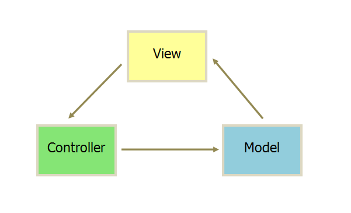
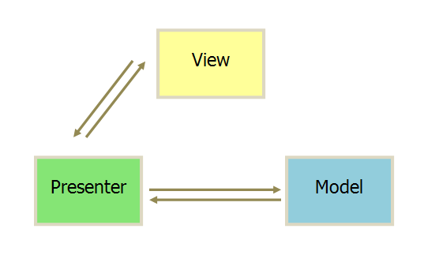
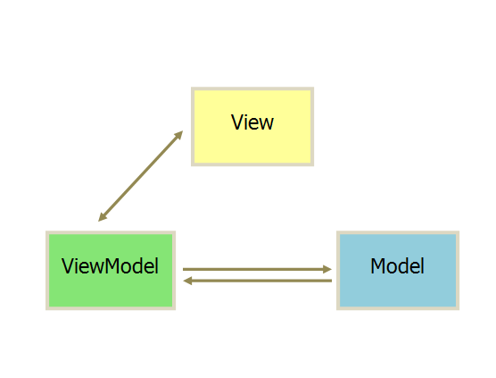

### 前端工程化

是指将软件工程的方法和理念应用到前端开发中，以提高开发效率、保证项目质量、加快交付速度，并确保项目的可维护性和可扩展性。随着互联网技术的发展和用户需求的日益增长，前端工程化已经成为现代前端开发不可或缺的一部分。

### 前端工程化的关键组成部分：

1. **模块化**：将复杂的前端应用分解为独立的模块，每个模块负责一部分功能。这样可以提高代码的可读性和可维护性，便于团队协作开发。

2. **组件化**：与模块化类似，组件化是将界面拆分为独立的、可复用的组件。组件可以包含逻辑、样式和模板，使得开发更加高效。

3. **自动化**：通过自动化构建工具（如Webpack、Gulp等）来自动化执行代码编译、压缩、合并等任务，减少手动操作的错误和提高工作效率。

4. **规范化**：制定统一的编码规范和开发流程，确保团队成员按照相同的标准进行开发，提高代码质量和一致性。

5. **版本控制**：使用版本控制系统（如Git）来管理代码变更，便于追踪问题、协作开发和代码回退。

6. **测试**：编写单元测试、集成测试和端到端测试来确保代码质量，减少bug，提高软件的稳定性和可靠性。

7. **持续集成/持续部署（CI/CD）**：通过自动化流程实现代码的持续集成和持续部署，加快产品的迭代速度和交付效率。

### 前端工程化的工具和框架：

1. **构建工具**：Webpack、Rollup、Parcel等，用于打包、编译和优化前端资源。

2. **任务运行器**：Gulp、Grunt、NPM Scripts等，用于自动化执行重复性任务。

3. **代码质量管理**：ESLint、Prettier等，用于检查代码规范和自动格式化代码。

4. **测试框架**：Jest、Mocha、Cypress等，用于编写和执行测试用例。

5. **版本控制工具**：Git、SVN等，用于代码版本管理和团队协作。

6. **IDE和编辑器**：Visual Studio Code、WebStorm、Sublime Text等，提供代码高亮、智能提示和调试功能。

7. **持续集成服务**：Jenkins、Travis CI、GitHub Actions等，用于自动化测试和部署。

### 实践前端工程化的步骤：

1. **需求分析**：明确项目需求，制定合理的开发计划和里程碑。

2. **技术选型**：根据项目需求选择合适的技术栈和工具。

3. **搭建开发环境**：配置开发环境，包括IDE、版本控制、代码规范等。

4. **编写代码**：按照模块化和组件化的原则编写代码，并进行代码审查。

5. **测试**：编写测试用例，并执行自动化测试。

6. **构建和部署**：使用构建工具打包应用，并部署到生产环境。

7. **监控和维护**：监控应用性能，及时修复bug，持续优化代码。

通过前端工程化，开发者可以更加专注于创造有价值的功能和提升用户体验，而不是被繁琐的重复性工作所困扰。随着前端技术的不断进步，前端工程化也在不断地演进和完善，为开发者提供更多的便利和可能性。


### 前后端分离

前后端分离是一种开发模式，前端负责将数据按照产品设计渲染以及调用后端接口实现产品功能，而后端则提供数据接口，功能接口。
两个团队分别开发，预先设计好借口的规范和模拟数据，前端可以用mock去模拟请求到的数据，后端可以用postman模拟前端去调用接口。
前后端分离的开发模式是为了让专业的人做专业的事，且现在前端和后端可以通过接口文档实现并行开发，提高开发效率。可以分服务器部署，也可以和后端接口打包在一起部署。


### 数据双向绑定原理：常见数据绑定的方案

- `Object.defineProperty（vue）`：劫持数据的 `getter` 和 `setter`
- 脏值检测（`angularjs`）：通过特定事件进行轮循
  发布/订阅模式：通过消息发布并将消息进行订阅


### MVC、MVP 与 MVVM 模式

**MVC**

通信方式如下



1. 视图（View）：用户界面。 传送指令到 Controller
2. 控制器（Controller）：业务逻辑。完成业务逻辑后，要求 Model 改变状态
3. 模型（Model）：数据保存。将新的数据发送到 View，用户得到反馈

所有通信都是单向的


**MVP**

通信方式如下



1. 各部分之间的通信，都是双向的。
2. View 与 Model 不发生联系，都通过 Presenter 传递。
3. View 非常薄，不部署任何业务逻辑，称为"被动视图"（Passive View），即没有任何主动性，而 Presenter 非常厚，所有逻辑都部署在那里。

首先阐述下你对 mvc 和 mvvm 的理解:

首先为什么我们会需要 MVC？因为随着代码规模越来越大，切分职责是大势所趋，还有为了后期维护方便，修改一块功能不影响其他功能。还有为了复用，因为很多逻辑是一样的。而 MVC 只是手段，终极目标是模块化和复用。


### MVVM

MVVM 是 Model-View-ViewModel 的缩写，是一种设计思想，由 Model、View、ViewModel 三部分构成。

- Model代表数据模型，也可以在Model中定义数据修改和操作的业务逻辑。
- View 代表UI 组件，它负责将数据模型转化成UI 展现出来。
- ViewModel 监听模型数据的改变和控制视图行为、处理用户交互，简单理解就是一个同步View 和 Model的对象，连接Model和View。

在MVVM架构下，View 和 Model ，而是通过ViewModel进行交互，Model 和 ViewModel 之间的交互是双向的， 因此View 数据的变化会同步到Model中，而Model 数据的变化也会立即反应到View 上。

ViewModel 通过双向数据绑定把 View 层和 Model 层连接了起来，而View 和 Model 之间的同步工作完全是自动的，无需人为干涉，因此开发者只需关注业务逻辑，不需要手动操作DOM, 不需要关注数据状态的同步问题，复杂的数据状态维护完全由 MVVM 来统一管理。

> - 在 JQuery 时期，如果需要刷新 UI 时，需要先取到对应的 DOM 再更新 UI，这样数据和业务的逻辑就和页面有强耦合
> - 在 MVVM 中，UI 是通过数据驱动的，数据一旦改变就会相应的刷新对应的 UI，UI 如果改变，也会改变对应的数据。这种方式就可以在业务处理中只关心数据的流转，而无需直接和页面打交道。ViewModel 只关心数据和业务的处理，不关心 View 如何处理数据，在这种情况下，View 和 Model 都可以独立出来，任何一方改变了也不一定需要改变另一方，并且可以将一些可复用的逻辑放在一个 ViewModel 中，让多个 View 复用这个 ViewModel

MVVM 模式将 Presenter 改名为 ViewModel，基本上与 MVP 模式完全一致。通信方式如下



唯一的区别是，它采用双向绑定（data-binding）：View 的变动，自动反映在 ViewModel，反之亦然。


### mvvm 的优点

低耦合：View 可以独立于 Model 变化和修改，同一个 ViewModel 可以被多个 View 复用；并且可以做到 View 和 Model 的变化互不影响；

可重用性：可以把一些视图的逻辑放在 ViewModel，让多个 View 复用；

独立开发：开发人员可以专注与业务逻辑和数据的开发（ViewModemvvmdi 计人员可以专注于 UI(View)的设计；

可测试性：清晰的 View 分层，使得针对表现层业务逻辑的测试更容易，更简单。

参考链接：

[MVVM的优点和缺点](https://blog.csdn.net/jia12216/article/details/55520426)

[MVVM架构的优缺点](https://blog.csdn.net/pangzi111/article/details/52294175)


### mvvm 和 mvc 区别？它和其它框架（jquery）的区别是什么？哪些场景适合？

- mvc 和 mvvm 其实区别并不大。都是一种设计思想。主要就是 mvc 中 Controller 演变成 mvvm 中的 viewModel。mvvm 主要解决了 mvc 中大量的 DOM 操作使页面渲染性能降低，加载速度变慢，影响用户体验。
- 区别：vue 数据驱动，通过数据来显示视图层而不是节点操作。

- 场景：数据操作比较多的场景，更加便捷。


### 什么是 MVC/MVP/MVVM/Flux？

**MVC(Model-View-Controller)** 

- V->C, C->M, M->V
- 通信都是单向的；C只起路由作用，业务逻辑都部署在V
- Backbone

**MVP(Model-View-Presenter)**

- V<->P, P<->M
- 通信都是双向的；V和M不发生联系(通过P传)；V非常薄，逻辑都部署在P
- Riot.js

**MVVM(Model-View-ViewModel)**

- V->VM, VM<->M
- 采用双向数据绑定：View 和 ViewModel 的变动都会相互映射到对象上面
- Angular

**Flux(Dispatcher-Store-View)**

- Action->Dispatcher->Store->View, View->Action
- Facebook 为了解决在 MVC 应用中碰到的工程性问题提出一个架构思想
- 基于一个简单的原则：数据在应用中单向流动（单向数据流）
- React(Flux 中 View，只关注表现层)


### MVVM

在 MVVM 中，最核心的也就是数据双向绑定，例如 Angluar 的脏数据检测，Vue 中的数据劫持。

**脏数据检测**

- 当触发了指定事件后会进入脏数据检测，这时会调用 $digest 循环遍历所有的数据观察者，判断当前值是否和先前的值有区别，如果检测到变化的话，会调用 $watch 函数，然后再次调用 $digest 循环直到发现没有变化。循环至少为二次 ，至多为十次
- 脏数据检测虽然存在低效的问题，但是不关心数据是通过什么方式改变的，都可以完成任务，但是这在 Vue 中的双向绑定是存在问题的。并且脏数据检测可以实现批量检测出更新的值，再去统一更新 UI，大大减少了操作 DOM 的次数

**数据劫持**

`Vue` 内部使用了 `Obeject.defineProperty()` 来实现双向绑定，通过这个函数可以监听到 `set` 和 `get `的事件

```javascript
var data = \\{ name: 'yck' \\}
observe(data)
let name = data.name // -> get value
data.name = 'yyy' // -> change value

function observe(obj) \\{
  // 判断类型
  if (!obj || typeof obj !== 'object') \\{
    return
  \\}
  Object.keys(data).forEach(key => \\{
    defineReactive(data, key, data[key])
  \\})
\\}

function defineReactive(obj, key, val) \\{
  // 递归子属性
  observe(val)
  Object.defineProperty(obj, key, \\{
    enumerable: true,
    configurable: true,
    get: function reactiveGetter() \\{
      console.log('get value')
      return val
    \\},
    set: function reactiveSetter(newVal) \\{
      console.log('change value')
      val = newVal
    \\}
  \\})
\\}
```

> 以上代码简单的实现了如何监听数据的 set 和 get 的事件，但是仅仅如此是不够的，还需要在适当的时候给属性添加发布订阅

```html
<div>
    \\\{\\\{nam\\\}\\\}e}}
</div>
```

> 在解析如上模板代码时，遇到 `\\\{\\\{nam\\\}\\\}e}}` 就会给属性 `name` 添加发布订阅

```javascript
// 通过 Dep 解耦
class Dep \\{
  constructor() \\{
    this.subs = []
  \\}
  addSub(sub) \\{
    // sub 是 Watcher 实例
    this.subs.push(sub)
  \\}
  notify() \\{
    this.subs.forEach(sub => \\{
      sub.update()
    \\})
  \\}
\\}
// 全局属性，通过该属性配置 Watcher
Dep.target = null

function update(value) \\{
  document.querySelector('div').innerText = value
\\}

class Watcher \\{
  constructor(obj, key, cb) \\{
    // 将 Dep.target 指向自己
    // 然后触发属性的 getter 添加监听
    // 最后将 Dep.target 置空
    Dep.target = this
    this.cb = cb
    this.obj = obj
    this.key = key
    this.value = obj[key]
    Dep.target = null
  \\}
  update() \\{
    // 获得新值
    this.value = this.obj[this.key]
    // 调用 update 方法更新 Dom
    this.cb(this.value)
  \\}
\\}
var data = \\{ name: 'yck' \\}
observe(data)
// 模拟解析到 `\\\{\\\{nam\\\}\\\}e}}` 触发的操作
new Watcher(data, 'name', update)
// update Dom innerText
data.name = 'yyy' 
```

> 接下来,对 defineReactive 函数进行改造

```javascript
function defineReactive(obj, key, val) \\{
  // 递归子属性
  observe(val)
  let dp = new Dep()
  Object.defineProperty(obj, key, \\{
    enumerable: true,
    configurable: true,
    get: function reactiveGetter() \\{
      console.log('get value')
      // 将 Watcher 添加到订阅
      if (Dep.target) \\{
        dp.addSub(Dep.target)
      \\}
      return val
    \\},
    set: function reactiveSetter(newVal) \\{
      console.log('change value')
      val = newVal
      // 执行 watcher 的 update 方法
      dp.notify()
    \\}
  \\})
\\}
```

> 以上实现了一个简易的双向绑定，核心思路就是手动触发一次属性的 getter 来实现发布订阅的添加


### Proxy 与 Obeject.defineProperty 对比

- `Obeject.defineProperty` 虽然已经能够实现双向绑定了，但是他还是有缺陷的。
  - 只能对属性进行数据劫持，所以需要深度遍历整个对象
  - 对于数组不能监听到数据的变化

> 虽然 `Vue` 中确实能检测到数组数据的变化，但是其实是使用了 `hack` 的办法，并且也是有缺陷的


### 解释下 Object.defineProperty()方法

答案：这是 js 中一个非常重要的方法，ES6 中某些方法的实现依赖于它，VUE 通过它实现双向绑定，此方法会直接在一个对象上定义一个新属性，或者修改一个已经存在的属性， 并返回这个对象

**语法**

Object.defineProperty(object, attribute, descriptor)

- 这三个参数都是必输项
- 第一个参数为 目标对象
- 第二个参数为 需要定义的属性或者方法
- 第三个参数为 目标属性所拥有的特性

**descriptor**

前两个参数都很明确，重点是第三个参数 descriptor， 它有以下取值

- value: 属性的值
- writable: 属性的值是否可被重写（默认为 false）
- configurable: 总开关，是否可配置，若为 false, 则其他都为 false（默认为 false）
- enumerable: 属性是否可被枚举（默认为 false）
- get: 获取该属性的值时调用
- set: 重写该属性的值时调用

一个例子

```js
var a = \\{\\};
Object.defineProperty(a, "b", \\{
  value: 123
\\});
console.log(a.b); //123
a.b = 456;
console.log(a.b); //123
a.c = 110;
for (item in a) \\{
  console.log(item, a[item]); //c 110
\\}
```

因为 writable 和 enumerable 默认值为 false, 所以对 a.b 赋值无效，也无法遍历它

**configurable**

总开关，是否可配置，设置为 false 后，就不能再设置了，否则报错， 例子

```js
var a = \\{\\};
Object.defineProperty(a, "b", \\{
  configurable: false
\\});
Object.defineProperty(a, "b", \\{
  configurable: true
\\});
//error: Uncaught TypeError: Cannot redefine property: b
```

**writabl**

是否可重写

```js
var a = \\{\\};
Object.defineProperty(a, "b", \\{
  value: 123,
  writable: false
\\});
console.log(a.b); // 打印 123
a.b = 25; // 没有错误抛出（在严格模式下会抛出，即使之前已经有相同的值）
console.log(a.b); // 打印 123， 赋值不起作用。
```

**enumerable**

属性特性 enumerable 定义了对象的属性是否可以在 for...in 循环和 Object.keys() 中被枚举

```js
var a = \\{\\};
Object.defineProperty(a, "b", \\{
  value: 3445,
  enumerable: true
\\});
console.log(Object.keys(a)); // 打印["b"]
```

enumerable 改为 false

```js
var a = \\{\\};
Object.defineProperty(a, "b", \\{
  value: 3445,
  enumerable: false //注意咯这里改了
\\});
console.log(Object.keys(a)); // 打印[]
```

**set 和 get**

如果设置了 set 或 get, 就不能设置 writable 和 value 中的任何一个，否则报错

```js
var a = \\{\\};
Object.defineProperty(a, "abc", \\{
  value: 123,
  get: function() \\{
    return value;
  \\}
\\});
//Uncaught TypeError: Invalid property descriptor. Cannot both specify accessors and a value or writable attribute, #<Object> at Function.defineProperty
```

对目标对象的目标属性 赋值和取值 时， 分别触发 set 和 get 方法

```js
var a = \\{\\};
var b = 1;
Object.defineProperty(a, "b", \\{
  set: function(newValue) \\{
    b = 99;
    console.log("你要赋值给我,我的新值是" + newValue);
  \\},
  get: function() \\{
    console.log("你取我的值");
    return 2; //注意这里，我硬编码返回2
  \\}
\\});
a.b = 1; //打印 你要赋值给我,我的新值是1
console.log(b); //打印 99
console.log(a.b); //打印 你取我的值
//打印 2    注意这里，和我的硬编码相同的
```

上面的代码中，给 a.b 赋值，b 的值也跟着改变了。原因是给 a.b 赋值，自动调用了 set 方法，在 set 方法中改变了 b 的值。vue 双向绑定的原理就是这个。

扩展：[参考](https://www.cnblogs.com/zhaowj/p/9576450.html)


### 什么是单页面应用(SPA)？

- 单页面应用(SPA)是指用户在浏览器加载单一的HTML页面，后续请求都无需再离开此页
- 目标：旨在用为用户提供了更接近本地移动APP或桌面应用程序的体验。
- 流程：第一次请求时，将导航页传输到客户端，其余请求通过 REST API 获取 JSON 数据
- 实现：数据的传输通过 Web Socket API 或 RPC(远程过程调用)。
- 优点：用户体验流畅，服务器压力小，前后端职责分离
- 缺点：关键词布局难度加大，不利于 SEO


### 多页面（MPA）开发 VS 单页面（SPA）开发

**jQuery + Bootstrap 多页面应用：**

- 优点：
  1. 数据可以直接渲染，对于搜索引擎（SEO）友好
  2. BootStrap 对移动端和PC端界面展示都很友好
  3. 后期维护方便，成本低，易上手
- 缺点：
  1. 页面之间传递数据比较局限，可以URL/Cookie/Storage等方式吧
  2. 资源请求较多，不过就现在这个网速情况，大部分没有问题

**Vue + ElementUI（BootStrap）单页面应用：（后台管理系统）**

- 优点：
  1. 可以组件化，数据绑定。方便定义页面的各种逻辑和改变页面数据
  2. 路由之间跳转可以定制动画，使用懒加载，减少白屏时间；相比对多页面，减少了请求服务器加载静态资源的次数
  3. 页面之间可以通信
- 缺点
  1. 初始加载较大且多的静态资源(因为需要进行代码编译)，业务增长，项目加载时间越大
  2. 因为前后端分离，数据通过Ajax获取，网页爬虫抓取不到页面数据，不利于搜索引擎搜索，SEO不友好
  3. ElementUI 基本不支持移动端设备的展示,BootStrap虽然支持移动端，但是综合考虑用多页面比较好
  4. 后期维护方便，但是成本高


### 什么是“前端路由"?什么时候适合使用“前端路由"? “前端路由"有哪些优点和缺点?

1. 什么是前端路由？

   路由是根据不同的 url 地址展示不同的内容或页面

   前端路由就是把不同路由对应不同的内容或页面的任务交给前端来做，之前是通过服务端根据 url 的不同返回不同的页面实现的。

2. 什么时候使用前端路由？

   在单页面应用，大部分页面结构不变，只改变部分内容的使用

3. 前端路由有什么优点和缺点？

   **优点**

   用户体验好，不需要每次都从服务器全部获取，快速展现给用户

   **缺点**

   使用浏览器的前进，后退键的时候会重新发送请求，没有合理地利用缓存

   单页面无法记住之前滚动的位置，无法在前进，后退的时候记住滚动的位置


### 什么是“前端路由”? 什么时候适用“前端路由”? 有哪些优点和缺点?

* 前端路由通过 URL 和 History 来实现页面切换
* 应用：前端路由主要适用于“前后端分离”的单页面应用(SPA)项目
* 优点：用户体验好，交互流畅
* 缺点：浏览器“前进”、“后退”会重新请求，无法合理利用缓存


### 虚拟节点（VDOM）：三个 part

- 虚拟节点类，将真实 `DOM `节点用 `js` 对象的形式进行展示，并提供 `render` 方法，将虚拟节点渲染成真实 `DOM`
- 节点 `diff` 比较：对虚拟节点进行 `js` 层面的计算，并将不同的操作都记录到 `patch` 对象
- `re-render`：解析 `patch` 对象，进行 `re-render`

**补充1：VDOM 的必要性？**

- **创建真实DOM的代价高**：真实的 `DOM` 节点 `node` 实现的属性很多，而 `vnode` 仅仅实现一些必要的属性，相比起来，创建一个 `vnode` 的成本比较低。
- **触发多次浏览器重绘及回流**：使用 `vnode` ，相当于加了一个缓冲，让一次数据变动所带来的所有 `node` 变化，先在 `vnode` 中进行修改，然后 `diff` 之后对所有产生差异的节点集中一次对 `DOM tree` 进行修改，以减少浏览器的重绘及回流。

**补充2：vue 为什么采用 vdom？**

> 引入 `Virtual DOM` 在性能方面的考量仅仅是一方面。

- 性能受场景的影响是非常大的，不同的场景可能造成不同实现方案之间成倍的性能差距，所以依赖细粒度绑定及 `Virtual DOM` 哪个的性能更好还真不是一个容易下定论的问题。
- `Vue` 之所以引入了 `Virtual DOM`，更重要的原因是为了解耦 `HTML`依赖，这带来两个非常重要的好处是：

> - 不再依赖 `HTML` 解析器进行模版解析，可以进行更多的 `AOT` 工作提高运行时效率：通过模版 `AOT` 编译，`Vue` 的运行时体积可以进一步压缩，运行时效率可以进一步提升；
> - 可以渲染到 `DOM` 以外的平台，实现 `SSR`、同构渲染这些高级特性，`Weex`等框架应用的就是这一特性。

> 综上，`Virtual DOM` 在性能上的收益并不是最主要的，更重要的是它使得 `Vue` 具备了现代框架应有的高级特性。


### vue 和 react 区别

- 相同点：都支持 `ssr`，都有 `vdom`，组件化开发，实现 `webComponents` 规范，数据驱动等
- 不同点：`vue` 是双向数据流（当然为了实现单数据流方便管理组件状态，`vuex` 便出现了），`react` 是单向数据流。`vue `的 `vdom` 是追踪每个组件的依赖关系，不会渲染整个组件树，`react` 每当应该状态被改变时，全部子组件都会 `re-render`


### 模块化开发怎么做？

* 封装对象作为命名空间 -- 内部状态可以被外部改写
* 立即执行函数(IIFE) -- 需要依赖多个JS文件，并且严格按顺序加载
* 使用模块加载器 -- require.js, sea.js, EC6 模块


### 模块化开发怎么做？

- AMD 是 RequireJS 在推广过程中对模块定义的规范化产出。
- CMD 是 SeaJS 在推广过程中对模块定义的规范化产出。
- AMD 是提前执行，CMD 是延迟执行。
- AMD 推荐的风格通过返回一个对象做为模块对象，CommonJS 的风格通过对 module.exports 或 exports 的属性赋值来达到暴露模块对象的目的。

CMD 模块方式

```js
define(function(require, exports, module) \\{
  // 模块代码
\\});
```


### 模块化开发怎么做？

立即执行函数,不暴露有成员

```
var module1 = (function()\\{
　　　　var _count = 0;
　　　　var m1 = function()\\{
　　　　　　//...
　　　　\\};
　　　　var m2 = function()\\{
　　　　　　//...
　　　　\\};
　　　　return \\{
　　　　　　m1 : m1,
　　　　　　m2 : m2
　　　　\\};
　　\\})();
```


### 通行的 Javascript 模块的规范有哪些？

* CommonJS -- 主要用在服务器端 node.js

```javascript
var math = require('./math');
math.add(2,3);
```

* AMD(异步模块定义) -- require.js

```javascript
require(['./math'], function (math) \\{
    math.add(2, 3);
\\});
```

* CMD(通用模块定义) -- sea.js 

```javascript
var math = require('./math');
math.add(2,3);
```

* ES6 模块


```javascript
import \\{math\\} from './math';
math.add(2, 3);
```


### 说说你对AMD和Commonjs的理解

- CommonJS是服务器端模块的规范，Node.js采用了这个规范。CommonJS规范加载模块是同步的，也就是说，只有加载完成，才能执行后面的操作。AMD规范则是非同步加载模块，允许指定回调函数
- AMD推荐的风格通过返回一个对象做为模块对象，CommonJS的风格通过对module.exports或exports的属性赋值来达到暴露模块对象的目的


### AMD 与 CMD 规范的区别？

规范化产出：

- AMD 由 RequireJS 推广产出
- CMD 由 SeaJS 推广产出

**模块的依赖:**

- **AMD 提前执行，推崇依赖前置**
- **CMD 延迟执行，推崇依赖就近**

API 功能:

- AMD 的 API 默认多功能（分全局 require 和局部 require）
- CMD 的 API 推崇职责单一纯粹（没有全局 require）

模块定义规则：

- AMD 默认一开始就载入全部依赖模块

```javascript
  define(['./a', './b'], function(a, b) \\{
      a.doSomething();
      b.doSomething();
  \\});
```

- CMD 依赖模块在用到时才就近载入

```javascript
  define(function(require, exports, module) \\{
      var a = require('./a');
      a.doSomething();
      var b = require('./b');
      b.doSomething();
  \\})
```


### AMD（Modules/Asynchronous-Definition）、CMD（Common Module Definition）规范区别？

Asynchronous Module Definition，异步模块定义，所有的模块将被异步加载，模块加载不影响后面语句运行。所有依赖某些模块的语句均放置在回调函数中

区别：

- 对于依赖的模块，AMD 是提前执行，CMD 是延迟执行。不过 RequireJS 从 2.0 开始，也改成可以延迟执行（根据写法不同，处理方式不同）。CMD 推崇 as lazy as possible
- CMD 推崇依赖就近，AMD 推崇依赖前置。看代码：

```
// CMD
define(function(require, exports, module) \\{
    var a = require('./a')
    a.doSomething()
    // 此处略去 100 行
    var b = require('./b') // 依赖可以就近书写
    b.doSomething()
    // ...
\\})

// AMD 默认推荐
define(['./a', './b'], function(a, b) \\{ // 依赖必须一开始就写好
    a.doSomething()
    // 此处略去 100 行
    b.doSomething()
    // ...
\\})
```


### 介绍类库和框架的区别？

类库是一些函数的集合，帮助开发者写WEB应用，起主导作用的是开发者的代码

框架是已实现的特殊WEB应用，开发者只需对它填充具体的业务逻辑，起主导作用是框架


###  请你详细介绍一些 package.json 里面的配置

scripts：npm run xxx 命令调用node执行的 .js 文件

dependencies：生产环境依赖包的名称和版本号，即这些 依赖包 都会打包进 生产环境的JS文件里

devDependencies：开发环境依赖包的名称和版本号，即这些 依赖包 只用于 代码开发 的时候，不会打包进 生产环境js文件 里面。


### 软件版本的命名规则

最近在完善实验室项目的软件设计，涉及功能的完善和 Bug 的修复，为了方便管理，更新软件版本号是不错的方法，故总结了下软件版本的命名规范。

软件版本号一般由四部分组成，格式如：主版本号.子版本号.修订版本号.日期版本号+希腊字母版本号。

举个例子：1.2.3.20230128_beta


#### 说明：

第一位(1): 主版本号。当功能模块有较大的变动，API 的兼容性发生变化时，比如增加多个模块或者整体架构发生变化。此版本号由项目决定是否修改，且只能递增。

第二位(2): 子版本号。当功能有一定的增加或变化，但是不影响 API 的兼容性，比如增加了对权限控制、增加自定义视图等功能。此版本号由项目决定是否修改，且只能递增。

第三位(3): 修订版本号。一般是 Bug 修复或是一些小的变动，不影响 API 的兼容性，要经常发布修订版，时间间隔不限，修复一个严重的 Bug 即可发布一个修订版。此版本号由项目经理决定是否修改，且只能递增。

日期版本号(20230128): 用于记录修改项目的当前日期，每天对项目的修改都需要更改日期版本号。此版本号由开发人员决定是否修改。

#### 希腊字母版本号(beta):

也叫里程碑版本号，此版本号用于标注当前版本的软件处于哪个开发阶段，当软件进入到另一个阶段时需要修改此版本号。此版本号由项目决定是否修改。

希腊字母版本号共有5种，分别为：Base、Alpha、Beta、RC、Release。

Base 版: 此版本表示该软件仅仅是一个基础框架，通常包括主要功能和结构，但是都没有做完整的实现，只是作为程序设计的一个基础架构。

Alpha 版: 此版本表示该软件在此阶段主要是以实现软件功能为主，通常只在软件开发者内部交流，一般不向外部发布，是内部测试版，该版本软件的 Bug 较多，需要继续修改。

Beta 版: 该版本相对于 Alpha 版已有了很大的改进，消除了严重的错误，但还是存在着一些缺陷，是公开测试版，需要经过多次测试来进一步消除，这个阶段的版本会一直加入新的功能。

RC 版: (Release   Candidate)最终测试版本，该版本已经相当成熟了，基本上不存在导致错误的 BUG，与即将发行的正式版相差无几。

Release 版: 该版本意味“最终版本”，在前面版本的一系列测试版之后，终归会有一个正式版本，是最终交付用户使用的一个版本。该版本有时也称为标准版。一般情况下，Release 不会以单词形式出现在软件封面上，取而代之的是符号(Ｒ)。

#### 版本号的详细规则如下：

主版本号，子版本号，修订版本号必须为非负整数，且不得包含前导零，必须按数值递增，如 1.9.0 -> 1.10.0 -> 1.11.0

主版本号为 0 表明软件处于初始开发阶段，意味着 API 可能不稳定；1.0.0 表明版本已有稳定的 API。

当 API 的兼容性变化时，主版本号必须递增，子版本号和修订版本号同时设置为 0；当新增功能(不影响 API 的兼容性)或者 API 被标记为 Deprecated 时，子版本号必须递增，同时修订版本号设置为 0；当进行 Bug 修复时，修订版本号必须递增。

先行版本号(Pre-release)意味该版本不稳定，可能存在兼容性问题，其格式为: 主版本号.子版本号.修订版本号.[a-c][正整数]，如 1.0.0.a1，1.0.0.b99，1.0.0.c1000。

开发版本号常用于 CI-CD，格式为: 主版本号.子版本号.修订版本号.dev[正整数]，如 1.0.1.dev4。

版本号的排序规则为依次比较主版本号、次版本号和修订号的数值，如 1.0.0 < 1.0.1 < 1.1.1 < 2.0.0；对于先行版本号和开发版本号，有：1.0.0.a100 < 1.0.0，2.1.0.dev3 < 2.1.0；当存在字母时，以 ASCII 的排序来比较，如 1.0.0.a1 < 1.0.0.b1。

原文链接：https://www.bilibili.com/read/cv21470282/


### WEB 应用从服务器主动推送 Data 到客户端有那些方式？

- html5 websoket
- WebSocket 通过 Flash
- XHR 长时间连接
- XHR Multipart Streaming
- 不可见的 Iframe
- `<script>`标签的长时间连接(可跨域)


### 什么是响应式设计？

它是关于网页制作的过程中让不同的设备有不同的尺寸和不同的功能。响应式设计是让所有的人能在这些设备上让网站运行正常


### 模块化的工具

参考链接：[常用模块化方案](https://www.cnblogs.com/bergwhite/p/6618686.html)


### webpack打包优化

参考链接：[webpack打包体积优化](https://www.cnblogs.com/Sunshine-boy/p/7412064.html)


### 设计一个自己的打包工具需要设计哪些主要功能

参考链接：[前端打包工具](https://blog.csdn.net/beauty5188/article/details/81510618)


### 介绍webpack是什么？ 有什么优势？

WebPack 是一款[模块加载器]兼[打包工具]，用于把各种静态资源（js/css/image等）作为模块来使用。

WebPack 是一个模块打包工具，你可以使用 WebPack 管理你的模块依赖，并编绎输出模块们所需的静态文件。它能够很好地管理、打包 Web 开发中所用到的 HTML、JavaScript、CSS 以及各种静态文件（图片、字体等），让开发过程更加高效。对于不同类型的资源，webpack 有对应的模块加载器。webpack 模块打包器会分析模块间的依赖关系，最后 生成了优化且合并后的静态资源。

WebPack 的优势：
- WebPack 同时支持 commonJS 和 AMD/CMD，方便代码迁移
- 不仅仅能被模块化 JS ，还包括 CSS、Image 等
- 能替代部分 grunt/gulp 的工作，如打包、压缩混淆、图片base64
- 扩展性强，插件机制完善，特别是支持 React 热插拔的功能


### webpack 的两大特色

1. code splitting（可以自动完成）
2. loader 可以处理各种类型的静态文件，并且支持串联操作

webpack 是以 commonJS 的形式来书写脚本滴，但对 AMD/CMD 的支持也很全面，方便旧项目进行代码迁移。

webpack 具有 requireJs 和 browserify 的功能，但仍有很多自己的新特性：

1. 对 CommonJS 、 AMD 、ES6 的语法做了兼容
2. 对 js、css、图片等资源文件都支持打包
3. 串联式模块加载器以及插件机制，让其具有更好的灵活性和扩展性，例如提供对 CoffeeScript、ES6 的支持
4. 有独立的配置文件 webpack.config.js
5. 可以将代码切割成不同的 chunk，实现按需加载，降低了初始化时间
6. 支持 SourceUrls 和 SourceMaps，易于调试
7. 具有强大的 Plugin 接口，大多是内部插件，使用起来比较灵活
8. webpack 使用异步 IO 并具有多级缓存。这使得 webpack 很快且在增量编译上更加快


### 平时如何管理你的项目？

- 先期团队必须确定好全局样式（globe.css），编码模式(utf-8) 等；

- 编写习惯必须一致（例如都是采用继承式的写法，单样式都写成一行）；

- 标注样式编写人，各模块都及时标注（标注关键样式调用的地方）；

- 页面进行标注（例如 页面 模块 开始和结束）；

- CSS 跟 HTML 分文件夹并行存放，命名都得统一（例如 style.css）；

- JS 分文件夹存放 命名以该 JS 功能为准的英文翻译。

- 图片采用整合的 images.png png8 格式文件使用 尽量整合在一起使用方便将来的管理


### 项目开发经历了哪几个阶段

- 需求分析及变更管理
- 项目模型及业务流程分析
- 系统分析及建模设计
- 界面设计及代码开发
- 系统测试，部署和文档编写
- 维护


### 怎么提高首屏加载速度

服务端渲染等


### 首屏、白屏时间如何计算？

Performance 接口可以获取到当前页面中与性能相关的信息。<br>
该类型的对象可以通过调用只读属性 Window.performance 来获得。<br>
白屏时间：

```
performance.timing.responseStart - performance.timing.navigationStart
```

首屏时间

```
window.onload = () => \\{
    new Date() - performance.timing.responseStart
\\}
```

解析：[参考](https://developer.mozilla.org/zh-CN/docs/Web/API/Performance)


### requireJS的核心原理是什么？

每个模块所依赖模块都会比本模块预先加载


### 什么是 npm ？

npm 是 Node.js 的模块管理和发布工具


### 什么是 WebKit ？

* WebKit 是一个开源的浏览器内核，由渲染引擎(WebCore)和JS解释引擎(JSCore)组成
* 通常所说的 WebKit 指的是 WebKit(WebCore)，主要工作是进行 HTML/CSS 渲染
* WebKit 一直是 Safari 和 Chrome(之前) 使用的浏览器内核，后来 Chrome 改用Blink 内核


### 如何测试前端代码? 知道 Unit Test，BDD, TDD 么? 怎么测试你的前端工程(mocha, jasmin..)?

* 通过为前端代码编写单元测试(Unit Test)来测试前端代码
* Unit Test：一段用于测试一个模块或接口是否能达到预期结果的代码
* BDD：行为驱动开发 -- 业务需求描述产出产品代码的开发方法
* TDD：测试驱动开发 -- 单元测试用例代码产出产品代码的开发方法
* 单元测试框架：


```javascript
// mocha 示例
describe('Test add', function() \\{
  it('1 + 2 = 3', function() \\{
      expect(add(1, 2)).to.be.equal(3);
  \\});
\\});

// jasmin 示例
describe('Test add', function () \\{
    it('1 + 2 = 3', function () \\{
        expect(add(1, 2)).toEqual(3);
    \\});
\\});
```


### 介绍你知道的前端模板引擎？

artTemplate, underscore, handlebars


### 什么是 Modernizr？ Modernizr 工作原理？

Modernizr 是一个开源的 JavaScript 库，用于检测用户浏览器对 HTML5 与 CSS3 的支持情况


### 移动端最小触控区域是多大？

44 * 44 px


### 什么是函数式编程？

函数式编程是一种"编程范式"，主要思想是**把运算过程尽量写成一系列嵌套的函数调用**

* 例如：var result = subtract(multiply(add(1,2), 3), 4);

函数式编程的特点：

- 函数核心化：函数可以作为变量的赋值、另一函数的参数、另一函数的返回值
- 只用“表达式”，不用“语句”：要求每一步都是单纯的运算，都必须有返回值
- 没有"副作用"：所有功能只为返回一个新的值，不修改外部变量
- 引用透明：运行不依赖于外部变量，只依赖于输入的参数

函数式编程的优点：

- 代码简洁，接近自然语言，易于理解
- 便于维护，利于测试、除错、组合
- 易于“并发编程“，不用担心一个线程的数据，被另一个线程修改
- 可“热升级”代码，在运行状态下直接升级代码，不需要重启，也不需要停机


### 什么是函数柯里化Currying)？

通常也称部分求值，含义是给函数分步传递参数，每次递参部分应用参数，并返回一个更具体的函数，继续接受剩余参数。期间会连续返回具体函数，直至返回最后结果。因此，函数柯里化是逐步传参，逐步缩小函数的适用范围，逐步求解的过程。

柯里化的**作用**：延迟计算；参数复用；动态创建函数；

柯里化的**缺点**：函数柯里化会产生开销（函数嵌套，比普通函数占更多内存），但性能瓶颈首先来自其它原因（DOM 操作等）


### 什么是依赖注入？

- 当一个类的实例依赖另一个类的实例时，自己不创建该实例，由IOC容器创建并注入给自己，因此称为依赖注入。
- 依赖注入解决的就是如何有效组织代码依赖模块的问题


### 设计模式：什么是 singleton, factory, strategy, decorator？

* Singleton(单例)   一个类只有唯一实例，这个实例在整个程序中有一个全局的访问点
* Factory (工厂)    解决实列化对象产生重复的问题
* Strategy(策略)    将每一个算法封装起来，使它们还可以相互替换，让算法独立于使用
* Observer(观察者)  多个观察者同时监听一个主体，当主体对象发生改变时，所有观察者都将得到通知
* Prototype(原型)   一个完全初始化的实例，用于拷贝或者克隆
* Adapter(适配器)   将不同类的接口进行匹配调整，尽管内部接口不兼容，不同的类还是可以协同工作
* Proxy(代理模式)   一个充当过滤转发的对象用来代表一个真实的对象
* Iterator(迭代器)  在不需要直到集合内部工作原理的情况下，顺序访问一个集合里面的元素
* Chain of Responsibility(职责连)  处理请求组成的对象一条链，请求链中传递，直到有对象可以处理


### 什么是前端工程化？

前端工程化就是把一整套前端工作流程使用工具自动化完成

前端开发基本流程：
- 项目初始化：yeoman, FIS
- 引入依赖包：bower, npm
- 模块化管理：npm, browserify, Webpack
- 代码编译：babel, sass, less
- 代码优化(压缩/合并)：Gulp, Grunt
- 代码检查：JSHint, ESLint
- 代码测试：Mocha

目前最知名的构建工具：Gulp, Grunt, npm + Webpack


### 介绍 Yeoman 是什么？

Yeoman --前端开发脚手架工具，自动将最佳实践和工具整合起来构建项目骨架

Yeoman 其实是三类工具的合体，三类工具各自独立：
- yo --- 脚手架，自动生成工具（相当于一个粘合剂，把 Yeoman 工具粘合在一起）
- Grunt、gulp --- 自动化构建工具 （最初只有grunt，之后加入了gulp）
- Bower、npm --- 包管理工具 （原来是bower，之后加入了npm）


### Backbone 是什么？

Backbone 是一个基于 jquery 和 underscore 的前端(MVC)框架


### AngularJS 是什么？

AngularJS 是一个完善的前端 MVVM 框架，包含模板、数据双向绑定、路由、模块化、服务、依赖注入等

AngularJS 由 Google 维护，用来协助大型单一页面应用开发。


### 如何评价AngularJS和BackboneJS

- backbone具有依赖性，依赖underscore.js。Backbone + Underscore + jQuery(or Zepto)就比一个AngularJS 多出了2 次HTTP请求.
- Backbone的Model没有与UI视图数据绑定，而是需要在View中自行操作DOM来更新或读取UI数据。AngularJS与此相反，Model直接与UI视图绑定，Model与UI视图的关系，通过directive封装，AngularJS内置的通用directive，就能实现大部分操作了，也就是说，基本不必关心Model与UI视图的关系，直接操作Model就行了，UI视图自动更新
- AngularJS的directive，你输入特定数据，他就能输出相应UI视图。是一个比较完善的前端MVW框架，包含模板，数据双向绑定，路由，模块化，服务，依赖注入等所有功能，模板功能强大丰富，并且是声明式的，自带了丰富的 Angular 指令


### Meteor 是什么

- Meteor 是一个全栈开发框架，基础构架是 Node.JS + MongoDB，并把延伸到了浏览器端。
- Meteor 统一了服务器端和客户端的数据访问，使开发者可以轻松完成全栈式开发工作。


### 前端异常监控

**一：前端异常监控系统的构建目标**

在对被监控页面无侵入的前提下，提供7*24小时全天候的监控任务，第一时间发现“裸奔”、“半裸奔”页面或是有JavaScript异常抛出的页面，并给网站前端负责人提供短信、邮件等方式的报警服务。

可以说，前端异常监控系统主要是解决两大异常情况：a. 页面上有javascript异常  b. 各种因素造成的页面的样式丢失。我先分别介绍下两种这两种异常的解决思路：

**二：JavaScript的异常监控**

由于客户端浏览器环境的不同，在开发环境中能够工作的代码，并非就能够在用户的电脑上正常运行，各种畸形浏览器造成的问题弄得我们很头大，如果能像后端开发那样可以随时地查看服务器端错误日志就好了！可为什么不呢？

JavaScript语言自身就提供了try catch的异常处理语法，我们假以利用的话，就能够在增强前端应用鲁棒性的同时，又可以把捕获到的异常抛送给前端异常监控系统，以错误日志的形式记录到数据库中。

给应用添加异常处理功能，我们是可以充分发挥javascript语言是动态语言这一优势的。我可不想为了添加异常处理而在代码中写N多的try-catch语句。 我的思路是：通过JavaScript类模块在应用中注册的时候，遍历类模块中的每个函数，然后统一的加上try-catch处理，这样前端里面的所有函数就都在异常处理的范围之内了。怎么样，是不是要比Java等静态语言cool很多？ 代码示例如下：


有了以上的全局异常处理函数之后，解决线上的JavaScript异常就是小菜一碟，只需要定义好错误message的格式，并在catch语句中向异常监控系统的固定接口发送请求即可。我们可以在错误消息中发送关于错误的浏览器信息，JS模块信息，函数信息，或具体的错误消息等，要传送哪些信息全看你自己的需要。在FdSafe异常监控系统中，我们传输了如下错误信息：


**三：样式丢失的异常监控**

如果你的页面在不该裸奔的时候突然裸奔了，那就是严重的可用性问题，需要前端同学在第一时间定位问题并迅速修复。引发“裸奔”的可能性很多，也许是CSS文件404了，也许是CSS文件@import url的问题，但是最终的表象只有一个，那就是页面样式突然发生极大改变。

在fdsafe系统中，我们使用了图片对比的方法来探测线上页面发生“裸奔”的现象，原理上很简单：对于被监控页面的URL，我们让监控系统保留其前一天页面被浏览器渲染后的截图，然后让监控系统周期性的定时抓取线上页面的截图，两张图片做相似度对比，如果相似度差值超过一定的阈值，则会触发报警条件。

页面的截图我们是使用QT的webkit内核渲染并截取的，当然也推荐使用selenium的浏览器截图功能。而图片相似度的算法很多，我们最终采用的是OpenCV中的cvCompareHist算法。

**四：其它的异常监控**

除了样式丢失及javascript异常之外，前端还是有很多其它异常可以通过系统来监控的，比如说JS、CSS文件的404错误，HTML源码的闭合异常，或JS、CSS文件的压缩异常等。fdSafe系统能够通过添加插件的方式来提供对不同异常的监控，然后统一汇总到异常日志中。

**五：系统总体框架图**

搭建前端的异常监控系统，自然也要体现我们前端的特色，后台的系统我们是基于NodeJS来实现的，它主要完成两个功能：

1）定时抓取被监控页面的HTML源码，并分析是否存在页面样式丢失异常或是其它异常。

2）接受来自用户浏览器发送的JavaScript异常。

一旦异常发生，且超出设定的允许阈值，则触发报警条件，给负责人发送报警短信，系统原理图如下：


### Ascii、GBK、UTF、Unicode

Ascii（1 个字节 1 个字符）

GBK 是国内的编码标准（汉字 2 个字节）

Unicode 是国际编码标准（统一 2 个字节表示一个字符）

UTF 是 Unicode 实现的另一个标准

> unicode 同样也不完美，这里就有两个的问题，一个是，如何才能区别 unicode 和 ascii？<br>
> 由于”半角”英文符号只需要用到低 8 位，所以其高 8 位永远是 0，因此这种大气的方案在保存英文文本时会多浪费一倍的空间<br>
> unicode 在很长一段时间内无法推广，直到互联网的出现，为解决 unicode 如何在网络上传输的问题，于是面向传输的众多 UTF（UCS Transfer Format）标准出现了，顾名思义，UTF-8 就是每次 8 个位传输数据，而 UTF-16 就是每次 16 个位。UTF-8 就是在互联网上使用最广的一种 unicode 的实现方式，这是为传输而设计的编码，并使编码无国界，这样就可以显示全世界上所有文化的字符了。UTF-8 最大的一个特点，就是它是一种变长的编码方式。它可以使用 1~4 个字节表示一个符号，根据不同的符号而变化字节长度，当字符在 ASCII 码的范围时，就用一个字节表示，保留了 ASCII 字符一个字节的编码做为它的一部分，注意的是 unicode 一个中文字符占 2 个字节，而 UTF-8 一个中文字符占 3 个字节）。从 unicode 到 utf-8 并不是直接的对应，而是要过一些算法和规则来转换。

解析：[参考](https://www.zhihu.com/question/23374078/answer/69732605)


### 请谈谈你对Node.js技术及其生态的理解，并举例说明你如何在实际项目中利用webpack、Vite等构建打包工具提高开发效率的。

Node.js 是一个基于 Chrome V8 引擎的 JavaScript 运行时环境，它具有高效的异步 I/O 和事件驱动模型，适用于构建服务器端应用程序。其生态丰富，有许多常用的库和框架。

在实际项目中，可以利用 webpack 或 Vite 等构建打包工具，将多个模块和资源打包成一个或多个文件，提高开发效率。例如，使用 webpack 的模块化和代码分割功能，按需加载模块，减少初始加载时间。Vite 则通过即时编译提供了更快速的开发体验。


### 分享一次你独立开发前端项目的经验，特别是在技术架构设计、组件封装和维护方面的工作。你是如何确保项目的稳定交付的？

在独立开发前端项目时，我注重技术架构的设计，选择合适的前端框架和工具。通过组件封装，提高代码复用性和可维护性。在维护方面，进行代码审查、测试和持续集成，确保项目稳定交付。例如，使用版本控制系统管理代码变更，及时修复 Bug，并定期更新文档，以便团队成员更好地理解和维护项目。


### 请详细描述一次你使用ES6/ES7或TypeScript进行项目开发的经历，包括你是如何应用这些技术来解决具体问题的。

在项目开发中，使用 ES6/ES7 的特性，如箭头函数、模板字符串和模块化，提高代码的可读性和简洁性。TypeScript 的静态类型检查和面向对象编程特性帮助我在开发过程中更早地发现错误，并构建更健壮的代码结构。例如，通过定义接口和类型注解，明确函数和变量的类型，从而提高代码的可维护性和可扩展性。