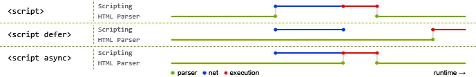
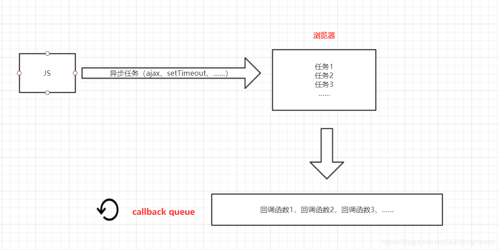

### 如何测试前端代码? 知道 BDD, TDD, Unit Test 么? 知道怎么测试你的前端工程么(mocha, sinon, jasmin, qUnit..)

了解 BDD 行为驱动开发与 TDD 测试驱动开发已经单元测试相关概念


### 检测浏览器版本版本有哪些方式？

- 根据 navigator.userAgent   //  UA.toLowerCase().indexOf('chrome')
- 根据 window 对象的成员       // 'ActiveXObject' in window


### 作用域-编译期执行期以及全局局部作用域问题

js 执行主要的两个阶段：预解析和执行期


### target 和 currentTarget 区别

- event.target<br>
  返回触发事件的元素
- event.currentTarget<br>
  返回绑定事件的元素


### 自动分号

有时 JavaScript 会自动为代码行补上缺失的分号，即自动分号插入（Automatic SemicolonInsertion，ASI）。
因为如果缺失了必要的 ; ，代码将无法运行，语言的容错性也会降低。ASI 能让我们忽略那些不必要的 ; 。
请注意，ASI 只在换行符处起作用，而不会在代码行的中间插入分号。
如果 JavaScript 解析器发现代码行可能因为缺失分号而导致错误，那么它就会自动补上分
号。并且，只有在代码行末尾与换行符之间除了空格和注释之外没有别的内容时，它才会
这样做。


### 浮点数精度

[参考](https://www.css88.com/archives/7340)


### 自执行函数?用于什么场景？好处?

自执行函数:1、声明一个匿名函数 2、马上调用这个匿名函数。
作用：创建一个独立的作用域。

好处：防止变量弥散到全局，以免各种 js 库冲突。隔离作用域避免污染，或者截断作用域链，避免闭包造成引用变量无法释放。利用立即执行特性，返回需要的业务函数或对象，避免每次通过条件判断来处理

场景：一般用于框架、插件等场景


### css 动画和 js 动画的差异

1. 代码复杂度，js 动画代码相对复杂一些
2. 动画运行时，对动画的控制程度上，js 能够让动画，暂停，取消，终止，css 动画不能添加事件
3. 动画性能看，js 动画多了一个 js 解析的过程，性能不如 css 动画好

解析：[参考](https://zhuanlan.zhihu.com/p/41479807)


### 如何实现文件断点续传

断点续传最核心的内容就是把文件“切片”然后再一片一片的传给服务器，但是这看似简单的上传过程却有着无数的坑。

首先是文件的识别，一个文件被分成了若干份之后如何告诉服务器你切了多少块，以及最终服务器应该如何把你上传上去的文件进行合并，这都是要考虑的。

因此在文件开始上传之前，我们和服务器要有一个“握手”的过程，告诉服务器文件信息，然后和服务器约定切片的大小，当和服务器达成共识之后就可以开始后续的文件传输了。

前台要把每一块的文件传给后台，成功之后前端和后端都要标识一下，以便后续的断点。

当文件传输中断之后用户再次选择文件就可以通过标识来判断文件是否已经上传了一部分，如果是的话，那么我们可以接着上次的进度继续传文件，以达到续传的功能。
有了 HTML5 的 File api 之后切割文件比想想的要简单的多的多。

只要用 slice 方法就可以了

```
var packet = file.slice(start, end);
```

参数 start 是开始切片的位置，end 是切片结束的位置 单位都是字节。通过控制 start 和 end 就可以是实现文件的分块

如

```
file.slice(0,1000);
file.slice(1000,2000);
file.slice(2000,3000);
// ......
```

在把文件切成片之后，接下来要做的事情就是把这些碎片传到服务器上。
如果中间掉线了，下次再传的时候就得先从服务器获取上一次上传文件的位置，然后以这个位置开始上传接下来的文件内容。

解析：[参考](https://www.cnblogs.com/zhwl/p/3580776.html)


### JavaScript 以下哪条语句会产生运行错误

A. var obj = (); B. var obj = []; C. var obj = \\{\\}; D. var obj = //;

答案：AD


### window.encodeURIComponent和window.decodeURIComponent介绍

`window.encodeURIComponent` 和 `window.decodeURIComponent` 是 JavaScript 中用于编码和解码 Uniform Resource Identifier (URI) 组件的两个全局函数。

#### encodeURIComponent
`encodeURIComponent` 函数用于对URI的各个组成部分进行编码，确保它们可以安全地作为URI的一部分被传输。该函数会将特殊字符转换成适用于URI的形式，即所谓的“百分号编码”（也称为“URL编码”）。

#### 语法
```javascript
encodeURIComponent(uriComponent)
```

- **uriComponent**: 要编码的字符串。

#### 示例
```javascript
let uriComponent = "http://www.example.com/path with spaces";
let encodedURI = encodeURIComponent(uriComponent);
console.log(encodedURI);  // 输出: http\\%3A\\%2F\\%2Fwww.example.com\\%2Fpath\\%20with\\%20spaces
```

#### 特殊字符编码
`encodeURIComponent` 不会对以下字符进行编码：`a-z, A-Z, 0-9, -, _, ., !, ~, *, '(),`；所有其他字符都会被转换成百分号编码格式。

#### decodeURIComponent
`decodeURIComponent` 函数则用于将通过 `encodeURIComponent` 编码的URI组件解码回原始字符串。

#### 语法
```javascript
decodeURIComponent(encodedURI)
```

- **encodedURI**: 已经经过编码的URI字符串。

#### 示例
```javascript
let encodedURI = "http\\%3A\\%2F\\%2Fwww.example.com\\%2Fpath\\%20with\\%20spaces";
let decodedURI = decodeURIComponent(encodedURI);
console.log(decodedURI);  // 输出: http://www.example.com/path with spaces
```

#### 处理错误
如果传递给 `decodeURIComponent` 的字符串包含了无法解码的序列，则会抛出一个 `URIError` 异常。因此，在使用此函数之前，最好确认字符串是有效编码的。

#### 总结
- 使用 `encodeURIComponent` 来确保URI组件中的特殊字符能够被正确传输。
- 使用 `decodeURIComponent` 来从编码后的URI组件恢复原始字符串。
- 这两个函数特别适合处理URI的局部部分，如查询字符串或路径片段。

这两个函数在处理Web请求时非常有用，特别是在构建动态链接或解析URL参数时。但是，请注意，对于整个URI的编码和解码，应分别使用 `encodeURI` 和 `decodeURI` 函数。


### 以下哪些是 javascript 的全局函数：

```
A. escape	函数可对字符串进行编码，这样就可以在所有的计算机上读取该字符串。ECMAScript v3 反对使用该方法，应用使用 decodeURI() 和 decodeURIComponent() 替代它。
B. parseFloat	parseFloat() 函数可解析一个字符串，并返回一个浮点数。
该函数指定字符串中的首个字符是否是数字。如果是，则对字符串进行解析，直到到达数字的末端为止，然后以数字返回该数字，而不是作为字符串。
C. eval	 函数可计算某个字符串，并执行其中的的 JavaScript 代码。
D. setTimeout
E. alert
```

答案：ABC


### 描述错误的是

```
A：HTTP状态码302表示暂时性转移
B:domContentLoaded事件早于onload事件
C: IE678不支持事件捕获
D:localStorage 存储的数据在电脑重启后丢失
```

答案：D

解析：

HTTP状态码302表示被请求的资源暂时转移(Moved temporatily)，然后会给出一个转移后的URL，而浏览器在处理服务器返回的302错误时，原则上会重新建立一个TCP连接，然后再取重定向后的URL的页面；但是如果页面存在于缓存中，则不重新获取；

onload事件触发时，页面上所有的DOM，样式表，脚本，图片，flash都已经加载完成了，domContentLoaded事件触发时，仅当DOM加载完成，不包括样式表，图片，flash。

C正确，故选D


### 下面正确的是

```
A: 跨域问题能通过JsonP方案解决
B：不同子域名间仅能通过修改window.name解决跨域   还可以通过script标签src  jsonp等h5 Java split等
C：只有在IE中可通过iframe嵌套跨域
D：MediaQuery属性是进行视频格式检测的属性是做响应式的
```

答案：A


### 谈一下 JS 中的递归函数，并且用递归简单实现阶乘

递归即是程序在执行过程中**不断调用自身**的编程技巧，当然也必须要有一个明确的结束条件，不然就会陷入死循环。


### JavaScript alert(0.4\*0.2);结果是多少？和你预期的一样吗？如果不一样该如何处理？

有误差，应该比准确结果偏大。 一般我会将小数变为整数来处理。当前之前遇到这个问题时也上网查询发现有人用 try catch return 写了一个函数，
当然原理也是一致先转为整数再计算。看起来挺麻烦的，我没用过。


### 请写一个正则表达式：要求最短 6 位数，最长 20 位，阿拉伯数和英文字母（不区分大小写）组成

^(?=.\_\d)(?=.\_[a-z])(?=.\\*[A-Z])[a-zA-Z\d]\\{6,20\\}\$


### 如何将字符串转化为数字，例如'12.3b'?

- parseFloat('12.3b');
- 正则表达式，'12.3b'.match(/(\d)+(\.)?(\d)+/g)[0] * 1, 但是这个不太靠谱，提供一种思路而已


### 如何将浮点数点左边的数每三位添加一个逗号，如12000000.11转化为『12,000,000.11』?

```
function commafy(num)\\{
	return num && num
		.toString()
		.replace(/(\d)(?=(\d\\{3\\})+\.)/g, function($1, $2)\\{
			return $2 + ',';
		\\});
\\}
```


### ["1", "2", "3"].map(parseInt) 答案是多少？

- parseInt() 函数能解析一个字符串，并返回一个整数，需要两个参数 (val, radix)，其中 radix 表示要解析的数字的**基数**

```
function parseInt(str, radix) \\{
    return str+'-'+radix;
\\};
var a=["1", "2", "3"];
a.map(parseInt);  // ["1-0", "2-1", "3-2"] 不能大于radix
```

- 因为二进制里面，没有数字3,导致出现超范围的radix赋值和不合法的进制解析，才会返回NaN

  所以["1", "2", "3"].map(parseInt) 答案也就是：[1, NaN, NaN]


### 解释一下这段代码的意思吗？

```javascript
  [].forEach.call($$("*"), function(el)\\{
      el.style.outline = "1px solid #" + (~~(Math.random()*(1<<24))).toString(16);
  \\})
```

解释：获取页面所有的元素，遍历这些元素，为它们添加1像素随机颜色的轮廓(outline)

1. `$$(sel)` // $$函数被许多现代浏览器命令行支持，等价于 document.querySelectorAll(sel)

2. `[].forEach.call(NodeLists)` // 使用 call 函数将数组遍历函数 forEach 应到节点元素列表

3. `el.style.outline = "1px solid #333"` // 样式 outline 位于盒模型之外，不影响元素布局位置

4. `(1<<24)` // parseInt("ffffff", 16) == 16777215 == 2^24 - 1 // 1<<24 == 2^24 == 16777216

5. `Math.random()*(1<<24)` // 表示一个位于 0 到 16777216 之间的随机浮点数

6. `~~Math.random()*(1<<24)` // `~~` 作用相当于 parseInt 取整

7. `(~~(Math.random()*(1<<24))).toString(16)` // 转换为一个十六进制- 


### 知道什么是webkit么? 知道怎么用浏览器的各种工具来调试和debug代码么?

- Chrome,Safari浏览器内核

**检测浏览器版本版本有哪些方式？**

- 功能检测、userAgent特征检测
- 比如：navigator.userAgent

```
//"Mozilla/5.0 (Macintosh; Intel Mac OS X 10_10_2) AppleWebKit/537.36
		  (KHTML, like Gecko) Chrome/41.0.2272.101 Safari/537.36"
```

**What is a Polyfill?**

- polyfill 是“在旧版浏览器上复制标准 API 的 JavaScript 补充”,可以动态地加载 JavaScript 代码或库，在不支持这些标准 API 的浏览器中模拟它们
- 例如，geolocation（地理位置）polyfill 可以在 navigator 对象上添加全局的 geolocation 对象，还能添加 getCurrentPosition 函数以及“坐标”回调对象
- 所有这些都是 W3C 地理位置 API 定义的对象和函数。因为 polyfill 模拟标准 API，所以能够以一种面向所有浏览器未来的方式针对这些 API 进行开发
- 一旦对这些 API 的支持变成绝对大多数，则可以方便地去掉 polyfill，无需做任何额外工作。

**做的项目中，有没有用过或自己实现一些 polyfill 方案（兼容性处理方案）？**

- 比如： html5shiv、Geolocation、Placeholder

**使用JS实现获取文件扩展名？**

```
function getFileExtension(filename) \\{
  return filename.slice((filename.lastIndexOf(".") - 1 >>> 0) + 2);
\\}

```

- String.lastIndexOf() 
  - 方法返回指定值（本例中的'.'）在调用该方法的字符串中最后出现的位置，如果没找到则返回 -1。对于'filename'和'.hiddenfile'，lastIndexOf的返回值分别为0和-1无符号右移操作符(»>) 
  - 将-1转换为4294967295，将-2转换为4294967294，这个方法可以保证边缘情况时文件名不变

- String.prototype.slice() 
  - 从上面计算的索引处提取文件的扩展名。如果索引比文件名的长度大，结果为""


### 遍历所有文档树所有节点(考察递归)的方法

参考链接：

https://blog.csdn.net/jjaze3344/article/details/7280321

https://blog.csdn.net/sinat_27346451/article/details/77073938


### sort排序相关(注意ASCII这个坑)（[参考链接](https://blog.csdn.net/bingxi312/article/details/77160876)）

**默认情况下，sort函数是按照ASCII字符排序。**在ASCII字符排序中，是对应位相比较。18和5相比，实际上就是1和5相比，因为5只有一位数，所以只比较第一位。因为1<5，所以就会出现错误的答案。

错误如：

```
var a = [5,41,7,18]
a.sort();
alert(a);     //18，41，5，7 
```

解决方案：

如果省略参数，将默认为ASCII字符排序，简而言之，就是有了参数，就不是默认为ASCII字符排序了。

即：

```
var a=[5,41,7,18];
a.sort(function (m, n)\\{
    return m-n;
\\});
alert(a);     //5,7,18,41
```


### 移动端开发相关

参考链接：

https://juejin.im/post/5a77d6086fb9a0634417bfd3

http://www.restran.net/2015/05/14/mobile-web-front-end-collections/


### for in 和 for of

**for in**

- 一般用于遍历对象的可枚举属性。以及对象从构造函数原型中继承的属性。对于每个不同的属性，语句都会被执行。
- 不建议使用 for in 遍历数组，因为输出的顺序是不固定的。
- 如果迭代的对象的变量值是 null 或者 undefined, for in 不执行循环体，建议在使用 for in 循环之前，先检查该对象的值是不是 null 或者 undefined

**for of**

for…of 语句在可迭代对象（包括 Array，Map，Set，String，TypedArray，arguments 对象等等）上创建一个迭代循环，调用自定义迭代钩子，并为每个不同属性的值执行语句

解析：

```js
var s = \\{
  a: 1,
  b: 2,
  c: 3
\\};
var s1 = Object.create(s);
for (var prop in s1) \\{
  console.log(prop); //a b c
  console.log(s1[prop]); //1 2 3
\\}
for (let prop of s1) \\{
  console.log(prop); //报错如下 Uncaught TypeError: s1 is not iterable
\\}
for (let prop of Object.keys(s1)) \\{
  console.log(prop); // a b c
  console.log(s1[prop]); //1 2 3
\\}
```


### for in、Object.keys 和 Object.getOwnPropertyNames 对属性遍历有什么区别？

- for in 会遍历自身及原型链上的可枚举属性
- Object.keys 会将对象自身的可枚举属性的 key 输出
- 会将自身所有的属性的 key 输出

解析：

ECMAScript 将对象的属性分为两种：数据属性和访问器属性。

```js
var parent = Object.create(Object.prototype, \\{
  a: \\{
    value: 123,
    writable: true,
    enumerable: true,
    configurable: true
  \\}
\\});
// parent继承自Object.prototype，有一个可枚举的属性a（enumerable:true）。

var child = Object.create(parent, \\{
  b: \\{
    value: 2,
    writable: true,
    enumerable: true,
    configurable: true
  \\},
  c: \\{
    value: 3,
    writable: true,
    enumerable: false,
    configurable: true
  \\}
\\});
//child 继承自 parent ，b可枚举，c不可枚举
```

### for in

```js
for (var key in child) \\{
  console.log(key);
\\}
// b
// a
// for in 会遍历自身及原型链上的可枚举属性
```

如果只想输出自身的可枚举属性，可使用 hasOwnProperty 进行判断(数组与对象都可以，此处用数组做例子)

```js
let arr = [1, 2, 3];
Array.prototype.xxx = 1231235;
for (let i in arr) \\{
  if (arr.hasOwnProperty(i)) \\{
    console.log(arr[i]);
  \\}
\\}
// 1
// 2
// 3
```

### Object.keys

```js
console.log(Object.keys(child));
// ["b"]
// Object.keys 会将对象自身的可枚举属性的key输出
```

### Object.getOwnPropertyNames

```js
console.log(Object.getOwnPropertyNames(child));
// ["b","c"]
// 会将自身所有的属性的key输出
```


### iframe 跨域通信和不跨域通信

**不跨域通信**

主页面

```html
<!DOCTYPE html>
<html>
  <head>
    <meta charset="utf-8" />
    <title></title>
  </head>
  <body>
    <iframe
      name="myIframe"
      id="iframe"
      class=""
      src="flexible.html"
      width="500px"
      height="500px"
    >
    </iframe>
  </body>
  <script type="text/javascript" charset="utf-8">
    function fullscreen() \\{
      alert(1111);
    \\}
  </script>
</html>
```

子页面 flexible.html

```html
<!DOCTYPE html>
<html>
  <head>
    <meta charset="utf-8" />
    <title></title>
  </head>
  <body>
    我是子页面
  </body>
  <script type="text/javascript" charset="utf-8">
    // window.parent.fullScreens()
    function showalert() \\{
      alert(222);
    \\}
  </script>
</html>
```

1、主页面要是想要调取子页面的 showalert 方法

```js
myIframe.window.showalert();
```

2、子页面要掉主页面的 fullscreen 方法

```js
window.parent.fullScreens();
```

3、js 在 iframe 子页面获取父页面元素:

```js
window.parent.document.getElementById("元素id");
```

4、js 在父页面获取 iframe 子页面元素代码如下:

```js
window.frames["iframe_ID"].document.getElementById("元素id");
```

**跨域通信**

使用[postMessage(官方用法）](https://developer.mozilla.org/zh-CN/docs/Web/API/Window/postMessage)

子页面

```js
window.parent.postMessage("hello", "http://127.0.0.1:8089");
```

父页面接收

```js
window.addEventListener("message", function(event) \\{
  alert(123);
\\});
```

解析：
[参考](https://blog.csdn.net/weixin_41229588/article/details/93719894)


### H5 与 Native 如何交互

jsBridge

解析：
[参考](https://segmentfault.com/a/1190000010356403)


### `<script>` 标签的 defer 和 asnyc 属性的作用以及二者的区别？

- 1、defer 和 async 的网络加载过程是一致的，都是异步执行。
- 2、区别在于加载完成之后什么时候执行，可以看出 defer 是文档所有元素解析完成之后才执行的。
- 3、如果存在多个 defer 脚本，那么它们是按照顺序执行脚本的，而 async，无论声明顺序如何，只要加载完成就立刻执行

解析：

无论`<script>`标签是嵌入代码还是引用外部文件，只要不包含 defer 属性和 async 属性（这两个属性只对外部文件有效），浏览器会按照`<script>`的出现顺序对他们依次进行解析，也就是说，只有在第一个`<script>`中的代码执行完成之后，浏览器才会执行第二个`<script>`中的代码，并且在解析时，页面的处理会暂时停止。

嵌入代码的解析=执行
外部文件的解析=下载+执行

script 标签存在两个属性，defer 和 async，这两个属性只对外部文件有效

**只有一个脚本的情况**

```js
<script src="a.js" />
```

没有 defer 或 async 属性，浏览器会立即下载并执行相应的脚本，并且在下载和执行时页面的处理会停止。

```js
<script defer src="a.js" />
```

有了 defer 属性，浏览器会立即下载相应的脚本，在下载的过程中页面的处理不会停止，等到文档解析完成脚本才会执行。

```js
<script async src="a.js" />
```

有了 async 属性，浏览器会立即下载相应的脚本，在下载的过程中页面的处理不会停止，下载完成后立即执行，执行过程中页面处理会停止。

```js
<script defer async src="a.js" />
```

如果同时指定了两个属性,则会遵从 async 属性而忽略 defer 属性。

下图可以直观的看出三者之间的区别:



其中蓝色代表 js 脚本网络下载时间，红色代表 js 脚本执行，绿色代表 html 解析。

**多个脚本的情况**

这里只列举两个脚本的情况：

```js
<script src="a.js"></script>
<script src="b.js"></script>
```

没有 defer 或 async 属性，浏览器会立即下载并执行脚本 a.js，在 a.js 脚本执行完成后才会下载并执行脚本 b.js，在脚本下载和执行时页面的处理会停止。

```js
<script defer src="a.js"></script>
<script defer src="b.js"></script>
```

有了 defer 属性，浏览器会立即下载相应的脚本 a.js 和 b.js，在下载的过程中页面的处理不会停止，等到文档解析完成才会执行这两个脚本。HTML5 规范要求脚本按照它们出现的先后顺序执行，因此第一个延迟脚本会先于第二个延迟脚本执行，而这两个脚本会先于 DOMContentLoaded 事件执行。
在现实当中，延迟脚本并不一定会按照顺序执行，也不一定会在 DOMContentLoaded 事件触发前执行，因此最好只包含一个延迟脚本。

```js
<script async src="a.js"></script>
<script async src="b.js"></script>
```

有了 async 属性，浏览器会立即下载相应的脚本 a.js 和 b.js，在下载的过程中页面的处理不会停止，a.js 和 b.js 哪个先下载完成哪个就立即执行，执行过程中页面处理会停止，但是其他脚本的下载不会停止。标记为 async 的脚本并不保证按照制定它们的先后顺序执行。异步脚本一定会在页面的 load 事件前执行，但可能会在 DOMContentLoaded 事件触发之前或之后执行。

[参考](https://blog.csdn.net/weixin_42561383/article/details/86564715)


### Object.prototype.toString.call() 和 instanceOf 和 Array.isArray() 区别好坏

- Object.prototype.toString.call()

  - 优点：这种方法对于所有基本的数据类型都能进行判断，即使是 null 和 undefined 。

  - 缺点：不能精准判断自定义对象，对于自定义对象只会返回[object Object]

- instanceOf

  - 优点：instanceof 可以弥补 Object.prototype.toString.call()不能判断自定义实例化对象的缺点。
  - 缺点： instanceof 只能用来判断对象类型，原始类型不可以。并且所有对象类型 instanceof Object 都是 true，且不同于其他两种方法的是它不能检测出 iframes。

- Array.isArray()

  - 优点：当检测 Array 实例时，Array.isArray 优于 instanceof ，因为 Array.isArray 可以检测出 iframes
  - 缺点：只能判别数组
    解析：

**Object.prototype.toString.call()**

每一个继承 Object 的对象都有 toString 方法，如果 toString 方法没有重写的话，会返回 [Object type]，其中 type 为对象的类型。但当除了 Object 类型的对象外，其他类型直接使用 toString 方法时，会直接返回都是内容的字符串，所以我们需要使用 call 或者 apply 方法来改变 toString 方法的执行上下文。

```js
const an = ["Hello", "An"];
an.toString(); // "Hello,An"
Object.prototype.toString.call(an); // "[object Array]"
```

这种方法对于所有基本的数据类型都能进行判断，即使是 null 和 undefined 。

```js
Object.prototype.toString.call("An"); // "[object String]"
Object.prototype.toString.call(1); // "[object Number]"
Object.prototype.toString.call(Symbol(1)); // "[object Symbol]"
Object.prototype.toString.call(null); // "[object Null]"
Object.prototype.toString.call(undefined); // "[object Undefined]"
Object.prototype.toString.call(function() \\{\\}); // "[object Function]"
Object.prototype.toString.call(\\{ name: "An" \\}); // "[object Object]"
```

缺点：不能精准判断自定义对象，对于自定义对象只会返回[object Object]

```js
function f(name) \\{
  this.name = name;
\\}
var f1 = new f("martin");
console.log(Object.prototype.toString.call(f1)); //[object Object]

Object.prototype.toString.call(); // 常用于判断浏览器内置对象。
```

**Array.isArray()**

- 功能：用来判断对象是否为数组
- instanceof 与 isArray

当检测 Array 实例时，Array.isArray 优于 instanceof ，因为 Array.isArray 可以检测出 iframes

```js
var iframe = document.createElement("iframe");
document.body.appendChild(iframe);
xArray = window.frames[window.frames.length - 1].Array;
var arr = new xArray(1, 2, 3); // [1,2,3]

// Correctly checking for Array
Array.isArray(arr); // true
Object.prototype.toString.call(arr); // true
// Considered harmful, because doesn't work though iframes
arr instanceof Array; // false
```

缺点：只能判别数组

- Array.isArray() 与 Object.prototype.toString.call()

Array.isArray()是 ES5 新增的方法，当不存在 Array.isArray() ，可以用 Object.prototype.toString.call() 实现。

```js
if (!Array.isArray) \\{
  Array.isArray = function(arg) \\{
    return Object.prototype.toString.call(arg) === "[object Array]";
  \\};
\\}
```

[参考](https://github.com/Advanced-Frontend/Daily-Interview-Question/issues/23)


### 你对松散类型的理解

JavaScript 中的变量为松散类型，所谓松散类型就是指当一个变量被申明出来就可以保存任意类型的值，就是不像 SQL 一样申明某个键值为 int 就只能保存整型数值，申明 varchar 只能保存字符串。一个变量所保存值的类型也可以改变，这在 JavaScript 中是完全有效的，只是不推荐。相比较于将变量理解为“盒子“，《JavaScript 编程精解》中提到应该将变量理解为“触手”，它不保存值，而是抓取值。这一点在当变量保存引用类型值时更加明显。

JavaScript 中变量可能包含两种不同的数据类型的值：基本类型和引用类型。基本类型是指简单的数据段，而引用类型指那些可能包含多个值的对象。


### JS 严格模式和正常模式

严格模式使用"use strict";

作用：

- 消除 Javascript 语法的一些不合理、不严谨之处，减少一些怪异行为;
- 消除代码运行的一些不安全之处，保证代码运行的安全；
- 提高编译器效率，增加运行速度；
- 为未来新版本的 Javascript 做好铺垫。

表现：

- 严格模式下, delete 运算符后跟随非法标识符(即 delete 不存在的标识符)，会抛出语法错误； 非严格模式下，会静默失败并返回 false
- 严格模式中，对象直接量中定义同名属性会抛出语法错误； 非严格模式不会报错
- 严格模式中，函数形参存在同名的，抛出错误； 非严格模式不会
- 严格模式不允许八进制整数直接量（如：023）
- 严格模式中，arguments 对象是传入函数内实参列表的静态副本；非严格模式下，arguments 对象里的元素和对应的实参是指向同一个值的引用
- 严格模式中 eval 和 arguments 当做关键字，它们不能被赋值和用作变量声明
- 严格模式会限制对调用栈的检测能力，访问 arguments.callee.caller 会抛出异常
- 严格模式 变量必须先声明，直接给变量赋值，不会隐式创建全局变量，不能用 with,
- 严格模式中 call apply 传入 null undefined 保持原样不被转换为 window

解析：

一、概述

除了正常运行模式，ECMAscript 5 添加了第二种运行模式："严格模式"（strict mode）。顾名思义，这种模式使得 Javascript 在更严格的条件下运行。

设立"严格模式"的目的，主要有以下几个：

- 消除 Javascript 语法的一些不合理、不严谨之处，减少一些怪异行为;
- 消除代码运行的一些不安全之处，保证代码运行的安全；
- 提高编译器效率，增加运行速度；
- 为未来新版本的 Javascript 做好铺垫。

"严格模式"体现了 Javascript 更合理、更安全、更严谨的发展方向，包括 IE 10 在内的主流浏览器，都已经支持它，许多大项目已经开始全面拥抱它。

另一方面，同样的代码，在"严格模式"中，可能会有不一样的运行结果；一些在"正常模式"下可以运行的语句，在"严格模式"下将不能运行。掌握这些内容，有助于更细致深入地理解 Javascript，让你变成一个更好的程序员。

本文将对"严格模式"做详细介绍。

二、进入标志

进入"严格模式"的标志，是下面这行语句：

"use strict";

老版本的浏览器会把它当作一行普通字符串，加以忽略。

三、如何调用

"严格模式"有两种调用方法，适用于不同的场合。

3.1 针对整个脚本文件

将"use strict"放在脚本文件的第一行，则整个脚本都将以"严格模式"运行。如果这行语句不在第一行，则无效，整个脚本以"正常模式"运行。如果不同模式的代码文件合并成一个文件，这一点需要特别注意。

(严格地说，只要前面不是产生实际运行结果的语句，"use strict"可以不在第一行，比如直接跟在一个空的分号后面。)

```js
　　<script>
　　　　"use strict";
　　　　console.log("这是严格模式。");
　　</script>

　　<script>
　　　　console.log("这是正常模式。");kly, it's almost 2 years ago now. I can admit it now - I run it on my school's network that has about 50 computers.
　　</script>
```

上面的代码表示，一个网页中依次有两段 Javascript 代码。前一个 script 标签是严格模式，后一个不是。

3.2 针对单个函数

将"use strict"放在函数体的第一行，则整个函数以"严格模式"运行。

```js
function strict() \\{
  "use strict";
  return "这是严格模式。";
\\}

function notStrict() \\{
  return "这是正常模式。";
\\}
```

3.3 脚本文件的变通写法

因为第一种调用方法不利于文件合并，所以更好的做法是，借用第二种方法，将整个脚本文件放在一个立即执行的匿名函数之中。

```js
(function() \\{
  "use strict"; // some code here

\\})();
```

四、语法和行为改变

严格模式对 Javascript 的语法和行为，都做了一些改变。

4.1 全局变量显式声明

在正常模式中，如果一个变量没有声明就赋值，默认是全局变量。严格模式禁止这种用法，全局变量必须显式声明。

```js
"use strict";

v = 1; // 报错，v未声明

for (i = 0; i < 2; i++) \\{
  // 报错，i未声明
\\}
```

因此，严格模式下，变量都必须先用 var 命令声明，然后再使用。

4.2 静态绑定

Javascript 语言的一个特点，就是允许"动态绑定"，即某些属性和方法到底属于哪一个对象，不是在编译时确定的，而是在运行时（runtime）确定的。

严格模式对动态绑定做了一些限制。某些情况下，只允许静态绑定。也就是说，属性和方法到底归属哪个对象，在编译阶段就确定。这样做有利于编译效率的提高，也使得代码更容易阅读，更少出现意外。

具体来说，涉及以下几个方面。

（1）禁止使用 with 语句

因为 with 语句无法在编译时就确定，属性到底归属哪个对象。

```js
　　"use strict";

　　var v = 1;

　　with (o)\\{ // 语法错误
　　　　v = 2;
　　\\}
```

（2）创设 eval 作用域

正常模式下，Javascript 语言有两种变量作用域（scope）：全局作用域和函数作用域。严格模式创设了第三种作用域：eval 作用域。

正常模式下，eval 语句的作用域，取决于它处于全局作用域，还是处于函数作用域。严格模式下，eval 语句本身就是一个作用域，不再能够生成全局变量了，它所生成的变量只能用于 eval 内部。

```js
"use strict";

var x = 2;

console.info(eval("var x = 5; x")); // 5

console.info(x); // 2
```

4.3 增强的安全措施

（1）禁止 this 关键字指向全局对象

```js
function f() \\{
  return !this;
\\} // 返回false，因为"this"指向全局对象，"!this"就是false
function f() \\{
  "use strict";
  return !this;
\\} // 返回true，因为严格模式下，this的值为undefined，所以"!this"为true。
```

因此，使用构造函数时，如果忘了加 new，this 不再指向全局对象，而是报错。

```js
function f() \\{
  "use strict";

  this.a = 1;
\\}

f(); // 报错，this未定义
```

（2）禁止在函数内部遍历调用栈

```js
function f1() \\{
  "use strict";

  f1.caller; // 报错

  f1.arguments; // 报错
\\}

f1();
```

4.4 禁止删除变量

严格模式下无法删除变量。只有 configurable 设置为 true 的对象属性，才能被删除。

```js
　　"use strict";

　　var x;

　　delete x; // 语法错误

　　var o = Object.create(null, \\{'x': \\{
　　　　　　value: 1,
　　　　　　configurable: true
　　}});

　　delete o.x; // 删除成功
```

4.5 显式报错

正常模式下，对一个对象的只读属性进行赋值，不会报错，只会默默地失败。严格模式下，将报错。

```js
"use strict";

var o = \\{\\};

Object.defineProperty(o, "v", \\{ value: 1, writable: false \\});

o.v = 2; // 报错
```

严格模式下，对一个使用 getter 方法读取的属性进行赋值，会报错。

```js
"use strict";

var o = \\{
  get v() \\{
    return 1;
  \\}
\\};

o.v = 2; // 报错
```

严格模式下，对禁止扩展的对象添加新属性，会报错。

```js
"use strict";

var o = \\{\\};

Object.preventExtensions(o);

o.v = 1; // 报错
```

严格模式下，删除一个不可删除的属性，会报错。

```js
"use strict";

delete Object.prototype; // 报错
```

4.6 重名错误

严格模式新增了一些语法错误。

（1）对象不能有重名的属性

正常模式下，如果对象有多个重名属性，最后赋值的那个属性会覆盖前面的值。严格模式下，这属于语法错误。

```js
"use strict";

var o = \\{
  p: 1,
  p: 2
\\}; // 语法错误
```

（2）函数不能有重名的参数

正常模式下，如果函数有多个重名的参数，可以用 arguments[i]读取。严格模式下，这属于语法错误。

```js
　　"use strict";

　　function f(a, a, b) \\{ // 语法错误

　　　　return ;

　　\\}
```

4.7 禁止八进制表示法

正常模式下，整数的第一位如果是 0，表示这是八进制数，比如 0100 等于十进制的 64。严格模式禁止这种表示法，整数第一位为 0，将报错。

```js
　　"use strict";

　　var n = 0100; // 语法错误
```

4.8 arguments 对象的限制

arguments 是函数的参数对象，严格模式对它的使用做了限制。

（1）不允许对 arguments 赋值

```js
　　"use strict";

　　arguments++; // 语法错误

　　var obj = \\{ set p(arguments) \\{ \\} \\}; // 语法错误

　　try \\{ \\} catch (arguments) \\{ \\} // 语法错误

　　function arguments() \\{ \\} // 语法错误

　　var f = new Function("arguments", "'use strict'; return 17;"); // 语法错误
```

（2）arguments 不再追踪参数的变化

```js
function f(a) \\{
  a = 2;

  return [a, arguments[0]];
\\}

f(1); // 正常模式为[2,2]

function f(a) \\{
  "use strict";

  a = 2;

  return [a, arguments[0]];
\\}

f(1); // 严格模式为[2,1]
```

（3）禁止使用 arguments.callee

这意味着，你无法在匿名函数内部调用自身了。

```js
"use strict";

var f = function() \\{
  return arguments.callee;
\\};

f(); // 报错
```

4.9 函数必须声明在顶层

将来 Javascript 的新版本会引入"块级作用域"。为了与新版本接轨，严格模式只允许在全局作用域或函数作用域的顶层声明函数。也就是说，不允许在非函数的代码块内声明函数。

```js
"use strict";

if (true) \\{
  function f() \\{\\} // 语法错误
\\}

for (var i = 0; i < 5; i++) \\{
  function f2() \\{\\} // 语法错误
\\}
```

4.10 保留字

为了向将来 Javascript 的新版本过渡，严格模式新增了一些保留字：implements, interface, let, package, private, protected, public, static, yield。

使用这些词作为变量名将会报错。

```js
　　function package(protected) \\{ // 语法错误

　　　　"use strict";

　　　　var implements; // 语法错误

　　\\}
```

此外，ECMAscript 第五版本身还规定了另一些保留字（class, enum, export, extends, import, super），以及各大浏览器自行增加的 const 保留字，也是不能作为变量名的。

[参考](https://www.ruanyifeng.com/blog/2013/01/javascript_strict_mode.html)


### 正则表达式构造函数 var reg = new RegExp('xxx')与正则表达字面量 var reg = // 有什么不同？

使用正则表达字面量的效率更高

解析：下面的示例代码演示了两种可用于创建正则表达式以匹配反斜杠的方法：

```js
//正则表达字面量
var re = /\\/gm;

//正则构造函数
var reg = new RegExp("\\\\", "gm");

var foo = "abc\\123"; // foo的值为"abc\123"
console.log(re.test(foo)); //true
console.log(reg.test(foo)); //true

```

如上面的代码中可以看到，使用正则表达式字面量表示法时式子显得更加简短，而且不用按照类似类（class-like）的构造函数方式思考。

其次，在当使用构造函数的时候，在这里要使用四个反斜杠才能匹配单个反斜杠。这使得正则表达式模式显得更长，更加难以阅读和修改。正确来说，当使用 RegExp()构造函数的时候，不仅需要转义引号（即\"表示"），并且通常还需要双反斜杠（即\\表示一个\）。

使用 new RegExp()的原因之一在于，某些场景中无法事先确定模式，而只能在运行时以字符串方式创建。

[参考](https://www.cnblogs.com/coco1s/p/4008955.html)


### js 中 callee 与 caller 的作用

1. caller 返回一个调用当前函数的引用 如果是由顶层调用的话 则返回 null

（举个栗子哈 caller 给你打电话的人 谁给你打电话了 谁调用了你 很显然是下面 a 函数的执行 只有在打电话的时候你才能知道打电话的人是谁 所以对于函数来说 只有 caller 在函数执行的时候才存在）

```js
var callerTest = function() \\{
  console.log(callerTest.caller);
\\};
function a() \\{
  callerTest();
\\}
a(); //输出function a() \\{callerTest();\\}
callerTest(); //输出null

```

2. callee 返回一个正在被执行函数的引用 （这里常用来递归匿名函数本身 但是在严格模式下不可行）

   callee 是 arguments 对象的一个成员 表示对函数对象本身的引用 它有个 length 属性（代表形参的长度）

```js
var c = function(x, y) \\{
  console.log(arguments.length, arguments.callee.length, arguments.callee);
\\};
c(1, 2, 3); //输出3 2 function(x,y) \\{console.log(arguments.length,arguments.callee.length,arguments.callee)\\}

```


### 异步加载 js 的方法 

方案一：`<script>`标签的 async="async"属性（详细参见：script 标签的 async 属性）

点评：HTML5 中新增的属性，Chrome、FF、IE9&IE9+均支持（IE6~8 不支持）。此外，这种方法不能保证脚本按顺序执行。

方案二：`<script>`标签的 defer="defer"属性

点评：兼容所有浏览器。此外，这种方法可以确保所有设置 defer 属性的脚本按顺序执行。

方案三：动态创建`<script>`标签

示例：

```html
<!DOCTYPE html>
<html>
  <head>
    <script type="text/javascript">
      (function() \\{
        var s = document.createElement_x("script");
        s.type = "text/javascript";
        s.src = "http://code.jquery.com/jquery-1.7.2.min.js";
        var tmp = document.getElementsByTagName_r("script")[0];
        tmp.parentNode.insertBefore(s, tmp);
      \\})();
    </script>
  </head>
  <body>
    
  </body>
</html>
```

点评：兼容所有浏览器。

方案四：AJAX eval（使用 AJAX 得到脚本内容，然后通过 eval_r(xmlhttp.responseText)来运行脚本）

点评：兼容所有浏览器。

方案五：iframe 方式（这里可以参照：iframe 异步加载技术及性能 中关于 Meboo 的部分）

点评：兼容所有浏览器。


### JS 中 文档碎片的理解和使用

 1、什么是文档碎片？

document.createDocumentFragment(); // 一个容器，用于暂时存放创建的dom元素

2、文档碎片有什么用？

// 将需要添加的大量元素,先添加到文档碎片中，再将文档碎片添加到需要插入的位置，大大 减少dom操作，提高性能（IE和火狐比较明显）

解析：

```js
// 普通方式：（操作了100次dom）
for (var i = 100; i > 0; i--) \\{
  var elem = document.createElement("div");
  document.body.appendChild(elem); //放到body中
\\}

//  文档碎片：(操作1次dom)
var df = document.createDocumentFragment();
for (var i = 100; i > 0; i--) \\{
  var elem = document.createElement("div");
  df.appendChild(elem);
\\}
//最后放入到页面上
document.body.appendChild(df);

```


### JS单线程还是多线程，如何显示异步操作

JS 本身是单线程的，他是依靠浏览器完成的异步操作。

解析：

具体步骤，

1、主线程 执行 js 中所有的代码。

2、主线程 在执行过程中发现了需要异步的任务任务后扔给浏览器（浏览器创建多个线程执行），并在  callback queque  中创建对应的回调函数（回调函数是一个对象，包含该函数是否执行完毕等）。

3、主线程 已经执行完毕所有同步代码。开始监听  callback queque 一旦 浏览器 中某个线程任务完成将会改变回调函数的状态。主线程查看到某个函数的状态为已完成，就会执行该函数。




