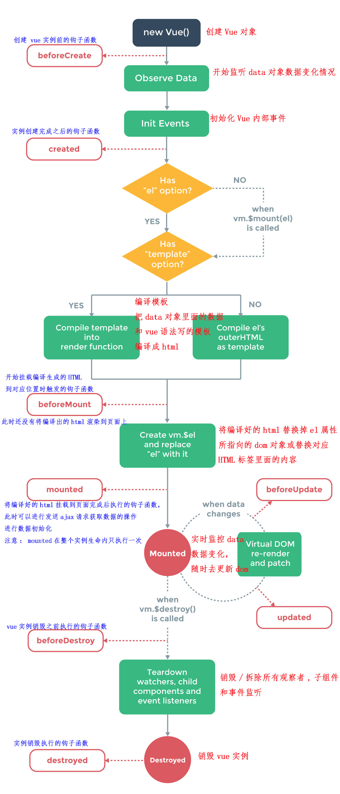
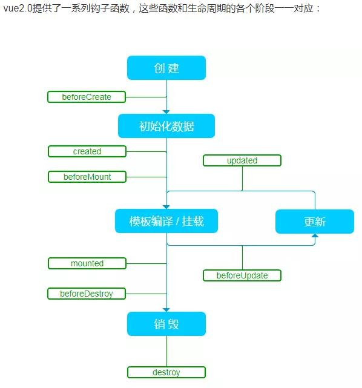
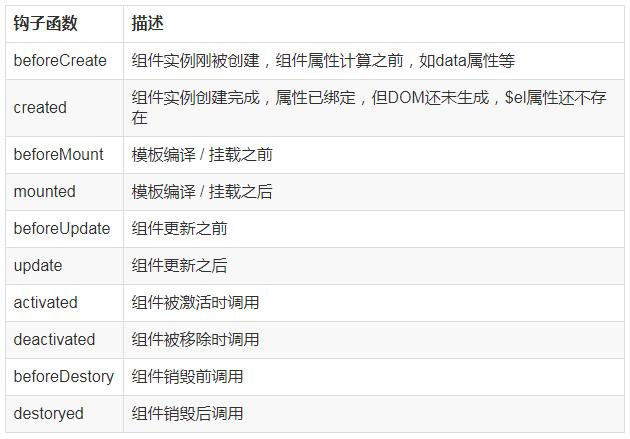

[TOC]


### 面试题链接

https://blog.csdn.net/qq_41646249/article/details/104644647

https://blog.csdn.net/qq_41646249/article/details/104644712


### Vue 中的 key 有什么作用？

key 是为 Vue 中 vnode 的唯一标记，通过这个 key，我们的 diff 操作可以更准确、更快速。

Vue 的 diff 过程可以概括为：oldCh 和 newCh 各有两个头尾的变量 oldStartIndex、oldEndIndex 和 newStartIndex、newEndIndex，它们会新节点和旧节点会进行两两对比，即一共有4种比较方式：newStartIndex 和oldStartIndex 、newEndIndex 和 oldEndIndex 、newStartIndex 和 oldEndIndex 、newEndIndex 和 oldStartIndex，如果以上 4 种比较都没匹配，如果设置了key，就会用 key 再进行比较，在比较的过程中，遍历会往中间靠，一旦 StartIdx > EndIdx 表明 oldCh 和 newCh 至少有一个已经遍历完了，就会结束比较。具体有无 key 的 diff 过程，可以查看作者写的另一篇详解虚拟 DOM 的文章《深入剖析：Vue核心之虚拟DOM》

所以 Vue 中 key 的作用是：key 是为 Vue 中 vnode 的唯一标记，通过这个 key，我们的 diff 操作可以更准确、更快速

更准确：因为带 key 就不是就地复用了，在 sameNode 函数 a.key === b.key 对比中可以避免就地复用的情况。所以会更加准确。

更快速：利用 key 的唯一性生成 map 对象来获取对应节点，比遍历方式更快，源码如下：

```jsx
function createKeyToOldIdx (children, beginIdx, endIdx) \\{
```


### vue的优点是什么？

- 低耦合。视图（View）可以独立于Model变化和修改，一个ViewModel可以绑定到不同的"View"上，当View变化的时候Model可以不变，当Model变化的时候View也可以不变

- 可重用性。你可以把一些视图逻辑放在一个ViewModel里面，让很多view重用这段视图逻辑

- 可测试。界面素来是比较难于测试的，而现在测试可以针对ViewModel来写

- 简洁、轻快、舒服


### 组件之间的传值？

#### 父组件与子组件传值

```
//父组件通过标签上面定义传值
<template>
    <Main :obj="data"></Main>
</template>
<script>
    //引入子组件
    import Main form "./main"
    
    exprot default\\{
        name:"parent",
        data()\\{
            return \\{
                data:"我要向子组件传递数据"
            \\}
        \\},
        //初始化组件
        components:\\{
            Main
        \\}
    \\}
</script>

//子组件通过props方法接受数据
<template>
    <div>\\\{\\\{dat\\\}\\\}a}}</div>
</template>
<script>
    exprot default\\{
        name:"son",
        //接受父组件传值
        props:["data"]
    \\}
</script>
```

#### 子组件向父组件传递数据

```
//子组件通过$emit方法传递参数
<template>
   <div v-on:click="events"></div>
</template>
<script>
    //引入子组件
    import Main form "./main"
    
    exprot default\\{
        methods:\\{
            events:function()\\{
                
            \\}
        \\}
    \\}
</script>

<template>
    <div>\\\{\\\{dat\\\}\\\}a}}</div>
</template>
<script>
    exprot default\\{
        name:"son",
        //接受父组件传值
        props:["data"]
    \\}
</script>
```


### Vue的实例生命周期



### 什么是vue的生命周期？

Vue实例从创建到销毁的过程，就是生命周期。

也就是从开始创建、初始化数据、编译模板、挂载DOM->渲染、更新->渲染、卸载等一系列过程，我们称这是Vue的生命周期。


### vue生命周期的作用是什么？

它的生命周期中有多个事件钩子，让我们在控制整个vue实例的过程时更容易形成好的逻辑。


### 钩子函数

1、生命周期函数  (c语言中有一类系统回调的函数然后执行业务 叫做钩子)

2、 在某一种条件成立的时刻 系统会去调用的vue中设定的函数 这些函数都叫做:生命周期函数

3、当前vm实例在创建到销毁的过程中  会去调用的函数

4、设计钩子函数的意义：为了更好的设计程序,让代码更有逻辑 和 可维护性


### 页面首次加载过程中，会依次触发哪些钩子：

beforeCreate，created，beforeMount，mounted


### DOM渲染在哪个周期中就已经完成？

DOM渲染在mounted中就已经完成了


### Vue生命周期总共有几个阶段？

它可以总共分为8个阶段：创建前/后，载入前/后，更新前/后，销毁前/后

除了beforeCreate，其他钩子都能访问Vue 实例的 data 属性

#### 创建前/后：

##### 1.beforeCreate

初始化实例后 数据观测和事件配置之前调用

vue实例的挂载元素el和数据对象data都为undefined，还未初始化。

在实例初始化之后，el 和 data 并未初始化（这个时期，this变量还不能使用，在data下的数据，和methods下的方法，watcher中的事件都不能获得到；）

1、这个在项目中干什么?

用于预加载一类，不是页面渲染

如：预加载图片: 网页中同源加载的优化(同一个页面中img script等等 src属性去请求资源) 、预加载工具、第三方工具的加载

可以加个loading事件，在加载实例时触发

2、能否网络请求?

能做网络请求，因为这是函数在运行时XMLHttpRequest是可以访问并且去做AJAX请求的

3、能否网络请求数据 然后设置到数据源中?

不能设置到数据源中，因为这个钩子中this还在创建

4、这个函数在运行时vm正在创建中:劫持data,methods 也就是this对象中还不能访问到数据

##### 2.created

实例创建完成后调用

完成了data数据的初始化，el没有（这个时候可以操作vue实例中的数据和各种方法，但是还不能对dom节点进行操作）

1、这个在项目中干什么?

请求首屏数据

初始化完成时的事件写在这里，如在这结束loading事件，异步请求也适宜在这里调用

2、能否网络请求?

能做网络请求,因为这是函数在运行时XMLHttpRequest是可以访问并且去做AJAX请求的

3、能否网络请求数据 然后设置到数据源中

可以设置到数据源中,因为这个钩子中 this已经创建完毕了      

4、vm对象已经创建完毕了,但是它(vm)还没有挂载到DOM树中， 这个函数可以操作this对象了  但是无法操作DOM

#### 载入前/后：

##### 3.beforeMount

挂载开始前被用

vue实例的$el（这里的el是虚拟的dom）和data都初始化了，但还是挂载之前为虚拟的dom节点，data.message还未替换。

1、渲染前的操作

2、vm对象已经创建完毕了,在挂载之前触发的钩子

3、这个函数可以操作this对象了  但是无法操作DOM

##### 4.mounted

el被新建，vm.\$el替换并挂载到实例上 之后调用

在mounted阶段，vue实例挂载完成，可以获取到dom节点，data.message成功渲染。

也可以在这发起后端请求，拿回数据，配合路由钩子做一些事情（挂载完毕，这时dom节点被渲染到文档内，一些需要dom的操作在此时才能正常进行）

1、vm已经挂载到页面了，注意：this.$el 代表了当前组件的真实DOM，要在mounted之后才有
2、请求首屏数据，请求时页面已经出来了  

#### 更新前/后：

当data变化时，会触发beforeUpdate和updated方法

注意：这两个钩子中不能网络请求新数据去更新数据源，会导致死循环

##### 5.beforeUpdate

数据更新时调用

数据源已经更新了(并不是数据更新前)，页面重新渲染前触发的钩子

是指view层数据变化前，不是data中的数据改变前触发；

##### 6.updated

数据更改导致的 DOM 重新渲染后调用

页面已经重新渲染了触发的钩子，是指view层的数据变化之后

如果对数据统一处理，在这里写上相应函数

#### 销毁前/后：

##### 7.beforeDestory

实例被销毁前调用

可以弹出一个确认是否保存的确认框：您确认要退出吗？确认删除XX吗？

1、vm对象销毁之前触发的钩子，this还在，可以做最后的操作
2、保存用户的行为配置文件：播放器的进度 等等

##### 8.destroyed

实例销毁后调用

当前组件已被删除，清空相关内容

1、 无法操作this
2、往往把当前组件中计时器清除了，可以把body的滚动条滚到顶部

销毁对象官方有一个专门的函数 this.$destroy()

在执行destroy方法后，对data的改变不会再触发周期函数，说明此时vue实例已经解除了事件监听以及和dom的绑定，但是dom结构依然存在。


### 基本写法模板：

```
new Vue(\\{
    el:"app",
    data: \\{\\},
    methods:\\{\\},
    filters:\\{ \\},
    computed:\\{\\},
    directives:\\{\\},
    // 钩子函数
    beforeCreate() \\{\\},
    created()\\{\\},

    beforeMount() \\{\\},
    mounted()\\{\\},

    beforeUpdate() \\{\\},
    updataed()\\{\\},

    beforeDestroy() \\{\\},
    destroyed() \\{\\}                
\\})
```


### vue 双向数据绑定原理？

vue 通过使用双向数据绑定，来实现了 View 和 Model 的同步更新。vue 的双向数据绑定主要是通过**使用数据劫持和发布订阅者模式来实现的**。

首先我们通过 Object.defineProperty() 方法来对 Model 数据各个属性添加访问器属性，以此来实现数据的劫持，因此当 Model 中的数据发生变化的时候，我们可以通过配置的 **setter 和 getter 方法来实现对 View 层数据更新的通知**。Vue3.0 将用原生 Proxy 替换 Object.defineProperty

数据在 html 模板中一共有两种绑定情况，一种是使用 v-model 来对 value 值进行绑定，一种是作为文本绑定，在对模板引擎进行解析的过程中。

如果遇到元素节点，并且属性值包含 v-model 的话，我们就从 Model 中去获取 v-model 所对应的属性的值，并赋值给元素的 value 值。然后给这个元素设置一个监听事件，当 View 中元素的数据发生变化的时候触发该事件，通知 Model 中的对应的属性的值进行更新。

如果遇到了绑定的文本节点，我们使用 Model 中对应的属性的值来替换这个文本。对于文本节点的更新，我们使用了发布订阅者模式，属性作为一个主题，我们为这个节点设置一个订阅者对象，将这个订阅者对象加入这个属性主题的订阅者列表中。当 Model 层数据发生改变的时候，Model 作为发布者向主题发出通知，主题收到通知再向它的所有订阅者推送，订阅者收到通知后更改自己的数
据。

详细资料可以参考：
[《Vue.js 双向绑定的实现原理》](http://www.cnblogs.com/kidney/p/6052935.html?utm_source=gold_browser_extension)


### Object.defineProperty 介绍？

Object.defineProperty 函数一共有三个参数，第一个参数是需要定义属性的对象，第二个参数是需要定义的属性，第三个是该属性描述符。

一个属性的描述符有四个属性，分别是 value 属性的值，writable 属性是否可写，enumerable 属性是否可枚举，configurable 属性是否可配置修改。

详细资料可以参考：
[《Object.defineProperty()》](https://developer.mozilla.org/zh-CN/docs/Web/JavaScript/Reference/Global_Objects/Object/defineProperty)


### 使用Object.defineProperty() 来进行数据劫持有什么缺点？

Object.defineProperty 无法监控到数组下标的变化，有一些对属性的操作，使用这种方法无法拦截，比如说**通过下标方式修改数组数据**或者**给对象新增属性**，不能实时响应，vue 内部通过重写函数解决了这个问题。Object.defineProperty 只能劫持对象的属性,因此我们需要对每个对象的每个属性进行遍历。

在 Vue3.0 中已经不使用这种方式了，而是通过使用 Proxy 对对象进行代理，从而实现数据劫持。使用 Proxy 的好处是它可以完美的监听到任何方式的数据改变，唯一的缺点是兼容性的问题，因为这是 ES6 的语法。


### 什么是 Proxy？

Proxy 是 ES6 中新增的一个特性，翻译过来意思是"代理"，用在这里表示**由它来“代理”某些操作**，可以译为“代理器”。 Proxy 让我们能够以简洁易懂的方式控制外部对对象的访问。其功能非常类似于设计模式中的代理模式。

Proxy 可以理解成，在目标对象之前架设一层“拦截”，外界对该对象的访问，都必须先通过这层拦截，因此提供了一种机制，可以对外界的访问进行过滤和改写。Proxy 用于修改某些操作的默认行为，等同于在语言层面做出修改，所以属于一种“元编程”，即对编程语言进行编程。

使用 Proxy 的核心优点是可以交由它来处理一些非核心逻辑（如：读取或设置对象的某些属性前记录日志；设置对象的某些属性值前，需要验证；某些属性的访问控制等）。 从而可以让对象只需关注于核心逻辑，达到关注点分离，降低对象复杂度等目的。


### Vue组件通信有哪些方式

1.父传子：props
父组件通过 props 向下传递数据给子组件。注：组件中的数据共有三种形式：data、props、computed

2.父传子孙：provide 和 inject
父组件定义provide方法return需要分享给子孙组件的属性，子孙组件使用 inject 选项来接收指定的我们想要添加在这个实例上的 属性；

3.子传父：通过事件形式
子组件通过 $emit()给父组件发送消息，父组件通过v-on绑定事件接收数据。

4.父子、兄弟、跨级：eventBus.js
这种方法通过一个空的 Vue 实例作为中央事件总线（事件中心）,用它来（e m i t ） 触 发 事 件 和 （ emit）触发事件和（emit）触发事件和（on）监听事件，巧妙而轻量地实现了任何组件间的通信。

5.通信插件：PubSub.js

6.vuex
vuex 是 vue 的状态管理器，存储的数据是响应式的。只需要把共享的值放到vuex中，其他需要的组件直接获取使用即可；


### router和route的区别

router为VueRouter的实例，是路由实例对象，相当于一个全局的路由器对象，包括了路由的跳转方法，钩子函数等，里面含有很多属性和子对象，例如history对象。经常用的跳转链接就可以用this.$router.push和router-link跳转一样。

route是当前正在跳转的路由信息对象。包括path，params，hash，query，fullPath，matched，name 等路由信息参数，可以从里面获取name,path,params,query等。


### Vue中常用的一些指令

1.v-model指令：用于表单输入，实现表单控件和数据的双向绑定。
2.v-on：简写为@，基础事件绑定
3.v-bind：简写为：，动态绑定一些元素的属性，类型可以是：字符串、对象或数组。
4.v-if指令：取值为true/false，控制元素是否需要被渲染
5.v-else指令：和v-if指令搭配使用，没有对应的值。当v-if的值false，v-else才会被渲染出来。
6.v-show指令：指令的取值为true/false，分别对应着显示/隐藏。
7.v-for指令：遍历data中存放的数组数据，实现列表的渲染。
8.v-once： 通过使用 v-once 指令，你也能执行一次性地插值，当数据改变时，插值处的内容不会更新


### vue的自定义指令

Vue除了核心功能默认内置的指令 ，Vue 也允许注册自定义指令。
自定义指令是用来操作DOM的。尽管Vue推崇数据驱动视图的理念，但并非所有情况都适合数据驱动。自定义指令就是一种有效的补充和扩展，不仅可用于定义任何的DOM操作，并且是可复用的。

添加自定义指令的两种方式：

全局指令： 通过 Vue.directive() 函数注册一个全局的指令。
局部指令：通过组件的 directives 属性，对该组件添加一个局部的指令。
可以参考[如何写一个Vue自定义指令](https://blog.csdn.net/qq_44182284/article/details/111309028)或[Vue.js官网关于自定义指令的详细讲解](https://cn.vuejs.org/v2/guide/custom-directive.html)学习


### 你有写过自定义指令吗？自定义指令的应用场景有哪些？

可以参考[如何写一个Vue自定义指令](https://blog.csdn.net/qq_44182284/article/details/111309028)


### 16.如何编写一个自定义指令

指令是个函数或者对象，用来操作dom，指令内部的this指向window；

a:全局指令 Vue.directive（指令名称不带v-,回调（el,bingding））

el:dom元素；binding是个对象，含有传入的参数，binding。value

b:局部 定义在选项里面

```
directives:\\{
	指令名不带v-	: 函数(el,binding)\\{\\}
\\}
```


### v-show和v-if指令的共同点和不同点

相同点：
v-show和v-if都能控制元素的显示和隐藏。
不同点：
1.实现本质方法不同:v-show本质就是通过设置css中的display设置为none;控制隐藏v-if是动态的向DOM树内添加或者删除DOM元素;
2.v-show都会编译，初始值为false，只是将display设为none，但它也编译了;v-if初始值为false，就不会编译了
总结：v-show只编译一次，后面其实就是控制css，而v-if不停的销毁和创建，如果要频繁切换某节点时，故v-show性能更好一点。


### 为什么避免v-if和v-for一起使用

vue2.x版本中，当 v-if 与 v-for 一起使用时，v-for 具有比 v-if 更高的优先级；
vue3.x版本中，当 v-if 与 v-for 一起使用时，v-if 具有比 v-for 更高的优先级。
官网明确指出：避免 v-if 和 v-for 一起使用，永远不要在一个元素上同时使用 v-if 和 v-for。

可以先对数据在计算数据中进行过滤，然后再进行遍历渲染；

操作和实现起来都没有什么问题，页面也会正常展示。但是会带来不必要的性能消耗；


### 为什么避免 v-if 和 v-for 用在一起

当 Vue 处理指令时，v-for 比 v-if 具有更高的优先级，这意味着 v-if 将分别重复运行于每个 v-for 循环中。通过 v-if 移动到容器元素，不会再重复遍历列表中的每个值。取而代之的是，我们只检查它一次，且不会在 v-if 为否的时候运算 v-for。


### 请问 v-if 和 v-show 有什么区别

v-if 指令是直接销毁和重建 DOM 达到让元素显示和隐藏的效果，适用于在运行时很少改变条件，不需要频繁切换条件的场景

v-show 指令是通过修改元素的 display 的 CSS 属性让其显示或者隐藏，适用于需要非常频繁切换条件的场景


### vue中 key 值的作用

需要使用 key 来给每个节点做一个唯一标识，Diff 算法就可以正确的识别此节点，找到正确的位置区插入新的节点
所以一句话，key 的作用主要是为了高效的更新虚拟 DOM


### computed和watch有什么区别

#### computed

是计算一个新的属性，并将该属性挂载到 Vue 实例上，而 watch 是监听已经存在且已挂载到 Vue 实例上的数据，所以用 watch 同样可以监听 computed 计算属性的变化。

`computed`是依赖已有的变量来计算一个目标变量，大多数情况都是`多个变量`凑在一起计算出`一个变量`，并且`computed`具有`缓存机制`，依赖值不变的情况下其会直接读取缓存进行复用，`computed`不能进行`异步操作`

- computed是计算属性，依赖其他属性计算值，它**更多用于计算值的场景**
- computed具有缓存性，computed的值在getter执行后是会缓存的，只有在它依赖的属性值改变之后，下一次获取computed的值时重新调用对应的getter来计算
- computed适用于计算比较消耗性能的计算场景

#### watch

`watch`是监听某一个变量的变化，并执行相应的回调函数，在回调中可以进行一些逻辑操作。通常是`一个变量`的变化决定`多个变量`的变化，`watch`可以进行`异步操作`

- watch更多的是[观察]的作用，类似于某些数据的监听回调，用于观察props $emit或者本组件的值，当数据变化时来执行回调进行后续操作
- 无缓存性，页面重新渲染时值不变化也会执行

**小结**

**当我们要进行数值计算，而且依赖于其他数据，那么把这个数据设计为computed**
**如果你需要在某个数据变化时做一些事情，使用watch来观察这个数据变化。**

computed 本质是一个惰性求值的观察者，具有缓存性，只有当依赖变化后，第一次访问 computed 属性，才会计算新的值。而 watch 则是当数据发生变化便会调用执行函数。

从使用场景上说，computed 适用一个数据被多个数据影响，而 watch 适用一个数据影响多个数据。

简单记就是：一般情况下`computed`是`多对一`，`watch`是`一对多`

详细资料可以参考：
[《做面试的不倒翁：浅谈 Vue 中 computed 实现原理》](https://juejin.im/post/5b98c4da6fb9a05d353c5fd7)
[《深入理解 Vue 的 watch 实现原理及其实现方式》](https://juejin.im/post/5af908ea5188254265399009)


### 计算变量时，methods和computed哪个好？

```
<div>
    <div>\\\{\\\{howMuch1(\\\}\\\})}}</div>
    <div>\\\{\\\{howMuch2(\\\}\\\})}}</div>
    <div>\\\{\\\{inde\\\}\\\}x}}</div>
</div>

data: () \\{
    return \\{
         index: 0
       \\}
     \\}
methods: \\{
    howMuch1() \\{
        return this.num + this.price
    \\}
  \\}
computed() \\{
    howMuch2() \\{
        return this.num + this.price
    \\}
  \\}
```

> `computed`会好一些，因为computed会有`缓存`。例如index由0变成1，那么会触发视图更新，这时候methods会重新执行一次，而computed不会，因为computed依赖的两个变量num和price都没变。


### 只执行一次，使用methods和computed哪个比较好

在Vue.js中，`methods` 和 `computed` 都可以用来定义函数，但它们的使用场景有所不同。

`methods` 用于定义在Vue实例中可调用的方法，这些方法可以执行一些具有副作用的操作，例如修改数据、发送请求等。一般来说，`methods` 是用来处理交互行为或事件处理的函数。

`computed` 用于定义基于响应式数据计算出的派生数据。在`computed`中定义的属性会根据依赖的数据进行缓存，只有相关依赖发生变化时才会重新计算。因此，`computed`适合用来定义依赖数据的派生状态，避免重复计算。

对于只需要执行一次的逻辑，如果这个逻辑是基于响应式数据计算出的结果，并且希望在数据变化时自动更新，那么可以考虑使用 `computed`。如果这个逻辑不涉及响应式数据，或者只是简单的执行操作，那么可以使用 `methods`。

综上所述，根据具体需求来选择使用 `methods` 或 `computed`。如果仅仅是执行一次的逻辑，且不需要基于响应式数据的更新，更倾向于使用 `methods`。


### keep-alive 组件有什么作用？

如果你需要在组件切换的时候，保存一些组件的状态防止多次渲染，就可以使用 keep-alive 组件包裹需要保存的组件。


### $nextTick的理解

用法：

**在下次DOM更新循环结束之后执行延迟回调**。在修改数据之后立即使用这个方法，获取更新后的 DOM。

为什么？

Vue 实现响应式并不是数据发生变化之后 DOM 立即变化，而是按一定的策略进行 DOM 的更新。Vue 在更新 DOM 时是异步执行的。只要侦听到数据变化，Vue 将开启一个队列，并缓冲在同一事件循环中发生的所有数据变更。如果同一个 watcher 被多次触发，只会被推入到队列中一次。这种在缓冲时去除重复数据对于避免不必要的计算和 DOM 操作是非常重要的。然后，在下一个的事件循环“tick”中，Vue 刷新队列并执行实际 (已去重的) 工作。
所以为了**在数据变化之后等待Vue完成更新DOM**，可以在数据变化之后立即使用 Vue.nextTick(callback)。这样回调函数将在 DOM 更新完成后被调用。

使用场景：

在你更新完数据后，需要及时操作渲染好的DOM时


### Vue.nextTick(callback) 使用原理：

原因是，Vue 是异步执行 dom 更新的，一旦观察到数据变化，Vue 就会开启一个队列，然后把在同一个事件循环 (event loop) 当中观察到数据变化的 watcher 推送进这个队列。如果这个 watcher 被触发多次，只会被推送到队列一次。这种缓冲行为可以有效的去掉重复数据造成的不必要的计算和 DOm 操作。而在下一个事件循环时，Vue 会清空队列，并进行必要的 DOM 更新。

当你设置 vm.someData = 'new value'，DOM 并不会马上更新，而是在异步队列被清除，也就是下一个事件循环开始时执行更新时才会进行必要的 DOM 更新。如果此时你想要根据更新的 DOM 状态去做某些事情，就会出现问题。为了在数据变化之后等待 Vue 完成更新 DOM ，可以在数据变化之后立即使用 Vue.nextTick(callback) 。这样回调函数在 DOM 更新完成后就会调用。


### nextTick实现原理是什么？

nextTick主要使用了宏任务和微任务。根据执行环境分别尝试采用

Promise

MutationObserver

setImmediate

如果以上都不行则采用 setTimeout

定义了一个异步方法，多次调用 nextTick 会将方法存入队列中，通过这个异步方法清空当前队列。

（关于宏任务和微任务以及事件循环可以参考我的另两篇专栏）

(看到这你就会发现，其实问框架最终还是考验你的原生 JavaScript 功底)


### \$nextTick的使用

#### 1、什么是 Vue.nextTick()？

定义：在下次 DOM 更新循环结束之后执行延迟回调。在修改数据之后立即使用这个方法，获取更新后的 DOM。

所以就衍生出了这个获取更新后的 DOM 的 Vue 方法。所以放在 Vue.nextTick()回调函数中的执行的应该是会对 DOM 进行操作的 js 代码；

理解：nextTick()，是将回调函数延迟在下一次 dom 更新数据后调用，简单的理解是：当数据更新了，在dom中渲染后，自动执行该函数，

```js
<template>
  <div class="hello">
    <div>
      <button id="firstBtn" @click="testClick()" ref="aa">\\\{\\\{testMs\\\}\\\}g}}</button>
    </div>
  </div>
</template>

<script>
export default \\{
  name: 'HelloWorld',
  data () \\{
    return \\{
      testMsg:"原始值",
    \\}
  \\},
  methods:\\{
    testClick:function()\\{
      let that=this;
      that.testMsg="修改后的值";
      console.log(that.$refs.aa.innerText);   //that.$refs.aa获取指定DOM，输出：原始值
    \\}
  \\}
\\}
</script>
```

使用 this.\$nextTick()

```js
methods:\\{
    testClick:function()\\{
      let that=this;
      that.testMsg="修改后的值";
      that.$nextTick(function()\\{
        console.log(that.$refs.aa.innerText);  //输出：修改后的值
      \\});
    \\}
  \\}
```

注意：Vue 实现响应式并不是数据发生变化之后 DOM 立即变化，而是按一定的策略进行 DOM 的更新。$nextTick 是在下次 DOM 更新循环结束之后执行延迟回调，在修改数据之后使用 $nextTick，则可以在回调中获取更新后的 DOM，

#### 2、什么时候需要用的 Vue.nextTick()？

1、Vue 生命周期的 created()钩子函数进行的 DOM 操作一定要放在 Vue.nextTick()的回调函数中，原因是在 created()钩子函数执行的时候 DOM 其实并未进行任何渲染，而此时进行 DOM 操作无异于徒劳，所以此处一定要将 DOM 操作的 js 代码放进 Vue.nextTick()的回调函数中。与之对应的就是 mounted 钩子函数，因为该钩子函数执行时所有的 DOM 挂载已完成。

```js
created()\\{
    let that=this;
    that.$nextTick(function()\\{  //不使用this.$nextTick()方法会报错
        that.$refs.aa.innerHTML="created中更改了按钮内容";  //写入到DOM元素
    \\});
\\}
```

2、当项目中你想在改变 DOM 元素的数据后基于新的 dom 做点什么，对新 DOM 一系列的 js 操作都需要放进 Vue.nextTick()的回调函数中；通俗的理解是：更改数据后当你想立即使用 js 操作新的视图的时候需要使用它

```js
<template>
  <div class="hello">
    <h3 id="h">\\\{\\\{testMs\\\}\\\}g}}</h3>
  </div>
</template>

<script>
export default \\{
  name: 'HelloWorld',
  data () \\{
    return \\{
      testMsg:"原始值",
    \\}
  \\},
  methods:\\{
    changeTxt:function()\\{
      let that=this;
      that.testMsg="修改后的文本值";  //vue数据改变，改变dom结构
      let domTxt=document.getElementById('h').innerText;  //后续js对dom的操作
      console.log(domTxt);  //输出可以看到vue数据修改后DOM并没有立即更新，后续的dom都不是最新的
      if(domTxt==="原始值")\\{
        console.log("文本data被修改后dom内容没立即更新");
      \\}else \\{
        console.log("文本data被修改后dom内容被马上更新了");
      \\}
    \\},

  \\}
\\}
</script>
```

正确的用法是：vue 改变 dom 元素结构后使用 vue.\$nextTick()方法来实现 dom 数据更新后延迟执行后续代码

```js
    changeTxt:function()\\{
      let that=this;
      that.testMsg="修改后的文本值";  //修改dom结构

      that.$nextTick(function()\\{  //使用vue.$nextTick()方法可以dom数据更新后延迟执行
        let domTxt=document.getElementById('h').innerText;
        console.log(domTxt);  //输出可以看到vue数据修改后并没有DOM没有立即更新，
        if(domTxt==="原始值")\\{
          console.log("文本data被修改后dom内容没立即更新");
        \\}else \\{
          console.log("文本data被修改后dom内容被马上更新了");
        \\}
      \\});
    \\}
```

3、在使用某个第三方插件时 ，希望在 vue 生成的某些 dom 动态发生变化时重新应用该插件，也会用到该方法，这时候就需要在 \$nextTick 的回调函数中执行重新应用插件的方法。


### 路由之间跳转？

#### 声明式（标签跳转）

```
<router-link :to="index">
```

#### 编程式（ js跳转）

```
router.push('index')
```


### vue 中的性能优化

编码阶段

- 尽量减少data中的数据，data中的数据都会增加getter和setter，会收集对应的watcher
- v-if和v-for不能连用
- 如果需要使用v-for给每项元素绑定事件时使用事件代理
- 在更多的情况下，使用v-if替代v-show
- key保证唯一
- SPA 页面采用keep-alive缓存组件
- 使用路由（组件）懒加载、异步组件
- 防抖、节流
- 第三方模块按需导入
- 长列表滚动到可视区域动态加载
- 图片懒加载（LazyLoad Images）
- 引入生产环境的 Vue 文件
- 使用单文件组件预编译模板
- 减少 http 请求，合理设置 HTTP 缓存
- CSS Sprites
- 提取组件的 CSS 到单独到文件
- CSS 放在页面最上部，javascript 放在页面最下面
- 尽量避免使用 eval 和 Function
- 利用 Object.freeze()提升性能
- 扁平化 Store 数据结构
- 合理使用持久化 Store 数据

SEO优化

- 服务端渲染SSR
- 预渲染

打包优化

- 压缩代码
- 服务端开启 gzip 压缩
- Tree Shaking/Scope Hoisting
- 使用cdn加载第三方模块
- 多线程打包happypack
- splitChunks抽离公共文件
- sourceMap优化

用户体验

- 骨架屏

- PWA


使用缓存优化

- 客户端（浏览器）缓存
- 服务端缓存


### 什么是 MVVM？比之 MVC 有什么区别？什么又是 MVP ？

MVC、MVP 和 MVVM 是三种常见的软件架构设计模式，主要通过分离关注点的方式来组织代码结构，优化我们的开发效率。

比如说我们实验室在以前项目开发的时候，使用单页应用时，往往一个路由页面对应了一个脚本文件，所有的页面逻辑都在一个脚本文件里。页面的渲染、数据的获取，对用户事件的响应所有的应用逻辑都混合在一起，这样在开发简单项目时，可能看不出什么问题，当时一旦项目变得复杂，那么整个文件就会变得冗长，混乱，这样对我们的项目开发和后期的项目维护是非常不利的。

MVC 通过分离 Model、View 和 Controller 的方式来组织代码结构。其中 View 负责页面的显示逻辑，Model 负责存储页面的业务数据，以及对相应数据的操作。并且 View 和 Model 应用了观察者模式，当 Model 层发生改变的时候它会通知有关 View 层更新页面。Controller 层是 View 层和 Model 层的纽带，它主要负责用户与应用的响应操作，当用户与页面产生交互的时候，Controller 中的事件触发器就开始工作了，通过调用 Model 层，来完成对 Model 的修改，然后 Model 层再去通知 View 层更新。

MVP 模式与 MVC 唯一不同的在于 Presenter 和 Controller。在 MVC 模式中我们使用观察者模式，来实现当 Model 层数据发生变化的时候，通知 View 层的更新。这样 View 层和 Model 层耦合在一起，当项目逻辑变得复杂的时候，可能会造成代码的混乱，并且可能会对代码的复用性造成一些问题。MVP 的模式通过使用 Presenter 来实现对 View 层和 Model 层的解耦。MVC 中的Controller 只知道 Model 的接口，因此它没有办法控制 View 层的更新，MVP 模式中，View 层的接口暴露给了 Presenter 因此我们可以在 Presenter 中将 Model 的变化和 View 的变化绑定在一起，以此来实现 View 和 Model 的同步更新。这样就实现了对 View 和 Model 的解耦，Presenter 还包含了其他的响应逻辑。

MVVM 模式中的 VM，指的是 ViewModel，它和 MVP 的思想其实是相同的，不过它通过双向的数据绑定，将 View 和 Model 的同步更新给自动化了。当 Model 发生变化的时候，ViewModel 就会自动更新；ViewModel 变化了，View 也会更新。这样就将 Presenter 中的工作给自动化了。我了解过一点双向数据绑定的原理，比如 vue 是通过使用数据劫持和发布订阅者模式来实现的这一功能。

详细资料可以参考：
[《浅析前端开发中的 MVC/MVP/MVVM 模式》](https://juejin.im/post/593021272f301e0058273468)
[《MVC，MVP 和 MVVM 的图示》](http://www.ruanyifeng.com/blog/2015/02/mvcmvp_mvvm.html)
[《MVVM》](https://juejin.im/book/5bdc715fe51d454e755f75ef/section/5bdc72e6e51d45054f664dbf)
[《一篇文章了解架构模式：MVC/MVP/MVVM》](https://segmentfault.com/a/1190000015310674)


### 什么是 Virtual DOM？为什么 Virtual DOM 比原生 DOM 快？

我对 Virtual DOM 的理解是，

首先对我们将要插入到文档中的 DOM 树结构进行分析，使用 js 对象将其表示出来，比如一个元素对象，包含 TagName、props 和 Children 这些属性。然后我们将这个 js 对象树给保存下来，最后再将 DOM 片段插入到文档中。

当页面的状态发生改变，我们需要对页面的 DOM 的结构进行调整的时候，我们首先根据变更的状态，重新构建起一棵对象树，然后将这棵新的对象树和旧的对象树进行比较，记录下两棵树的的差异。

最后将记录的有差异的地方应用到真正的 DOM 树中去，这样视图就更新了。

我认为 Virtual DOM 这种方法对于我们需要有大量的 DOM 操作的时候，能够很好的提高我们的操作效率，通过在操作前确定需要做的最小修改，尽可能的减少 DOM 操作带来的重流和重绘的影响。其实 Virtual DOM 并不一定比我们真实的操作 DOM 要快，这种方法的目的是为了提高我们开发时的可维护性，在任意的情况下，都能保证一个尽量小的性能消耗去进行操作。

详细资料可以参考：
[《Virtual DOM》](https://juejin.im/book/5bdc715fe51d454e755f75ef/section/5bdc72e6e51d45054f664dbf)
[《理解 Virtual DOM》](https://github.com/y8n/blog/issues/5)
[《深度剖析：如何实现一个 Virtual DOM 算法》](https://github.com/livoras/blog/issues/13)
[《网上都说操作真实 DOM 慢，但测试结果却比 React 更快，为什么？》](https://www.zhihu.com/question/31809713/answer/53544875)


### 如何比较两个 DOM 树的差异？

两个树的完全 diff 算法的时间复杂度为 O(n^3) ，但是在前端中，我们很少会跨层级的移动元素，所以我们只需要比较同一层级的元素进行比较，这样就可以将算法的时间复杂度降低为 O(n)。

算法首先会对新旧两棵树进行一个深度优先的遍历，这样每个节点都会有一个序号。在深度遍历的时候，每遍历到一个节点，我们就将这个节点和新的树中的节点进行比较，如果有差异，则将这个差异记录到一个对象中。

在对列表元素进行对比的时候，由于 TagName 是重复的，所以我们不能使用这个来对比。我们需要给每一个子节点加上一个 key，列表对比的时候使用 key 来进行比较，这样我们才能够复用老的 DOM 树上的节点。


### 组件的设计原则

- 页面上每个独立的可视/可交互区域视为一个组件(比如页面的头部，尾部，可复用的区块)
- 每个组件对应一个工程目录，组件所需要的各种资源在这个目录下就近维护(组件的就近维护思想体现了前端的工程化思想，为前端开发提供了很好的分治策略，在vue.js中，通过.vue文件将组件依赖的模板，js，样式写在一个文件中)
  (每个开发者清楚开发维护的功能单元，它的代码必然存在在对应的组件目录中，在该目录下，可以找到功能单元所有的内部逻辑)
- 页面不过是组件的容器，组件可以嵌套自由组合成完整的页面


### 对于 Vue 是一套渐进式框架的理解

每个框架都不可避免会有自己的一些特点，从而会对使用者有一定的要求，这些要求就是主张，主张有强有弱，它的强势程度会影响在业务开发中的使用方式。

1、使用 vue，你可以在原有大系统的上面，把一两个组件改用它实现，当 jQuery 用；

2、也可以整个用它全家桶开发，当 Angular 用；

3、还可以用它的视图，搭配你自己设计的整个下层用。你可以在底层数据逻辑的地方用 OO(Object–Oriented )面向对象和设计模式的那套理念。
也可以函数式，都可以。

它只是个轻量视图而已，只做了自己该做的事，没有做不该做的事，仅此而已。

你不必一开始就用 Vue 所有的全家桶，根据场景，官方提供了方便的框架供你使用。

场景联想
场景 1：
维护一个老项目管理后台，日常就是提交各种表单了，这时候你可以把 vue 当成一个 js 库来使用，就用来收集 form 表单，和表单验证。

场景 2：
得到 boss 认可， 后面整个页面的 dom 用 Vue 来管理，抽组件，列表用 v-for 来循环，用数据驱动 DOM 的变化

场景 3:
越来越受大家信赖，领导又找你了，让你去做一个移动端 webapp，直接上了 vue 全家桶！

场景 1-3 从最初的只因多看你一眼而用了前端 js 库，一直到最后的大型项目解决方案。


### vue 常用的修饰符

[参考](https://blog.csdn.net/qq_42238554/article/details/86592295)


### v-on 可以监听多个方法吗？

肯定可以的。

解析：

```html
<input
  type="text"
  :value="name"
  @input="onInput"
  @focus="onFocus"
  @blur="onBlur"
/>
```


### vue-cli 工程升级 vue 版本

在项目目录里运行 npm upgrade vue vue-template-compiler，不出意外的话，可以正常运行和 build。如果有任何问题，删除 node_modules 文件夹然后重新运行 npm i 即可。（简单的说就是升级 vue 和 vue-template-compiler 两个插件）


### vue 事件中如何使用 event 对象？

v-on 指令（可以简写为 @）

1、使用不带圆括号的形式，event 对象将被自动当做实参传入；

2、使用带圆括号的形式，我们需要使用 \$event 变量显式传入 event 对象。

解析：

一、event 对象

（一）事件的 event 对象

你说你是搞前端的，那么你肯定就知道事件，知道事件，你就肯定知道 event 对象吧？各种的库、框架多少都有针对 event 对象的处理。比如 jquery，通过它内部进行一定的封装，我们开发的时候，就无需关注 event 对象的部分兼容性问题。最典型的，如果我们要阻止默认事件，在 chrome 等浏览器中，我们可能要写一个：

```js
event.preventDefault();
```

而在 IE 中，我们则需要写：

```js
event.returnValue = false;
```

多亏了 jquery ，跨浏览器的实现，我们统一只需要写：

```js
event.preventDefault();
```

兼容？jquery 内部帮我们搞定了。类似的还有比如阻止事件冒泡以以及事件绑定（addEventListener / attachEvent）等，简单到很多的后端都会使用 \$('xxx').bind(...)，这不是我们今天的重点，我们往下看。

（二）vue 中的 event 对象

我们知道，相比于 jquery，vue 的事件绑定可以显得更加直观和便捷，我们只需要在模板上添加一个 v-on 指令（还可以简写为 @），即可完成类似于 \$('xxx').bind 的效果，少了一个利用选择器查询元素的操作。我们知道，jquery 中，event 对象会被默认当做实参传入到处理函数中，如下

```js
$("body").bind("click", function(event) \\{
  console.log(typeof event); // object
\\});
```

这里直接就获取到了 event 对象，那么问题来了，vue 中呢？

```js
<div id="app">
    <button v-on:click="click">click me</button>
</div>
...
var app = new Vue(\\{
    el: '#app',
    methods: \\{
        click(event) \\{
            console.log(typeof event);    // object
        \\}
    \\}
\\});
```

这里的实现方式看起来和 jquery 是一致的啊，但是实际上，vue 比 jquery 要要复杂得多，jquery 官方也明确的说，v-on 不简单是 addEventListener 的语法糖。在 jquery 中，我们传入到 bind 方法中的回调，只能是一个函数表类型的变量或者一个匿名函数，传递的时候，还不能执行它（在后面加上一堆圆括号），否则就变成了取这一个函数的返回值作为事件回调。而我们知道，vue 的 v-on 指令接受的值可以是函数执行的形式，比如 v-on:click="click(233)" 。这里我们可以传递任何需要传递的参数，甚至可以不传递参数：

```js
<div id="app">
    <button v-on:click="click()">click me</button>
</div>
...
var app = new Vue(\\{
    el: '#app',
    methods: \\{
        click(event) \\{
            console.log(typeof event);    // undefined
        \\}
    \\}
\\});
```

咦？我的 event 对象呢？怎么不见了？打印看看 arguments.length 也是 0，说明这时候确实没有实参被传入进来。T_T，那我们如果既需要传递参数，又需要用到 event 对象，这个该怎么办呢？

（三）\$event

翻看 vue 文档，不难发现，其实我们可以通过将一个特殊变量 \$event 传入到回调中解决这个问题：

```js
<div id="app">
    <button v-on:click="click($event, 233)">click me</button>
</div>
...
var app = new Vue(\\{
    el: '#app',
    methods: \\{
        click(event, val) \\{
            console.log(typeof event);    // object
        \\}
    \\}
\\});
```

好吧，这样看起来就正常了。
简单总结来说：

使用不带圆括号的形式，event 对象将被自动当做实参传入；

使用带圆括号的形式，我们需要使用 \$event 变量显式传入 event 对象。


### Vue 组件中 data 为什么必须是函数

在 new Vue() 中，data 是可以作为一个对象进行操作的，然而在 component 中，data 只能以函数的形式存在，不能直接将对象赋值给它，这并非是 Vue 自身如此设计，而是跟 JavaScript 特性相关，我们来回顾下 JavaScript 的原型链

```js
var Component = function() \\{\\};
	Component.prototype.data = \\{
  	message: "Love"
\\};
var component1 = new Component(),
component2 = new Component();
component1.data.message = "Peace";
console.log(component2.data.message); // Peace
```

以上**两个实例都引用同一个对象，当其中一个实例属性改变时，另一个实例属性也随之改变，只有当两个实例拥有自己的作用域时，才不会互相干扰** ！

```js
var Component = function() \\{
  	this.data = this.data();
\\};
Component.prototype.data = function() \\{
  	return \\{
    	message: "Love"
  	\\};
\\};
var component1 = new Component(),
 component2 = new Component();
component1.data.message = "Peace";
console.log(component2.data.message); // Love
```


### vue 中子组件调用父组件的方法

- 第一种方法是直接在子组件中通过 this.\$parent.event 来调用父组件的方法
- 第二种方法是在子组件里用\$emit 向父组件触发一个事件，父组件监听这个事件就行了
- 第三种是父组件把方法传入子组件中，在子组件里直接调用这个方法

解析：

第一种方法是直接在子组件中通过 this.\$parent.event 来调用父组件的方法

父组件

```js
<template>
  <div>
    <child></child>
  </div>
</template>
<script>
  import child from '~/components/dam/child';
  export default \\{
    components: \\{
      child
    \\},
    methods: \\{
      fatherMethod() \\{
        console.log('测试');
      \\}
    \\}
  \\};
</script>
```

子组件

```html
<template>
  <div>
    <button @click="childMethod()">点击</button>
  </div>
</template>
<script>
  export default \\{
    methods: \\{
      childMethod() \\{
        this.$parent.fatherMethod();
      \\}
    \\}
  \\};
</script>
```

第二种方法是在子组件里用\$emit 向父组件触发一个事件，父组件监听这个事件就行了

父组件

```html
<template>
  <div>
    <child @fatherMethod="fatherMethod"></child>
  </div>
</template>
<script>
  import child from "~/components/dam/child";
  export default \\{
    components: \\{
      child
    \\},
    methods: \\{
      fatherMethod() \\{
        console.log("测试");
      \\}
    \\}
  \\};
</script>
```

子组件

```html
<template>
  <div>
    <button @click="childMethod()">点击</button>
  </div>
</template>
<script>
  export default \\{
    methods: \\{
      childMethod() \\{
        this.$emit("fatherMethod");
      \\}
    \\}
  \\};
</script>
```

第三种是父组件把方法传入子组件中，在子组件里直接调用这个方法

父组件

```html
<template>
  <div>
    <child :fatherMethod="fatherMethod"></child>
  </div>
</template>
<script>
  import child from "~/components/dam/child";
  export default \\{
    components: \\{
      child
    \\},
    methods: \\{
      fatherMethod() \\{
        console.log("测试");
      \\}
    \\}
  \\};
</script>

```

子组件

```html
<template>
  <div>
    <button @click="childMethod()">点击</button>
  </div>
</template>
<script>
  export default \\{
    props: \\{
      fatherMethod: \\{
        type: Function,
        default: null
      \\}
    \\},
    methods: \\{
      childMethod() \\{
        if (this.fatherMethod) \\{
          this.fatherMethod();
        \\}
      \\}
    \\}
  \\};
</script>
```


### vue 中父组件调用子组件的方法

答案：使用\$refs

父组件

```html
<template>
  <div>
    <button @click="clickParent">点击</button>
    <child ref="mychild"></child>
  </div>
</template>

<script>
  import Child from "./child";
  export default \\{
    name: "parent",
    components: \\{
      child: Child
    \\},
    methods: \\{
      clickParent() \\{
        this.$refs.mychild.parentHandleclick("嘿嘿嘿"); // 划重点！！！！
      \\}
    \\}
  \\};
</script>
```

子组件

```html
<template>
  <div>
    child
  </div>
</template>

<script>
  export default \\{
    name: "child",
    props: "someprops",
    methods: \\{
      parentHandleclick(e) \\{
        console.log(e);
      \\}
    \\}
  \\};
</script>
```


### vue 中 keep-alive 组件的作用

答案：keep-alive 是 Vue 内置的一个组件，**可以使被包含的组件保留状态，或避免重新渲染。**

解析：

用法也很简单：

```html
<keep-alive>
  <component>
    <!-- 该组件将被缓存！ -->
  </component>
</keep-alive>
```

props
_ include - 字符串或正则表达，只有匹配的组件会被缓存
_ exclude - 字符串或正则表达式，任何匹配的组件都不会被缓存

```js
// 组件 a
export default \\{
  name: "a",
  data() \\{
    return \\{\\};
  \\}
\\};
```

```html
<keep-alive include="a">
  <component>
    <!-- name 为 a 的组件将被缓存！ -->
  </component> 
</keep-alive>
可以保留它的状态或避免重新渲染
```

```html
<keep-alive exclude="a">
  <component>
    <!-- 除了 name 为 a 的组件都将被缓存！ -->
  </component> </keep-alive>
可以保留它的状态或避免重新渲染
```

但实际项目中,需要配合 vue-router 共同使用.

router-view 也是一个组件，如果直接被包在 keep-alive 里面，所有路径匹配到的视图组件都会被缓存：

```html
<keep-alive>
  <router-view>
    <!-- 所有路径匹配到的视图组件都会被缓存！ -->
  </router-view>
</keep-alive>
```

如果只想 router-view 里面某个组件被缓存，怎么办？

增加 router.meta 属性

```js
// routes 配置
export default [
  \\{
    path: "/",
    name: "home",
    component: Home,
    meta: \\{
      keepAlive: true // 需要被缓存
    \\}
  \\},
  \\{
    path: "/:id",
    name: "edit",
    component: Edit,
    meta: \\{
      keepAlive: false // 不需要被缓存
    \\}
  \\}
];
```

```
<keep-alive>
    <router-view v-if="$route.meta.keepAlive">
        <!-- 这里是会被缓存的视图组件，比如 Home！ -->
    </router-view>
</keep-alive>

<router-view v-if="!$route.meta.keepAlive">
    <!-- 这里是不被缓存的视图组件，比如 Edit！ -->
</router-view>
```


### vue 中如何编写可复用的组件？

总结组件的职能，什么需要外部控制（即 props 传啥），组件需要控制外部吗（\$emit）,是否需要插槽（slot）


### 什么是 vue 生命周期和生命周期钩子函数？

vue 的生命周期就是 vue 实例从创建到销毁的过程

解析：




### vue 生命周期钩子函数有哪些？




### vue 如何监听键盘事件中的按键
[参考](https://blog.csdn.net/xiaxiangyun/article/details/80404768)


### 什么是 vue 的计算属性？

答案：先来看一下计算属性的定义：
**当其依赖的属性的值发生变化的时，计算属性会重新计算。反之则使用缓存中的属性值。**
计算属性和vue中的其它数据一样，都是响应式的，只不过它必须依赖某一个数据实现，并且只有它依赖的数据的值改变了，它才会更新。


### 什么是 Virtual DOM？

可以看作是一个使用 javascript 模拟了 DOM 结构的树形结构

[参考](https://www.cnblogs.com/gaosong-shuhong/p/9253959.html)


### Vue 中如何实现 proxy 代理？

webpack 自带的 devServer 中集成了 http-proxy-middleware。配置 devServer 的 proxy 选项即可

```js
proxyTable: \\{
    '/api': \\{
        target: 'http://192.168.149.90:8080/', // 设置你调用的接口域名和端口号
    	changeOrigin: true,   // 跨域
    	pathRewrite: \\{
     		'^/api': '/'
    	\\}
   	\\}
\\}
```


### vue 在什么情况下在数据发生改变的时候不会触发视图更新

v-for 遍历的数组，当数组内容使用的是 arr[0].xx =xx 更改数据，vue 无法监测到
vm.arr.length = newLength 也是无法检测的到的


### vue 的优点是什么？

低耦合。视图（View）可以独立于 Model 变化和修改，一个 ViewModel 可以绑定到不同的"View"上，当 View 变化的时候 Model 可以不变，当 Model 变化的时候 View 也可以不变。

可重用性。你可以把一些视图逻辑放在一个 ViewModel 里面，让很多 view 重用这段视图逻辑。

独立开发。开发人员可以专注于业务逻辑和数据的开发（ViewModel），设计人员可以专注于页面设计。

可测试。界面素来是比较难于测试的，而现在测试可以针对 ViewModel 来写。

轻量级框架：只关注视图层，是一个构建数据的视图集合，大小只有几十 kb ；

简单易学：国人开发，中文文档，不存在语言障碍 ，易于理解和学习；

双向数据绑定：保留了 angular 的特点，在数据操作方面更为简单；

组件化：保留了 react 的优点，实现了 html 的封装和重用，在构建单页面应用方面有着独特的优势；

视图，数据，结构分离：使数据的更改更为简单，不需要进行逻辑代码的修改，只需要操作数据就能完成相关操作；

虚拟DOM：dom 操作是非常耗费性能的， 不再使用原生的 dom 操作节点，极大解放 dom 操作，但具体操作的还是 dom 不过是换了另一种方式；

运行速度更快：相比较于 react 而言，同样是操作虚拟 dom ，就性能而言， vue 存在很大的优势。


### 观察者模式和发布订阅模式有什么不同？

发布订阅模式其实属于广义上的观察者模式

在观察者模式中，观察者需要直接订阅目标事件。在目标发出内容改变的事件后，直接接收事件并作出响应。

而在发布订阅模式中，发布者和订阅者之间多了一个调度中心。调度中心一方面从发布者接收事件，另一方面向订阅者发布事件，订阅者需要在调度中心中订阅事件。通过调度中心实现了发布者和订阅者关系的解耦。使用发布订阅者模式更利于我们代码的可维护性。

详细资料可以参考：
[《观察者模式和发布订阅模式有什么不同？》](https://www.zhihu.com/question/23486749)


### Vue 的生命周期是什么？

```
Vue 的生命周期指的是组件从创建到销毁的一系列的过程，被称为 Vue 的生命周期。通过提供的 Vue 在生命周期各个阶段的钩子函数，我们可以很好的在 Vue 的各个生命阶段实现一些操作。
```


### Vue 的各个生命阶段是什么？

```
Vue 一共有8个生命阶段，分别是创建前、创建后、加载前、加载后、更新前、更新后、销毁前和销毁后，每个阶段对应了一个生命周期的钩子函数。

（1）beforeCreate 钩子函数，在实例初始化之后，在数据监听和事件配置之前触发。因此在这个事件中我们是获取不到 data 数据的。

（2）created 钩子函数，在实例创建完成后触发，此时可以访问 data、methods 等属性。但这个时候组件还没有被挂载到页面中去，所以这个时候访问不到 $el 属性。一般我们可以在这个函数中进行一些页面初始化的工作，比如通过 ajax 请求数据来对页面进行初始化。

（3）beforeMount 钩子函数，在组件被挂载到页面之前触发。在 beforeMount 之前，会找到对应的 template，并编译成 render 函数。

（4）mounted 钩子函数，在组件挂载到页面之后触发。此时可以通过 DOM API 获取到页面中的 DOM 元素。

（5）beforeUpdate 钩子函数，在响应式数据更新时触发，发生在虚拟 DOM 重新渲染和打补丁之前，这个时候我们可以对可能会被移除的元素做一些操作，比如移除事件监听器。

（6）updated 钩子函数，虚拟 DOM 重新渲染和打补丁之后调用。

（7）beforeDestroy 钩子函数，在实例销毁之前调用。一般在这一步我们可以销毁定时器、解绑全局事件等。

（8）destroyed 钩子函数，在实例销毁之后调用，调用后，Vue 实例中的所有东西都会解除绑定，所有的事件监听器会被移除，所有的子实例也会被销毁。

当我们使用 keep-alive 的时候，还有两个钩子函数，分别是 activated 和 deactivated 。用 keep-alive 包裹的组件在切换时不会进行销毁，而是缓存到内存中并执行 deactivated 钩子函数，命中缓存渲染后会执行 actived 钩子函数。
```

详细资料可以参考：
[《vue 生命周期深入》](https://juejin.im/entry/5aee8fbb518825671952308c)
[《Vue 实例》](https://cn.vuejs.org/v2/guide/instance.html)


### Vue 组件间的参数传递方式？

```
（1）父子组件间通信

第一种方法是子组件通过 props 属性来接受父组件的数据，然后父组件在子组件上注册监听事件，子组件通过 emit 触发事
件来向父组件发送数据。

第二种是通过 ref 属性给子组件设置一个名字。父组件通过 $refs 组件名来获得子组件，子组件通过 $parent 获得父组
件，这样也可以实现通信。

第三种是使用 provider/inject，在父组件中通过 provider 提供变量，在子组件中通过 inject 来将变量注入到组件
中。不论子组件有多深，只要调用了 inject 那么就可以注入 provider 中的数据。

（2）兄弟组件间通信

第一种是使用 eventBus 的方法，它的本质是通过创建一个空的 Vue 实例来作为消息传递的对象，通信的组件引入这个实
例，通信的组件通过在这个实例上监听和触发事件，来实现消息的传递。

第二种是通过 $parent.$refs 来获取到兄弟组件，也可以进行通信。

（3）任意组件之间

使用 eventBus ，其实就是创建一个事件中心，相当于中转站，可以用它来传递事件和接收事件。


如果业务逻辑复杂，很多组件之间需要同时处理一些公共的数据，这个时候采用上面这一些方法可能不利于项目的维护。这个时候
可以使用 vuex ，vuex 的思想就是将这一些公共的数据抽离出来，将它作为一个全局的变量来管理，然后其他组件就可以对这个
公共数据进行读写操作，这样达到了解耦的目的。
```

详细资料可以参考：
[《VUE 组件之间数据传递全集》](https://juejin.im/entry/5ba215ac5188255c6d0d8345)


### vue-router 中的导航钩子函数

```
（1）全局的钩子函数 beforeEach 和 afterEach

beforeEach 有三个参数，to 代表要进入的路由对象，from 代表离开的路由对象。next 是一个必须要执行的函数，如果不传参数，那就执行下一个钩子函数，如果传入 false，则终止跳转，如果传入一个路径，则导航到对应的路由，如果传入 error ，则导航终止，error 传入错误的监听函数。

（2）单个路由独享的钩子函数 beforeEnter，它是在路由配置上直接进行定义的。

（3）组件内的导航钩子主要有这三种：beforeRouteEnter、beforeRouteUpdate、beforeRouteLeave。它们是直接在路由组
件内部直接进行定义的。
```

详细资料可以参考：
[《导航守卫》](https://router.vuejs.org/zh/guide/advanced/navigation-guards.html#\\%E5\\%85\\%A8\\%E5\\%B1\\%80\\%E5\\%89\\%8D\\%E7\\%BD\\%AE\\%E5\\%AE\\%88\\%E5\\%8D\\%AB)


### $route 和 $router 的区别？

```
$route 是“路由信息对象”，包括 path，params，hash，query，fullPath，matched，name 等路由信息参数。而 $router 是“路由实例”对象包括了路由的跳转方法，钩子函数等。
```


### vue 中 key 值的作用？

```
vue 中 key 值的作用可以分为两种情况来考虑。

第一种情况是 v-if 中使用 key。由于 Vue 会尽可能高效地渲染元素，通常会复用已有元素而不是从头开始渲染。因此当我们使用 v-if 来实现元素切换的时候，如果切换前后含有相同类型的元素，那么这个元素就会被复用。如果是相同的 input 元素，那么切换前后用户的输入不会被清除掉，这样是不符合需求的。因此我们可以通过使用 key 来唯一的标识一个元素，这个情况下，使用 key 的元素不会被复用。这个时候 key 的作用是用来标识一个独立的元素。

第二种情况是 v-for 中使用 key。用 v-for 更新已渲染过的元素列表时，它默认使用“就地复用”的策略。如果数据项的顺序发生了改变，Vue 不会移动 DOM 元素来匹配数据项的顺序，而是简单复用此处的每个元素。因此通过为每个列表项提供一个 key 值，来以便 Vue 跟踪元素的身份，从而高效的实现复用。这个时候 key 的作用是为了高效的更新渲染虚拟 DOM。
```

详细资料可以参考：
[《Vue 面试中，经常会被问到的面试题 Vue 知识点整理》](https://segmentfault.com/a/1190000016344599)
[《Vue2.0 v-for 中 :key 到底有什么用？》](https://www.zhihu.com/question/61064119)
[《vue 中 key 的作用》](https://www.cnblogs.com/RainyBear/p/8563101.html)


### vue 中 mixin 和 mixins 区别？

```
mixin 用于全局混入，会影响到每个组件实例。

mixins 应该是我们最常使用的扩展组件的方式了。如果多个组件中有相同的业务逻辑，就可以将这些逻辑剥离出来，通过 mixins 混入代码，比如上拉下拉加载数据这种逻辑等等。另外需要注意的是 mixins 混入的钩子函数会先于组件内的钩子函数执行，并且在遇到同名选项的时候也会有选择性的进行合并
```

详细资料可以参考：
[《前端面试之道》](https://juejin.im/book/5bdc715fe51d454e755f75ef/section/5bdc731b51882516c56ced6f)
[《混入》](https://cn.vuejs.org/v2/guide/mixins.html)


### 说说你对SPA单页面的理解，它的优缺点分别是什么？

是什么

- SPA（ single page application ）仅在 Web 页面初始化时加载相应的 HTML、JavaScript 和 CSS。
- 一旦页面加载完成，SPA 不会因为用户的操作而进行页面的重新加载或跳转
- 而页面的变化是利用路由机制实现 HTML 内容的变换，避免页面的重新加载。

优点

- 用户体验好，内容的改变不需要重新加载整个页面，避免了不必要的跳转和重复渲染
- 减少了不必要的跳转和重复渲染，这样相对减轻了服务器的压力
- 前后端职责分离，架构清晰，前端进行交互逻辑，后端负责数据处理

缺点

- 初次加载耗时多
- 不能使用浏览器的前进后退功能，由于单页应用在一个页面中显示所有的内容，所以，无法前进后退
- 不利于搜索引擎检索：由于所有的内容都在一个页面中动态替换显示，所以在 SEO 上其有着天然的弱势。


### SPA首屏加载速度慢的怎么解决？

首屏时间（First Contentful Paint），指的是浏览器从响应用户输入网址地址，到首屏内容渲染完成的时间，此时整个网页不一定要全部渲染完成，但需要展示当前视窗需要的内容；

加载慢的原因

- 网络延时问题
- 资源文件体积是否过大
- 资源是否重复发送请求去加载了
- 加载脚本的时候，渲染内容堵塞了

常见的几种SPA首屏优化方式

- 减小入口文件积
- 静态资源本地缓存
- UI框架按需加载
- 图片资源的压缩
- 组件重复打包
- 开启GZip压缩
- 使用SSR（想要具体了解可以点击[SPA（单页应用）首屏加载速度慢的解决详解](https://blog.csdn.net/weixin_44475093/article/details/110675962)）


### Vue初始化过程中（new Vue(options)）都做了什么？

- 处理组件配置项；初始化根组件时进行了选项合并操作，将全局配置合并到根组件的局部配置上；初始化每个子组件时做了一些性能优化，将组件配置对象上的一些深层次属性放到 vm.$options 选项中，以提高代码的执行效率；初始化组件实例的关系属性，比如 p a r e n t 、 parent、parent、children、r o o t 、 root、root、refs 等
- 处理自定义事件
- 调用 beforeCreate 钩子函数
- 初始化组件的 inject 配置项，得到 ret[key] = val 形式的配置对象，然后对该配置对象进行响应式处理，并代理每个 key 到 vm 实例上
- 数据响应式，处理 props、methods、data、computed、watch 等选项
- 解析组件配置项上的 provide 对象，将其挂载到 vm._provided 属性上
- 调用 created 钩子函数
- 如果发现配置项上有 el 选项，则自动调用 $mount 方法，也就是说有了 el 选项，就不需要再手动调用
- $mount 方法，反之，没提供 el 选项则必须调用 $mount
- 接下来则进入挂载阶段

    // core/instance/init.js
    export function initMixin (Vue: Class<Component>) \\{
      Vue.prototype._init = function (options?: Object) \\{
          const vm: Component = this
          vm._uid = uid++
          
    
          // 如果是Vue的实例，则不需要被observe
          vm._isVue = true
          
          if (options && options._isComponent) \\{
            // optimize internal component instantiation
            // since dynamic options merging is pretty slow, and none of the
            // internal component options needs special treatment.
            initInternalComponent(vm, options)
          \\} else \\{
            vm.$options = mergeOptions(
              resolveConstructorOptions(vm.constructor),
              options || \\{\\},
              vm
            )
          \\}
          
          if (process.env.NODE_ENV !== 'production') \\{
            initProxy(vm)
          \\} else \\{
            vm._renderProxy = vm
          \\}
        
          vm._self = vm
        
          initLifecycle(vm)
          initEvents(vm)
          callHook(vm, 'beforeCreate')
          initInjections(vm) // resolve injections before data/props
        
          initState(vm)
          initProvide(vm) // resolve provide after data/props
          callHook(vm, 'created')
          
          if (vm.$options.el) \\{
            vm.$mount(vm.$options.el)
          \\}
      \\}
    \\}


### 对MVVM的理解？

MVVM 由 Model、View、ViewModel 三部分构成，Model 层代表数据模型，也可以在Model中定义数据修改和操作的业务逻辑；View 代表UI 组件，它负责将数据模型转化成UI 展现出来；ViewModel 是一个同步View 和 Model的对象。

在MVVM架构下，View 和 Model 之间并没有直接的联系，而是通过ViewModel进行交互，Model 和 ViewModel 之间的交互是双向的， 因此View 数据的变化会同步到Model中，而Model 数据的变化也会立即反应到View 上。

ViewModel 通过双向数据绑定把 View 层和 Model 层连接了起来，而View 和 Model 之间的同步工作完全是自动的，无需人为干涉，因此开发者只需关注业务逻辑，不需要手动操作DOM， 不需要关注数据状态的同步问题，复杂的数据状态维护完全由 MVVM 来统一管理。


### Vue数据双向绑定原理

实现mvvm的数据双向绑定，是采用数据劫持结合发布者-订阅者模式的方式，通过Object.defineProperty()来给各个属性添加setter，getter并劫持监听，在数据变动时发布消息给订阅者，触发相应的监听回调。就必须要实现以下几点：
1、实现一个数据监听器Observer，能够对数据对象的所有属性进行监听，如有变动可拿到最新值并通知订阅者
2、实现一个指令解析器Compile，对每个元素节点的指令进行扫描和解析，根据指令模板替换数据，以及绑定相应的更新函数
3、实现一个Watcher，作为连接Observer和Compile的桥梁，能够订阅并收到每个属性变动的通知，执行指令绑定的相应回调函数，从而更新视图


### Vue的响应式原理

什么是响应式，也即是说，数据发生改变的时候，视图会重新渲染，匹配更新为最新的值。
Object.defineProperty 为对象中的每一个属性，设置 get 和 set 方法，每个声明的属性，都会有一个 专属的依赖收集器 subs，当页面使用到 某个属性时，触发 ObjectdefineProperty - get函数，页面的 watcher 就会被 放到 属性的依赖收集器 subs 中，在 数据变化时，通知更新；
当数据改变的时候，会触发Object.defineProperty - set函数，数据会遍历自己的 依赖收集器 subs，逐个通知 watcher，视图开始更新；


### Vue3.x响应式数据原理

Vue3.x改用Proxy替代Object.defineProperty。
因为Proxy可以直接监听对象和数组的变化，并且有多达13种拦截方法。并且作为新标准将受到浏览器厂商重点持续的性能优化。
Proxy只会代理对象的第一层，Vue3是怎样处理这个问题的呢？
判断当前Reflect.get的返回值是否为Object，如果是则再通过reactive方法做代理， 这样就实现了深度观测。
监测数组的时候可能触发多次get/set，那么如何防止触发多次呢？我们可以判断key是否为当前被代理对象target自身属性，也可以判断旧值与新值是否相等，只有满足以上两个条件之一时，才有可能执行trigger。


### Vue3.0 里为什么要用 Proxy API替代 defineProperty API？

1.defineProperty API 的局限性最大原因是它只能针对单例属性做监听。
Vue2.x中的响应式实现正是基于defineProperty中的descriptor，对 data 中的属性做了遍历 + 递归，为每个属性设置了 getter、setter。这也就是为什么 Vue 只能对 data 中预定义过的属性做出响应的原因。
2.Proxy API的监听是针对一个对象的，那么对这个对象的所有操作会进入监听操作， 这就完全可以代理所有属性，将会带来很大的性能提升和更优的代码。
Proxy 可以理解成，在目标对象之前架设一层“拦截”，外界对该对象的访问，都必须先通过这层拦截，因此提供了一种机制，可以对外界的访问进行过滤和改写。
3.响应式是惰性的。
在 Vue.js 2.x 中，对于一个深层属性嵌套的对象，要劫持它内部深层次的变化，就需要递归遍历这个对象，执行 Object.defineProperty 把每一层对象数据都变成响应式的，这无疑会有很大的性能消耗。
在 Vue.js 3.0 中，使用 Proxy API 并不能监听到对象内部深层次的属性变化，因此它的处理方式是在 getter 中去递归响应式，这样的好处是真正访问到的内部属性才会变成响应式，简单的可以说是按需实现响应式，减少性能消耗。


### Proxy 与 Object.defineProperty 优劣对比

1.Proxy 可以直接监听对象而非属性；
2.Proxy 可以直接监听数组的变化；
3.Proxy 有多达 13 种拦截方法,不限于 apply、ownKeys、deleteProperty、has 等等是 Object.defineProperty 不具备的；
4.Proxy 返回的是一个新对象,我们可以只操作新的对象达到目的,而 Object.defineProperty 只能遍历对象属性直接修改；
5.Proxy 作为新标准将受到浏览器厂商重点持续的性能优化，也就是传说中的新标准的性能红利；
6.Object.defineProperty 的优势如下:
兼容性好，支持 IE9，而 Proxy 的存在浏览器兼容性问题,而且无法用 polyfill 磨平，因此 Vue 的作者才声明需要等到下个大版本( 3.0 )才能用 Proxy 重写。


### vue中组件的data为什么是一个函数？而new Vue 实例里，data 可以直接是一个对象

我们知道，Vue组件其实就是一个Vue实例。

JS中的实例是通过构造函数来创建的，每个构造函数可以new出很多个实例，那么每个实例都会继承原型上的方法或属性。

Vue的data数据其实是Vue原型上的属性，数据存在于内存当中。Vue为了保证每个实例上的data数据的独立性，规定了必须使用函数，而不是对象。

因为使用对象的话，每个实例（组件）上使用的data数据是相互影响的，这当然就不是我们想要的了。对象是对于内存地址的引用，直接定义个对象的话组件之间都会使用这个对象，这样会造成组件之间数据相互影响。

使用函数后，使用的是data()函数，data()函数中的this指向的是当前实例本身，就不会相互影响了。

而 new Vue 的实例，是不会被复用的，因此不存在引用对象的问题。


### vue中data的属性可以和methods中方法同名吗，为什么？

可以同名，methods的方法名会被data的属性覆盖；调试台也会出现报错信息，但是不影响执行；
原因：源码定义的initState函数内部执行的顺序：props>methods>data>computed>watch

```
//initState部分源码
export function initState (vm: Component) \\{
  vm._watchers = []
  const opts = vm.$options
  if (opts.props) initProps(vm, opts.props)
  if (opts.methods) initMethods(vm, opts.methods)
  if (opts.data) \\{
    initData(vm)
  \\} else \\{
    observe(vm._data = \\{\\}, true /* asRootData */)
  \\}
  if (opts.computed) initComputed(vm, opts.computed)
  if (opts.watch && opts.watch !== nativeWatch) \\{
    initWatch(vm, opts.watch)
  \\}   
\\}
```


### vue中created与mounted区别

在created阶段，实例已经被初始化，但是还没有挂载至el上，所以我们无法获取到对应的节点，但是此时我们是可以获取到vue中data与methods中的数据的；
在mounted阶段，vue的template成功挂载在$el中，此时一个完整的页面已经能够显示在浏览器中，所以在这个阶段，可以调用节点了；

```
//以下为测试vue部分生命函数，便于理解
beforeCreate()\\{  //创建前
    console.log('beforecreate:',document.getElementById('first'))//null
    console.log('data:',this.text);//undefined
    this.sayHello();//error:not a function
\\},
created()\\{  //创建后
    console.log('create:',document.getElementById('first'))//null
    console.log('data:',this.text);//this.text
    this.sayHello();//this.sayHello()
\\},
beforeMount()\\{ //挂载前
    console.log('beforeMount:',document.getElementById('first'))//null
    console.log('data:',this.text);//this.text
    this.sayHello();//this.sayHello()
\\},
mounted()\\{  //挂载后
    console.log('mounted:',document.getElementById('first'))//<p></p>
    console.log('data:',this.text);//this.text
    this.sayHello();//this.sayHello()
\\}
```


### Vue中computed与method的区别

相同点:
如果作为模板的数据显示，二者能实现响应的功能，唯一不同的是methods定义的方法需要执行
不同点：
1.computed 会基于响应数据缓存，methods不会缓存；
2.diff之前先看data里的数据是否发生变化，如果没有变化computed的方法不会执行，但methods里的方法会执行
3.computed是属性调用，而methods是函数调用


### 虚拟DOM中key的作用

简单的说：key是虚拟DOM对象的标识，在更新显示时key起着极其重要的作用。
复杂的说：当状态中的数据发生了变化时，react会根据【新数据】生成【新的虚拟DOM】，随后React进行【新虚拟DOM】与【旧虚拟DOM】的diff比较，比较规则如下：

旧虚拟DOM中找到了与新虚拟DOM相同的key
1.若虚拟DOM中的内容没有变，直接使用之前的真是DOM
2.若虚拟DOM中内容变了，则生成新的真实DOM，随后替换掉页面中之前的真实DOM
旧虚拟DOM中未找到与新虚拟DOM相同的key
1.根据数据创建新的真实DOM，随后渲染到页面


### 用index作为key可能会引发的问题

若对数据进行：逆序添加/逆序删除等破坏顺序的操作，会产生没有必要的真实DOM更新，界面效果虽然没有问题，但是数据过多的话，会效率过低；
如果结构中还包含输入类的DOM，会产生错误DOM更新，界面有问题；
注意！如果不存在对数据的逆序操作，仅用于渲染表用于展示，使用index作为key是没有问题的。


### Vue中watch用法详解

在vue中，使用watch来监听数据的变化；
1.监听的数据后面可以写成对象形式，包含handler方法，immediate和deep。
2.immediate表示在watch中首次绑定的时候，是否执行handler，值为true则表示在watch中声明的时候，就立即执行handler方法，值为false，则和一般使用watch一样，在数据发生变化的时候才执行handler。
3.当需要监听一个对象的改变时，普通的watch方法无法监听到对象内部属性的改变，只有data中的数据才能够监听到变化，此时就需要deep属性对对象进行深度监听。

```
watch: \\{
    name: \\{
      handler(newName, oldName) \\{
      
      \\},
      deep: true,
      immediate: true
    \\}
  \\} 
```


### vue中对mixins的理解和使用

mixins是一种分发 Vue 组件中可复用功能的非常灵活的方式。混合对象可以包含任意组件选项。当组件使用混合对象时，所有混合对象的选项将被混入该组件本身的选项。
而mixins引入组件之后，则是将组件内部的内容如data等方法、method等属性与父组件相应内容进行合并。相当于在引入后，父组件的各种属性方法都被扩充了。
可点击[vue中对mixins的理解和使用的介绍](https://blog.csdn.net/qq_44182284/article/details/108119674)作为参考


### vue中的插槽

点击[Vue中组件神兵利器，插槽Slot](https://mp.weixin.qq.com/s/6sUvglxC25zEo_pGLVJHeQ)！查看详解！


### 为什么vue采用异步渲染

vue是组件级更新，当前组件里的数据变了，它就会去更新这个组件。当数据更改一次组件就要重新渲染一次，性能不高，为了防止数据一更新就更新组件，所以做了个异步更新渲染。（核心的方法就是nextTick）

源码实现原理：
当数据变化后会调用notify方法，将watcher遍历，调用update方法通知watcher进行更新，这时候watcher并不会立即去执行，在update中会调用queueWatcher方法将watcher放到了一个队列里，在queueWatcher会根据watcher的进行去重，多个属性依赖一个watcher，如果队列中没有该watcher就会将该watcher添加到队列中，然后通过nextTick异步执行flushSchedulerQueue方法刷新watcher队列。flushSchedulerQueue中开始会触发一个before的方法，其实就是beforeUpdate，然后watcher.run() 才开始真正执行watcher，执行完页面就渲染完成啦，更新完成后会调用updated钩子。


### Vue 的异步更新机制是如何实现的？

Vue 的异步更新机制的核心是利用了浏览器的异步任务队列来实现的，首选微任务队列，宏任务队列次之。

当响应式数据更新后，会调用 dep.notify 方法，通知 dep 中收集的 watcher 去执行 update 方法，watcher.update 将 watcher 自己放入一个 watcher 队列（全局的 queue 数组）。

然后通过 nextTick 方法将一个刷新 watcher 队列的方法（flushSchedulerQueue）放入一个全局的 callbacks 数组中。

如果此时浏览器的异步任务队列中没有一个叫 flushCallbacks 的函数，则执行 timerFunc 函数，将 flushCallbacks 函数放入异步任务队列。如果异步任务队列中已经存在 flushCallbacks 函数，等待其执行完成以后再放入下一个 flushCallbacks 函数。

flushCallbacks 函数负责执行 callbacks 数组中的所有 flushSchedulerQueue 函数。

flushSchedulerQueue 函数负责刷新 watcher 队列，即执行 queue 数组中每一个 watcher 的 run 方法，从而进入更新阶段，比如执行组件更新函数或者执行用户 watch 的回调函数。


### vue为什么在 HTML 中监听事件？

你可能注意到这种事件监听的方式违背了关注点分离 (separation of concern) 这个长期以来的优良传统。但不必担心，因为所有的 Vue.js 事件处理方法和表达式都严格绑定在当前视图的 ViewModel 上，它不会导致任何维护上的困难。实际上，使用 v-on 或 @ 有几个好处：

扫一眼 HTML 模板便能轻松定位在 JavaScript 代码里对应的方法。
因为你无须在 JavaScript 里手动绑定事件，你的 ViewModel 代码可以是非常纯粹的逻辑，和 DOM 完全解耦，更易于测试。
当一个 ViewModel 被销毁时，所有的事件处理器都会自动被删除。你无须担心如何清理它们。


### Vue.set 改变数组和对象中的属性

在一个组件实例中，只有在data里初始化的数据才是响应的，Vue不能检测到对象属性的添加或删除，没有在data里声明的属性不是响应的,所以数据改变了但是不会在页面渲染；
解决办法：
使用 Vue.set(object, key, value) 方法将响应属性添加到嵌套的对象上


### 说说vue的生命周期的理解

生命周期通俗说就是Vue实例从创建到销毁的过程，就是生命周期。
beforecreate （初始化界面前）
created （初始化界面后）
beforemount （渲染界面前）
mounted （渲染界面后）
beforeUpdate （更新数据前）
updated （更新数据后）
beforedestory （卸载组件前）
destroyed （卸载组件后）
注意：面试官想听到的不只是你说出了以上八个钩子名称，而是每个阶段做了什么？可以收藏下图！


### 第一次页面加载会触发哪几个钩子？

第一次页面加载时会触发 beforeCreate, created, beforeMount, mounted 这几个钩子


### vue-router有几种钩子函数？

1.全局路由
全局导航钩子主要有两种钩子：前置守卫(beforeEach)、后置钩子(afterEach)

2.路由独享的钩子
单个路由独享的导航钩子，它是在路由配置上直接进行定义的

```
routes: [
         \\{
            path: '/file',
            component: File,
            beforeEnter: (to, from ,next) => \\{ 
             //do something
            \\}
         \\}
        ]

```

3.组件内的导航钩子
组件内的导航钩子主要有这三种：beforeRouteEnter、beforeRouteUpdate、beforeRouteLeave。他们是直接在路由组件内部直接进行定义的。
ps:详细知识点可以点击[路由导航守卫](https://router.vuejs.org/zh/guide/advanced/navigation-guards.html)查看；


### vue路由跳转

在Vue中，路由跳转通常使用vue-router插件来实现。以下是一些常见的路由跳转方法：

使用router-link组件创建链接进行导航：

```
<router-link to="/about">About</router-link>
```

在Vue组件中使用this.$router.push方法进行编程式导航：

```
// 字符串
this.$router.push('home')

// 对象
this.$router.push(\\{ path: 'home' \\})

// 带查询参数，变成 /register?plan=private
this.$router.push(\\{ path: 'register', query: \\{ plan: 'private' }})
created() \\{  
    // 当组件被创建时，访问查询参数  
    const empGroupName = this.$route.query.empGroupName;  
    const empGroupId = this.$route.query.empGroupId;
\\},
```

使用router-link的tag属性自定义标签类型：

```
<router-link to="/about" tag="button">About</router-link>
```

使用router-link的replace属性避免在历史记录中留下记录：

```
<router-link to="/about" replace>About</router-link>
```

在JavaScript中使用name属性进行导航（推荐）：

```
// 使用路由name进行导航
this.$router.push(\\{ name: 'user', params: \\{ userId: 123 }})
```

使用Vue Router的beforeEach钩子进行全局路由守卫：

```
router.beforeEach((to, from, next) => \\{
  // 对路由进行某些操作，例如权限校验
  // ...
  next(); // 必须调用该方法来resolve这个钩子
\\})
```

以上是Vue路由跳转的一些常用方法，实际应用中可以根据需要选择合适的方式进行路由跳转。


### vue-router路由跳转方式

声明式（标签跳转）

```
  <router-link :to="\\{name:'home'\\}"></router-link>
  <router-link :to="\\{path:'/home'\\}"></router-link>
```


编程式（ js跳转）

```
this.$router.push('/home')
this.$router.push(\\{name:'home'\\})
this.$router.push(\\{path:'/home'\\})
```


### vue-router路由传参

[router-link 进行页面按钮式路由跳转传参](https://blog.csdn.net/qq_44182284/article/details/108128860)
[this.$router.push进行编程式路由跳转传参](https://blog.csdn.net/qq_44182284/article/details/108197898)


### axios 是什么，其特点和常用语法

是什么？

Axios 是一个基于 promise 的 HTTP 库，可以用在浏览器和 node.js 中。前端最流行的 ajax 请求库，
react/vue 官方都推荐使用 axios 发 ajax 请求
特点:

基于 promise 的异步 ajax 请求库，支持promise所有的API
浏览器端/node 端都可以使用，浏览器中创建XMLHttpRequests
支持请求／响应拦截器
支持请求取消
可以转换请求数据和响应数据，并对响应回来的内容自动转换成 JSON类型的数据
批量发送多个请求
安全性更高，客户端支持防御 XSRF，就是让你的每个请求都带一个从cookie中拿到的key, 根据浏览器同源策略，假冒的网站是拿不到你cookie中得key的，这样，后台就可以轻松辨别出这个请求是否是用户在假冒网站上的误导输入，从而采取正确的策略。
常用语法：
axios(config): 通用/最本质的发任意类型请求的方式
axios(url[, config]): 可以只指定 url 发 get 请求
axios.request(config): 等同于 axios(config)
axios.get(url[, config]): 发 get 请求
axios.delete(url[, config]): 发 delete 请求
axios.post(url[, data, config]): 发 post 请求
axios.put(url[, data, config]): 发 put 请求
axios.defaults.xxx: 请求的默认全局配置
axios.interceptors.request.use(): 添加请求拦截器
axios.interceptors.response.use(): 添加响应拦截器
axios.create([config]): 创建一个新的 axios(它没有下面的功能)
axios.Cancel(): 用于创建取消请求的错误对象
axios.CancelToken(): 用于创建取消请求的 token 对象
axios.isCancel(): 是否是一个取消请求的错误
axios.all(promises): 用于批量执行多个异步请求
axios.spread(): 用来指定接收所有成功数据的回调函数的方法


### 对SSR有了解吗，它主要解决什么问题？

Server-Side Rendering 我们称其为SSR，意为服务端渲染指由服务侧完成页面的 HTML 结构拼接的页面处理技术，发送到浏览器，然后为其绑定状态与事件，成为完全可交互页面的过程；

解决了以下两个问题：

- seo：搜索引擎优先爬取页面HTML结构，使用ssr时，服务端已经生成了和业务想关联的HTML，有利于seo
- 首屏呈现渲染：用户无需等待页面所有js加载完成就可以看到页面视图（压力来到了服务器，所以需要权衡哪些用服务端渲染，哪些交给客户端）

缺点

- 复杂度：整个项目的复杂度

- 性能会受到影响

- 服务器负载变大，相对于前后端分离务器只需要提供静态资源来说，服务器负载更大，所以要慎重使用

  

### Vue要做权限管理该怎么做？控制到按钮级别的权限怎么做？

具体详解查看[Vue要做权限管理该怎么做？控制到按钮级别的权限怎么做](https://cloud.tencent.com/developer/article/1794300)


### Vue项目前端开发环境请求服务器接口跨域问题

对于vue-cli 2.x版本在config文件夹配置服务器代理；
对于vue-cli 3.x版本前端配置服务器代理在vue.config.js中设置服务器代理；如下图：

target对应的属性值为你准备向后端服务器发送请求的主机+端口，含义为：相当于把前端发送请求的主机+端口自动替换成挂载的主机和端口，这样前后端的主机端口都一一就不会存在跨域问题；
ws:表示WebSocket协议；
changeOrigin:true;表示是否改变原域名；这个一定要选择为true;
这样发送请求的时候就不会出现跨域问题了。


### Vue3有了解过吗？能说说跟Vue2的区别吗？

具体详解请点击[Vue3有了解过吗？能说说跟Vue2的区别吗？](https://cloud.tencent.com/developer/article/1794328)


### Vue 3.0 所采用的 Composition Api 与 Vue 2.x使用的Options Api 有什么区别？

Options Api

包含一个描述组件选项（data、methods、props等）的对象 options；
API开发复杂组件，同一个功能逻辑的代码被拆分到不同选项 ；
使用mixin重用公用代码，也有问题：命名冲突，数据来源不清晰；

Composition Api

vue3 新增的一组 api，它是基于函数的 api，可以更灵活的组织组件的逻辑。
解决options api在大型项目中，options api不好拆分和重用的问题。


### vue 如何实现按需加载配合 webpack 设置

```
webpack 中提供了 require.ensure()来实现按需加载。以前引入路由是通过 import 这样的方式引入，改为 const 定义的方式进行引入。
不进行页面按需加载引入方式：import home from '../../common/home.vue'
进行页面按需加载的引入方式：const home = r => require.ensure( [], () => r (require('../../common/home.vue')))
```

在音乐 app 中使用的路由懒加载方式为：

```
const Recommend = (resolve) => \\{
  import('components/recommend/recommend').then((module) => \\{
    resolve(module)
  \\})
\\}

const Singer = (resolve) => \\{
  import('components/singer/singer').then((module) => \\{
    resolve(module)
  \\})
\\}
```


### 如何让 CSS 只在当前组件中起作用

将当前组件的<style>修改为<style scoped>


### 指令 v-el 的作用是什么?

提供一个在页面上已存在的 DOM 元素作为 Vue 实例的挂载目标.可以是 CSS 选择器，也可以是一个 HTMLElement 实例


### vue-loader 是什么？使用它的用途有哪些？

vue-loader 是解析 .vue 文件的一个加载器，将 template/js/style 转换成 js 模块。

用途：js 可以写 es6、style 样式可以 scss 或 less；template 可以加 jade 等。


### vue怎么实现页面的权限控制

利用 vue-router 的 beforeEach 事件，可以在跳转页面前判断用户的权限（利用 cookie 或 token），是否能够进入此页面，如果不能则提示错误或重定向到其他页面，在后台管理系统中这种场景经常能遇到。


### watch的作用是什么

watch 主要作用是监听某个数据值的变化。和计算属性相比除了**没有缓存**，作用是一样的。

借助 watch 还可以做一些特别的事情，例如监听页面路由，当页面跳转时，我们可以做相应的权限控制，拒绝没有权限的用户访问页面。


### vue组件设计相关

​    1）用一些功能单一的小模块来组织应用，较小的模块更容易看懂、维护、复用和调试 （每个组件应该保持单一、独立、可复用、可测试）；

​    2)组件命名应该遵从以下几点原则：

​        有意义: 名字不要太详细，也不要太抽象。

​        短: 名字最好是2-3个单词。

​        可读的:容易让人能读出来以便我们可以更容易的讨论它。

​    vue组件也应该遵循以下原则：

​        遵从元素命名规范，包括连字符，不要使用保留字

​        为了在其他项目中复用，应该以某个模块名字作为命名空间。

​    3）把复杂的语法移动到methods或者计算属性中，避免使用行内表达式；

​    4）保证组件的props简单，保证接口简单，便于开发理解维护，同时进行props限制，比如检查是否存在，设置默认值，设置类型校验等；

​    参考链接：[vue组件最佳实践](https://www.cnblogs.com/ytu2010dt/p/6523586.html)


### vue数据绑定原理

> **定义**：vue的数据双向绑定是基于Object.defineProperty方法，通过定义data属性的get和set函数来监听数据对象的变化，一旦变化，vue利用发布订阅模式，通知订阅者执行回调函数，更新dom。

参考链接：[vue数据绑定原理](https://www.cnblogs.com/knightsu/p/7230302.html)


### vue父子组件和兄弟组件的通信问题；

1）父子组件通信：

> 1、父组件使用 props 把数据传给子组件。
>
> 2、子组件使用 $emit 触发父组件的自定义事件。

2）兄弟组件通信：

创建一个事件中心，相当于中转站，可以用它来传递事件和接收事件。

```
let Hub = new Vue(); //创建事件中心
```

组件1触发：

```
methods: \\{
	eve() \\{ Hub.$emit('change','hehe');  \\}  //Hub触发事件
\\}
```

组件2接收:

```
created() \\{
	Hub.$on('change', () => \\{  //Hub接收事件
	this.msg = 'hehe';  
	\\});
\\}
```


### vue的事件监听

参考链接：[事件监听](http://wiki.jikexueyuan.com/project/vue-js/listen.html)


### vue和react的对比

参考链接：[Vue.js与React的全面对比](https://blog.csdn.net/CystalVon/article/details/78428036)


### vue和jquery的对比

jQuery是使用选择器（$）选取DOM对象，对其进行赋值、取值、事件绑定等操作，其实和原生的HTML的区别只在于可以更方便的选取和操作DOM对象，而数据和界面是在一起的。比如需要获取label标签的内容：$("lable").val();,它还是依赖DOM元素的值。

Vue则是通过Vue对象将数据和View完全分离开来了。对数据进行操作不再需要引用相应的DOM对象，可以说数据和View是分离的，他们通过Vue对象这个vm实现相互的绑定。这就是传说中的MVVM。

> vue适用的场景：复杂数据操作的后台页面，表单填写页面；
>
> jquery适用的场景：比如说一些html5的动画页面，一些需要js来操作页面样式的页面；
>
> 然而二者也是可以结合起来一起使用的，vue侧重数据绑定，jquery侧重样式操作，动画效果等，则会更加高效率的完成业务需求。


### 实现 Vue SSR

其基本实现原理

- app.js 作为客户端与服务端的公用入口，导出 Vue 根实例，供客户端 entry 与服务端 entry 使用。客户端 entry 主要作用挂载到 DOM 上，服务端 entry 除了创建和返回实例，还进行路由匹配与数据预获取。
- webpack 为客服端打包一个 Client Bundle ，为服务端打包一个 Server Bundle 。
- 服务器接收请求时，会根据 url，加载相应组件，获取和解析异步数据，创建一个读取 Server Bundle 的 BundleRenderer，然后生成 html 发送给客户端。
- 客户端混合，客户端收到从服务端传来的 DOM 与自己的生成的 DOM 进行对比，把不相同的 DOM 激活，使其可以能够响应后续变化，这个过程称为客户端激活 。为确保混合成功，客户端与服务器端需要共享同一套数据。在服务端，可以在渲染之前获取数据，填充到 stroe 里，这样，在客户端挂载到 DOM 之前，可以直接从 store 里取数据。首屏的动态数据通过 `window.__INITIAL_STATE__ `发送到客户端


> Vue SSR 的实现，主要就是把 Vue 的组件输出成一个完整 HTML, vue-server-renderer 就是干这事的

`Vue SSR `需要做的事多点（输出完整 HTML），除了` complier -> vnode`，还需如数据获取填充至 HTML、客户端混合（hydration）、缓存等等。
相比于其他模板引擎（ejs, jade 等），最终要实现的目的是一样的，性能上可能要差点


### Vue 组件 data 为什么必须是函数

- 每个组件都是 Vue 的实例。
- 组件共享 data 属性，当 data 的值是同一个引用类型的值时，改变其中一个会影响其他


### Vue computed 实现

- 建立与其他属性（如：data、 Store）的联系；
- 属性改变后，通知计算属性重新计算

> 实现时，主要如下

- 初始化 data， 使用 `Object.defineProperty` 把这些属性全部转为 `getter/setter`。
- 初始化 `computed`, 遍历 `computed` 里的每个属性，每个 computed 属性都是一个 watch 实例。每个属性提供的函数作为属性的 getter，使用 Object.defineProperty 转化。
- `Object.defineProperty getter` 依赖收集。用于依赖发生变化时，触发属性重新计算。
- 若出现当前 computed 计算属性嵌套其他 computed 计算属性时，先进行其他的依赖收集


### Vue complier 实现

- 模板解析这种事，本质是将数据转化为一段 html ，最开始出现在后端，经过各种处理吐给前端。随着各种 mv* 的兴起，模板解析交由前端处理。
- 总的来说，Vue complier 是将 template 转化成一个 render 字符串。

> 可以简单理解成以下步骤：

- parse 过程，将 template 利用正则转化成 AST 抽象语法树。
- optimize 过程，标记静态节点，后 diff 过程跳过静态节点，提升性能。
- generate 过程，生成 render 字符串


### 怎么快速定位哪个组件出现性能问题

用 timeline 工具。 大意是通过 timeline 来查看每个函数的调用时常，定位出哪个函数的问题，从而能判断哪个组件出了问题


### 1.那你能讲一讲 MVVM 吗？

MVVM 是 Model-View-ViewModel 缩写，也就是把 MVC 中的 Controller 演变成 ViewModel。Model 层代表数据模型，View 代表 UI 组件，

ViewModel 是 View 和 Model 层的桥梁，数据会绑定到 viewModel 层并自动将数据渲染到页面中，视图变化的时候会通知 viewModel 层更新数据。


### 2.简单说一下 Vue2.x 响应式数据原理

Vue 在初始化数据时，会使用 Object.defineProperty 重新定义 data 中的所有属性，当页面使用对应属性时，首先会进行依赖收集(收集当前组件的 watcher)

如果属性发生变化会通知相关依赖进行更新操作(发布订阅)。


### 3.那你知道 Vue3.x 响应式数据原理吗？

(还好我有看，这个难不倒我)

Vue3.x 改用 Proxy 替代 Object.defineProperty。因为 Proxy 可以直接监听对象和数组的变化，并且有多达 13 种拦截方法。

并且作为新标准将受到浏览器厂商重点持续的性能优化。

❝ Proxy 只会代理对象的第一层，那么 Vue3 又是怎样处理这个问题的呢？❞

（很简单啊）

判断当前 Reflect.get 的返回值是否为 Object，如果是则再通过 reactive 方法做代理， 这样就实现了深度观测。

❝ 监测数组的时候可能触发多次 get/set，那么如何防止触发多次呢？❞

我们可以判断 key 是否为当前被代理对象 target 自身属性，也可以判断旧值与新值是否相等，只有满足以上两个条件之一时，才有可能执行 trigger。

面试官抬起了头。心里暗想

(这小子还行，比上两个强，应该是多多少少看过 Vue3 的源码了)


### 4.再说一下 vue2.x 中如何监测数组变化

使用了函数劫持的方式，重写了数组的方法，Vue 将 data 中的数组进行了原型链重写，指向了自己定义的数组原型方法。

这样当调用数组 api 时，可以通知依赖更新。如果数组中包含着引用类型，会对数组中的引用类型再次递归遍历进行监控。这样就实现了监测数组变化。

（能问到这的面试官都比较注重深度，这些常规操作要记牢）

（原型链的细节可以参考我的另一篇专栏）


### 6.说一下 Vue 的生命周期

beforeCreate 是 new Vue()之后触发的第一个钩子，在当前阶段 data、methods、computed 以及 watch 上的数据和方法都不能被访问。

created 在实例创建完成后发生，当前阶段已经完成了数据观测，也就是可以使用数据，更改数据，在这里更改数据不会触发 updated 函数。

可以做一些初始数据的获取，在当前阶段无法与 Dom 进行交互，如果非要想，可以通过 vm.$nextTick 来访问 Dom。

beforeMount 发生在挂载之前，在这之前 template 模板已导入渲染函数编译。而当前阶段虚拟 Dom 已经创建完成，即将开始渲染。

在此时也可以对数据进行更改，不会触发 updated。

mounted 在挂载完成后发生，在当前阶段，真实的 Dom 挂载完毕，数据完成双向绑定，可以访问到 Dom 节点，使用$refs 属性对 Dom 进行操作。

beforeUpdate 发生在更新之前，也就是响应式数据发生更新，虚拟 dom 重新渲染之前被触发，你可以在当前阶段进行更改数据，不会造成重渲染。

updated 发生在更新完成之后，当前阶段组件 Dom 已完成更新。要注意的是避免在此期间更改数据，因为这可能会导致无限循环的更新。

beforeDestroy 发生在实例销毁之前，在当前阶段实例完全可以被使用，我们可以在这时进行善后收尾工作，比如清除计时器。

destroyed 发生在实例销毁之后，这个时候只剩下了 dom 空壳。组件已被拆解，数据绑定被卸除，监听被移出，子实例也统统被销毁。

(关于 Vue 的生命周期详解感兴趣的也请移步我的另一篇专栏)


### 7.你的接口请求一般放在哪个生命周期中？

接口请求一般放在 mounted 中，但需要注意的是服务端渲染时不支持 mounted，需要放到 created 中。


### 8.再说一下 Computed 和 Watch

Computed 本质是一个具备缓存的 watcher，依赖的属性发生变化就会更新视图。适用于计算比较消耗性能的计算场景。

当表达式过于复杂时，在模板中放入过多逻辑会让模板难以维护，可以将复杂的逻辑放入计算属性中处理。

Watch 没有缓存性，更多的是观察的作用，可以监听某些数据执行回调。当我们需要深度监听对象中的属性时，可以打开 deep：true 选项，

这样便会对对象中的每一项进行监听。这样会带来性能问题，优化的话可以使用字符串形式监听，如果没有写到组件中，不要忘记使用 unWatch 手动注销哦。


### 9.说一下 v-if 和 v-show 的区别

当条件不成立时，v-if 不会渲染 DOM 元素，v-show 操作的是样式(display)，切换当前 DOM 的显示和隐藏。


### 10.组件中的 data 为什么是一个函数？

一个组件被复用多次的话，也就会创建多个实例。本质上，这些实例用的都是同一个构造函数。如果 data 是对象的话，对象属于引用类型，会影响到所有的实例。

所以为了保证组件不同的实例之间 data 不冲突，data 必须是一个函数。


### 11.说一下 v-model 的原理

v-model 本质就是一个语法糖，可以看成是 value + input 方法的语法糖。可以通过 model 属性的 prop 和 event 属性来进行自定义。

原生的 v-model，会根据标签的不同生成不同的事件和属性。


### 12.Vue 事件绑定原理说一下

原生事件绑定是通过 addEventListener 绑定给真实元素的，组件事件绑定是通过 Vue 自定义的$on 实现的。

❝ 面试官：(这小子基础还可以，接下来我得上上难度了） ❞


### 13.Vue 模版编译原理知道吗，能简单说一下吗？

简单说，Vue 的编译过程就是将 template 转化为 render 函数的过程。会经历以下阶段：

生成 AST 树

优化

codegen

首先解析模版，生成 AST 语法树(一种用 JavaScript 对象的形式来描述整个模板)。使用大量的正则表达式对模板进行解析，

遇到标签、文本的时候都会执行对应的钩子进行相关处理。

Vue 的数据是响应式的，但其实模板中并不是所有的数据都是响应式的。有一些数据首次渲染后就不会再变化，对应的 DOM 也不会变化。

那么优化过程就是深度遍历 AST 树，按照相关条件对树节点进行标记。这些被标记的节点(静态节点)我们就可以跳过对它们的比对，对运行时的模板起到很大的优化作用。

编译的最后一步是将优化后的 AST 树转换为可执行的代码。

❝ 面试官：(精神小伙啊，有点东西，难度提升，不信难不倒你）❞


### 14.Vue2.x 和 Vue3.x 渲染器的 diff 算法分别说一下

简单来说，diff 算法有以下过程

同级比较，再比较子节点

先判断一方有子节点一方没有子节点的情况(如果新的 children 没有子节点，将旧的子节点移除)

比较都有子节点的情况(核心 diff)

递归比较子节点

正常 Diff 两个树的时间复杂度是 O(n^3)，但实际情况下我们很少会进行跨层级的移动 DOM，所以 Vue 将 Diff 进行了优化，从 O(n^3) -> O(n)，

只有当新旧 children 都为多个子节点时才需要用核心的 Diff 算法进行同层级比较。

Vue2 的核心 Diff 算法采用了双端比较的算法，同时从新旧 children 的两端开始进行比较，借助 key 值找到可复用的节点，再进行相关操作。

相比 React 的 Diff 算法，同样情况下可以减少移动节点次数，减少不必要的性能损耗，更加的优雅。

Vue3.x 借鉴了 ivi 算法和 inferno 算法

在创建 VNode 时就确定其类型，以及在 mount/patch 的过程中采用位运算来判断一个 VNode 的类型，在这个基础之上再配合核心的 Diff 算法，

使得性能上较 Vue2.x 有了提升。(实际的实现可以结合 Vue3.x 源码看。)

该算法中还运用了动态规划的思想求解最长递归子序列。

(看到这你还会发现，框架内无处不蕴藏着数据结构和算法的魅力)

❝ 面试官：(可以可以，看来是个苗子，不过自我介绍属实有些无聊，下一题) ❞


### 15.再说一下虚拟 Dom 以及 key 属性的作用

由于在浏览器中操作 DOM 是很昂贵的。**频繁的操作 DOM，会产生一定的性能问题。**这就是虚拟 Dom 的产生原因。

Vue2 的 Virtual DOM 借鉴了开源库 snabbdom 的实现。

Virtual DOM 本质就是用一个原生的 JS 对象去描述一个 DOM 节点。是对真实 DOM 的一层抽象。(也就是源码中的 VNode 类，它定义在 src/core/vdom/vnode.js 中。)

VirtualDOM 映射到真实 DOM 要经历 VNode 的 create、diff、patch 等阶段。

「key 的作用是尽可能的复用 DOM 元素。」

新旧 children 中的节点只有顺序是不同的时候，最佳的操作应该是通过移动元素的位置来达到更新的目的。

需要在新旧 children 的节点中保存映射关系，以便能够在旧 children 的节点中找到可复用的节点。key 也就是 children 中节点的唯一标识。


### 16.keep-alive 了解吗？

keep-alive 可以**实现组件缓存**，当组件切换时不会对当前组件进行卸载。

常用的两个属性 include/exclude，允许组件有条件的进行缓存。

两个生命周期 activated/deactivated，用来得知当前组件是否处于活跃状态。

keep-alive 的中还运用了 LRU(Least Recently Used)算法。

（又是数据结构与算法，原来算法在前端有这么多的应用）


### 17.Vue 中组件生命周期调用顺序说一下

组件的调用顺序都是先父后子,渲染完成的顺序是先子后父。

组件的销毁操作是先父后子，销毁完成的顺序是先子后父。

加载渲染过程

父 beforeCreate->父 created->父 beforeMount->子 beforeCreate->子 created->子 beforeMount- >子 mounted->父 mounted

子组件更新过程

父 beforeUpdate->子 beforeUpdate->子 updated->父 updated

父组件更新过程

父 beforeUpdate -> 父 updated

销毁过程

父 beforeDestroy->子 beforeDestroy->子 destroyed->父 destroyed


### 18.Vue2.x 组件通信有哪些方式？

父子组件通信

父->子 props，子->父 $on、$emit

获取父子组件实例 $parent、$children

Ref 获取实例的方式调用组件的属性或者方法

Provide、inject 官方不推荐使用，但是写组件库时很常用

兄弟组件通信

Event Bus 实现跨组件通信 Vue.prototype.$bus = new Vue

Vuex

跨级组件通信

Vuex

$attrs、$listeners

Provide、inject


### 19.SSR 了解吗？

SSR 也就是服务端渲染，也就是将 Vue 在客户端把标签渲染成 HTML 的工作放在服务端完成，然后再把 html 直接返回给客户端。

SSR **有着更好的 SEO、并且首屏加载速度更快**等优点。不过它也有一些缺点，比如我们的开发条件会受到限制，

服务器端渲染只支持 beforeCreate 和 created 两个钩子，当我们需要一些外部扩展库时需要特殊处理，

服务端渲染应用程序也需要处于 Node.js 的运行环境。还有就是服务器会有更大的负载需求。


### 21.hash 路由和 history 路由实现原理说一下

location.hash 的值实际就是 URL 中#后面的东西。

history 实际采用了 HTML5 中提供的 API 来实现，主要有 history.pushState()和 history.replaceState()。

面试官拿起旁边已经凉透的咖啡，喝了一口。(我难道问不倒这小子了么)


### 1.v-show 与 v-if 区别

v-show 是css隐藏，v-if是直接销毁和创建，所以频繁切换的适合用v-show


### 2.计算属性和 watch 的区别

计算属性是自动监听依赖值的变化，从而动态返回内容，监听是一个过程，在监听的值变化时，可以触发一个回调，并做一些事情。

所以区别来源于用法，只是**需要动态值，那就用计算属性**；需要知道值的改变后执行业务逻辑，才用 watch，用反或混用虽然可行，但都是不正确的用法。

**说出一下区别会加分**

computed 是一个对象时，它有哪些选项？

computed 和 methods 有什么区别？

computed 是否能依赖其它组件的数据？

watch 是一个对象时，它有哪些选项？

有get和set两个选项

methods是一个方法，它可以接受参数，而computed不能，computed是可以缓存的，methods不会。

computed可以依赖其他computed，甚至是其他组件的data

watch 配置

handler

deep 是否深度

immeditate 是否立即执行

**总结**

当有一些数据需要随着另外一些数据变化时，建议使用computed。

当有一个通用的响应数据变化的时候，要执行一些业务逻辑或异步操作的时候建议使用watcher


### 3.事件修饰符

绑定一个原生的click事件， 加native，

其他事件修饰符

stop（阻止事件冒泡） prevent（阻止默认事件） self（只有自己触发，子组件不会触发）

组合键

click.ctrl.exact 只有ctrl被按下的时候才触发


### 4.双向绑定的原理

通过数据劫持和发布订阅模式方式实现的，**核心的 API 是通过Object.defineProperty()来劫持各个属性的setter / getter，在数据变动时发布消息给订阅者，触发相应的监听回调，这也是为什么 Vue.js 2.x 不支持 IE8 的原因。**要实现双向绑定，首先进行数据劫持，所以需要设置一个监听器Observer，用来监听所有属性。如果属性发生变化，就需要告诉订阅者Watcher看是否需要更新。因为订阅者很多，所以需要一个消息订阅器Dep来专门收集这些订阅者，然后在监听器和订阅者之间进行统一管理，最后需要一个指令解析器Compile，对每个节点元素进行扫描和解析，将相关指令（v-model，v-on）对应初始化一个订阅者Watcheer  ，并替换模板数据或绑定相应函数

官网解释：[https://cn.vuejs.org/v2/guide/reactivity.html](https://links.jianshu.com/go?to=https\\%3A\\%2F\\%2Fxn--kbt444f7hhh9h\\%2F)


### 5.怎么理解单项数据流

这是关于组件通讯中父组件的prop传递给子组件，在子组件中不能更改prop，只能父组件更改prop，否则会报错。子组件想修改时，只能通过 $emit 派发一个自定义事件，父组件接收到后，由父组件修改。

一般来说，对于子组件想要更改父组件状态的场景，可以有两种方案：

在子组件的 data 中拷贝一份 prop，data 是可以修改的，但 prop 不能：

exportdefault\\{props: \\{value:String\\}, data () \\{return\\{currentValue:this.value  \\} }}复制代码

如果是对 prop 值的转换，可以使用计算属性：

exportdefault\\{props: ['size'],computed: \\{normalizedSize:function()\\{returnthis.size.trim().toLowerCase();  \\} }}


### 6.简述vue的状态管理并说明你在项目中哪些地方使用了

component通过mapactions或者dispatch将方法类型和负载传给actions，actions接收到后进行业务处理通过commit将处理后的类型和负载传给mutations，mutations不做业务处理，只根据接收的类型和负载将state中的数据进行突变，component通过mapgetters拿到更新后的仓库数据。

在组件中用mapactions接管methods方法，用mapgetters接收computed计算属性，这样主要是为了action更简洁，便于后期迭代更新。以下通过官网例子进行加深理解：

 

 


 

 

 


 

 

 


 

 

 


 

 

 


 

 

 


 

 

 


 

 

 


 

### 7.简述下生命周期钩子

vue实例从创建到销毁的过程，就是生命周期。从开始创建，初始化数据，编译模板，挂载DOM，渲染，更新再渲染，最后到销毁等一系列过程就是生命周期。

**beforeCreate**：数据观测和初始化事件还没开始

**Created**：完成数据观测，属性和方法的运算，初始化事件，$el属性还没显示出来

beforeMount：挂载前调用，相关的render第一次调用。实例已经完成编译模板，**data里的数据和模板已经生成HTML，但没有讲HTML挂载到页面上**

**Mounted：el被新创建的Vm.$el替换，并挂载到实例上面调用。实例已经完成以下配置：用上面编译好的HTML内容替换el属性指向DOM元素。完成模板中HTML渲染到HTML页面中。此过程进行ajax交互。**

**beforeUpdate**:发生在虚拟dom和打补丁之前，可以在该钩子中进一步修改状态，不会触发附加的冲渲染过程。

**Updated**：由于数据更改导致的虚拟DOM重新渲染和打补丁之后调用。调用时，组件DOM已经更新，所以可以执行依赖于DOM的操作。然而在大多数情况下，应该避免在此期间更改状态，因为这可能会导致更新无限循环。该钩子在服务器端渲染期间不被调用。

**beforeDestroy**（销毁前） 在实例销毁之前调用。实例仍然完全可用。

**destroyed**（销毁后） 在实例销毁之后调用。调用后，所有的事件监听器会被移除，所有的子实例也会被销毁。该钩子在服务器端渲染期间不被调用。


### 8.组件中如何通信

**九叔说要讲半小时左右：。。。。**

父到子：

传<子组件 :自定义属性=“父数据”>

收：子组件选项props：【‘自定义属性’】

子到父：

父组件向子组件传递事件方法，子组件通过$emit触发事件，回调给父组件

非父子，兄弟组件通讯：

可以通过实例一个vue实例Bus作为媒介，要相互通信的兄弟组件之中，都引入Bus，然后通过分别调用Bus事件触发和监听来实现通信和参数传递。

[组件通讯更详细解释](https://www.jianshu.com/p/949b4ecf1cba)


### 9.路由守卫是什么，有几种方式

全局守卫，路由独享守卫，组件内部守卫；

#### 全局守卫：

router.beforeRouteEnter(to,from,next)\\{前置守卫，进入\\}

router.beforeRouterLeave(to,from,next)\\{后置守卫，离开\\}

to 目标路由 from  当前路由 

next函数：next() == next(true) 运行跳转

  next(false) 不让跳转

  next('字符路径')/next(\\{对象路径\\}) 重定向

#### 路由独享守卫：没有后置守卫

```
\\{
   path: '/foo',
   component: Foo,
   beforeEnter: (to, from, next) => \\{
   // ...
   \\}
\\}
```

#### 组件内部守卫：

```
const Foo = \\{
	template: `...`,
 	beforeRouteEnter (to, from, next) \\{ 前置
  		// 在渲染该组件的对应路由被 confirm 前调用
  		// 不！能！获取组件实例 `this`
  		// 因为当守卫执行前，组件实例还没被创建
 	\\},
 	beforeRouteLeave (to, from, next) \\{ 后置
  		// 导航离开该组件的对应路由时调用
  		// 可以访问组件实例 `this`
 	\\}
\\}
```

 

### 10.vue的优化

不支持低版本的浏览器，最低只支持到IE9；

不利于SEO的优化（如果要支持SEO，建议通过服务端来进行渲染组件）；

第一次加载首页耗时相对长一些；

不可以使用浏览器的导航按钮需要自行实现前进、后退


### 11.什么是插槽或内容分发 ，插槽有几种方式

组件内部保留槽位:

具名槽位:<slot name=槽名

匿名槽位: <slot></..>

调用组件插入内容: 内容 == dom | 组件

<组件名>

<template #槽名> 内容 | <组件名>

<template v-slot:槽名>内容

父级模板里的所有内容都是在父级作用域中编译的；子模板里的所有内容都是在子作用域中编译


### 12.简述下mvvm和MVC

#### MVC：

 


 

1.View 传送指令到 Controller

2.Controller 完成业务逻辑后，要求 Model 改变状态

3.Model 将新的数据发送到 View，用户得到反馈

#### MVP：

 


 

1. 各部分之间的通信，都是双向的。

2. View 与 Model 不发生联系，都通过 Presenter 传递。

3. View 非常薄，不部署任何业务逻辑，称为"被动视图"（Passive View），即没有任何主动性，而 Presenter非常厚，所有逻辑都部署在那里。

#### MVVM：

 


和MVP很像，采用双向绑定（data-binding）：View的变动，自动反映在 ViewModel，反之亦然


### 13.路由懒加载，异步路由，分片打包

原理: 把组件封装到一个函数内部，路由激活时，调用该函数，函数内部 异步加载目标组件并返回

路由配置router.js:

a)

```
\- import home from "../components/home.vue"
\+ const home =()=>import("../components/home.vue");
\\{path:'/home', component: home \\}
```

b)

```
\\{path:xxx, component: r => \\{ require(['./login/Login'], r) }}
```

 

### 17.如何自定义事件

定义：vm.$on( '自定义事件名'|['自定义事件名1','自定义事件名2'], 回调(参数) )

销毁：vm.$off( '自定义事件名'|['自定义事件名1','自定义事件名2'], 回调(参数) )

触发: vm.$emit(自定义事件名1,参数)

自定义事件名：	使用 kebab-case 的事件名

场景： 在一个组件实例上手动侦听事件时


### 18.懒加载，按需加载，点击加载，滑动加载

把组件加载封装在一个函数中，路由激活的时候调用这个函数，这个函数在运行的时候去加载这个组件。加载用import或者requireAPI


### 19.如何更改计算属性并响应式

计算属性的set方法


 

 


 

### 20.vue的diff算法

突然发现弄懂这个就不是初级了。。。

[https://juejin.im/post/5c97002b6fb9a070aa5cf60b](https://links.jianshu.com/go?to=https\\%3A\\%2F\\%2Fxn--8nr082bujt19l\\%2F)


### 路由懒加载

vue项目作为一个单页面应用，如果不对路由进行处理，在加载首页的时候，就会将所有组件全部加载，并向服务器请求数据，这必将拖慢加载速度；当打包构建应用时，Javascript 包会变得非常大，影响页面加载。如果我们能把不同路由对应的组件分割成不同的代码块，然后当路由被访问的时候才加载对应组件，这样就更加高效了。


### 图片资源的压缩

严格说来这一步不算在编码技术范围内，但是却对页面的加载速度影响很大，特别是对于移动端的项目来说。

对于非logo的图片文件，让UI设计师提供jpg格式的，不要用png

对于所有的图片文件，都可以在一个叫tinypng的网站上去压缩一下或采用webpack插件进行压缩

使用cdn

在Vue项目中，引入到工程中的所有js、css文件，编译时都会被打包进vendor.js，浏览器在加载该文件之后才能开始显示首屏。若是引入的库众多，那么vendor.js文件体积将会相当的大，影响首开的体验。

解决方法是，将引用的外部js、css文件剥离开来，不编译到vendor.js中，而是用资源的形式引用，这样浏览器可以使用多个线程异步将vendor.js、外部的js等加载下来，达到加速首开的目的。

外部的库文件，可以使用CDN资源，或者别的服务器资源等。


### 详述虚拟DOM

#### 第一种：

1、state数据

2、JSX模板

3、 数据 + 模板 结合，生成真实的DOM -> 视图

4、state发生了变化

5、数据 + 模板 结合，生成真实的DOM，替换原始的DOM

缺陷：

1、第一次生成了完整的DOM片段

2、第二次生成了完整的DOM片段

3、第二次的DOM替换第一次的DOM，非常耗费性能

#### 第二种：

1、state数据

2、JSX模板

3、数据 + 模板 结合， 生成真实的DOM -> 视图

4、state发生变化

5、数据 + 模板 结合，生成真实的DOM，并不直接替换原始的DOM

6、新的DOM（DocumentFragment）和原始的DOM做比对，找差异

7、找出input框发生了变化

8、只用新的DOM中的input元素，替换掉老的DOM中input元素

缺陷：

虽然DOM只是局部替换，但是在比对时候的计算是比较耗费性能的，因此，性能的提升并不明显

#### 第三种：

1、state数据

2、JSX模板

3、数据 + 模板 生成虚拟DOM(虚拟DOM就是一个JS对象，用它来描述真实DOM)（损耗一点性能）

虚拟DOM：[‘div’, \\{id: ‘abc’\\}, [‘span’, ‘’, ‘hello world’]]

4、用虚拟DOM的结构生成真实的DOM -> 视图显示

真实DOM：

5、state发生了变化

6、数据 + 模板 生成新的虚拟DOM：[‘div’, \\{id: ‘abc’\\}, [‘span’, ‘’, ‘hi world’]]（极大提升性能）

7、比较原始虚拟DOM和新的虚拟DOM的区别，找到的区别是span中的内容发生了变化（极大提升了性能）

8、直接操作DOM，改变span中的内容

总结：

减少了真实DOM的创建及对比，创建都是JS对象，对比的也都是JS的对象，在JS底层实现了极大的性能飞越

组件生成流程：

JSX -> JS对象(虚拟DOM) -> 真实的DOM

用React.createElement改写JSX模板：

JSX：return

\\{ item \\}

JSX -> JS对象(虚拟DOM) -> 真实的DOM

React.createElement(‘div’, \\{\\}, React.createElement(‘span’, \\{\\}, ‘item’))

JSX -> createElement -> JS对象(虚拟DOM) -> 真实的DOM


### 虚拟DOM优点：

1、性能提升了

2、它使得跨端应用得以实现，Ract Native

React可以写原生应用了，得益于React中的虚拟DOM，如果没有虚拟DOM是不能写原生应用的。原生系统是不支持DOM不存在DOm这个概念的，但是支持虚拟DOM（虚拟DOM就是一个JS对象）；虚拟DOM可以在浏览器端被解析为真实的DOM，在原生端可以被解析原生所支持的组件等格式


### 详述虚拟DOM中的diff算法

虚拟DOM对比时，会用到diff算法

虚拟DOM什么时候会被比对？

当数据发生变化的时候就会被比对

那什么时候数据会发生改变呢？

要么改变了state，要么改变了props（props的改变其实是他的父组件的state发生了改变）

setState方法，其实是异步的，为什么是异步的？实际为了提升React底层的性能，假设：调用三次setState变更三组数据，大家想页面会怎么做或者说React会怎么做？我们想的是React可能会做三次比对更新三次视图。又假设三次更新间隔非常小，这样会耗费性能，React可以把三次合并为一次，只去做一次虚拟DOM的比对，然后更新一次视图，这样的话就可以省去两次比对性能上的耗费。


### 1、说说你对 SPA 单页面的理解，它的优缺点分别是什么？

SPA（ single-page application ）仅在 Web 页面初始化时加载相应的 HTML、JavaScript 和 CSS。一旦页面加载完成，SPA 不会因为用户的操作而进行页面的重新加载或跳转；取而代之的是利用路由机制实现 HTML 内容的变换，UI 与用户的交互，避免页面的重新加载。

**优点：**

- 用户体验好、快，内容的改变不需要重新加载整个页面，避免了不必要的跳转和重复渲染；
- 基于上面一点，SPA 相对对服务器压力小；
- 前后端职责分离，架构清晰，前端进行交互逻辑，后端负责数据处理；

**缺点：**

- 初次加载耗时多：为实现单页 Web 应用功能及显示效果，需要在加载页面的时候将 JavaScript、CSS 统一加载，部分页面按需加载；
- 前进后退路由管理：由于单页应用在一个页面中显示所有的内容，所以不能使用浏览器的前进后退功能，所有的页面切换需要自己建立堆栈管理；
- SEO 难度较大：由于所有的内容都在一个页面中动态替换显示，所以在 SEO 上其有着天然的弱势。


### 2、v-show 与 v-if 有什么区别？

**v-if** 是**真正**的条件渲染，因为它会确保在切换过程中条件块内的事件监听器和子组件适当地被销毁和重建；也是**惰性的**：如果在初始渲染时条件为假，则什么也不做——直到条件第一次变为真时，才会开始渲染条件块。

**v-show** 就简单得多——不管初始条件是什么，元素总是会被渲染，并且只是简单地基于 CSS 的 “display” 属性进行切换。

所以，v-if 适用于在运行时很少改变条件，不需要频繁切换条件的场景；v-show 则适用于需要非常频繁切换条件的场景。


### 4、怎样理解 Vue 的单向数据流？

所有的 prop 都使得其父子 prop 之间形成了一个**单向下行绑定**：父级 prop 的更新会向下流动到子组件中，但是反过来则不行。这样会防止从子组件意外改变父级组件的状态，从而导致你的应用的数据流向难以理解。

额外的，每次父级组件发生更新时，子组件中所有的 prop 都将会刷新为最新的值。这意味着你不应该在一个子组件内部改变 prop。如果你这样做了，Vue 会在浏览器的控制台中发出警告。子组件想修改时，只能通过 $emit 派发一个自定义事件，父组件接收到后，由父组件修改。

有两种常见的试图改变一个 prop 的情形 :

- **这个 prop 用来传递一个初始值；这个子组件接下来希望将其作为一个本地的 prop 数据来使用。** 在这种情况下，最好定义一个本地的 data 属性并将这个 prop 用作其初始值：

```
props: ['initialCounter'],
data: function () \\{
  return \\{
    counter: this.initialCounter
  \\}
\\}
复制代码
```

- **这个 prop 以一种原始的值传入且需要进行转换。** 在这种情况下，最好使用这个 prop 的值来定义一个计算属性

```
props: ['size'],
computed: \\{
  normalizedSize: function () \\{
    return this.size.trim().toLowerCase()
  \\}
\\}
复制代码
```


### 5、computed 和 watch 的区别和运用的场景？

**computed：** 是计算属性，依赖其它属性值，并且 computed 的值有缓存，只有它依赖的属性值发生改变，下一次获取 computed 的值时才会重新计算 computed  的值；

**watch：** 更多的是「观察」的作用，类似于某些数据的监听回调 ，每当监听的数据变化时都会执行回调进行后续操作；

**运用场景：**

- 当我们需要进行数值计算，并且依赖于其它数据时，应该使用 computed，因为可以利用 computed 的缓存特性，避免每次获取值时，都要重新计算；
- 当我们需要在数据变化时执行异步或开销较大的操作时，应该使用 watch，使用 watch 选项允许我们执行异步操作 ( 访问一个 API )，限制我们执行该操作的频率，并在我们得到最终结果前，设置中间状态。这些都是计算属性无法做到的。


### 7、谈谈你对 Vue 生命周期的理解？

**（1）生命周期是什么？**

Vue 实例有一个完整的生命周期，也就是从开始创建、初始化数据、编译模版、挂载 Dom -> 渲染、更新 -> 渲染、卸载等一系列过程，我们称这是 Vue 的生命周期。

**（2）各个生命周期的作用**

| 生命周期      | 描述                                                         |
| ------------- | ------------------------------------------------------------ |
| beforeCreate  | 组件实例被创建之初，组件的属性生效之前                       |
| created       | 组件实例已经完全创建，属性也绑定，但真实 dom 还没有生成，$el 还不可用 |
| beforeMount   | 在挂载开始之前被调用：相关的 render 函数首次被调用           |
| mounted       | el 被新创建的 vm.$el 替换，并挂载到实例上去之后调用该钩子    |
| beforeUpdate  | 组件数据更新之前调用，发生在虚拟 DOM 打补丁之前              |
| update        | 组件数据更新之后                                             |
| activited     | keep-alive 专属，组件被激活时调用                            |
| deactivated   | keep-alive 专属，组件被销毁时调用                            |
| beforeDestory | 组件销毁前调用                                               |
| destoryed     | 组件销毁后调用                                               |

**（3）生命周期示意图**


### 8、Vue 的父组件和子组件生命周期钩子函数执行顺序？

Vue 的父组件和子组件生命周期钩子函数执行顺序可以归类为以下 4 部分：

- 加载渲染过程

  父 beforeCreate -> 父 created -> 父 beforeMount -> 子 beforeCreate -> 子 created -> 子 beforeMount -> 子 mounted -> 父 mounted

- 子组件更新过程

  父 beforeUpdate -> 子 beforeUpdate -> 子 updated -> 父 updated

- 父组件更新过程

  父 beforeUpdate -> 父 updated

- 销毁过程

  父 beforeDestroy -> 子 beforeDestroy -> 子 destroyed -> 父 destroyed


### 9、在哪个生命周期内调用异步请求？

可以在钩子函数 created、beforeMount、mounted 中进行调用，因为在这三个钩子函数中，data 已经创建，可以将服务端端返回的数据进行赋值。但是本人推荐在 created 钩子函数中调用异步请求，因为在 created 钩子函数中调用异步请求有以下优点：

- 能更快获取到服务端数据，减少页面 loading 时间；
- ssr 不支持 beforeMount 、mounted 钩子函数，所以放在 created 中有助于一致性；


### 10、在什么阶段才能访问操作DOM？

在钩子函数 mounted 被调用前，Vue 已经将编译好的模板挂载到页面上，所以在 mounted 中可以访问操作 DOM。vue 具体的生命周期示意图可以参见如下，理解了整个生命周期各个阶段的操作，关于生命周期相关的面试题就难不倒你了。


### 11、父组件可以监听到子组件的生命周期吗？

比如有父组件 Parent 和子组件 Child，如果父组件监听到子组件挂载 mounted 就做一些逻辑处理，可以通过以下写法实现：

```
// Parent.vue
<Child @mounted="doSomething"/>
    
// Child.vue
mounted() \\{
  this.$emit("mounted");
\\}
复制代码
```

以上需要手动通过 $emit 触发父组件的事件，更简单的方式可以在父组件引用子组件时通过 @hook 来监听即可，如下所示：

```
//  Parent.vue
<Child @hook:mounted="doSomething" ></Child>

doSomething() \\{
   console.log('父组件监听到 mounted 钩子函数 ...');
\\},
    
//  Child.vue
mounted()\\{
   console.log('子组件触发 mounted 钩子函数 ...');
\\},    
    
// 以上输出顺序为：
// 子组件触发 mounted 钩子函数 ...
// 父组件监听到 mounted 钩子函数 ...     
复制代码
```

当然 @hook 方法不仅仅是可以监听 mounted，其它的生命周期事件，例如：created，updated 等都可以监听。


### 12、谈谈你对 keep-alive 的了解？

keep-alive 是 Vue 内置的一个组件，可以使被包含的组件保留状态，避免重新渲染DOM ，其有以下特性：

- 一般结合路由和动态组件一起使用，用于缓存组件；
- < keep-alive > 包裹动态组件时，会缓存不活动的组件实例，而不是销毁它们。
- 提供 include 和 exclude 属性，两者都支持字符串或正则表达式， include 表示只有名称匹配的组件会被缓存，exclude 表示任何名称匹配的组件都不会被缓存 ，其中 exclude 的优先级比 include 高；
- 对应两个钩子函数 activated 和 deactivated ，当组件被激活时，触发钩子函数 activated，当组件被移除时，触发钩子函数 deactivated。


### 13、组件中 data 为什么是一个函数？

> 为什么组件中的 data 必须是一个函数，然后 return 一个对象，而 new Vue 实例里，data 可以直接是一个对象？

```
// data
data() \\{
  return \\{
	message: "子组件",
	childName:this.name
  \\}
\\}

// new Vue
new Vue(\\{
  el: '#app',
  router,
  template: '<App/>',
  components: \\{App\\}
\\})

复制代码
```

因为组件是用来复用的，且 JS 里对象是引用关系，如果组件中 data 是一个对象，那么这样作用域没有隔离，子组件中的 data 属性值会相互影响，如果组件中 data 选项是一个函数，那么每个实例可以维护一份被返回对象的独立的拷贝，组件实例之间的 data 属性值不会互相影响；而 new Vue 的实例，是不会被复用的，因此不存在引用对象的问题。


### 14、v-model 的原理？

我们在 vue 项目中主要使用 v-model 指令在表单 input、textarea、select 等元素上创建双向数据绑定，我们知道 v-model 本质上不过是语法糖，v-model 在内部为不同的输入元素使用不同的属性并抛出不同的事件：

- text 和 textarea 元素使用 value 属性和 input 事件；
- checkbox 和 radio 使用 checked 属性和 change 事件；
- select 字段将 value 作为 prop 并将 change 作为事件。

以 input  表单元素为例：

```
<input v-model='something'>
    
相当于

<input v-bind:value="something" v-on:input="something = $event.target.value">
复制代码
```

如果在自定义组件中，v-model 默认会利用名为 value 的 prop 和名为 input 的事件，如下所示：

```
父组件：
<ModelChild v-model="message"></ModelChild>

子组件：
<div>\\\{\\\{valu\\\}\\\}e}}</div>

props:\\{
    value: String
\\},
methods: \\{
  test1()\\{
     this.$emit('input', '小红')
  \\},
\\},
复制代码
```


### 15、Vue 组件间通信有哪几种方式？

Vue 组件间通信是面试常考的知识点之一，这题有点类似于开放题，你回答出越多方法当然越加分，表明你对 Vue 掌握的越熟练。Vue 组件间通信只要指以下 3 类通信：父子组件通信、隔代组件通信、兄弟组件通信，下面我们分别介绍每种通信方式且会说明此种方法可适用于哪类组件间通信。

**（1）`props / $emit`  适用 父子组件通信**

这种方法是 Vue 组件的基础，相信大部分同学耳闻能详，所以此处就不举例展开介绍。

**（2）`ref` 与 `$parent / $children` 适用 父子组件通信**

- `ref`：如果在普通的 DOM 元素上使用，引用指向的就是 DOM 元素；如果用在子组件上，引用就指向组件实例
- `$parent` / `$children`：访问父 / 子实例

**（3）`EventBus （$emit / $on）`  适用于 父子、隔代、兄弟组件通信**

这种方法通过一个空的 Vue 实例作为中央事件总线（事件中心），用它来触发事件和监听事件，从而实现任何组件间的通信，包括父子、隔代、兄弟组件。

**（4）`$attrs`/`$listeners` 适用于 隔代组件通信**

- `$attrs`：包含了父作用域中不被 prop 所识别 (且获取) 的特性绑定 ( class 和 style 除外 )。当一个组件没有声明任何 prop 时，这里会包含所有父作用域的绑定 ( class 和 style 除外 )，并且可以通过 `v-bind="$attrs"` 传入内部组件。通常配合 inheritAttrs 选项一起使用。
- `$listeners`：包含了父作用域中的 (不含 .native 修饰器的)  v-on 事件监听器。它可以通过 `v-on="$listeners"` 传入内部组件

**（5）`provide / inject` 适用于 隔代组件通信**

祖先组件中通过 provider 来提供变量，然后在子孙组件中通过 inject 来注入变量。 provide / inject API 主要解决了跨级组件间的通信问题，不过它的使用场景，主要是子组件获取上级组件的状态，跨级组件间建立了一种主动提供与依赖注入的关系。

**（6）Vuex  适用于 父子、隔代、兄弟组件通信**

Vuex 是一个专为 Vue.js 应用程序开发的状态管理模式。每一个 Vuex 应用的核心就是 store（仓库）。“store” 基本上就是一个容器，它包含着你的应用中大部分的状态 ( state )。

- Vuex 的状态存储是响应式的。当 Vue 组件从 store 中读取状态的时候，若 store 中的状态发生变化，那么相应的组件也会相应地得到高效更新。
- 改变 store 中的状态的唯一途径就是显式地提交  (commit) mutation。这样使得我们可以方便地跟踪每一个状态的变化。


### 17、使用过 Vue SSR 吗？说说 SSR？

> Vue.js 是构建客户端应用程序的框架。默认情况下，可以在浏览器中输出 Vue 组件，进行生成 DOM 和操作 DOM。然而，也可以将同一个组件渲染为服务端的 HTML 字符串，将它们直接发送到浏览器，最后将这些静态标记"激活"为客户端上完全可交互的应用程序。
>
> 即：SSR大致的意思就是vue在客户端将标签渲染成的整个 html 片段的工作在服务端完成，服务端形成的html 片段直接返回给客户端这个过程就叫做服务端渲染。

**服务端渲染 SSR 的优缺点如下：**

**（1）服务端渲染的优点：**

- 更好的 SEO： 因为 SPA 页面的内容是通过 Ajax 获取，而搜索引擎爬取工具并不会等待 Ajax 异步完成后再抓取页面内容，所以在 SPA 中是抓取不到页面通过 Ajax 获取到的内容；而 SSR 是直接由服务端返回已经渲染好的页面（数据已经包含在页面中），所以搜索引擎爬取工具可以抓取渲染好的页面；
- 更快的内容到达时间（首屏加载更快）： SPA 会等待所有 Vue 编译后的 js 文件都下载完成后，才开始进行页面的渲染，文件下载等需要一定的时间等，所以首屏渲染需要一定的时间；SSR 直接由服务端渲染好页面直接返回显示，无需等待下载 js 文件及再去渲染等，所以 SSR 有更快的内容到达时间；

**（2) 服务端渲染的缺点：**

- 更多的开发条件限制： 例如服务端渲染只支持 beforCreate 和 created 两个钩子函数，这会导致一些外部扩展库需要特殊处理，才能在服务端渲染应用程序中运行；并且与可以部署在任何静态文件服务器上的完全静态单页面应用程序 SPA 不同，服务端渲染应用程序，需要处于 Node.js server 运行环境；
- 更多的服务器负载：在 Node.js  中渲染完整的应用程序，显然会比仅仅提供静态文件的  server 更加大量占用CPU 资源 (CPU-intensive - CPU 密集)，因此如果你预料在高流量环境 ( high traffic ) 下使用，请准备相应的服务器负载，并明智地采用缓存策略。

如果没有 SSR 开发经验的同学，可以参考本文作者的另一篇 SSR 的实践文章[《Vue SSR 踩坑之旅》](https://juejin.cn/post/6844903824956588040)，里面 SSR 项目搭建以及附有项目源码。


### 18、vue-router 路由模式有几种？

vue-router 有 3 种路由模式：hash、history、abstract，对应的源码如下所示：

```
switch (mode) \\{
  case 'history':
	this.history = new HTML5History(this, options.base)
	break
  case 'hash':
	this.history = new HashHistory(this, options.base, this.fallback)
	break
  case 'abstract':
	this.history = new AbstractHistory(this, options.base)
	break
  default:
	if (process.env.NODE_ENV !== 'production') \\{
	  assert(false, `invalid mode: $\\{mode\\}`)
	\\}
\\}
复制代码
```

其中，3 种路由模式的说明如下：

- hash:  使用 URL hash 值来作路由。支持所有浏览器，包括不支持 HTML5 History Api 的浏览器；
- history :  依赖 HTML5 History API 和服务器配置。具体可以查看 HTML5 History 模式；
- abstract :  支持所有 JavaScript 运行环境，如 Node.js 服务器端。如果发现没有浏览器的 API，路由会自动强制进入这个模式.


### 19、能说下 vue-router 中常用的 hash 和 history 路由模式实现原理吗？

**（1）hash 模式的实现原理**

早期的前端路由的实现就是基于 location.hash 来实现的。其实现原理很简单，location.hash 的值就是 URL 中 # 后面的内容。比如下面这个网站，它的 location.hash 的值为 '#search'：

```
https://www.word.com#search
复制代码
```

hash  路由模式的实现主要是基于下面几个特性：

- URL 中 hash 值只是客户端的一种状态，也就是说当向服务器端发出请求时，hash 部分不会被发送；
- hash 值的改变，都会在浏览器的访问历史中增加一个记录。因此我们能通过浏览器的回退、前进按钮控制hash 的切换；
- 可以通过 a 标签，并设置 href 属性，当用户点击这个标签后，URL 的 hash 值会发生改变；或者使用  JavaScript 来对 loaction.hash 进行赋值，改变 URL 的 hash 值；
- 我们可以使用 hashchange 事件来监听 hash 值的变化，从而对页面进行跳转（渲染）。

**（2）history 模式的实现原理**

HTML5 提供了 History API 来实现 URL 的变化。其中做最主要的 API 有以下两个：history.pushState() 和 history.repalceState()。这两个 API 可以在不进行刷新的情况下，操作浏览器的历史纪录。唯一不同的是，前者是新增一个历史记录，后者是直接替换当前的历史记录，如下所示：

```
window.history.pushState(null, null, path);
window.history.replaceState(null, null, path);
复制代码
```

history 路由模式的实现主要基于存在下面几个特性：

- pushState 和 repalceState 两个 API 来操作实现 URL 的变化 ；
- 我们可以使用 popstate  事件来监听 url 的变化，从而对页面进行跳转（渲染）；
- history.pushState() 或 history.replaceState() 不会触发 popstate 事件，这时我们需要手动触发页面跳转（渲染）。


### 20、什么是 MVVM？

Model–View–ViewModel （MVVM） 是一个软件架构设计模式，由微软 WPF 和 Silverlight 的架构师 Ken Cooper 和 Ted Peters 开发，是一种简化用户界面的事件驱动编程方式。由 John Gossman（同样也是 WPF 和 Silverlight 的架构师）于2005年在他的博客上发表

MVVM 源自于经典的 Model–View–Controller（MVC）模式  ，MVVM 的出现促进了前端开发与后端业务逻辑的分离，极大地提高了前端开发效率，MVVM 的核心是 ViewModel 层，它就像是一个中转站（value converter），负责转换 Model 中的数据对象来让数据变得更容易管理和使用，该层向上与视图层进行双向数据绑定，向下与 Model 层通过接口请求进行数据交互，起呈上启下作用。如下图所示：


（1）View 层

View 是视图层，也就是用户界面。前端主要由 HTML 和 CSS 来构建 。

（2）Model 层

Model 是指数据模型，泛指后端进行的各种业务逻辑处理和数据操控，对于前端来说就是后端提供的 api 接口。

（3）ViewModel 层

ViewModel 是由前端开发人员组织生成和维护的视图数据层。在这一层，前端开发者对从后端获取的 Model 数据进行转换处理，做二次封装，以生成符合 View 层使用预期的视图数据模型。需要注意的是 ViewModel 所封装出来的数据模型包括视图的状态和行为两部分，而 Model 层的数据模型是只包含状态的，比如页面的这一块展示什么，而页面加载进来时发生什么，点击这一块发生什么，这一块滚动时发生什么这些都属于视图行为（交互），视图状态和行为都封装在了 ViewModel 里。这样的封装使得 ViewModel 可以完整地去描述 View 层。

MVVM 框架实现了双向绑定，这样 ViewModel 的内容会实时展现在 View 层，前端开发者再也不必低效又麻烦地通过操纵 DOM 去更新视图，MVVM 框架已经把最脏最累的一块做好了，我们开发者只需要处理和维护 ViewModel，更新数据视图就会自动得到相应更新。这样 View 层展现的不是 Model 层的数据，而是 ViewModel 的数据，由 ViewModel 负责与 Model 层交互，这就完全解耦了 View 层和 Model 层，这个解耦是至关重要的，它是前后端分离方案实施的重要一环。

我们以下通过一个 Vue 实例来说明 MVVM 的具体实现，有 Vue 开发经验的同学应该一目了然：

（1）View 层

```
<div id="app">
    <p>\\\{\\\{messag\\\}\\\}e}}</p>
    <button v-on:click="showMessage()">Click me</button>
</div>
复制代码
```

（2）ViewModel 层

```
var app = new Vue(\\{
    el: '#app',
    data: \\{  // 用于描述视图状态   
        message: 'Hello Vue!', 
    \\},
    methods: \\{  // 用于描述视图行为  
        showMessage()\\{
            let vm = this;
            alert(vm.message);
        \\}
    \\},
    created()\\{
        let vm = this;
        // Ajax 获取 Model 层的数据
        ajax(\\{
            url: '/your/server/data/api',
            success(res)\\{
                vm.message = res;
            \\}
        \\});
    \\}
\\})
复制代码
```

（3） Model 层

```
\\{
    "url": "/your/server/data/api",
    "res": \\{
        "success": true,
        "name": "IoveC",
        "domain": "www.cnblogs.com"
    \\}
\\}
复制代码
```


### 21、Vue 是如何实现数据双向绑定的？

Vue 数据双向绑定主要是指：数据变化更新视图，视图变化更新数据，如下图所示：


即：

- 输入框内容变化时，Data 中的数据同步变化。即 View => Data 的变化。
- Data 中的数据变化时，文本节点的内容同步变化。即 Data => View 的变化。

其中，View 变化更新 Data ，可以通过事件监听的方式来实现，所以 Vue 的数据双向绑定的工作主要是如何根据 Data 变化更新 View。

Vue 主要通过以下 4 个步骤来实现数据双向绑定的：

实现一个监听器 Observer：对数据对象进行遍历，包括子属性对象的属性，利用 Object.defineProperty() 对属性都加上 setter 和 getter。这样的话，给这个对象的某个值赋值，就会触发 setter，那么就能监听到了数据变化。

实现一个解析器 Compile：解析 Vue 模板指令，将模板中的变量都替换成数据，然后初始化渲染页面视图，并将每个指令对应的节点绑定更新函数，添加监听数据的订阅者，一旦数据有变动，收到通知，调用更新函数进行数据更新。

实现一个订阅者 Watcher：Watcher 订阅者是 Observer 和 Compile 之间通信的桥梁 ，主要的任务是订阅 Observer 中的属性值变化的消息，当收到属性值变化的消息时，触发解析器 Compile 中对应的更新函数。

实现一个订阅器 Dep：订阅器采用 发布-订阅 设计模式，用来收集订阅者 Watcher，对监听器 Observer 和 订阅者 Watcher 进行统一管理。

以上四个步骤的流程图表示如下，如果有同学理解不大清晰的，可以查看作者专门介绍数据双向绑定的文章[《0 到 1 掌握：Vue 核心之数据双向绑定》](https://juejin.cn/post/6844903903822086151)，有进行详细的讲解、以及代码 demo 示例。


### 22、Vue 框架怎么实现对象和数组的监听？

如果被问到 Vue 怎么实现数据双向绑定，大家肯定都会回答 通过 Object.defineProperty() 对数据进行劫持，但是  Object.defineProperty() 只能对属性进行数据劫持，不能对整个对象进行劫持，同理无法对数组进行劫持，但是我们在使用 Vue 框架中都知道，Vue 能检测到对象和数组（部分方法的操作）的变化，那它是怎么实现的呢？我们查看相关代码如下：

```
  /**
   * Observe a list of Array items.
   */
  observeArray (items: Array<any>) \\{
    for (let i = 0, l = items.length; i < l; i++) \\{
      observe(items[i])  // observe 功能为监测数据的变化
    \\}
  \\}

  /**
   * 对属性进行递归遍历
   */
  let childOb = !shallow && observe(val) // observe 功能为监测数据的变化

复制代码
```

通过以上 Vue 源码部分查看，我们就能知道 Vue 框架是通过遍历数组 和递归遍历对象，从而达到利用  Object.defineProperty() 也能对对象和数组（部分方法的操作）进行监听。


### 23、Proxy 与 Object.defineProperty 优劣对比

**Proxy 的优势如下:**

- Proxy 可以直接监听对象而非属性；
- Proxy 可以直接监听数组的变化；
- Proxy 有多达 13 种拦截方法,不限于 apply、ownKeys、deleteProperty、has 等等是 Object.defineProperty 不具备的；
- Proxy 返回的是一个新对象,我们可以只操作新的对象达到目的,而 Object.defineProperty 只能遍历对象属性直接修改；
- Proxy 作为新标准将受到浏览器厂商重点持续的性能优化，也就是传说中的新标准的性能红利；

**Object.defineProperty 的优势如下:**

- 兼容性好，支持 IE9，而 Proxy 的存在浏览器兼容性问题,而且无法用 polyfill 磨平，因此 Vue 的作者才声明需要等到下个大版本( 3.0 )才能用 Proxy 重写。


### 25、虚拟 DOM 的优缺点？

**优点：**

- **保证性能下限：** 框架的虚拟 DOM 需要适配任何上层 API 可能产生的操作，它的一些 DOM 操作的实现必须是普适的，所以它的性能并不是最优的；但是比起粗暴的 DOM 操作性能要好很多，因此框架的虚拟 DOM 至少可以保证在你不需要手动优化的情况下，依然可以提供还不错的性能，即保证性能的下限；
- **无需手动操作 DOM：** 我们不再需要手动去操作 DOM，只需要写好 View-Model 的代码逻辑，框架会根据虚拟 DOM 和 数据双向绑定，帮我们以可预期的方式更新视图，极大提高我们的开发效率；
- **跨平台：** 虚拟 DOM 本质上是 JavaScript 对象,而 DOM 与平台强相关，相比之下虚拟 DOM 可以进行更方便地跨平台操作，例如服务器渲染、weex 开发等等。

**缺点:**

- **无法进行极致优化：** 虽然虚拟 DOM + 合理的优化，足以应对绝大部分应用的性能需求，但在一些性能要求极高的应用中虚拟 DOM 无法进行针对性的极致优化。


### 26、虚拟 DOM 实现原理？

虚拟 DOM 的实现原理主要包括以下 3 部分：

- 用 JavaScript 对象模拟真实 DOM 树，对真实 DOM 进行抽象；
- diff 算法 — 比较两棵虚拟 DOM 树的差异；
- pach 算法 — 将两个虚拟 DOM 对象的差异应用到真正的 DOM 树。

如果对以上 3 个部分还不是很了解的同学，可以查看本文作者写的另一篇详解虚拟 DOM 的文章《[深入剖析：Vue核心之虚拟DOM](https://juejin.cn/post/6844903895467032589#heading-14)》


### 27、Vue 中的 key 有什么作用？

key 是为 Vue 中 vnode 的唯一标记，通过这个 key，我们的 diff 操作可以更准确、更快速。Vue 的 diff 过程可以概括为：oldCh 和 newCh 各有两个头尾的变量 oldStartIndex、oldEndIndex 和 newStartIndex、newEndIndex，它们会新节点和旧节点会进行两两对比，即一共有4种比较方式：newStartIndex 和oldStartIndex 、newEndIndex 和  oldEndIndex 、newStartIndex 和 oldEndIndex 、newEndIndex 和 oldStartIndex，如果以上 4 种比较都没匹配，如果设置了key，就会用 key 再进行比较，在比较的过程中，遍历会往中间靠，一旦 StartIdx > EndIdx 表明 oldCh 和 newCh 至少有一个已经遍历完了，就会结束比较。具体有无 key 的 diff 过程，可以查看作者写的另一篇详解虚拟 DOM 的文章《[深入剖析：Vue核心之虚拟DOM](https://juejin.cn/post/6844903895467032589#heading-14)》

所以 Vue 中 key 的作用是：key 是为 Vue 中 vnode 的唯一标记，通过这个 key，我们的 diff 操作可以更准确、更快速

**更准确**：因为带 key 就不是就地复用了，在 sameNode 函数 `a.key === b.key` 对比中可以避免就地复用的情况。所以会更加准确。

**更快速**：利用 key 的唯一性生成 map 对象来获取对应节点，比遍历方式更快，源码如下：

```
function createKeyToOldIdx (children, beginIdx, endIdx) \\{
  let i, key
  const map = \\{\\}
  for (i = beginIdx; i <= endIdx; ++i) \\{
    key = children[i].key
    if (isDef(key)) map[key] = i
  \\}
  return map
\\}
复制代码
```


### 28、你有对 Vue 项目进行哪些优化？

如果没有对 Vue 项目没有进行过优化总结的同学，可以参考本文作者的另一篇文章[《 Vue 项目性能优化 — 实践指南 》](https://juejin.cn/post/6844903913410314247)，文章主要介绍从 3 个大方面，22 个小方面详细讲解如何进行 Vue 项目的优化。

**（1）代码层面的优化**

- v-if 和 v-show 区分使用场景
- computed 和 watch  区分使用场景
- v-for 遍历必须为 item 添加 key，且避免同时使用 v-if
- 长列表性能优化
- 事件的销毁
- 图片资源懒加载
- 路由懒加载
- 第三方插件的按需引入
- 优化无限列表性能
- 服务端渲染 SSR or 预渲染

**（2）Webpack 层面的优化**

- Webpack 对图片进行压缩
- 减少 ES6 转为 ES5 的冗余代码
- 提取公共代码
- 模板预编译
- 提取组件的 CSS
- 优化 SourceMap
- 构建结果输出分析
- Vue 项目的编译优化

**（3）基础的 Web 技术的优化**

- 开启 gzip 压缩
- 浏览器缓存
- CDN 的使用
- 使用 Chrome Performance 查找性能瓶颈


### 29、对于即将到来的 vue3.0 特性你有什么了解的吗？

Vue 3.0 正走在发布的路上，Vue 3.0 的目标是让 Vue 核心变得更小、更快、更强大，因此 Vue 3.0 增加以下这些新特性：

**（1）监测机制的改变**

3.0 将带来基于代理 Proxy 的 observer 实现，提供全语言覆盖的反应性跟踪。这消除了 Vue 2 当中基于 Object.defineProperty 的实现所存在的很多限制：

- 只能监测属性，不能监测对象
- 检测属性的添加和删除；
- 检测数组索引和长度的变更；
- 支持 Map、Set、WeakMap 和 WeakSet。

新的 observer 还提供了以下特性：

- 用于创建 observable 的公开 API。这为中小规模场景提供了简单轻量级的跨组件状态管理解决方案。
- 默认采用惰性观察。在 2.x 中，不管反应式数据有多大，都会在启动时被观察到。如果你的数据集很大，这可能会在应用启动时带来明显的开销。在 3.x 中，只观察用于渲染应用程序最初可见部分的数据。
- 更精确的变更通知。在 2.x 中，通过 Vue.set 强制添加新属性将导致依赖于该对象的 watcher 收到变更通知。在 3.x 中，只有依赖于特定属性的 watcher 才会收到通知。
- 不可变的 observable：我们可以创建值的“不可变”版本（即使是嵌套属性），除非系统在内部暂时将其“解禁”。这个机制可用于冻结 prop 传递或 Vuex 状态树以外的变化。
- 更好的调试功能：我们可以使用新的 renderTracked 和 renderTriggered 钩子精确地跟踪组件在什么时候以及为什么重新渲染。

**（2）模板**

模板方面没有大的变更，只改了作用域插槽，2.x 的机制导致作用域插槽变了，父组件会重新渲染，而 3.0 把作用域插槽改成了函数的方式，这样只会影响子组件的重新渲染，提升了渲染的性能。

同时，对于 render 函数的方面，vue3.0 也会进行一系列更改来方便习惯直接使用 api 来生成 vdom 。

**（3）对象式的组件声明方式**

vue2.x 中的组件是通过声明的方式传入一系列 option，和 TypeScript 的结合需要通过一些装饰器的方式来做，虽然能实现功能，但是比较麻烦。3.0 修改了组件的声明方式，改成了类式的写法，这样使得和 TypeScript 的结合变得很容易。

此外，vue 的源码也改用了 TypeScript 来写。其实当代码的功能复杂之后，必须有一个静态类型系统来做一些辅助管理。现在 vue3.0 也全面改用 TypeScript 来重写了，更是使得对外暴露的 api 更容易结合 TypeScript。静态类型系统对于复杂代码的维护确实很有必要。

**（4）其它方面的更改**

vue3.0 的改变是全面的，上面只涉及到主要的 3 个方面，还有一些其他的更改：

- 支持自定义渲染器，从而使得 weex 可以通过自定义渲染器的方式来扩展，而不是直接 fork 源码来改的方式。
- 支持 Fragment（多个根节点）和 Protal（在 dom 其他部分渲染组建内容）组件，针对一些特殊的场景做了处理。
- 基于 treeshaking 优化，提供了更多的内置功能。


### 30、说说你使用 Vue 框架踩过最大的坑是什么？怎么解决的？

本题为开放题目，欢迎大家在评论区畅所欲言，分享自己的踩坑、填坑经历，提供前车之鉴，避免大伙再次踩坑 ~~~


链接：https://juejin.cn/post/6844903918753808398