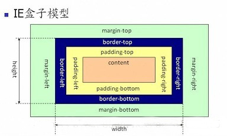
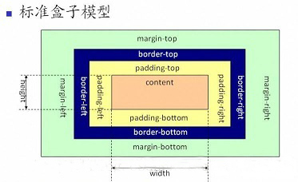
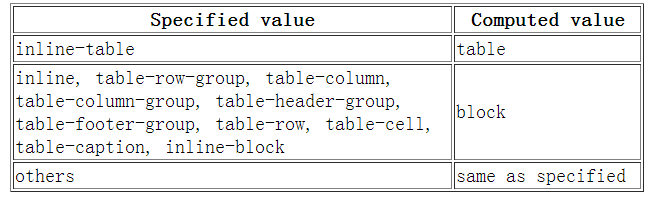
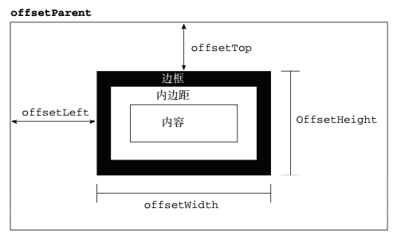
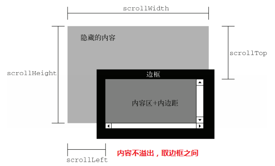
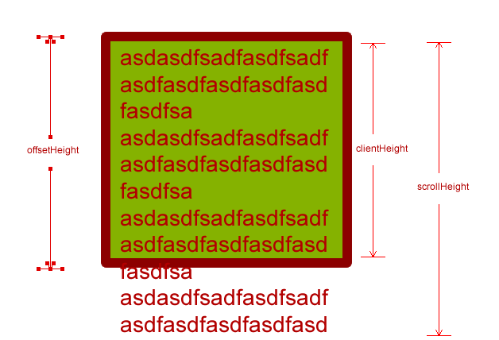
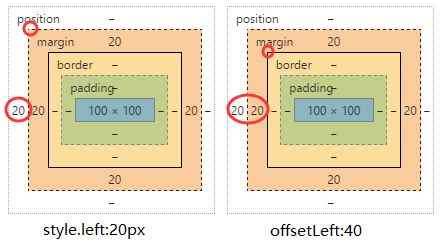
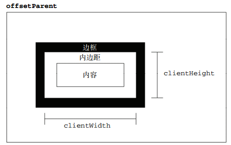

### 前端水平垂直居中的十种方法

#### 第1种： 弹性盒子的方式

> 通过给父元素设置justify-content: center;
>
> align-items: center;就可以了
>

优点： 移动端使用灵活自如

缺点： pc端需要根据兼容情况来判定

#### 第2种： line-height

> 只对文本有效果，对定宽高的div是没有用的。所以在文本水平垂直居中时使用。

优点：代码简洁

缺点：只对文本有效，只对单行文本有效，多行文本不可以

#### 第3种： 通过绝对定位的方式 absolute + 负margin

> 首先知道子元素的宽高，给子元素设置top：50\\%；left：50\\%，
>
> 但绝对定位是基于子元素的左上角，我们所希望的效果是子元素的中心居中显示。。。。借助外边距的负值，负的外边距可以让元素向相反方向定位，
>
> 通过指定子元素的外边距为子元素宽度一半的负值，就可以让子元素居中了
>

优点： 比较好理解，兼容性好

缺点： 需要知道子元素的宽高

#### 第4种： 也是通过绝对定位的方式 absolute + margin auto

> 这个是需要将各个方向的距离都设0，再讲margin设为auto；就行

优点： 兼容性也很好

缺点： 需要知道子元素的宽高

#### 第5种： absolute + calc（计算）

> 这种方法top的百分比是基于元素的左上角，那么在减去宽度与高度的一半就好了
>
> calc :任何长度值都可以使用calc()函数进行计算； calc()函数使用标准的数学运算优先级规则； 它支持 “+”, “-”,
> “*”, “/” 运算
>
> 也可以查看calc教程：
> https://www.runoob.com/cssref/func-calc.html

优点： 他的兼容性依赖的是calc的兼容性

缺点： 同样是需要知道子元素的宽高

#### 第6种： absolute + transform （过渡）

> 这个方法不需要子元素固定宽高
>
> 修复绝对定位的问题，还可以使用css3新增的transform，transform的translate
>
> 属性也可以设置百分比，其是相对于自身的宽和高，所以可以将translate设置为-50\\%，就可以做到居中了
>

优点： 代码量少

缺点： IE8不支持, 属性需要追加浏览器厂商前缀, 可能干扰其他 transform 效果, 某些情形下会出现文本或元素边界渲染模糊的现象。

#### 第7种： writing-mode

> 可以参考：https://www.runoob.com/cssref/css-pr-writing-mode.html
>
> 这种方法稍微有些复杂，writing-mode可以改变文字的显示方向。
>

#### 第8种： table-cell实现水平垂直居中: table-cell middle center组合使用

直接给父级设

```
 display: table-cell;
 vertical-align: middle;
 text-align: center;
```


为了可以明显看出，我们可以给它设个宽高与边框

```
  width: 240px;
  height: 180px;
  border:1px solid #666;
```

#### 第9种： table 形式

> 通过table单元格的形式设

优点： tabel单元格中的内容天然就是垂直居中的，只要添加一个水平居中属性就好了

缺点： 这个不是table的正确方法，不是很建议使用，但是也是可以实现的

#### 第10种： grid（网格布局）

> 给父级设display:grid;
>
> 给子元素设align-self: center;justify-self: center;
>

优点： 代码量少

缺点： 兼容不如flex，建议用flex


### 介绍一下标准的 CSS 的盒子模型？低版本 IE 的盒子模型有什么不同的？

盒模型：分为内容（content）、填充（padding）、边界（margin）、边框（border）四个部分

有两种盒子模型：IE盒模型（border-box）、W3C标准盒模型（content-box）

IE盒模型和W3C标准盒模型的区别：

（1）W3C标准盒模型：属性width，height只包含内容content，不包含border和padding
（2）IE盒模型：属性width，height包含content、border和padding，指的是content+padding+border

一般来说，我们可以通过修改元素的box-sizing属性来改变元素的盒模型。

在ie8+浏览器中使用哪个盒模型可以由box-sizing（CSS新增的属性）控制，默认值为content-box，即标准盒模型；
如果将box-sizing设为border-box则用的是IE盒模型。如果在ie6，7，8中DOCTYPE缺失会将盒子模型解释为IE
盒子模型。若在页面中声明了DOCTYPE类型，所有的浏览器都会把盒模型解释为W3C盒模型。


### 介绍一下box-sizing属性？

`box-sizing`属性主要用来控制元素的盒模型的解析模式。默认值是`content-box`。

- `content-box`：让元素维持W3C的标准盒模型。元素的宽度/高度由border + padding + content的宽度/高度决定，设置width/height属性指的是content部分的宽/高
- `border-box`：让元素维持IE传统盒模型（IE6以下版本和IE6~7的怪异模式）。设置width/height属性指的是border + padding + content

标准浏览器下，按照W3C规范对盒模型解析，一旦修改了元素的边框或内距，就会影响元素的盒子尺寸，就不得不重新计算元素的盒子尺寸，从而影响整个页面的布局。


### CSS 选择符有哪些？

```
（1）id选择器（#myid）
（2）类选择器（.myclassname）
（3）标签选择器（div,h1,p）
（4）后代选择器（h1 p）
（5）相邻后代选择器（子）选择器（ul>li）
（6）兄弟选择器（li~a）
（7）相邻兄弟选择器（li+a）
（8）属性选择器（a[rel="external"]）
（9）伪类选择器（a:hover,li:nth-child）
（10）伪元素选择器（::before、::after）
（11）通配符选择器（*）
```


### 介绍使用过的 CSS 预处理器？

最常用的 CSS 预处理器语言包括：Sass（SCSS）和 LESS

* CSS 预处理器基本思想：为 CSS 增加了一些编程的特性（变量、逻辑判断、函数等）
* 开发者使用这种语言进行进行 Web 页面样式设计，再编译成正常的 CSS 文件使用
* 使用 CSS 预处理器，增强了css代码的复用性，可以使 CSS 更加简洁、适应性更强、可读性更佳，无需考虑兼容性，极大的提高工作效率


### 什么是 CSS 预处理器/后处理器？

```
CSS预处理器定义了一种新的语言，其基本思想是，用一种专门的编程语言，为CSS增加了一些编程的特性，将CSS作为目标生成文件，然后开发者就只要使用这种语言进行编码工作。通俗的说，CSS预处理器用一种专门的编程语言，进行Web页面样式设计，然后再编译成正常的CSS文件。

预处理器例如：LESS、Sass、Stylus，用来预编译Sass或less csssprite，增强了css代码的复用性，还有层级、mixin、变量、循环、函数等，具有很方便的UI组件模块化开发能力，极大的提高工作效率。

CSS后处理器是对CSS进行处理，并最终生成CSS的预处理器，它属于广义上的CSS预处理器。我们很久以前就在用CSS后
处理器了，最典型的例子是CSS压缩工具（如clean-css），只不过以前没单独拿出来说过。还有最近比较火的Autoprefixer，以CanIUse上的浏览器支持数据为基础，自动处理兼容性问题。

后处理器例如：PostCSS，通常被视为在完成的样式表中根据CSS规范处理CSS，让其更有效；目前最常做的是给CSS属性添加浏览器私有前缀，实现跨浏览器兼容性的问题。
```

详细资料可以参考：
[《CSS 预处理器和后处理器》](https://blog.csdn.net/yushuangyushuang/article/details/79209752)


### CSS优化、提高性能的方法有哪些？

* 多个css合并，尽量减少HTTP请求
* 将css文件放在页面最上面
* 移除空的css规则
* 避免使用CSS表达式
* 选择器优化嵌套，尽量避免层级过深
* 充分利用css继承属性，减少代码量
* 属性值为0时，不加单位
* 属性值为小于1的小数时，省略小数点前面的0
* css雪碧图
* 提取项目的通用公有样式，增强可复用性，按模块编写组件；增强项目的协同开发性、可维护性和可扩展性;
* 使用预处理工具或构建工具（gulp对css进行语法检查、自动补前缀、打包压缩、自动优雅降级）


### CSS 优化、提高性能的方法有哪些？

#### 加载性能：

（1）css压缩：将写好的css进行打包压缩，可以减少很多的体积。
（2）css单一样式：当需要下边距和左边距的时候，很多时候选择:margin:top 0 bottom 0;但margin-bottom:bot
tom;margin-left:left;执行的效率更高。
（3）**减少使用@import，而建议使用link**，因为后者在页面加载时一起加载，前者是等待页面加载完成之后再进行加载。

#### 选择器性能：

（1）关键选择器（key selector）。选择器的最后面的部分为关键选择器（即用来匹配目标元素的部分）。CSS选择符是从右到左进行匹配的。当使用后代选择器的时候，浏览器会遍历所有子元素来确定是否是指定的元素等等；

（2）如果规则拥有ID选择器作为其关键选择器，则不要为规则增加标签。过滤掉无关的规则（这样样式系统就不会浪费时间去匹配它们了）。

（3）避免使用通配规则，如*\\{\\}计算次数惊人！只对需要用到的元素进行选择。

（4）**尽量少的去对标签进行选择，而是用class**。

（5）**尽量少的去使用后代选择器，降低选择器的权重值。后代选择器的开销是最高的**，尽量将选择器的深度降到最低，最高不要超过三层，更多的使用类来关联每一个标签元素。

（6）了解哪些属性是可以通过继承而来的，然后避免对这些属性重复指定规则。

#### 渲染性能：

（1）**慎重使用高性能属性：浮动、定位**。

（2）尽量减少页面重排、重绘。

（3）去除空规则：｛｝。空规则的产生原因一般来说是为了预留样式。去除这些空规则无疑能减少css文档体积。

（4）属性值为0时，不加单位。

（5）属性值为浮动小数0.**，可以省略小数点之前的0。

（6）标准化各种浏览器前缀：带浏览器前缀的在前。标准属性在后。

（7）不使用@import前缀，它会影响css的加载速度。

（8）选择器优化嵌套，尽量避免层级过深。

（9）css雪碧图，同一页面相近部分的小图标，方便使用，减少页面的请求次数，但是同时图片本身会变大，使用时，优劣考虑清楚，再使用。

（10）正确使用display的属性，由于display的作用，某些样式组合会无效，徒增样式体积的同时也影响解析性能。

（11）不滥用web字体。对于中文网站来说WebFonts可能很陌生，国外却很流行。web fonts通常体积庞大，而且一些浏览器在下载web fonts时会阻塞页面渲染损伤性能。

#### 可维护性、健壮性：

（1）将具有相同属性的样式抽离出来，整合并通过class在页面中进行使用，提高css的可维护性。
（2）样式与内容分离：将css代码定义到外部css中。

详细资料可以参考：
[《CSS 优化、提高性能的方法有哪些？》](https://www.zhihu.com/question/19886806)
[《CSS 优化，提高性能的方法》](https://www.jianshu.com/p/4e673bf24a3b)


### 


### ::before 和:after 中双冒号和单冒号有什么区别？解释一下这 2 个伪元素的作用。

相关知识点：

```
单冒号（:）用于CSS3伪类，双冒号（::）用于CSS3伪元素。（伪元素由双冒号和伪元素名称组成）
双冒号是在当前规范中引入的，用于区分伪类和伪元素。不过浏览器需要同时支持旧的已经存在的伪元素写法，
比如:first-line、:first-letter、:before、:after等，
而新的在CSS3中引入的伪元素则不允许再支持旧的单冒号的写法。

想让插入的内容出现在其它内容前，使用::before，否者，使用::after；
在代码顺序上，::after生成的内容也比::before生成的内容靠后。
如果按堆栈视角，::after生成的内容会在::before生成的内容之上。
```

回答：

```
在css3中使用单冒号来表示伪类，用双冒号来表示伪元素。但是为了兼容已有的伪元素的写法，在一些浏览器中也可以使用单冒号
来表示伪元素。

伪类一般匹配的是元素的一些特殊状态，如hover、link等，而伪元素一般匹配的特殊的位置，比如after、before等。
```


### 伪类与伪元素的区别

```
css引入伪类和伪元素概念是为了格式化文档树以外的信息。也就是说，伪类和伪元素是用来修饰不在文档树中的部分，比如，一句
话中的第一个字母，或者是列表中的第一个元素。

伪类用于当已有的元素处于某个状态时，为其添加对应的样式，这个状态是根据用户行为而动态变化的。比如说，当用户悬停在指定的
元素时，我们可以通过:hover来描述这个元素的状态。

伪元素用于创建一些不在文档树中的元素，并为其添加样式。它们允许我们为元素的某些部分设置样式。比如说，我们可以通过::be
fore来在一个元素前增加一些文本，并为这些文本添加样式。虽然用户可以看到这些文本，但是这些文本实际上不在文档树中。

有时你会发现伪元素使用了两个冒号（::）而不是一个冒号（:）。这是CSS3的一部分，并尝试区分伪类和伪元素。大多数浏览
器都支持这两个值。按照规则应该使用（::）而不是（:），从而区分伪类和伪元素。但是，由于在旧版本的W3C规范并未对此进行
特别区分，因此目前绝大多数的浏览器都支持使用这两种方式表示伪元素。
```

详细资料可以参考：
[《总结伪类与伪元素》](http://www.alloyteam.com/2016/05/summary-of-pseudo-classes-and-pseudo-elements/)


### CSS 中哪些属性可以继承？

相关资料：

```
每个CSS属性定义的概述都指出了这个属性是默认继承的，还是默认不继承的。这决定了当你没有为元素的属性指定值时该如何计算
值。

当元素的一个继承属性没有指定值时，则取父元素的同属性的计算值。只有文档根元素取该属性的概述中给定的初始值（这里的意思应
该是在该属性本身的定义中的默认值）。

当元素的一个非继承属性（在Mozilla code里有时称之为reset property）没有指定值时，则取属性的初始值initial v
alue（该值在该属性的概述里被指定）。

有继承性的属性：

（1）字体系列属性
font、font-family、font-weight、font-size、font-style、font-variant、font-stretch、font-size-adjust

（2）文本系列属性
text-indent、text-align、text-shadow、line-height、word-spacing、letter-spacing、
text-transform、direction、color

（3）表格布局属性
caption-side border-collapse empty-cells

（4）列表属性
list-style-type、list-style-image、list-style-position、list-style

（5）光标属性
cursor

（6）元素可见性
visibility

（7）还有一些不常用的；speak，page，设置嵌套引用的引号类型quotes等属性


注意：当一个属性不是继承属性时，可以使用inherit关键字指定一个属性应从父元素继承它的值，inherit关键字用于显式地
指定继承性，可用于任何继承性/非继承性属性。
```

回答：

```
每一个属性在定义中都给出了这个属性是否具有继承性，一个具有继承性的属性会在没有指定值的时候，会使用父元素的同属性的值
来作为自己的值。

一般具有继承性的属性有，字体相关的属性，font-size和font-weight等。文本相关的属性，color和text-align等。
表格的一些布局属性、列表属性如list-style等。还有光标属性cursor、元素可见性visibility。

当一个属性不是继承属性的时候，我们也可以通过将它的值设置为inherit来使它从父元素那获取同名的属性值来继承。
```

详细的资料可以参考：
[《继承属性》](https://developer.mozilla.org/zh-CN/docs/Web/CSS/inheritance)
[《CSS 有哪些属性可以继承？》](https://www.jianshu.com/p/34044e3c9317)


### CSS 优先级算法如何计算？

相关知识点：

```
CSS的优先级是根据样式声明的特殊性值来判断的。

选择器的特殊性值分为四个等级，如下：

（1）标签内选择符x,0,0,0
（2）ID选择符0,x,0,0
（3）class选择符/属性选择符/伪类选择符	0,0,x,0
（4）元素和伪元素选择符0,0,0,x

计算方法：

（1）每个等级的初始值为0
（2）每个等级的叠加为选择器出现的次数相加
（3）不可进位，比如0,99,99,99
（4）依次表示为：0,0,0,0
（5）每个等级计数之间没关联
（6）等级判断从左向右，如果某一位数值相同，则判断下一位数值
（7）如果两个优先级相同，则最后出现的优先级高，!important也适用
（8）通配符选择器的特殊性值为：0,0,0,0
（9）继承样式优先级最低，通配符样式优先级高于继承样式
（10）!important（权重），它没有特殊性值，但它的优先级是最高的，为了方便记忆，可以认为它的特殊性值为1,0,0,0,0。

计算实例：

（1）#demo a\\{color: orange;\\}/*特殊性值：0,1,0,1*/
（2）div#demo a\\{color: red;\\}/*特殊性值：0,1,0,2*/


注意：
（1）样式应用时，css会先查看规则的权重（!important），加了权重的优先级最高，当权重相同的时候，会比较规则的特殊性。

（2）特殊性值越大的声明优先级越高。

（3）相同特殊性值的声明，根据样式引入的顺序，后声明的规则优先级高（距离元素出现最近的）

 (4) 部分浏览器由于字节溢出问题出现的进位表现不做考虑
```

回答：

```
判断优先级时，首先我们会判断一条属性声明是否有权重，也就是是否在声明后面加上了!important。一条声明如果加上了权重，
那么它的优先级就是最高的，前提是它之后不再出现相同权重的声明。如果权重相同，我们则需要去比较匹配规则的特殊性。

一条匹配规则一般由多个选择器组成，一条规则的特殊性由组成它的选择器的特殊性累加而成。选择器的特殊性可以分为四个等级，
第一个等级是行内样式，为1000，第二个等级是id选择器，为0100，第三个等级是类选择器、伪类选择器和属性选择器，为0010，
第四个等级是元素选择器和伪元素选择器，为0001。规则中每出现一个选择器，就将它的特殊性进行叠加，这个叠加只限于对应的等
级的叠加，不会产生进位。选择器特殊性值的比较是从左向右排序的，也就是说以1开头的特殊性值比所有以0开头的特殊性值要大。
比如说特殊性值为1000的的规则优先级就要比特殊性值为0999的规则高。如果两个规则的特殊性值相等的时候，那么就会根据它们引
入的顺序，后出现的规则的优先级最高。
```

对于组合声明的特殊性值计算可以参考：
[《CSS 优先级计算及应用》](https://www.jianshu.com/p/1c4e639ff7d5)
[《CSS 优先级计算规则》](http://www.cnblogs.com/wangmeijian/p/4207433.html)
[《有趣：256 个 class 选择器可以干掉 1 个 id 选择器》](https://www.zhangxinxu.com/wordpress/2012/08/256-class-selector-beat-id-selector/)


### 关于伪类 LVHA 的解释?

```
a标签有四种状态：链接访问前、链接访问后、鼠标滑过、激活，分别对应四种伪类:link、:visited、:hover、:active；

当链接未访问过时：

（1）当鼠标滑过a链接时，满足:link和:hover两种状态，要改变a标签的颜色，就必须将:hover伪类在:link伪
类后面声明；
（2）当鼠标点击激活a链接时，同时满足:link、:hover、:active三种状态，要显示a标签激活时的样式（:active），
必须将:active声明放到:link和:hover之后。因此得出LVHA这个顺序。

当链接访问过时，情况基本同上，只不过需要将:link换成:visited。

这个顺序能不能变？可以，但也只有:link和:visited可以交换位置，因为一个链接要么访问过要么没访问过，不可能同时满足，
也就不存在覆盖的问题。
```


### display 有哪些值？说明他们的作用。

```
block	块类型。默认宽度为父元素宽度，可设置宽高，换行显示。
none	元素不显示，并从文档流中移除。
inline	行内元素类型。默认宽度为内容宽度，不可设置宽高，同行显示。
inline-block 默认宽度为内容宽度，可以设置宽高，同行显示。
list-item	像块类型元素一样显示，并添加样式列表标记。
table	此元素会作为块级表格来显示。
inherit	规定应该从父元素继承display属性的值。
```

详细资料可以参考：
[《CSS display 属性》](http://www.w3school.com.cn/css/pr_class_display.asp)


### position 的值 relative 和 absolute 定位原点是？

相关知识点：

```
absolute
生成绝对定位的元素，相对于值不为static的第一个父元素的padding box进行定位，也可以理解为离自己这一级元素最近的
一级position设置为absolute或者relative的父元素的padding box的左上角为原点的。

fixed（老IE不支持）
生成绝对定位的元素，相对于浏览器窗口进行定位。

relative
生成相对定位的元素，相对于其元素本身所在正常位置进行定位。

static
默认值。没有定位，元素出现在正常的流中（忽略top,bottom,left,right,z-index声明）。

inherit
规定从父元素继承position属性的值。
```

回答：

```
relative定位的元素，是相对于元素本身的正常位置来进行定位的。

absolute定位的元素，是相对于它的第一个position值不为static的祖先元素的padding box来进行定位的。这句话
我们可以这样来理解，我们首先需要找到绝对定位元素的一个position的值不为static的祖先元素，然后相对于这个祖先元
素的padding box来定位，也就是说在计算定位距离的时候，padding的值也要算进去。
```


### position几个属性的作用？

position的常见四个属性值： relative，absolute，fixed，static。

一般都要配合"left"、"top"、"right"以及 "bottom"

**属性使用：**

**1.Static：**

默认位置，设置为 static 的元素，它始终会处于页面流给予的位置（static 元素会忽略任何 top、bottom、left 或 right 声明）。一般不常用。

**2.Relative：**

位置被设置为 relative 的元素，可将其移至相对于其正常位置的地方，意思就是如果设置了 relative 值，那么，它偏移的 top，right，bottom，left 的值都**以它原来的位置为基准偏移**，而不管其他元素会怎么样。注意 relative 移动后的元素在原来的位置仍占据空间。

**3.Absolute：**

位置设置为 absolute 的元素，可定位于相对于包含它的元素的指定坐标。意思就是如果它的父容器设置了 position 属性，并且 position 的属性值为 absolute  或者 relative，那么就会**依据父容器进行偏移**。如果其父容器没有设置 position 属性，那么偏移是以 body 为依据。注意设置 absolute 属性的元素在标准流中不占位置。

**4.Fixed：**

位置被设置为 fixed 的元素，可定位于**相对于浏览器窗口的指定坐标**。不论窗口滚动与否，元素都会留在那个位置。它始终是以 body 为依据的。 注意设置 fixed 属性的元素在标准流中不占位置。

 

### px，em，rem的区别？

 1.px 像素（Pixel）。绝对单位。

像素 px 是**相对于显示器屏幕分辨率**而言的，是一个虚拟长度单位，是计算机系统的数字化图像长度单位，如果 px 要换算成物理长度，需要指定精度 DPI。

2.em 是相对长度单位，**相对于当前对象内文本的字体尺寸**。如当前对行内文本的字体尺寸未被人为设置，则相对于浏览器的默认字体尺寸。它会继承父级元素的字体大小，因此并不是一个固定的值。

3.rem是[CSS3](http://www.html5cn.org/portal.php?mod=list&catid=16)新增的一个相对单位（rootem，根 em），使用 rem 为元素设定字体大小时，仍然是相对大小，但**相对于HTML 根元素**。

4.区别：IE 无法调整那些使用 px 作为单位的字体大小，而 **em 和 rem 可以缩放**，rem 相对的只是 HTML 根元素。这个单位可谓集相对大小和绝对大小的优点于一身，通过它既可以做到只修改根元素就成比例地调整所有字体大小，又可以避免字体大小逐层复合的连锁反应。目前，除了 IE8 及更早版本外，所有浏览器均已支持 rem。

 

### 页面导入样式时，使用link和@import有什么区别？

- `link`属于`XHTML`标签，除了加载`CSS`外，还能用于定义`RSS`,定义`rel`连接属性等作用；而`@import`是`CSS`提供的，只能用于加载`CSS`
- 页面被加载的时，`link`会同时被加载，而`@import`引用的`CSS`会等到页面被加载完再加载
- `import`是`CSS2.1` 提出的，只在`IE5`以上才能被识别，而`link`是`XHTML`标签，无兼容问题


### CSS3 有哪些新特性？（根据项目回答）

```
新增各种CSS选择器	（:not(.input)：所有class不是“input”的节点）
圆角		（border-radius:8px）
多列布局	（multi-column layout）
阴影和反射	（Shadow\Reflect）
文字特效		（text-shadow）
文字渲染		（Text-decoration）
线性渐变		（gradient）
旋转			（transform）
缩放，定位，倾斜，动画，多背景
例如：transform:\scale(0.85,0.90)\translate(0px,-30px)\skew(-9deg,0deg)\Animation:
```


### 请解释一下 CSS3 的 Flex box（弹性盒布局模型），以及适用场景？

相关知识点：

```
Flex是FlexibleBox的缩写，意为"弹性布局"，用来为盒状模型提供最大的灵活性。

任何一个容器都可以指定为Flex布局。行内元素也可以使用Flex布局。注意，设为Flex布局以后，子元素的float、cl
ear和vertical-align属性将失效。

采用Flex布局的元素，称为Flex容器（flex container），简称"容器"。它的所有子元素自动成为容器成员，称为Flex
项目（flex item），简称"项目"。

容器默认存在两根轴：水平的主轴（main axis）和垂直的交叉轴（cross axis），项目默认沿主轴排列。


以下6个属性设置在容器上。

flex-direction属性决定主轴的方向（即项目的排列方向）。

flex-wrap属性定义，如果一条轴线排不下，如何换行。

flex-flow属性是flex-direction属性和flex-wrap属性的简写形式，默认值为row nowrap。

justify-content属性定义了项目在主轴上的对齐方式。

align-items属性定义项目在交叉轴上如何对齐。

align-content属性定义了多根轴线的对齐方式。如果项目只有一根轴线，该属性不起作用。


以下6个属性设置在项目上。

order属性定义项目的排列顺序。数值越小，排列越靠前，默认为0。

flex-grow属性定义项目的放大比例，默认为0，即如果存在剩余空间，也不放大。

flex-shrink属性定义了项目的缩小比例，默认为1，即如果空间不足，该项目将缩小。

flex-basis属性定义了在分配多余空间之前，项目占据的主轴空间。浏览器根据这个属性，计算主轴是否有多余空间。它的默认
值为auto，即项目的本来大小。

flex属性是flex-grow，flex-shrink和flex-basis的简写，默认值为0 1 auto。

align-self属性允许单个项目有与其他项目不一样的对齐方式，可覆盖align-items属性。默认值为auto，表示继承父
元素的align-items属性，如果没有父元素，则等同于stretch。
```

回答：

```
flex布局是CSS3新增的一种布局方式，我们可以通过将一个元素的display属性值设置为flex从而使它成为一个flex
容器，它的所有子元素都会成为它的项目。

一个容器默认有两条轴，一个是水平的主轴，一个是与主轴垂直的交叉轴。我们可以使用flex-direction来指定主轴的方向。
我们可以使用justify-content来指定元素在主轴上的排列方式，使用align-items来指定元素在交叉轴上的排列方式。还
可以使用flex-wrap来规定当一行排列不下时的换行方式。

对于容器中的项目，我们可以使用order属性来指定项目的排列顺序，还可以使用flex-grow来指定当排列空间有剩余的时候，
项目的放大比例。还可以使用flex-shrink来指定当排列空间不足时，项目的缩小比例。
```

详细资料可以参考：
[《Flex 布局教程：语法篇》](http://www.ruanyifeng.com/blog/2015/07/flex-grammar.html)
[《Flex 布局教程：实例篇》](http://www.ruanyifeng.com/blog/2015/07/flex-examples.html)


### 一个满屏品字布局如何设计?

```
简单的方式：
	上面的div宽100\\%，
	下面的两个div分别宽50\\%，
	然后用float或者inline使其不换行即可
```


### CSS 多列等高如何实现？

```
（1）利用padding-bottom|margin-bottom正负值相抵，不会影响页面布局的特点。设置父容器设置超出隐藏（overflow:
hidden），这样父容器的高度就还是它里面的列没有设定padding-bottom时的高度，当它里面的任一列高度增加了，则
父容器的高度被撑到里面最高那列的高度，其他比这列矮的列会用它们的padding-bottom补偿这部分高度差。

（2）利用table-cell所有单元格高度都相等的特性，来实现多列等高。

（3）利用flex布局中项目align-items属性默认为stretch，如果项目未设置高度或设为auto，将占满整个容器的高度
的特性，来实现多列等高。

```

详细资料可以参考：
[《前端应该掌握的 CSS 实现多列等高布局》](https://juejin.im/post/5b0fb34151882515662238fd)
[《CSS：多列等高布局》](https://codepen.io/yangbo5207/post/equh)


### 经常遇到的浏览器的兼容性有哪些？原因，解决方法是什么，常用 hack 的技巧？

```
（1）png24位的图片在iE6浏览器上出现背景
解决方案：做成PNG8，也可以引用一段脚本处理。

（2）浏览器默认的margin和padding不同
解决方案：加一个全局的*\\{margin:0;padding:0;\\}来统一。

（3）IE6双边距bug：在IE6下，如果对元素设置了浮动，同时又设置了margin-left或
margin-right，margin值会加倍。

#box\\{float:left;width:10px;margin:0 0 0 10px;\\}

这种情况之下IE会产生20px的距离
解决方案：在float的标签样式控制中加入_display:inline;将其转化为行内属性。(_这个符号只有ie6会识别)

（4）渐进识别的方式，从总体中逐渐排除局部。
首先，巧妙的使用"\9"这一标记，将IE游览器从所有情况中分离出来。
接着，再次使用"+"将IE8和IE7、IE6分离开来，这样IE8已经独立识别。
.bb\\{
background-color:#f1ee18;/*所有识别*/
.background-color:#00deff\9;/*IE6、7、8识别*/
+background-color:#a200ff;/*IE6、7识别*/
_background-color:#1e0bd1;/*IE6识别*/
\\}

（5）IE下，可以使用获取常规属性的方法来获取自定义属性，也可以使用getAttribute()获取自定义
属性；Firefox下，只能使用getAttribute()获取自定义属性
解决方法：统一通过getAttribute()获取自定义属性。

（6）IE下，event对象有x、y属性，但是没有pageX、pageY属性;Firefox下，event对象有
pageX、pageY属性，但是没有x、y属性。
解决方法：（条件注释）缺点是在IE浏览器下可能会增加额外的HTTP请求数。

（7）Chrome中文界面下默认会将小于12px的文本强制按照12px显示
解决方法：

1.可通过加入CSS属性-webkit-text-size-adjust:none;解决。但是，在chrome
更新到27版本之后就不可以用了。

2.还可以使用-webkit-transform:scale(0.5);注意-webkit-transform:scale(0.75);
收缩的是整个span的大小，这时候，必须要将span转换成块元素，可以使用display：block/inline-block/...；

（8）超链接访问过后hover样式就不出现了，被点击访问过的超链接样式不再具有hover和active了
解决方法：改变CSS属性的排列顺序L-V-H-A

（9）怪异模式问题：漏写DTD声明，Firefox仍然会按照标准模式来解析网页，但在IE中会触发怪异模
式。为避免怪异模式给我们带来不必要的麻烦，最好养成书写DTD声明的好习惯。
```


### 双边距重叠问题(外边距折叠)

多个相邻（兄弟或者父子关系）普通流的块元素垂直方向margin会重叠

两个相邻的外边距都是正数时、折叠结果是它们两者之间的较大值

都是负数时、折叠结果是两者绝对值的较大值

一正一负时、折叠结果是两者的相加值

解决嵌套块元素塌陷问题：

可以给父元素定义边框

可以为父元素定义内边距

可以为父元素添加overflow:hidden;

将块级div设置成行内div（display：inline-block；）


### li 与 li 之间有看不见的空白间隔是什么原因引起的？有什么解决办法？

```
浏览器会把inline元素间的空白字符（空格、换行、Tab等）渲染成一个空格。而为了美观。我们通常是一个<li>放在一行，
这导致<li>换行后产生换行字符，它变成一个空格，占用了一个字符的宽度。

解决办法：

（1）为<li>设置float:left。不足：有些容器是不能设置浮动，如左右切换的焦点图等。

（2）将所有<li>写在同一行。不足：代码不美观。

（3）将<ul>内的字符尺寸直接设为0，即font-size:0。不足：<ul>中的其他字符尺寸也被设为0，需要额外重新设定其他
字符尺寸，且在Safari浏览器依然会出现空白间隔。

（4）消除<ul>的字符间隔letter-spacing:-8px，不足：这也设置了<li>内的字符间隔，因此需要将<li>内的字符
间隔设为默认letter-spacing:normal。
```

详细资料可以参考：
[《li 与 li 之间有看不见的空白间隔是什么原因引起的？》](https://blog.csdn.net/sjinsa/article/details/70919546)


### 什么是包含块，对于包含块的理解?

```
包含块（containing block）就是元素用来计算和定位的一个框。

（1）根元素（很多场景下可以看成是<html>）被称为“初始包含块”，其尺寸等同于浏览器可视窗口的大小。

（2）对于其他元素，如果该元素的position是relative或者static，则“包含块”由其最近的块容器祖先盒的content box
边界形成。

（3）如果元素position:fixed，则“包含块”是“初始包含块”。

（4）如果元素position:absolute，则“包含块”由最近的position不为static的祖先元素建立，具体方式如下：

如果该祖先元素是纯inline元素，则规则略复杂：
•假设给内联元素的前后各生成一个宽度为0的内联盒子（inline box），则这两个内联盒子的padding box外面的包
围盒就是内联元素的“包含块”；
•如果该内联元素被跨行分割了，那么“包含块”是未定义的，也就是CSS2.1规范并没有明确定义，浏览器自行发挥
否则，“包含块”由该祖先的padding box边界形成。

如果没有符合条件的祖先元素，则“包含块”是“初始包含块”。
```


### CSS 里的 visibility 属性有个 collapse 属性值是干嘛用的？在不同浏览器下以后什么区别？

```
（1）对于一般的元素，它的表现跟visibility：hidden;是一样的。元素是不可见的，但此时仍占用页面空间。

（2）但例外的是，如果这个元素是table相关的元素，例如table行，table group，table列，table column group，它的
表现却跟display:none一样，也就是说，它们占用的空间也会释放。

在不同浏览器下的区别：

在谷歌浏览器里，使用collapse值和使用hidden值没有什么区别。

在火狐浏览器、Opera和IE11里，使用collapse值的效果就如它的字面意思：table的行会消失，它的下面一行会补充它的位
置。

```

详细资料可以参考：
[《CSS 里的 visibility 属性有个鲜为人知的属性值：collapse》](http://www.webhek.com/post/visibility-collapse.html)


### width:auto 和 width:100\\%的区别

```
一般而言

width:100\\%会使元素box的宽度等于父元素的content box的宽度。

width:auto会使元素撑满整个父元素，margin、border、padding、content区域会自动分配水平空间。
```


### 绝对定位元素与非绝对定位元素的百分比计算的区别

```
绝对定位元素的宽高百分比是相对于临近的position不为static的祖先元素的padding box来计算的。

非绝对定位元素的宽高百分比则是相对于父元素的content box来计算的。
```


### 简单介绍使用图片 base64 编码的优点和缺点。

```
base64编码是一种图片处理格式，通过特定的算法将图片编码成一长串字符串，在页面上显示的时候，可以用该字符串来代替图片的
url属性。

使用base64的优点是：

（1）减少一个图片的HTTP请求

使用base64的缺点是：

（1）根据base64的编码原理，编码后的大小会比原文件大小大1/3，如果把大图片编码到html/css中，不仅会造成文件体
积的增加，影响文件的加载速度，还会增加浏览器对html或css文件解析渲染的时间。

（2）使用base64无法直接缓存，要缓存只能缓存包含base64的文件，比如HTML或者CSS，这相比域直接缓存图片的效果要
差很多。

（3）兼容性的问题，ie8以前的浏览器不支持。

一般一些网站的小图标可以使用base64图片来引入。
```

详细资料可以参考：
[《玩转图片 base64 编码》](https://www.cnblogs.com/coco1s/p/4375774.html)
[《前端开发中，使用 base64 图片的弊端是什么？》](https://www.zhihu.com/question/31155574)
[《小 tip:base64:URL 背景图片与 web 页面性能优化》](https://www.zhangxinxu.com/wordpress/2012/04/base64-url-image-\\%E5\\%9B\\%BE\\%E7\\%89\\%87-\\%E9\\%A1\\%B5\\%E9\\%9D\\%A2\\%E6\\%80\\%A7\\%E8\\%83\\%BD\\%E4\\%BC\\%98\\%E5\\%8C\\%96/)


### 'display'、'position'和'float'的相互关系？

```
（1）首先我们判断display属性是否为none，如果为none，则position和float属性的值不影响元素最后的表现。

（2）然后判断position的值是否为absolute或者fixed，如果是，则float属性失效，并且display的值应该被
设置为table或者block，具体转换需要看初始转换值。

（3）如果position的值不为absolute或者fixed，则判断float属性的值是否为none，如果不是，则display
的值则按上面的规则转换。注意，如果position的值为relative并且float属性的值存在，则relative相对
于浮动后的最终位置定位。

（4）如果float的值为none，则判断元素是否为根元素，如果是根元素则display属性按照上面的规则转换，如果不是，
则保持指定的display属性值不变。

总的来说，可以把它看作是一个类似优先级的机制，"position:absolute"和"position:fixed"优先级最高，有它存在
的时候，浮动不起作用，'display'的值也需要调整；其次，元素的'float'特性的值不是"none"的时候或者它是根元素
的时候，调整'display'的值；最后，非根元素，并且非浮动元素，并且非绝对定位的元素，'display'特性值同设置值。

```

详细资料可以参考：
[《position 跟 display、margincollapse、overflow、float 这些特性相互叠加后会怎么样？》](https://www.cnblogs.com/jackyWHJ/p/3756087.html)


### margin 重叠问题的理解。

相关知识点：

```
块级元素的上外边距（margin-top）与下外边距（margin-bottom）有时会合并为单个外边距，这样的现象称为“margin合
并”。

产生折叠的必备条件：margin必须是邻接的!

而根据w3c规范，两个margin是邻接的必须满足以下条件：

•必须是处于常规文档流（非float和绝对定位）的块级盒子，并且处于同一个BFC当中。
•没有线盒，没有空隙，没有padding和border将他们分隔开
•都属于垂直方向上相邻的外边距，可以是下面任意一种情况
•元素的margin-top与其第一个常规文档流的子元素的margin-top
•元素的margin-bottom与其下一个常规文档流的兄弟元素的margin-top
•height为auto的元素的margin-bottom与其最后一个常规文档流的子元素的margin-bottom
•高度为0并且最小高度也为0，不包含常规文档流的子元素，并且自身没有建立新的BFC的元素的margin-top
和margin-bottom


margin合并的3种场景：

（1）相邻兄弟元素margin合并。

解决办法：
•设置块状格式化上下文元素（BFC）

（2）父级和第一个/最后一个子元素的margin合并。

解决办法：

对于margin-top合并，可以进行如下操作（满足一个条件即可）：
•父元素设置为块状格式化上下文元素；
•父元素设置border-top值；
•父元素设置padding-top值；
•父元素和第一个子元素之间添加内联元素进行分隔。

对于margin-bottom合并，可以进行如下操作（满足一个条件即可）：
•父元素设置为块状格式化上下文元素；
•父元素设置border-bottom值；
•父元素设置padding-bottom值；
•父元素和最后一个子元素之间添加内联元素进行分隔；
•父元素设置height、min-height或max-height。

（3）空块级元素的margin合并。

解决办法：
•设置垂直方向的border；
•设置垂直方向的padding；
•里面添加内联元素（直接Space键空格是没用的）；
•设置height或者min-height。
```

回答：

```
margin重叠指的是在垂直方向上，两个相邻元素的margin发生重叠的情况。

一般来说可以分为四种情形：

第一种是相邻兄弟元素的marin-bottom和margin-top的值发生重叠。这种情况下我们可以通过设置其中一个元素为BFC
来解决。

第二种是父元素的margin-top和子元素的margin-top发生重叠。它们发生重叠是因为它们是相邻的，所以我们可以通过这
一点来解决这个问题。我们可以为父元素设置border-top、padding-top值来分隔它们，当然我们也可以将父元素设置为BFC
来解决。

第三种是高度为auto的父元素的margin-bottom和子元素的margin-bottom发生重叠。它们发生重叠一个是因为它们相
邻，一个是因为父元素的高度不固定。因此我们可以为父元素设置border-bottom、padding-bottom来分隔它们，也可以为
父元素设置一个高度，max-height和min-height也能解决这个问题。当然将父元素设置为BFC是最简单的方法。

第四种情况，是没有内容的元素，自身的margin-top和margin-bottom发生的重叠。我们可以通过为其设置border、pa
dding或者高度来解决这个问题。
```


### 对 BFC 规范（块级格式化上下文：block formatting context）的理解？

相关知识点：

```
块格式化上下文（Block Formatting Context，BFC）是Web页面的可视化CSS渲染的一部分，是布局过程中生成块级盒
子的区域，也是浮动元素与其他元素的交互限定区域。

通俗来讲

•BFC是一个独立的布局环境，可以理解为一个容器，在这个容器中按照一定规则进行物品摆放，并且不会影响其它环境中的物品。
•如果一个元素符合触发BFC的条件，则BFC中的元素布局不受外部影响。

创建BFC

（1）根元素或包含根元素的元素
（2）浮动元素float＝left|right或inherit（≠none）
（3）绝对定位元素position＝absolute或fixed
（4）display＝inline-block|flex|inline-flex|table-cell或table-caption
（5）overflow＝hidden|auto或scroll(≠visible)

```

回答：

```
BFC指的是块级格式化上下文，一个元素形成了BFC之后，那么它内部元素产生的布局不会影响到外部元素，外部元素的布局也
不会影响到BFC中的内部元素。一个BFC就像是一个隔离区域，和其他区域互不影响。

一般来说根元素是一个BFC区域，浮动和绝对定位的元素也会形成BFC，display属性的值为inline-block、flex这些
属性时也会创建BFC。还有就是元素的overflow的值不为visible时都会创建BFC。
```

详细资料可以参考：
[《深入理解 BFC 和 MarginCollapse》](https://www.w3cplus.com/css/understanding-bfc-and-margin-collapse.html)
[《前端面试题-BFC（块格式化上下文）》](https://segmentfault.com/a/1190000013647777)


### IFC 是什么？

```
IFC指的是行级格式化上下文，它有这样的一些布局规则：

（1）行级上下文内部的盒子会在水平方向，一个接一个地放置。
（2）当一行不够的时候会自动切换到下一行。
（3）行级上下文的高度由内部最高的内联盒子的高度决定。
```

详细资料可以参考：
[《[译]:BFC 与 IFC》](https://segmentfault.com/a/1190000004466536#articleHeader5)
[《BFC 和 IFC 的理解（布局）》](https://blog.csdn.net/paintandraw/article/details/80401741)


### 请解释一下为什么需要清除浮动？清除浮动的方式

```
浮动元素可以左右移动，直到遇到另一个浮动元素或者遇到它外边缘的包含框。浮动框不属于文档流中的普通流，当元素浮动之后，
不会影响块级元素的布局，只会影响内联元素布局。此时文档流中的普通流就会表现得该浮动框不存在一样的布局模式。当包含框
的高度小于浮动框的时候，此时就会出现“高度塌陷”。

清除浮动是为了清除使用浮动元素产生的影响。浮动的元素，高度会塌陷，而高度的塌陷使我们页面后面的布局不能正常显示。

清除浮动的方式

（1）使用clear属性清除浮动。参考28。

（2）使用BFC块级格式化上下文来清除浮动。参考26。

因为BFC元素不会影响外部元素的特点，所以BFC元素也可以用来清除浮动的影响，因为如果不清除，子元素浮动则父元
素高度塌陷，必然会影响后面元素布局和定位，这显然有违BFC元素的子元素不会影响外部元素的设定。
```


### 使用 clear 属性清除浮动的原理？

```
使用clear属性清除浮动，其语法如下：

clear:none|left|right|both

如果单看字面意思，clear:left应该是“清除左浮动”，clear:right应该是“清除右浮动”的意思，实际上，这种解释是有问
题的，因为浮动一直还在，并没有清除。

官方对clear属性的解释是：“元素盒子的边不能和前面的浮动元素相邻。”，我们对元素设置clear属性是为了避免浮动元素
对该元素的影响，而不是清除掉浮动。

还需要注意的一点是clear属性指的是元素盒子的边不能和前面的浮动元素相邻，注意这里“前面的”3个字，也就是clear属
性对“后面的”浮动元素是不闻不问的。考虑到float属性要么是left，要么是right，不可能同时存在，同时由于clear
属性对“后面的”浮动元素不闻不问，因此，当clear:left有效的时候，clear:right必定无效，也就是此时clear:left
等同于设置clear:both；同样地，clear:right如果有效也是等同于设置clear:both。由此可见，clear:left和cle
ar:right这两个声明就没有任何使用的价值，至少在CSS世界中是如此，直接使用clear:both吧。

一般使用伪元素的方式清除浮动

.clear::after\\{
content:'';
display:table;//也可以是'block'，或者是'list-item'
clear:both;
\\}

clear属性只有块级元素才有效的，而::after等伪元素默认都是内联水平，这就是借助伪元素清除浮动影响时需要设置disp
lay属性值的原因。
```


### zoom:1 的清除浮动原理?

```
清除浮动，触发hasLayout；
zoom属性是IE浏览器的专有属性，它可以设置或检索对象的缩放比例。解决ie下比较奇葩的bug。譬如外边距（margin）
的重叠，浮动清除，触发ie的haslayout属性等。

来龙去脉大概如下：
当设置了zoom的值之后，所设置的元素就会就会扩大或者缩小，高度宽度就会重新计算了，这里一旦改变zoom值时其实也会发
生重新渲染，运用这个原理，也就解决了ie下子元素浮动时候父元素不随着自动扩大的问题。

zoom属性是IE浏览器的专有属性，火狐和老版本的webkit核心的浏览器都不支持这个属性。然而，zoom现在已经被逐步标
准化，出现在CSS3.0规范草案中。

目前非ie由于不支持这个属性，它们又是通过什么属性来实现元素的缩放呢？可以通过css3里面的动画属性scale进行缩放。
```


### 移动端的布局用过媒体查询吗？

```
假设你现在正用一台显示设备来阅读这篇文章，同时你也想把它投影到屏幕上，或者打印出来，而显示设备、屏幕投影和打印等这些
媒介都有自己的特点，CSS就是为文档提供在不同媒介上展示的适配方法

当媒体查询为真时，相关的样式表或样式规则会按照正常的级联规被应用。当媒体查询返回假，标签上带有媒体查询的样式表仍将被
下载（只不过不会被应用）。

包含了一个媒体类型和至少一个使用宽度、高度和颜色等媒体属性来限制样式表范围的表达式。CSS3加入的媒体查询使得无需修改
内容便可以使样式应用于某些特定的设备范围。
```

详细资料可以参考：
[《CSS3@media 查询》](http://www.runoob.com/cssref/css3-pr-mediaquery.html)
[《响应式布局和自适应布局详解》](http://caibaojian.com/356.html)


### 浏览器是怎样解析 CSS 选择器的？

```
样式系统从关键选择器开始匹配，然后左移查找规则选择器的祖先元素。只要选择器的子树一直在工作，样式系统就会持续左移，直
到和规则匹配，或者是因为不匹配而放弃该规则。

试想一下，如果采用从左至右的方式读取CSS规则，那么大多数规则读到最后（最右）才会发现是不匹配的，这样做会费时耗能，
最后有很多都是无用的；而如果采取从右向左的方式，那么只要发现最右边选择器不匹配，就可以直接舍弃了，避免了许多无效匹配。
```

详细资料可以参考：
[《探究 CSS 解析原理》](https://juejin.im/entry/5a123c55f265da432240cc90)


### 在网页中应该使用奇数还是偶数的字体？为什么呢？

```
（1）偶数字号相对更容易和web设计的其他部分构成比例关系。比如：当我用了14px的正文字号，我可能会在一些地方用14
×0.5=7px的margin，在另一些地方用14×1.5=21px的标题字号。
（2）浏览器缘故，低版本的浏览器ie6会把奇数字体强制转化为偶数，即13px渲染为14px。
（3）系统差别，早期的Windows里，中易宋体点阵只有12和14、15、16px，唯独缺少13px。
```

详细资料可以参考：
[《谈谈网页中使用奇数字体和偶数字体》](https://blog.csdn.net/jian_xi/article/details/79346477)
[《现在网页设计中的为什么少有人用 11px、13px、15px 等奇数的字体？》](https://www.zhihu.com/question/20440679)


### margin 和 padding 分别适合什么场景使用？

```
margin是用来隔开元素与元素的间距；padding是用来隔开元素与内容的间隔。
margin用于布局分开元素使元素与元素互不相干。
padding用于元素与内容之间的间隔，让内容（文字）与（包裹）元素之间有一段距离。

何时应当使用margin：
•需要在border外侧添加空白时。
•空白处不需要背景（色）时。
•上下相连的两个盒子之间的空白，需要相互抵消时。如15px+20px的margin，将得到20px的空白。

何时应当时用padding：
•需要在border内测添加空白时。
•空白处需要背景（色）时。
•上下相连的两个盒子之间的空白，希望等于两者之和时。如15px+20px的padding，将得到35px的空白。
```


### 抽离样式模块怎么写，说出思路，有无实践经验？[阿里航旅的面试题]

```
我的理解是把常用的css样式单独做成css文件……通用的和业务相关的分离出来，通用的做成样式模块儿共享，业务相关的，放
进业务相关的库里面做成对应功能的模块儿。
```

详细资料可以参考：
[《CSS 规范-分类方法》](http://nec.netease.com/standard/css-sort.html)


### 简单说一下 css3 的 all 属性。

```
all属性实际上是所有CSS属性的缩写，表示，所有的CSS属性都怎样怎样，但是，不包括unicode-bidi和direction
这两个CSS属性。支持三个CSS通用属性值，initial,inherit,unset。

initial是初始值的意思，也就是该元素元素都除了unicode-bidi和direction以外的CSS属性都使用属性的默认初始
值。

inherit是继承的意思，也就是该元素除了unicode-bidi和direction以外的CSS属性都继承父元素的属性值。

unset是取消设置的意思，也就是当前元素浏览器或用户设置的CSS忽略，然后如果是具有继承特性的CSS，如color，则
使用继承值；如果是没有继承特性的CSS属性，如background-color，则使用初始值。

```

详细资料可以参考：
[《简单了解 CSS3 的 all 属性》](https://www.zhangxinxu.com/wordpress/2016/03/know-about-css3-all/)


### 为什么不建议使用统配符初始化 css 样式。

```
采用*\\{padding:0;margin:0;\\}这样的写法好处是写起来很简单，但是是通配符，需要把所有的标签都遍历一遍，当网站较大时，
样式比较多，这样写就大大的加强了网站运行的负载，会使网站加载的时候需要很长一段时间，因此一般大型的网站都有分层次的一
套初始化样式。

出于性能的考虑，并不是所有标签都会有padding和margin，因此对常见的具有默认padding和margin的元素初始化即
可，并不需使用通配符*来初始化。
```


### absolute 的 containingblock（包含块）计算方式跟正常流有什么不同？

```
（1）内联元素也可以作为“包含块”所在的元素；

（2）“包含块”所在的元素不是父块级元素，而是最近的position不为static的祖先元素或根元素；

（3）边界是padding box而不是content box。
```


### 对于 hasLayout 的理解？

```
hasLayout是IE特有的一个属性。很多的IE下的css bug都与其息息相关。在IE中，一个元素要么自己对自身的内容进
行计算大小和组织，要么依赖于父元素来计算尺寸和组织内容。当一个元素的hasLayout属性值为true时，它负责对自己和可
能的子孙元素进行尺寸计算和定位。虽然这意味着这个元素需要花更多的代价来维护自身和里面的内容，而不是依赖于祖先元素来完
成这些工作。
```

详细资料可以参考：
[《CSS 基础篇--CSS 中 IE 浏览器的 hasLayout，IE 低版本的 bug 根源》](https://segmentfault.com/a/1190000010883974)
[《CSS 魔法堂：hasLayout 原来是这样的！》](https://segmentfault.com/a/1190000004632071)


### 元素竖向的百分比设定是相对于容器的高度吗？

如果是height的话，是相对于包含块的高度。

如果是padding或者margin竖直方向的属性则是相对于包含块的宽度。


### 什么是响应式设计？响应式设计的基本原理是什么？如何兼容低版本的 IE？（待深入了解）

响应式网站设计是一个网站能够兼容多个终端，而不是为每一个终端做一个特定的版本。基本原理是通过媒体查询检测不同的设备屏幕尺寸做处理。页面头部必须有meta声明的viewport。

详细资料可以参考：
[《响应式布局原理》](https://blog.csdn.net/dreamerframework/article/details/8994741)
[《响应式布局的实现方法和原理》](http://www.mahaixiang.cn/wzsj/278.html)


### 视差滚动效果，如何给每页做不同的动画？（回到顶部，向下滑动要再次出现，和只出现一次分别怎么做？）

视差滚动是指多层背景以不同的速度移动，形成立体的运动效果，带来非常出色的视觉体验。

详细资料可以参考：
[《如何实现视差滚动效果的网页？》](https://www.zhihu.com/question/20990029)


# background及渐变，详细介绍和使用

好的！作为前端开发者，掌握 `background` 属性和渐变的用法非常重要。以下是详细的介绍和示例：

---

## 一、`background` 属性详解
`background` 是一个**简写属性**，用于一次性设置多个背景相关的子属性。以下是它的常用子属性：

### 1. `background-color`
- **作用**：设置元素的背景颜色。
- **语法**：
  ```css
  background-color: <颜色值> | transparent;
  ```
- **示例**：
  ```css
  div \\{
    background-color: #ff0000; /* 红色 */
    background-color: rgba(255, 0, 0, 0.5); /* 半透明红色 */
  \\}
  ```

### 2. `background-image`
- **作用**：设置元素的背景图片或渐变。
- **语法**：
  ```css
  background-image: url("图片路径") | <渐变函数>;
  ```
- **示例**：
  ```css
  div \\{
    background-image: url("image.jpg");
    /* 或结合渐变 */
    background-image: linear-gradient(to right, red, blue);
  \\}
  ```

### 3. `background-position`
- **作用**：控制背景图片的起始位置。
- **语法**：
  ```css
  background-position: x-axis y-axis;
  ```
- **示例**：
  ```css
  div \\{
    background-position: center center; /* 居中 */
    background-position: 20px 50\\%;     /* 水平20px，垂直50\\% */
  \\}
  ```

### 4. `background-repeat`
- **作用**：设置背景图片是否重复。
- **值**：
  - `repeat`（默认，重复）
  - `no-repeat`（不重复）
  - `repeat-x`（水平重复）
  - `repeat-y`（垂直重复）
- **示例**：
  ```css
  div \\{
    background-repeat: no-repeat;
  \\}
  ```

### 5. `background-size`
- **作用**：控制背景图片的尺寸。
- **值**：
  - `cover`：覆盖整个容器，可能裁剪图片。
  - `contain`：完整显示图片，可能留白。
  - `<宽度> <高度>`：具体值或百分比。
- **示例**：
  ```css
  div \\{
    background-size: cover;
    background-size: 100px 200px;
  \\}
  ```

### 6. `background-attachment`
- **作用**：控制背景是否随页面滚动。
- **值**：
  - `scroll`（默认，随元素滚动）
  - `fixed`（固定，不随页面滚动）
- **示例**：
  ```css
  div \\{
    background-attachment: fixed;
  \\}
  ```

### 7. 简写语法
- **示例**：
  ```css
  div \\{
    background: #ff0000 url("image.jpg") center/cover no-repeat fixed;
  \\}
  ```
  **注意**：`background-size` 必须跟在 `background-position` 后面，用 `/` 分隔。

---

## 二、渐变（Gradients）
渐变是 `background-image` 的一种特殊类型，常用的有两种：**线性渐变**和**径向渐变**。

### 1. 线性渐变（`linear-gradient`）
- **作用**：沿直线方向渐变。
- **语法**：
  ```css
  linear-gradient([方向或角度], 颜色节点1, 颜色节点2, ...);
  ```
- **方向**：
  - 关键词：`to top`、`to right`、`to bottom left` 等。
  - 角度：`45deg`（45度）。
- **示例**：
  ```css
  div \\{
    /* 从左到右渐变 */
    background-image: linear-gradient(to right, red, blue);
    
    /* 对角线渐变 */
    background-image: linear-gradient(45deg, red 20\\%, yellow 80\\%);
    
    /* 多颜色节点 */
    background-image: linear-gradient(to bottom, red, green 30\\%, blue);
  \\}
  ```

### 2. 径向渐变（`radial-gradient`）
- **作用**：从中心向外辐射渐变。
- **语法**：
  ```css
  radial-gradient([形状 大小 at 位置], 颜色节点1, 颜色节点2, ...);
  ```
- **参数**：
  - **形状**：`circle`（圆形）或 `ellipse`（椭圆，默认）。
  - **位置**：`at center`（默认）、`at top left` 等。
- **示例**：
  ```css
  div \\{
    /* 默认径向渐变 */
    background-image: radial-gradient(red, blue);
    
    /* 指定形状和位置 */
    background-image: radial-gradient(circle at 20\\% 50\\%, red, yellow);
    
    /* 定义颜色节点位置 */
    background-image: radial-gradient(ellipse farthest-corner at 50\\% 50\\%, red 0\\%, blue 100\\%);
  \\}
  ```

### 3. 其他渐变（了解）
- **重复渐变**：
  - `repeating-linear-gradient`
  - `repeating-radial-gradient`
- **圆锥渐变**（`conic-gradient`）：
  ```css
  background-image: conic-gradient(red, yellow, green, blue);
  ```

---

## 三、实用技巧
### 1. 多背景叠加
```css
div \\{
  background-image: 
    linear-gradient(rgba(0,0,0,0.5), rgba(0,0,0,0.5)),
    url("image.jpg");
\\}
```

### 2. 条纹效果
通过设置相邻颜色节点的位置相同：
```css
div \\{
  background-image: linear-gradient(
    90deg,
    red 0\\%, red 50\\%,
    blue 50\\%, blue 100\\%
  );
\\}
```

### 3. 渐变过渡动画
结合 CSS 变量和 `transition` 实现动态渐变：
```css
div \\{
  --color1: red;
  --color2: blue;
  background-image: linear-gradient(to right, var(--color1), var(--color2));
  transition: --color1 0.3s, --color2 0.3s;
\\}

div:hover \\{
  --color1: yellow;
  --color2: green;
\\}
```

---

## 四、常见问题
1. **渐变不平滑？**
   

确保颜色节点的位置合理（如 `red 0\\%, blue 100\\%`）。

2. **背景图不显示？**

   检查路径是否正确，或是否被其他属性覆盖（如 `background-color`）。

3. **简写顺序错误？** 

   注意 `background-size` 必须通过 `/` 跟在 `background-position` 后。

---

通过灵活组合 `background` 属性和渐变，你可以轻松实现复杂的视觉效果！


### input输入框如果点击历史文字输入，输入框背景会变色

在chrome浏览器自动输入时，input就会有背景，字体大小和颜色都会变化，怎么解决？ 

这样可以有效果（失败场景：可以尝试直接去设置background-color :unset；但却是无效果的）

```
// 防止点击历史文字输入，输入框背景变色
input:-webkit-autofill \\{
  transition: background-color 2000s;
\\}
```


### 如何修改 chrome 记住密码后自动填充表单的黄色背景？

chrome表单自动填充后，input文本框的背景会变成黄色的，通过审查元素可以看到这是由于chrome会默认给自动填充的input表单加上input:-webkit-autofill私有属性，然后对其赋予以下样式：

```
\\{
    background-color:rgb(250,255,189)!important;
    background-image:none!important;
    color:rgb(0,0,0)!important;
\\}
```

对chrome默认定义的background-color，background-image，color使用important是不能提高其优先级的，但是其他属性可使用。
使用足够大的纯色内阴影来覆盖input输入框的黄色背景，处理如下

```
input:-webkit-autofill,textarea:-webkit-autofill,select:-webkit-autofill\\{
    -webkit-box-shadow:000px 1000px white inset;
    border:1px solid #CCC !important;
\\}
```

详细资料可以参考：
[《去掉 chrome 记住密码后的默认填充样式》](https://blog.csdn.net/zsl_955200/article/details/78276209)
[《修改谷歌浏览器 chrome 记住密码后自动填充表单的黄色背景》](https://blog.csdn.net/M_agician/article/details/73381706)


### 怎么让 Chrome 支持小于 12px 的文字？

```
在谷歌下css设置字体大小为12px及以下时，显示都是一样大小，都是默认12px。

解决办法：

（1）可以使用Webkit的内核的-webkit-text-size-adjust的私有CSS属性来解决，只要加了-webkit-text-size
-adjust:none;字体大小就不受限制了。但是chrome更新到27版本之后就不可以用了。所以高版本chrome谷歌浏览器
已经不再支持-webkit-text-size-adjust样式，所以要使用时候慎用。

（2）还可以使用css3的transform缩放属性-webkit-transform:scale(0.5);注意-webkit-transform:scale(0.
75);收缩的是整个元素的大小，这时候，如果是内联元素，必须要将内联元素转换成块元素，可以使用display：block/
inline-block/...；

（3）使用图片：如果是内容固定不变情况下，使用将小于12px文字内容切出做图片，这样不影响兼容也不影响美观。
```

详细资料可以参考：
[《谷歌浏览器不支持 CSS 设置小于 12px 的文字怎么办？》](https://570109268.iteye.com/blog/2406562)


### 让页面里的字体变清晰，变细用 CSS 怎么做？

```
webkit内核的私有属性：-webkit-font-smoothing，用于字体抗锯齿，使用后字体看起来会更清晰舒服。

在MacOS测试环境下面设置-webkit-font-smoothing:antialiased;但是这个属性仅仅是面向MacOS，其他操作系统设
置后无效。
```

详细资料可以参考：
[《让字体变的更清晰 CSS 中-webkit-font-smoothing》](https://blog.csdn.net/huo_bao/article/details/50251585)


### font-style 属性中 italic 和 oblique 的区别？

```
italic和oblique这两个关键字都表示“斜体”的意思。

它们的区别在于，italic是使用当前字体的斜体字体，而oblique只是单纯地让文字倾斜。如果当前字体没有对应的斜体字体，
则退而求其次，解析为oblique，也就是单纯形状倾斜。
```


### 设备像素、css 像素、设备独立像素、dpr、ppi 之间的区别？

```
设备像素指的是物理像素，一般手机的分辨率指的就是设备像素，一个设备的设备像素是不可变的。

css像素和设备独立像素是等价的，不管在何种分辨率的设备上，css像素的大小应该是一致的，css像素是一个相对单位，它是相
对于设备像素的，一个css像素的大小取决于页面缩放程度和dpr的大小。

dpr指的是设备像素和设备独立像素的比值，一般的pc屏幕，dpr=1。在iphone4时，苹果推出了retina屏幕，它的dpr
为2。屏幕的缩放会改变dpr的值。

ppi指的是每英寸的物理像素的密度，ppi越大，屏幕的分辨率越大。
```

详细资料可以参考：
[《什么是物理像素、虚拟像素、逻辑像素、设备像素，什么又是 PPI,DPI,DPR 和 DIP》](https://www.cnblogs.com/libin-1/p/7148377.html)
[《前端工程师需要明白的「像素」》](https://www.jianshu.com/p/af6dad66e49a)
[《CSS 像素、物理像素、逻辑像素、设备像素比、PPI、Viewport》](https://github.com/jawil/blog/issues/21)
[《前端开发中像素的概念》](https://github.com/wujunchuan/wujunchuan.github.io/issues/15)


### layout viewport、visual viewport 和 ideal viewport 的区别？

相关知识点：

```
如果把移动设备上浏览器的可视区域设为viewport的话，某些网站就会因为viewport太窄而显示错乱，所以这些浏览器就决定
默认情况下把viewport设为一个较宽的值，比如980px，这样的话即使是那些为桌面设计的网站也能在移动浏览器上正常显示了。
ppk把这个浏览器默认的viewport叫做layout viewport。

layout viewport的宽度是大于浏览器可视区域的宽度的，所以我们还需要一个viewport来代表浏览器可视区域的大小，ppk把
这个viewport叫做visual viewport。

ideal viewport是最适合移动设备的viewport，ideal viewport的宽度等于移动设备的屏幕宽度，只要在css中把某一元
素的宽度设为ideal viewport的宽度（单位用px），那么这个元素的宽度就是设备屏幕的宽度了，也就是宽度为100\\%的效果。i
deal viewport的意义在于，无论在何种分辨率的屏幕下，那些针对ideal viewport而设计的网站，不需要用户手动缩放，也
不需要出现横向滚动条，都可以完美的呈现给用户。
```

回答：

```
移动端一共需要理解三个viewport的概念的理解。

第一个视口是布局视口，在移动端显示网页时，由于移动端的屏幕尺寸比较小，如果网页使用移动端的屏幕尺寸进行布局的话，那么整
个页面的布局都会显示错乱。所以移动端浏览器提供了一个layout viewport布局视口的概念，使用这个视口来对页面进行布局展
示，一般layout viewport的大小为980px，因此页面布局不会有太大的变化，我们可以通过拖动和缩放来查看到这个页面。

第二个视口指的是视觉视口，visual viewport指的是移动设备上我们可见的区域的视口大小，一般为屏幕的分辨率的大小。visu
al viewport和layout viewport的关系，就像是我们通过窗户看外面的风景，视觉视口就是窗户，而外面的风景就是布局视口
中的网页内容。

第三个视口是理想视口，由于layout viewport一般比visual viewport要大，所以想要看到整个页面必须通过拖动和缩放才
能实现。所以又提出了ideal viewport的概念，ideal viewport下用户不用缩放和滚动条就能够查看到整个页面，并且页面在
不同分辨率下显示的内容大小相同。ideal viewport其实就是通过修改layout viewport的大小，让它等于设备的宽度，这个
宽度可以理解为是设备独立像素，因此根据ideal viewport设计的页面，在不同分辨率的屏幕下，显示应该相同。
```

详细资料可以参考：
[《移动前端开发之 viewport 的深入理解》](https://www.cnblogs.com/2050/p/3877280.html)
[《说说移动前端中 viewport（视口）》](https://www.html.cn/archives/5975)
[《移动端适配知识你到底知多少》](https://juejin.im/post/5b6d21daf265da0f9d1a2ed7#heading-14)


### position:fixed;在 android 下无效怎么处理？

```
因为移动端浏览器默认的viewport叫做layout viewport。在移动端显示时，因为layout viewport的宽度大于移动端屏幕
的宽度，所以页面会出现滚动条左右移动，fixed的元素是相对layout viewport来固定位置的，而不是移动端屏幕来固定位置的
，所以会出现感觉fixed无效的情况。

如果想实现fixed相对于屏幕的固定效果，我们需要改变的是viewport的大小为ideal viewport，可以如下设置：

<metaname="viewport"content="width=device-width,initial-scale=1.0,maximum-scale=1.0,minimum-sca
le=1.0,user-scalable=no"/>
```


### 如果需要手动写动画，你认为最小时间间隔是多久，为什么？（阿里）

```
多数显示器默认频率是60Hz，即1秒刷新60次，所以理论上最小间隔为1/60*1000ms＝16.7ms
```


### 如何让去除 inline-block 元素间间距？

```
移除空格、使用margin负值、使用font-size:0、letter-spacing、word-spacing
```

详细资料可以参考：
[《去除 inline-block 元素间间距的 N 种方法》](https://www.zhangxinxu.com/wordpress/2012/04/inline-block-space-remove-\\%E5\\%8E\\%BB\\%E9\\%99\\%A4\\%E9\\%97\\%B4\\%E8\\%B7\\%9D/)


### overflow:scroll时不能平滑滚动，iOS滚动不流畅的问题

```
// 启用iOS惯性滚动
-webkit-overflow-scrolling: touch;
```

以上代码可解决这种卡顿的问题，是因为这行代码启用了硬件加速特性，所以滑动很流畅。

它是一个CSS属性，主要用于提升移动端网页的滚动体验。这个属性是WebKit引擎的一个私有属性，因此它主要在使用WebKit内核的浏览器中有效，比如Safari和一些基于Chromium的浏览器。

当为某个元素设置 `-webkit-overflow-scrolling: touch;` 时，该元素的内容在移动设备上可以实现原生触控滚动的效果，这意味着滚动操作会更加流畅，尤其是在处理大量内容或者长列表时。这种滚动行为模仿了原生应用的滚动体验，提供了所谓的“惯性”滚动，即用户快速滑动页面后，页面还会继续滚动一段时间然后慢慢停下，就像物理世界的惯性一样。

此外，设置了此属性的元素在滚动时不会出现闪烁或卡顿的现象，提升了用户的交互体验。需要注意的是，为了使这个属性生效，元素还需要设置 `overflow: auto;` 或者 `overflow: scroll;`，以便允许其内容超出其边界并可以通过触摸进行滚动。

详细资料可以参考：
[《解决页面使用 overflow:scroll 在 iOS 上滑动卡顿的问题》](https://www.jianshu.com/p/1f4693d0ad2d)


### 快速回弹滚动

我们先来看看回弹滚动在手机浏览器发展的历史：
· 早期的时候，移动端的浏览器都不支持非body元素的滚动条，所以一般都借助 iScroll;
· Android 3.0/iOS解决了非body元素的滚动问题，但滚动条不可见，同时iOS上只能通过2个手指进行滚动；
· Android 4.0解决了滚动条不可见及增加了快速回弹滚动效果，不过随后这个特性又被移除；
· iOS从5.0开始解决了滚动条不可见及增加了快速回弹滚动效果
在iOS上如果你想让一个元素拥有像 Native 的滚动效果，你可以这样做：

```
 .xxx \\{
        overflow: auto; /* auto | scroll */
        -webkit-overflow-scrolling: touch;
    \\}
```

PS：iScroll用过之后感觉不是很好，有一些诡异的bug，这里推荐另外一个 iDangero Swiper，这个插件集成了滑屏滚动的强大功能（支持3D），而且还有回弹滚动的内置滚动条。iDangero官方地址： :www.idangero.us/swiper/#.VX_t9PmEB8Y


### 有一个高度自适应的 div，里面有两个 div，一个高度 100px，希望另一个填满剩下的高度。

```
（1）外层div使用position：relative；高度要求自适应的div使用position:absolute;top:100px;bottom:0;
left:0;right:0;

（2）使用flex布局，设置主轴为竖轴，第二个div的flex-grow为1。
```

详细资料可以参考：
[《有一个高度自适应的 div，里面有两个 div，一个高度 100px，希望另一个填满剩下的高度(三种方案)》](https://blog.csdn.net/xutongbao/article/details/79408522)


### png、jpg、gif 这些图片格式解释一下，分别什么时候用。有没有了解过 webp？

相关知识点：

```
（1）BMP，是无损的、既支持索引色也支持直接色的、点阵图。这种图片格式几乎没有对数据进行压缩，所以BMP格式的图片通常
具有较大的文件大小。

（2）GIF是无损的、采用索引色的、点阵图。采用LZW压缩算法进行编码。文件小，是GIF格式的优点，同时，GIF格式还具
有支持动画以及透明的优点。但，GIF格式仅支持8bit的索引色，所以GIF格式适用于对色彩要求不高同时需要文件体积
较小的场景。

（3）JPEG是有损的、采用直接色的、点阵图。JPEG的图片的优点，是采用了直接色，得益于更丰富的色彩，JPEG非常适合用来
存储照片，与GIF相比，JPEG不适合用来存储企业Logo、线框类的图。因为有损压缩会导致图片模糊，而直接色的选用，
又会导致图片文件较GIF更大。

（4）PNG-8是无损的、使用索引色的、点阵图。PNG是一种比较新的图片格式，PNG-8是非常好的GIF格式替代者，在可能的
情况下，应该尽可能的使用PNG-8而不是GIF，因为在相同的图片效果下，PNG-8具有更小的文件体积。除此之外，PNG-8
还支持透明度的调节，而GIF并不支持。现在，除非需要动画的支持，否则我们没有理由使用GIF而不是PNG-8。

（5）PNG-24是无损的、使用直接色的、点阵图。PNG-24的优点在于，它压缩了图片的数据，使得同样效果的图片，PNG-24格
式的文件大小要比BMP小得多。当然，PNG24的图片还是要比JPEG、GIF、PNG-8大得多。

（6）SVG是无损的、矢量图。SVG是矢量图。这意味着SVG图片由直线和曲线以及绘制它们的方法组成。当你放大一个SVG图
片的时候，你看到的还是线和曲线，而不会出现像素点。这意味着SVG图片在放大时，不会失真，所以它非常适合用来绘制企
业Logo、Icon等。

（7）WebP是谷歌开发的一种新图片格式，WebP是同时支持有损和无损压缩的、使用直接色的、点阵图。从名字就可以看出来它是
为Web而生的，什么叫为Web而生呢？就是说相同质量的图片，WebP具有更小的文件体积。现在网站上充满了大量的图片，
如果能够降低每一个图片的文件大小，那么将大大减少浏览器和服务器之间的数据传输量，进而降低访问延迟，提升访问体验。

•在无损压缩的情况下，相同质量的WebP图片，文件大小要比PNG小26\\%；
•在有损压缩的情况下，具有相同图片精度的WebP图片，文件大小要比JPEG小25\\%~34\\%；
•WebP图片格式支持图片透明度，一个无损压缩的WebP图片，如果要支持透明度只需要22\\%的格外文件大小。

但是目前只有Chrome浏览器和Opera浏览器支持WebP格式，兼容性不太好。
```

回答：

```
我了解到的一共有七种常见的图片的格式。

（1）第一种是BMP格式，它是无损压缩的，支持索引色和直接色的点阵图。由于它基本上没有进行压缩，因此它的文件体积一般比
较大。

（2）第二种是GIF格式，它是无损压缩的使用索引色的点阵图。由于使用了LZW压缩方法，因此文件的体积很小。并且GIF还
支持动画和透明度。但因为它使用的是索引色，所以它适用于一些对颜色要求不高且需要文件体积小的场景。

（3）第三种是JPEG格式，它是有损压缩的使用直接色的点阵图。由于使用了直接色，色彩较为丰富，一般适用于来存储照片。但
由于使用的是直接色，可能文件的体积相对于GIF格式来说更大。

（4）第四种是PNG-8格式，它是无损压缩的使用索引色的点阵图。它是GIF的一种很好的替代格式，它也支持透明度的调整，并
且文件的体积相对于GIF格式更小。一般来说如果不是需要动画的情况，我们都可以使用PNG-8格式代替GIF格式。

（5）第五种是PNG-24格式，它是无损压缩的使用直接色的点阵图。PNG-24的优点是它使用了压缩算法，所以它的体积比BMP
格式的文件要小得多，但是相对于其他的几种格式，还是要大一些。

（6）第六种格式是svg格式，它是矢量图，它记录的图片的绘制方式，因此对矢量图进行放大和缩小不会产生锯齿和失真。它一般
适合于用来制作一些网站logo或者图标之类的图片。

（7）第七种格式是webp格式，它是支持有损和无损两种压缩方式的使用直接色的点阵图。使用webp格式的最大的优点是，在相
同质量的文件下，它拥有更小的文件体积。因此它非常适合于网络图片的传输，因为图片体积的减少，意味着请求时间的减小，
这样会提高用户的体验。这是谷歌开发的一种新的图片格式，目前在兼容性上还不是太好。
```

详细资料可以参考：
[《图片格式那么多，哪种更适合你？》](https://www.cnblogs.com/xinzhao/p/5130410.html)


### 浏览器如何判断是否支持 webp 格式图片

```
（1）宽高判断法。通过创建image对象，将其src属性设置为webp格式的图片，然后在onload事件中获取图片的宽高，如
果能够获取，则说明浏览器支持webp格式图片。如果不能获取或者触发了onerror函数，那么就说明浏览器不支持webp格
式的图片。

（2）canvas判断方法。我们可以动态的创建一个canvas对象，通过canvas的toDataURL将设置为webp格式，然后判断
返回值中是否含有image/webp字段，如果包含则说明支持WebP，反之则不支持。
```

详细资料可以参考：
[《判断浏览器是否支持 WebP 图片》](https://blog.csdn.net/jesslu/article/details/82495061)
[《toDataURL()》](https://developer.mozilla.org/zh-CN/docs/Web/API/HTMLCanvasElement/toDataURL)


### style 标签写在 body 后与 body 前有什么区别？

```
页面加载自上而下当然是先加载样式。写在body标签后由于浏览器以逐行方式对HTML文档进行解析，当解析到写在尾部的样式
表（外联或写在style标签）会导致浏览器停止之前的渲染，等待加载且解析样式表完成之后重新渲染，在windows的IE下可
能会出现FOUC现象（即样式失效导致的页面闪烁问题）
```


### 阐述一下 CSSSprites

```
将一个页面涉及到的所有图片都包含到一张大图中去，然后利用CSS的background-image，background-repeat，background
-position的组合进行背景定位。利用CSSSprites能很好地减少网页的http请求，从而很好的提高页面的性能；CSSSprites
能减少图片的字节。

优点：

减少HTTP请求数，极大地提高页面加载速度
增加图片信息重复度，提高压缩比，减少图片大小
更换风格方便，只需在一张或几张图片上修改颜色或样式即可实现

缺点：

图片合并麻烦
维护麻烦，修改一个图片可能需要重新布局整个图片，样式
```


### 使用 rem 布局的优缺点？

```
优点：
在屏幕分辨率千差万别的时代，只要将rem与屏幕分辨率关联起来就可以实现页面的整体缩放，使得在设备上的展现都统一起来了。
而且现在浏览器基本都已经支持rem了，兼容性也非常的好。

缺点：
（1）在奇葩的dpr设备上表现效果不太好，比如一些华为的高端机型用rem布局会出现错乱。
（2）使用iframe引用也会出现问题。
（3）rem在多屏幕尺寸适配上与当前两大平台的设计哲学不一致。即大屏的出现到底是为了看得又大又清楚，还是为了看的更多的问
题。
```

详细资料可以参考：
[《css3 的字体大小单位 rem 到底好在哪？》](https://www.zhihu.com/question/21504656)
[《VW:是时候放弃 REM 布局了》](https://www.jianshu.com/p/e8ae1c3861dc)
[《为什么设计稿是 750px》](https://blog.csdn.net/Honeymao/article/details/76795089)
[《使用 Flexible 实现手淘 H5 页面的终端适配》](https://github.com/amfe/article/issues/17)


### 几种常见的 CSS 布局

详细的资料可以参考：
[《几种常见的 CSS 布局》](https://juejin.im/post/5bbcd7ff5188255c80668028#heading-12)


### 画一条 0.5px 的线

```
采用meta viewport的方式

采用border-image的方式

采用transform:scale()的方式
```

详细资料可以参考：
[《怎么画一条 0.5px 的边（更新）》](https://juejin.im/post/5ab65f40f265da2384408a95)


### 什么是首选最小宽度？

“首选最小宽度”，指的是元素最适合的最小宽度。

东亚文字（如中文）最小宽度为每个汉字的宽度。

西方文字最小宽度由特定的连续的英文字符单元决定。并不是所有的英文字符都会组成连续单元，一般会终止于空格（普通空格）、短
横线、问号以及其他非英文字符等。

如果想让英文字符和中文一样，每一个字符都用最小宽度单元，可以试试使用CSS中的word-break:break-all。


### 为什么 height:100\\%会无效？

对于普通文档流中的元素，百分比高度值要想起作用，其父级必须有一个可以生效的高度值。

原因是如果包含块的高度没有显式指定（即高度由内容决定），并且该元素不是绝对定位，则计算值为auto，因为解释成了auto，
所以无法参与计算。

使用绝对定位的元素会有计算值，即使祖先元素的height计算为auto也是如此。


### min-width/max-width 和 min-height/max-height 属性间的覆盖规则？

（1）max-width会覆盖width，即使width是行类样式或者设置了!important。

（2）min-width会覆盖max-width，此规则发生在min-width和max-width冲突的时候。


### 内联盒模型基本概念

```
（1）内容区域（content area）。内容区域指一种围绕文字看不见的盒子，其大小仅受字符本身特性控制，本质上是一个字符盒子
（character box）；但是有些元素，如图片这样的替换元素，其内容显然不是文字，不存在字符盒子之类的，因此，对于这些
元素，内容区域可以看成元素自身。

（2）内联盒子（inline box）。“内联盒子”不会让内容成块显示，而是排成一行，这里的“内联盒子”实际指的就是元素的“外在盒
子”，用来决定元素是内联还是块级。该盒子又可以细分为“内联盒子”和“匿名内联盒子”两类。

（3）行框盒子（line box），每一行就是一个“行框盒子”（实线框标注），每个“行框盒子”又是由一个一个“内联盒子”组成的。

（4）包含块（containing box），由一行一行的“行框盒子”组成。
```


### 什么是幽灵空白节点？

```
“幽灵空白节点”是内联盒模型中非常重要的一个概念，具体指的是：在HTML5文档声明中，内联元素的所有解析和渲染表现就如同
每个行框盒子的前面有一个“空白节点”一样。这个“空白节点”永远透明，不占据任何宽度，看不见也无法通过脚本获取，就好像幽灵
一样，但又确确实实地存在，表现如同文本节点一样，因此，我称之为“幽灵空白节点”。
```


### 什么是替换元素？

```
通过修改某个属性值呈现的内容就可以被替换的元素就称为“替换元素”。因此，、<object>、<video>、<iframe>或者表
单元素<textarea>和<input>和<select>都是典型的替换元素。

替换元素除了内容可替换这一特性以外，还有以下一些特性。

（1）内容的外观不受页面上的CSS的影响。用专业的话讲就是在样式表现在CSS作用域之外。如何更改替换元素本身的外观需要
类似appearance属性，或者浏览器自身暴露的一些样式接口，

（2）有自己的尺寸。在Web中，很多替换元素在没有明确尺寸设定的情况下，其默认的尺寸（不包括边框）是300像素×150像
素，如<video>、<iframe>或者<canvas>等，也有少部分替换元素为0像素，如图片，而表单元素的替换元素
的尺寸则和浏览器有关，没有明显的规律。

（3）在很多CSS属性上有自己的一套表现规则。比较具有代表性的就是vertical-align属性，对于替换元素和非替换元素，ve
rtical-align属性值的解释是不一样的。比方说vertical-align的默认值的baseline，很简单的属性值，基线之意，
被定义为字符x的下边缘，而替换元素的基线却被硬生生定义成了元素的下边缘。

（4）所有的替换元素都是内联水平元素，也就是替换元素和替换元素、替换元素和文字都是可以在一行显示的。但是，替换元素默认
的display值却是不一样的，有的是inline，有的是inline-block。
```


### 替换元素的计算规则？

```
替换元素的尺寸从内而外分为3类：固有尺寸、HTML尺寸和CSS尺寸。

（1）固有尺寸指的是替换内容原本的尺寸。例如，图片、视频作为一个独立文件存在的时候，都是有着自己的宽度和高度的。

（2）HTML尺寸只能通过HTML原生属性改变，这些HTML原生属性包括的width和height属性、<input>的s
ize属性、<textarea>的cols和rows属性等。

（3）CSS尺寸特指可以通过CSS的width和height或者max-width/min-width和max-height/min-height设置的
尺寸，对应盒尺寸中的content box。

这3层结构的计算规则具体如下

（1）如果没有CSS尺寸和HTML尺寸，则使用固有尺寸作为最终的宽高。

（2）如果没有CSS尺寸，则使用HTML尺寸作为最终的宽高。

（3）如果有CSS尺寸，则最终尺寸由CSS属性决定。

（4）如果“固有尺寸”含有固有的宽高比例，同时仅设置了宽度或仅设置了高度，则元素依然按照固有的宽高比例显示。

（5）如果上面的条件都不符合，则最终宽度表现为300像素，高度为150像素。

（6）内联替换元素和块级替换元素使用上面同一套尺寸计算规则。
```


### content 与替换元素的关系？

```
content属性生成的对象称为“匿名替换元素”。

（1）我们使用content生成的文本是无法选中、无法复制的，好像设置了user select:none声明一般，但是普通元素的文本
却可以被轻松选中。同时，content生成的文本无法被屏幕阅读设备读取，也无法被搜索引擎抓取，因此，千万不要自以为是
地把重要的文本信息使用content属性生成，因为这对可访问性和SEO都很不友好。

（2）content生成的内容不能左右:empty伪类。

（3）content动态生成值无法获取。
```


### margin:auto 的填充规则？

```
margin的'auto'可不是摆设，是具有强烈的计算意味的关键字，用来计算元素对应方向应该获得的剩余间距大小。但是触发mar
gin:auto计算有一个前提条件，就是width或height为auto时，元素是具有对应方向的自动填充特性的。

（1）如果一侧定值，一侧auto，则auto为剩余空间大小。
（2）如果两侧均是auto，则平分剩余空间。
```


### margin 无效的情形

```
（1）display计算值inline的非替换元素的垂直margin是无效的。对于内联替换元素，垂直margin有效，并且没有ma
rgin合并的问题。

（2）表格中的<tr>和<td>元素或者设置display计算值是table-cell或table-row的元素的margin都是无效的。

（3）绝对定位元素非定位方位的margin值“无效”。

（4）定高容器的子元素的margin-bottom或者宽度定死的子元素的margin-right的定位“失效”。
```


### border 的特殊性？

```
（1）border-width却不支持百分比。

（2）border-style的默认值是none，有一部分人可能会误以为是solid。这也是单纯设置border-width或border-col
or没有边框显示的原因。

（3）border-style:double的表现规则：双线宽度永远相等，中间间隔±1。

（4）border-color默认颜色就是color色值。

（5）默认background背景图片是相对于padding box定位的。
```


### 什么是基线和 x-height？

```
字母x的下边缘（线）就是我们的基线。

x-height指的就是小写字母x的高度，术语描述就是基线和等分线（meanline）（也称作中线，midline）之间的距离。在C
SS世界中，middle指的是基线往上1/2x-height高度。我们可以近似理解为字母x交叉点那个位置。

ex是CSS中的一个相对单位，指的是小写字母x的高度，没错，就是指x-height。ex的价值就在其副业上不受字体和字号影
响的内联元素的垂直居中对齐效果。内联元素默认是基线对齐的，而基线就是x的底部，而1ex就是一个x的高度。
```


### line-height 的特殊性？

```
（1）对于非替换元素的纯内联元素，其可视高度完全由line-height决定。对于文本这样的纯内联元素，line-height就是高
度计算的基石，用专业说法就是指定了用来计算行框盒子高度的基础高度。

（2）内联元素的高度由固定高度和不固定高度组成，这个不固定的部分就是这里的“行距”。换句话说，line-height之所以起作
用，就是通过改变“行距”来实现的。在CSS中，“行距”分散在当前文字的上方和下方，也就是即使是第一行文字，其上方也是
有“行距”的，只不过这个“行距”的高度仅仅是完整“行距”高度的一半，因此，也被称为“半行距”。

（3）行距=line-height-font-size。

（4）border以及line-height等传统CSS属性并没有小数像素的概念。如果标注的是文字上边距，则向下取整；如果是文字下
边距，则向上取整。

（5）对于纯文本元素，line-height直接决定了最终的高度。但是，如果同时有替换元素，则line-height只能决定最小高度。

（6）对于块级元素，line-height对其本身是没有任何作用的，我们平时改变line-height，块级元素的高度跟着变化实际上是
通过改变块级元素里面内联级别元素占据的高度实现的。

（7）line-height的默认值是normal，还支持数值、百分比值以及长度值。为数值类型时，其最终的计算值是和当前font-si
ze相乘后的值。为百分比值时，其最终的计算值是和当前font-size相乘后的值。为长度值时原意不变。

（8）如果使用数值作为line-height的属性值，那么所有的子元素继承的都是这个值；但是，如果使用百分比值或者长度值作为
属性值，那么所有的子元素继承的是最终的计算值。

（9）无论内联元素line-height如何设置，最终父级元素的高度都是由数值大的那个line-height决定的。

（10）只要有“内联盒子”在，就一定会有“行框盒子”，就是每一行内联元素外面包裹的一层看不见的盒子。然后，重点来了，在每个
“行框盒子”前面有一个宽度为0的具有该元素的字体和行高属性的看不见的“幽灵空白节点”。
```


### vertical-align属性

垂直对齐图像： 

```
img \\{
    vertical-align:text-top;
\\}
```

#### 属性定义及使用说明

vertical-align 属性设置一个元素的垂直对齐方式。

该属性定义行内元素的基线相对于该元素所在行的基线的垂直对齐。允许指定负长度值和百分比值。这会使元素降低而不是升高。在表单元格中，这个属性会设置单元格框中的单元格内容的对齐方式。

| 默认值：          | baseline                              |
| :---------------- | ------------------------------------- |
| 继承：            | no                                    |
| 版本：            | CSS1                                  |
| JavaScript 语法： | *object*.style.verticalAlign="bottom" |

#### 属性值

| 值          | 描述                                                         |
| :---------- | :----------------------------------------------------------- |
| baseline    | 默认。元素放置在父元素的基线上。                             |
| sub         | 垂直对齐文本的下标。                                         |
| super       | 垂直对齐文本的上标                                           |
| top         | 把元素的顶端与行中最高元素的顶端对齐                         |
| text-top    | 把元素的顶端与父元素字体的顶端对齐                           |
| middle      | 把此元素放置在父元素的中部。                                 |
| bottom      | 使元素及其后代元素的底部与整行的底部对齐。                   |
| text-bottom | 把元素的底端与父元素字体的底端对齐。                         |
| length      | 将元素升高或降低指定的高度，可以是负数。                     |
| \\%           | 使用 "line-height" 属性的百分比值来排列此元素。允许使用负值。 |
| inherit     | 规定应该从父元素继承 vertical-align 属性的值。               |

#### vertical-align 的特殊性？

（1）vertical-align的默认值是baseline，即基线对齐，而基线的定义是字母x的下边缘。因此，内联元素默认都是沿着字母x的下边缘对齐的。对于图片等替换元素，往往使用元素本身的下边缘作为基线。：一个inline-block元素，如果里面没有内联元素，或者overflow不是visible，则该元素的基线就是其margin底边缘；否则其基线就是元素里面最后一行内联元素的基线。

（2）vertical-align:top就是垂直上边缘对齐，如果是内联元素，则和这一行位置最高的内联元素的顶部对齐；如果display计算值是table-cell的元素，我们不妨脑补成<td>元素，则和<tr>元素上边缘对齐。

（3）vertical-align:middle是中间对齐，对于内联元素，元素的垂直中心点和行框盒子基线往上1/2x-height处对齐。对于table-cell元素，单元格填充盒子相对于外面的表格行居中对齐。

（4）vertical-align支持数值属性，根据数值的不同，相对于基线往上或往下偏移，如果是负值，往下偏移，如果是正值，往上偏移。

（5）vertical-align属性的百分比值则是相对于line-height的计算值计算的。

（6）vertical-align起作用是有前提条件的，这个前提条件就是：只能应用于内联元素以及display值为table-cell的元素。

（7）table-cell元素设置vertical-align垂直对齐的是子元素，但是其作用的并不是子元素，而是table-cell元素自身。


### overflow 的特殊性？

（1）一个设置了overflow:hidden声明的元素，假设同时存在border属性和padding属性，则当子元素内容超出容器宽度高度限制的时候，剪裁的边界是border box的内边缘，而非padding box的内边缘。

（2）HTML中有两个标签是默认可以产生滚动条的，一个是根元素<html>，另一个是文本域<textarea>。

（3）滚动条会占用容器的可用宽度或高度。

（4）元素设置了overflow:hidden声明，里面内容高度溢出的时候，滚动依然存在，仅仅滚动条不存在！


### 无依赖绝对定位是什么？

没有设置left/top/right/bottom属性值的绝对定位称为“无依赖绝对定位”。

无依赖绝对定位其定位的位置和没有设置position:absolute时候的位置相关。


### absolute 与 overflow 的关系？

（1）如果overflow不是定位元素，同时绝对定位元素和overflow容器之间也没有定位元素，则overflow无法对absolute元素进行剪裁。

（2）如果overflow的属性值不是hidden而是auto或者scroll，即使绝对定位元素高宽比overflow元素高宽还要大，也都不会出现滚动条。

（3）overflow元素自身transform的时候，Chrome和Opera浏览器下的overflow剪裁是无效的。


### clip 裁剪是什么？

所谓“可访问性隐藏”，指的是虽然内容肉眼看不见，但是其他辅助设备却能够进行识别和访问的隐藏。

clip剪裁被我称为“最佳可访问性隐藏”的另外一个原因就是，它具有更强的普遍适应性，任何元素、任何场景都可以无障碍使用。


### relative 的特殊性？

（1）相对定位元素的left/top/right/bottom的百分比值是相对于包含块计算的，而不是自身。注意，虽然定位位移是相对自身，但是百分比值的计算值不是。

（2）top和bottom这两个垂直方向的百分比值计算跟height的百分比值是一样的，都是相对高度计算的。同时，如果包含块的高度是auto，那么计算值是0，偏移无效，也就是说，如果父元素没有设定高度或者不是“格式化高度”，那么relative类似top:20\\%的代码等同于top:0。

（3）当相对定位元素同时应用对立方向定位值的时候，也就是top/bottom和left/right同时使用的时候，只有一个方向的定位属性会起作用。而谁起作用则是与文档流的顺序有关的，默认的文档流是自上而下、从左往右，因此top/bottom同时使用的时候，bottom失效；left/right同时使用的时候，right失效。


### 什么是层叠上下文？

层叠上下文，英文称作stacking context，是HTML中的一个三维的概念。如果一个元素含有层叠上下文，我们可以理解为这个元素在z轴上就“高人一等”。

层叠上下文元素有如下特性：

（1）层叠上下文的层叠水平要比普通元素高（原因后面会说明）。
（2）层叠上下文可以阻断元素的混合模式。
（3）层叠上下文可以嵌套，内部层叠上下文及其所有子元素均受制于外部的“层叠上下文”。
（4）每个层叠上下文和兄弟元素独立，也就是说，当进行层叠变化或渲染的时候，只需要考虑后代元素。
（5）每个层叠上下文是自成体系的，当元素发生层叠的时候，整个元素被认为是在父层叠上下文的层叠顺序中。


层叠上下文的创建：

（1）页面根元素天生具有层叠上下文，称为根层叠上下文。根层叠上下文指的是页面根元素，可以看成是<html>元素。因此，页面中所有的元素一定处于至少一个“层叠结界”中。

（2）对于position值为relative/absolute以及Firefox/IE浏览器（不包括Chrome浏览器）下含有position:fixed声明的定位元素，当其z-index值不是auto的时候，会创建层叠上下文。Chrome等WebKit内核浏览器下，position:fixed元素天然层叠上下文元素，无须z-index为数值。根据我的测试，目前IE和Firefox仍是老套路。

（3）其他一些CSS3属性，比如元素的opacity值不是1。


### 什么是层叠水平？

层叠水平，英文称作stacking level，决定了同一个层叠上下文中元素在z轴上的显示顺序。

显而易见，所有的元素都有层叠水平，包括层叠上下文元素，也包括普通元素。然而，对普通元素的层叠水平探讨只局限在当前层叠上下文元素中。


### 元素的层叠顺序？

层叠顺序，英文称作 stacking order，表示元素发生层叠时有着特定的垂直显示顺序。


### 层叠准则？

（1）谁大谁上：当具有明显的层叠水平标识的时候，如生效的z-index属性值，在同一个层叠上下文领域，层叠水平值大的那一个覆盖小的那一个。

（2）后来居上：当元素的层叠水平一致、层叠顺序相同的时候，在DOM流中处于后面的元素会覆盖前面的元素。


### font-weight 的特殊性？

如果使用数值作为font-weight属性值，必须是100～900的整百数。因为这里的数值仅仅是外表长得像数值，实际上是一个具有特定含义的关键字，并且这里的数值关键字和字母关键字之间是有对应关系的。


### text-indent 的特殊性？

（1）text-indent仅对第一行内联盒子内容有效。

（2）非替换元素以外的display计算值为inline的内联元素设置text-indent值无效，如果计算值inline-block/inli
ne-table则会生效。

（3）<input>标签按钮text-indent值无效。

（4）<button>标签按钮text-indent值有效。

（5）text-indent的百分比值是相对于当前元素的“包含块”计算的，而不是当前元素。


### letter-spacing 与字符间距？

letter-spacing可以用来控制字符之间的间距，这里说的“字符”包括英文字母、汉字以及空格等。

letter-spacing具有以下一些特性。

（1）继承性。
（2）默认值是normal而不是0。虽然说正常情况下，normal的计算值就是0，但两者还是有差别的，在有些场景下，letter-spacing会调整normal的计算值以实现更好的版面布局。
（3）支持负值，且值足够大的时候，会让字符形成重叠，甚至反向排列。
（4）和text-indent属性一样，无论值多大或多小，第一行一定会保留至少一个字符。
（5）支持小数值，即使0.1px也是支持的。
（6）暂不支持百分比值。


### word-spacing 与单词间距？

letter-spacing作用于所有字符，但word-spacing仅作用于空格字符。换句话说，word-spacing的作用就是增加空格的间隙宽度。


### white-space 与换行和空格的控制？

white-space属性声明了如何处理元素内的空白字符，这类空白字符包括Space（空格）键、Enter（回车）键、Tab（制表符）
键产生的空白。因此，white-space可以决定图文内容是否在一行显示（回车空格是否生效），是否显示大段连续空白（空格是否
生效）等。

其属性值包括下面这些。

- normal：合并空白字符和换行符。

- pre：空白字符不合并，并且内容只在有换行符的地方换行。

  按照<pre>标签的方式处理，浏览器会保留文本中的空格和换行。

- nowrap：该值和normal一样会合并空白字符，但不允许文本环绕。

- pre-wrap：空白字符不合并，并且内容只在有换行符的地方换行，同时允许文本环绕。

  `常用`在文字显示需要保留用户输入时的**回车和换行后的首位空格（首行缩进）**

- pre-line：合并空白字符，但只在有换行符的地方换行，允许文本环绕。

  保留换行符，除了换行符会原样输出，其他都与normal规则一致。 

  在文字显示**仅保留用户输入的回车**，不需要保留首位空格（首行缩进）时设置 `white-space: pre-line;` 


### 上述属性，p标签不生效，pre标签生效

使用 `<pre>` 标签后，换行符能够生效的原因在于 `<pre>` 标签的默认行为和其与CSS属性`white-space`的交互方式。

#### `<pre>` 标签的特点

- **保留空白字符**：`<pre>` 标签会原样显示其中的内容，包括空格、制表符和换行符。浏览器不会忽略这些空白字符，而是按照它们在HTML源代码中的样子来呈现。
- **字体格式**：通常情况下，`<pre>` 标签内的文本会以等宽字体（monospace）显示，但你可以通过CSS覆盖这个默认样式。

#### `white-space` 属性的作用

当你为 `<pre>` 标签设置了 `white-space: pre-line;` 时：

- **`pre-line`**：这种设置会合并多个空白字符为一个，并且保留换行符，同时允许文本在必要时自动换行。它是一种介于完全保留空白（`pre`）和完全忽略空白（`normal`）之间的选项。

#### 为什么 `<pre>` 标签生效

当你将文本放入 `<pre>` 标签中并应用了 `white-space: pre-line;`，实际上你是在利用 `<pre>` 标签的默认行为来保留换行符的同时，也允许文本根据需要自动换行。这意味着即使源代码中有额外的空白字符或换行符，它们也会被适当地处理，既保持了文本结构又不影响布局美观。

#### 为什么原来的方法可能没有生效

如果之前的 `<p>` 标签方法没有生效，可能是因为尽管你设置了 `white-space: pre-wrap;`，但是HTML本身对空白字符的处理机制导致了问题。具体来说，普通段落 `<p>` 标签中的多余空白（如多出的空格和换行）通常会被浏览器简化成单个空格。因此，即使你在CSS中指定了 `white-space: pre-wrap;`，如果HTML内容中没有实际的换行符（即回车键），那么视觉上看起来就没有换行。

#### 总结

使用 `<pre>` 标签配合适当的 `white-space` 设置是确保换行符和其他空白字符正确显示的有效方法。如果你不想改变HTML标签类型，也可以确保你的文本内容确实包含了实际的换行符，并且正确地设置了 `white-space` 属性。此外，使用 `<br>` 标签或者适当调整HTML内容也是解决换行问题的备选方案。


### 神奇的`<pre>`标签

`<pre>` 标签可定义预格式化的文本。

被包围在 `<pre>` 标签 元素中的文本通常会保留空格和换行符。而文本也会呈现为等宽字体。

一个场景： 比如我要解析出来的文本保留用户在`textarea`中输入的换行等，就可以使用这个标签。

1. `pre`元素是块级元素，但是只能包含文本或行内元素。也就是说，任何块级元素（常见为可以导致段落断开的标签）都不能位于 pre 元素中。
2. `pre`元素中允许的文本可以包含物理样式和基于内容的样式变化，还有链接、图像和水平分隔线。当把其他标签，比如`<a>`标签放到`<pre>`块中时，就像放在 HTML/XHTML 文档的其他部分中一样即可。
3. 制表符 tab 在`<pre>`标签定义的块当中可以起到应有的作用，每个制表符占据 8 个字符的位置，但并不推荐使用 tab，因为在不同的浏览器中，tab 的表现形式各不相同。在用`<pre>`标签格式化的文档段中使用**空格**，可以确保文本正确的水平位置。
4. 如果希望使用`<pre>`标签来定义计算机源代码，比如 HTML 源代码，请使用符号实体来表示特殊字符。一般将`<pre>`标签与`<code>`标签结合起来使用，以获得更加精确的语义，用于标记页面中需要呈现的源代码。
5. 如果想要把某一段规定好的文本格式放在 HTML 中，那么就要利用`<pre>`元素的特性。

可以使用`white-space`的 `pre`、 `pre-line`、 `pre-wrap` 属性达到相同的效果


### 隐藏元素的 background-image 到底加不加载？

相关知识点：

根据测试，一个元素如果display计算值为none，在IE浏览器下（IE8～IE11，更高版本不确定）依然会发送图片请求，Firefox浏览器不会，至于Chrome和Safari浏览器则似乎更加智能一点：如果隐藏元素同时又设置了background-image，则图片依然会去加载；如果是父元素的display计算值为none，则背景图不会请求，此时浏览器或许放心地认为这个背景图暂时是不会使用的。

如果不是background-image，而是元素，则设置display:none在所有浏览器下依旧都会请求图片资源。

还需要注意的是如果设置的样式没有对应的元素，则background-image也不会加载。hover情况下的background-image，在触发时加载。

回答：

（1）元素的背景图片

-元素本身设置 display:none，会请求图片 -父级元素设置 display:none，不会请求图片 -样式没有元素使用，不会请求
-:hover 样式下，触发时请求

（2）img 标签图片任何情况下都会请求图片

详细资料可以参考：
[《CSS 控制前端图片 HTTP 请求的各种情况示例》](https://www.jb51.net/css/469033.html)


### 常见的元素隐藏方式？

（1）使用 display:none;隐藏元素，渲染树不会包含该渲染对象，因此该元素不会在页面中占据位置，也不会响应绑定的监听事件。

（2）使用 visibility:hidden;隐藏元素。元素在页面中仍占据空间，但是不会响应绑定的监听事件。

（3）使用 opacity:0;将元素的透明度设置为 0，以此来实现元素的隐藏。元素在页面中仍然占据空间，并且能够响应元素绑定的监听事件。

（4）通过使用绝对定位将元素移除可视区域内，以此来实现元素的隐藏。

（5）通过 z-index 负值，来使其他元素遮盖住该元素，以此来实现隐藏。

（6）通过 clip/clip-path 元素裁剪的方法来实现元素的隐藏，这种方法下，元素仍在页面中占据位置，但是不会响应绑定的监听事件。

（7）通过 transform:scale(0,0)来将元素缩放为 0，以此来实现元素的隐藏。这种方法下，元素仍在页面中占据位置，但是不会响应绑定的监听事件。

详细资料可以参考：
[《CSS 隐藏元素的八种方法》](https://juejin.im/post/584b645a128fe10058a0d625#heading-2)


### 你知道 CSS 中不同属性设置为百分比\\%时对应的计算基准？

公式：当前元素某CSS属性值 = 基准 * 对应的百分比
元素的 position 为 relative 和 absolute 时，top和bottom、left和right基准分别为包含块的 height、width
元素的 position 为 fixed 时，top和bottom、left和right基准分别为初始包含块（也就是视口）的 height、width，移动设备较为复杂，基准为 Layout viewport 的 height、width
元素的 height 和 width 设置为百分比时，基准分别为包含块的 height 和 width
元素的 margin 和 padding 设置为百分比时，基准为包含块的 width（易错）
元素的 border-width，不支持百分比
元素的 text-indent，基准为包含块的 width

元素的 border-radius，基准为分别为自身的height、width
元素的 background-size，基准为分别为自身的height、width
元素的 translateX、translateY，基准为分别为自身的height、width
元素的 line-height，基准为自身的 font-size

元素的 font-size，基准为父元素字体


### 介绍一下标准的CSS的盒子模型？低版本IE的盒子模型有什么不同的？

有两种， IE 盒子模型、W3C 盒子模型；

**区别：** IE的content部分把 border 和 padding计算了进去;

盒子模型**构成：**内容(content)、内填充(padding)、 边框(border)、外边距(margin)

- IE8及其以下版本浏览器，未声明 DOCTYPE，内容宽高会包含内填充和边框，称为怪异盒模型(IE盒模型)
- 标准(W3C)盒模型：元素宽度 = width + padding + border + margin
- 怪异(IE)盒模型：元素宽度 = width + margin
- 标准浏览器通过设置 css3 的 box-sizing: border-box 属性，触发“怪异模式”解析计算宽高






### 标准模式与怪异模式的区别

浏览器解析 CSS 的两种模式：标准模式(strict mode)和怪异模式(quirks mode)

标准模式：浏览器按 W3C 标准解析执行代码；

怪异模式：使用浏览器自己的方式解析执行代码，因为不同浏览器解析执行的方式不一样，所以称之为怪异模式。

浏览器解析时使用标准模式还是怪异模式，与网页中的 DTD 声明直接相关，DTD 声明定义了标准文档的类型（标准模式解析）文档类型，会使浏览器使用相关的方式加载网页并显示，忽略 DTD 声明，将使网页进入怪异模式（quirks mode）。


### 选择器优先级是怎样的？

！important>行内样式>id 选择器>类选择器>标签选择器>通配符>继承

权重算法：

（0，0，0，0）==》第一个 0 对应的是 important 的个数，第二个 0 对应的是 id 选择器的个数，第三个 0 对应的类选择器的个数，第四个 0 对应的是标签选择器的个数，就是当前选择器的权重。

比较：

 先从第一个 0 开始比较，如果第一个 0 大，那么说明这个选择器的权重高，如果第一个相同，比较第二个，依次类推


### link 与 @import 的区别

 - `link` 是`HTML`方式， `@import` 是`CSS`方式
 - `link `最大限度支持并行下载，` @import` 过多嵌套导致串行下载，出现FOUC
 - `link` 可以通过 `rel="alternate stylesheet"` 指定候选样式
 - 浏览器对 `link` 支持早于` @import` ，可以使用 `@import` 对老浏览器隐藏样式
 - `@import` 必须在样式规则之前，可以在`css`文件中引用其他文件
 - 总体来说：`link`优于`@import`


### display有哪些值？说明他们的作用。

- block       	 块类型。默认宽度为父元素宽度，可设置宽高，换行显示。
- none            缺省值。像行内元素类型一样显示。
- inline       	行内元素类型。默认宽度为内容宽度，不可设置宽高，同行显示
- inline-block  默认宽度为内容宽度，可以设置宽高，同行显示。
- list-item   	像块类型元素一样显示，并添加样式列表标记。
- table       	 此元素会作为块级表格来显示。
- inherit     	规定应该从父元素继承 display 属性的值


### display 有哪些值？说明他们的作用

默认值：inline

none： 隐藏对象。与visibility属性的hidden值不同，其不为被隐藏的对象保留其物理空间
inline： 指定对象为内联元素。
block： 指定对象为块元素。
list-item： 指定对象为列表项目。
inline-block： 指定对象为内联块元素。（CSS2）
table： 指定对象作为块元素级的表格。类同于html标签<table>（CSS2）
inline-table： 指定对象作为内联元素级的表格。类同于html标签<table>（CSS2）
table-caption： 指定对象作为表格标题。类同于html标签<caption>（CSS2）
table-cell： 指定对象作为表格单元格。类同于html标签<td>（CSS2）
table-row： 指定对象作为表格行。类同于html标签<tr>（CSS2）
table-row-group： 指定对象作为表格行组。类同于html标签<tbody>（CSS2）
table-column： 指定对象作为表格列。类同于html标签<col>（CSS2）
table-column-group： 指定对象作为表格列组显示。类同于html标签<colgroup>（CSS2）
table-header-group： 指定对象作为表格标题组。类同于html标签<thead>（CSS2）
table-footer-group： 指定对象作为表格脚注组。类同于html标签<tfoot>（CSS2）
run-in： 根据上下文决定对象是内联对象还是块级对象。（CSS3）
box： 将对象作为弹性伸缩盒显示。（伸缩盒最老版本）（CSS3）
inline-box： 将对象作为内联块级弹性伸缩盒显示。（伸缩盒最老版本）（CSS3）
flexbox： 将对象作为弹性伸缩盒显示。（伸缩盒过渡版本）（CSS3）
inline-flexbox： 将对象作为内联块级弹性伸缩盒显示。（伸缩盒过渡版本）（CSS3）
flex： 将对象作为弹性伸缩盒显示。（伸缩盒最新版本）（CSS3）
inline-flex： 将对象作为内联块级弹性伸缩盒显示。（伸缩盒最新版本）（CSS3）

[参考](https://www.jianshu.com/p/77e1c36c0895)


### display: none; 与 visibility: hidden; 的区别

**联系：**它们都能让元素不可见

**区别：**

`display:none`：会让元素完全从渲染树中消失，隐藏对应的元素，渲染的时候不占据任何空间；`visibility: hidden`：不会让元素从渲染树消失，隐藏对应的元素，渲染时元素仍占据空间位置，只是内容不可见。

即是，使用 CSS display:none 属性后，HTML 元素（对象）的宽度、高度等各种属性值都将“丢失”;而使用 visibility:hidden 属性后，HTML 元素（对象）仅仅是在视觉上看不见（完全透明），而它所占据的空间位置仍然存在。

- `display: none`;是非继承属性，子孙节点消失由于元素从渲染树消失造成，通过修改子孙节点属性无法显示；`visibility:hidden`;是继承属性，子孙节点消失由于继承了`hidden`，通过设置`visibility: visible`;可以让子孙节点显式
- 修改常规流中元素的`display`通常会造成文档重排。修改`visibility`属性只会造成本元素的重绘
- 读屏器不会读取`display: none;`元素内容；会读取`visibility: hidden`元素内容

**display:none、visibile:hidden、opacity:0 的区别**

|                  | 是否隐藏 | 是否在文档中占用空间 | 是否会触发事件 |
| ---------------- | -------- | -------------------- | -------------- |
| display: none    | 是       | 否                   | 否             |
| visibile: hidden | 是       | 是                   | 否             |
| opacity: 0       | 是       | 是                   | 是             |


### display:inline-block 什么时候会显示间隙？(携程)

- 移除空格、使用margin负值、使用font-size:0、letter-spacing、word-spacing
- inline-block 布局的元素在编辑器里写在同一行

间隙产生的**原因**是因为，换行或空格会占据一定的位置

推荐**解决方法**：

父元素中设置
font-size:0;letter-spaceing:-4px;


### 设置元素浮动后，该元素的 display 值会如何变化？

设置元素浮动后，该元素的 display 值自动变成 block


### css中属性定义，使得dom元素不显示在浏览器可视范围内？

1.display属性为none、visibility设为hidden（但是仍然占据页面空间）
2.设置宽高为 0，设置透明度为 0，设置 z-index 位置在-1000em(附：该属性仅在定位元素中生效)；


### display,float,position的关系

- 如果 `display` 为`none`，那么`position`和`float`都不起作用，这种情况下元素不产生框
- 否则，如果`position`值为`absolute`或者`fixed`，框就是绝对定位的，`float`的计算值为`none`，`display`根据下面的表格进行调整
- 否则，如果`float`不是`none`，框是浮动的，`display`根据下表进行调整
- 否则，如果元素是根元素，`display`根据下表进行调整
- 其他情况下`display`的值为指定值 总结起来：绝对定位、浮动、根元素都需要调整 `display`




### css hack原理及常用hack

- 原理：利用不同浏览器对CSS的支持和解析结果不一样编写针对特定浏览器样式。
- 常见的hack有
  - 属性hack
  - 选择器hack
  - IE条件注释


### CSS有哪些继承属性

- 关于文字排版的属性如：
  - `font`
	- `word-break`
	- `letter-spacing`
	- `text-align`
	- `text-rendering`
	- `word-spacing`
	- `white-space`
	- `text-indent`
	- `text-transform`
	- `text-shadow`
  - `line-height`
  - `color`
  - `visibility`
  - `cursor`


### 什么是外边距重叠(collapsing margins)？ 

相邻的两个盒子（可能是兄弟关系也可能是祖先关系）的外边距可以结合成一个单独的外边距。
这种合并外边距的方式被称为**折叠**，结合而成的外边距称为**折叠外边距**

- 两个或多个毗邻的普通流中的块元素垂直方向上的`margin`会折叠
- 浮动元素或`inline-block`元素或绝对定位元素的`margin`不会和垂直方向上的其他元素的margin折叠
- 创建了块级格式化上下文的元素，不会和它的子元素发生margin折叠
- 元素自身的`margin-bottom`和`margin-top`相邻时也会折


### 重叠的结果是什么？

- 折叠结果遵循下列计算规则：

- 两个相邻的外边距都是正数时，折叠结果是它们两者之间较大的值
- 两个相邻的外边距都是负数时，折叠结果是两者绝对值的较大值
- 两个外边距一正一负时，折叠结果是两者的相加的和


### CSS选择符有哪些？哪些属性可以继承？

- id选择器（ # myid）
- 类选择器（.myclassname）
- 标签选择器（div, h1, p）
- 相邻选择器（h1 + p）
- 子选择器（ul > li）
- 后代选择器（li a）
- 通配符选择器（ * ）
- 属性选择器（a[rel = "external"]）
- 伪类选择器（a:hover, li:nth-child）

- 可继承的样式： `font-size font-family color, UL LI DL DD DT`
- 不可继承的样式：`border padding margin width height `


### CSS3新增伪类有那些？

p:first-of-type 选择属于其父元素的首个 <p> 元素的每个 <p> 元素。
p:last-of-type  选择属于其父元素的最后 <p> 元素的每个 <p> 元素。
p:only-of-type  选择属于其父元素唯一的 <p> 元素的每个 <p> 元素。
p:only-child        选择属于其父元素的唯一子元素的每个 <p> 元素。
p:nth-child(2)  选择属于其父元素的第二个子元素的每个 <p> 元素。

:after          在元素之前添加内容,也可以用来做清除浮动。
:before         在元素之后添加内容
:enabled        
:disabled       控制表单控件的禁用状态。
:checked        单选框或复选框被选中


### 用 H5+CSS3 解决下导航栏最后一项掉下来的问题

答案：box-sizing: border-box;


### position的值relative和absolute定位原点是？

absolute
- 生成绝对定位的元素，相对于值不为 static的第一个父元素进行定位。

fixed （老IE不支持）
- 生成绝对定位的元素，相对于浏览器窗口进行定位。

relative
- 生成相对定位的元素，相对于其正常位置进行定位。

static
- 默认值。没有定位，元素出现在正常的流中（忽略 top, bottom, left, right - z-index 声明）。

inherit
- 规定从父元素继承 position 属性的值


### CSS3有哪些新特性？

- 新增选择器     p:nth-child(n)\\{color: rgba(255, 0, 0, 0.75)\\}；E:last-child 匹配父元素的最后一个子元素 E；not(.input)：所有 class 不是“input”的节点
- 弹性盒模型     display: flex;
- 多列布局       column-count: 5;
- 媒体查询       @media (max-width: 480px) \\{.box: \\{column-count: 1;}}
- 个性化字体     @font-face\\{font-family: BorderWeb; src:url(BORDERW0.eot);\\}
- 颜色透明度     color: rgba(255, 0, 0, 0.75);
- 圆角           border-radius: 5px;
- 线性渐变   background:linear-gradient(red, green, blue);
- 阴影           box-shadow:3px 3px 3px rgba(0, 64, 128, 0.3);
- 倒影           box-reflect: below 2px;
-  反射           reflect
- 文字装饰      text-stroke-color: red;
- 文字溢出      text-overflow:ellipsis;
- 文字特效      text-shadow
 - 文字渲染      Text-decoration
- 背景效果      background-size: 100px 100px;
- 边框效果      border-image:url(bt_blue.png) 0 10;
- 转换
  - 旋转          transform: rotate(20deg);
  - 倾斜          transform: skew(150deg, -10deg);
  - 位移          transform: translate(20px, 20px);
  - 缩放          transform: scale(.5);
- 平滑过渡       transition: all .3s ease-in .1s;
- 动画           @keyframes anim-1 \\{50\\% \\{border-radius: 50\\%;}} animation: anim-1 1s;

[css tricks](http://css-tricks.com/)：如何活用CSS，以及了解CSS新特性，这里可以满足你

[2020不容错过！24个CSS新特性来了](https://mp.weixin.qq.com/s/n8E9htw0xXMyxHALLae_Eg)


### CSS3 新增伪类有那些？

（1）elem:nth-child(n)选中父元素下的第n个子元素，并且这个子元素的标签名为elem，n可以接受具体的数
值，也可以接受函数。

（2）elem:nth-last-child(n)作用同上，不过是从后开始查找。

（3）elem:last-child选中最后一个子元素。

（4）elem:only-child如果elem是父元素下唯一的子元素，则选中之。

（5）elem:nth-of-type(n)选中父元素下第n个elem类型元素，n可以接受具体的数值，也可以接受函数。

（6）elem:first-of-type选中父元素下第一个elem类型元素。

（7）elem:last-of-type选中父元素下最后一个elem类型元素。

（8）elem:only-of-type如果父元素下的子元素只有一个elem类型元素，则选中该元素。

（9）elem:empty选中不包含子元素和内容的elem类型元素。

（10）elem:target选择当前活动的elem元素。

（11）:not(elem)选择非elem元素的每个元素。

（12）:enabled 控制表单控件的禁用状态。

（13）:disabled	控制表单控件的禁用状态。

 (14) :checked单选框或复选框被选中。

详细的资料可以参考：
[《CSS3 新特性总结(伪类)》](https://www.cnblogs.com/SKLthegoodman/p/css3.html)
[《浅谈 CSS 伪类和伪元素及 CSS3 新增伪类》](https://blog.csdn.net/zhouziyu2011/article/details/58605705)


### css3 有哪些新特性

1. 选择器

- E:last-child 匹配父元素的最后一个子元素 E。
- E:nth-child(n)匹配父元素的第 n 个子元素 E。
- E:nth-last-child(n) CSS3 匹配父元素的倒数第 n 个子元素 E。

3. 多栏布局

```html
<div class="mul-col">
  <div>
    <h3>新手上路</h3>
    <p>新手专区 消费警示 交易安全 24小时在线帮助 免费开店</p>
  </div>
  <div>
    <h3>付款方式</h3>
    <p>快捷支付 信用卡 余额宝 蚂蚁花呗 货到付款</p>
  </div>
  <div>
    <h3>淘宝特色</h3>
    <p>手机淘宝 旺信 大众评审 B格指南</p>
  </div>
</div>
```

```css
.mul-col \\{
  column-count: 3;
  column-gap: 5px;
  column-rule: 1px solid gray;
  border-radius: 5px;
  border: 1px solid gray;
  padding: 10px;
\\}
```

4. 多背景图

```css
/* backgroundimage:url('1.jpg),url('2.jpg') */
```

5. CSS3 word-wrap 属性

```css
p.test \\{
  word-wrap: break-word;
\\}
```

6. 文字阴影

```css
text-shadow: 5px 2px 6px rgba(64, 64, 64, 0.5);
```

7. @font-face 属性

Font-face 可以用来加载字体样式，而且它还能够加载服务器端的字体文件，让客户端显示客户端所没有安装的字体。

```css
@font-face \\{
  font-family: BorderWeb;
  src: url(BORDERW0.eot);
\\}
@font-face \\{
  font-family: Runic;
  src: url(RUNICMT0.eot);
\\}
.border \\{
  font-size: 35px;
  color: black;
  font-family: "BorderWeb";
\\}
.event \\{
  font-size: 110px;
  color: black;
  font-family: "Runic";
\\}

/* 淘宝网字体使用 */

@font-face \\{
  font-family: iconfont;
  src: url(//at.alicdn.com/t/font_1465189805_4518812.eot);
\\}
```

8. 圆角

```css
border-radius: 15px;
```

9. 边框图片

CSS3 border-image 属性

10. 盒阴影

```css
/* box-shadow: 水平方向的偏移量 垂直方向的偏移量 模糊程度 扩展程度 颜色 是否具有内阴影 */
```

11. 盒子大小

CSS3 box-sizing 属性

12. 媒体查询

CSS3 @media 查询

13. CSS3 动画

@keyframes

```css
@keyframes abc \\{
  from \\{
    transform: rotate(0);
  \\}
  50\\% \\{
    transform: rotate(90deg);
  \\}
  to \\{
    transform: rotate(360deg);
  \\}
\\}
```

animation 属性

```css
/* animation：name duration timing-function delay interation-count direction play-state */
```

14. 渐变效果

```css
background-image: -webkit-gradient(
  linear,
  0\\% 0\\%,
  100\\% 0\\%,
  from(#2a8bbe),
  to(#fe280e)
);
```

15. CSS3 弹性盒子模型

- 弹性盒子是 CSS3 的一种新的布局模式。
- CSS3 弹性盒（ Flexible Box 或 flexbox），是一种当页面需要适应不同的屏幕大小以及设备类型时确保元素拥有恰当的行为的布局方式。
- 引入弹性盒布局模型的目的是提供一种更加有效的方式来对一个容器中的子元素进行排列、对齐和分配空白空间。

16. CSS3 过渡

```css
div \\{
  transition: width 2s;
  -moz-transition: width 2s; /* Firefox 4 */
  -webkit-transition: width 2s; /* Safari 和 Chrome */
  -o-transition: width 2s; /* Opera */
\\}
```

17. CSS3 变换

- rotate()旋转
- translate()平移
- scale( )缩放
- skew()扭曲/倾斜
- 变换基点
- 3d 转换

[参考](https://www.w3school.com.cn/css3/index.asp)


### 一个满屏 品 字布局 如何设计?

简单的方式：

- 上面的div宽100\\%，
- 下面的两个div分别宽50\\%，
- 然后用float或者inline使其不换行即可


### 请写出多种等高布局

### css定义的权重

```
// 以下是权重的规则：标签的权重为1，class的权重为10，id的权重为100
//以下例子是演示各种定义的权重值：

/*权重为1*/
div\\{
\\}
/*权重为10*/
.class1\\{
\\}
/*权重为100*/
#id1\\{
\\}
/*权重为100+1=101*/
#id1 div\\{
\\}
/*权重为10+1=11*/
.class1 div\\{
\\}
/*权重为10+10+1=21*/
.class1 .class2 div\\{
\\}

// 如果权重相同，则最后定义的样式会起作用，但是应该避免这种情况出现
```


### 谈谈浮动和清除浮动

浮动的框可以向左或向右移动，直到他的外边缘碰到包含框或另一个浮动框的边框为止。由于浮动框不在文档的普通流中，所以文档的普通流的块框表现得就像浮动框不存在一样。浮动的块框会漂浮在文档普通流的块框上


### 解释下什么是浮动和它的工作原理？

非IE浏览器下，容器不设高度且子元素浮动时，容器高度不能被内容撑开。
此时，内容会溢出到容器外面而影响布局。这种现象被称为**浮动**（溢出）。

**工作原理：**

- 浮动元素脱离文档流，不占据空间（引起“高度塌陷”现象）
- 浮动元素碰到包含它的边框或者其他浮动元素的边框停留


### 浮动元素引起的问题？

- 父元素的高度无法被撑开，影响与父元素同级的元素
- 与浮动元素同级的非浮动元素会跟随其后


### 列举几种清除浮动的方式？

- 添加额外标签，例如 `<div style="clear:both"></div>`

- 使用 br 标签和其自身的 clear 属性，例如 `<br clear="all" />`

- 父元素设置 overflow：hidden; 在IE6中还需要触发 hasLayout，例如zoom：1;

- 父元素也设置浮动

- 使用 :after 伪元素。由于IE6-7不支持 :after，使用 zoom:1 触发 hasLayout

  

### 清除浮动的方式以及各自的优点

1.额外标签法（在最后一个浮动标签后，新加一个标签，给其设置 clear： both）不推荐
o 优点：通俗易懂，方便
o 缺点：添加无意义标签，语义化差
2.父级添加 overflow 属性 （overflow：hidden）不推荐
o 优点：代码简洁
o 缺点：内容增多的时候容易造成不会自动换行导致内容被隐蔽掉，无法显示要溢
出的元素
3.给父级设置高度
o 优点：简单，代码少，容易掌握
o 缺点：只适合高度固定的布局，要给出精确的高度，如果高度和父级 div 不一样时，会产生问题
4.父级 div 定义 overflow:auto(必须定义 width 或 zoom:1，同时不能定义 height，使用 overflow:auto 时，浏览器会自动检查浮动区域的高度)
o 优点：简单，代码少，浏览器支持好
o 缺点：内部宽高超过父级 div 时，会出现滚动条。
5.使用 after 伪元素清除浮动（推荐使用）

```
.clear:after\\{
    content:"";
    display:block;
    clear:both;
    height:0;
    overflow:hidden;
    visibility:hidden
\\}
```

o 优点：符合闭合浮动思想，结构语义化正确
o 缺点：ie6-7 不支持伪元素：after，使用 zoom：1 触发 hasLayout

### CSS 清除浮动的几种方法（至少两种）

清除浮动： 核心：clear:both;

**1.（不推荐使用）**

在浮动的盒子下面再放一个标签，使用 clear:both;来清除浮动

a 内部标签：会将父盒子的高度重新撑开

b 外部标签：只能将浮动盒子的影响清除，但是不会撑开盒子

**2.使用 overflow 清除浮动（不推荐使用）**

先找到浮动盒子的父元素，给父元素添加一个属性：overflow:hidden;就会清除子元素对页面的影响

**3.使用伪元素清除浮动(用的最多)**

伪元素：在页面上不存在的元素，但是可以通过 css 添加上去

种类：
                  :after(在。。。之后)
                  :before(在。。。之前)

注意：每个元素都有自己的伪元素

```
.clearfix:after \\{
    content:"";
    height:0;
    line-height:0;
    display:block;
    clear:both;
    visibility:hidden;  /_将元素隐藏起来_/ 
      在页面的 clearfix 元素后面添加了一个空的块级元素
     （这个元素的高为 0 行高也为 0   并且这个元素清除了浮动）
\\}
.clearfix \\{
  zoom:1;/_为了兼容 IE6_/
\\}
```


### 清除浮动最佳实践（after伪元素闭合浮动）

```
.clearfix:after\\{
    content: "\200B";
    display: table; 
    height: 0;
    clear: both;
  \\}
  .clearfix\\{
    *zoom: 1;
  \\}
```


### 请解释一下为什么需要清除浮动？清除浮动的方式

清除浮动是为了清除使用浮动元素产生的影响。浮动的元素，高度会塌陷，而高度的塌陷使我们页面后面的布局不能正常显示

- 父级div定义height
- 父级div 也一起浮动；
- 常规的使用一个class；

```
.clearfix:before, .clearfix:after \\{
    content: " ";
    display: table;
\\}
.clearfix:after \\{
    clear: both;
\\}
.clearfix \\{
    *zoom: 1;
\\}
```

- SASS编译的时候，浮动元素的父级div定义伪类:after

```
&:after,&:before\\{
    content: " ";
    visibility: hidden;
    display: block;
    height: 0;
    clear: both;
\\}
```

**解析原理：**

- display:block 使生成的元素以块级元素显示,占满剩余空间
- height:0 避免生成内容破坏原有布局的高度。
- visibility:hidden 使生成的内容不可见，并允许可能被生成内容盖住的内容可以进行点击和交互
- 通过 content:"."生成内容作为最后一个元素，至于content里面是点还是其他都是可以的，例如oocss里面就有经典的 content:".",有些版本可能content 里面内容为空,一丝冰凉是不推荐这样做的,firefox直到7.0 content:”" 仍然会产生额外的空隙
- zoom：1 触发IE hasLayout

- 通过分析发现，除了clear：both用来闭合浮动的，其他代码无非都是为了隐藏掉content生成的内容，这也就是其他版本的闭合浮动为什么会有font-size：0，line-height：0

  

### zoom:1的清除浮动原理?

- 清除浮动，触发hasLayout；
- Zoom属性是IE浏览器的专有属性，它可以设置或检索对象的缩放比例。解决ie下比较奇葩的bug
- 譬如外边距（margin）的重叠，浮动清除，触发ie的haslayout属性等


### css的content属性？有什么作用与应用

css的content属性专门应用在before/after伪元素上，用来插入生成内容。
常用伪类清除浮动：

```
.clearfix:after\\{
    content:".";
    display:block;
    height:0;
    visibility:hidden;
    clear:both;
\\}
.clearfix\\{
	*zoom:1;
\\}
```


### 清除浮动的方式

1、给父元素定义height
2、结尾处加空div标签clear：both；
3、父级元素定义伪类：如上；
4、父级元素定义overflow：hidden；
5、父级元素定义overflow：auto；
6、父级元素也浮动,需要定义宽度；
7、父级元素定义display：table；
8、结尾处加br标签clear：both；

 第三种：after伪元素方法清理浮动，文档结构更加清晰


### 内联元素的尺寸

标准模式下，non-replaced inline 元素无法自定义大写；

怪异模式下，定义这些元素的 width、height 属性可以影响这些元素显示的尺寸。


### 元素的百分比高度

- CSS 中对于元素的百分比高度规定：百分比为元素包含块的高度，不可为负值；如果包含块的高度没有显示给出，该值等同于 auto，所以百分比的高度必须是在元素有高度声明的情况下使用。
- 当一个元素使用百分比高度是，标准模式下，高度取决于内容变化，怪异模式下，百分比高度被准确应用


### 元素溢出的处理

标准模式下，overflow 取值默认为 visible；在怪异模式在，该溢出会被当做扩展 box 来对待，即元素的大小由内容决定，溢出不会裁剪，元素框自动调整，包含溢出内容。


### 知道 css 计数器（序列数字字符自动递增）吗？

### 如何通过 css content 属性实现 css 计数器？

css 计数器是通过设置 counter-reset 、counter-increment 两个属性 、及 counter()/counters()一个方法配合 after / before 伪类实现。


### box-sizing 常用的属性有哪些？分别有什么作用？

* box-sizing: content-box;  // 默认的标准(W3C)盒模型元素效果
* box-sizing: border-box;   // 触发怪异(IE)盒模型元素的效果
* box-sizing: inherit;      //  继承父元素 box-sizing 属性的值


### CSS选择器有哪些？

* id选择器        #id
* 类选择器        .class
* 标签选择器      div, h1, p
* 相邻选择器      h1 + p
* 子选择器        ul > li
* 后代选择器      li a
* 通配符选择器    *
* 属性选择器      a[rel='external']
* 伪类选择器      a:hover, li:nth-child


### CSS哪些属性可以继承？哪些属性不可以继承？

* 可以继承的样式：font-size、font-family、color、list-style、cursor
* 不可继承的样式：width、height、border、padding、margin、background


### CSS3新增伪类有哪些？

- :root           选择文档的根元素，等同于 html 元素

- :empty          选择没有子元素的元素
- :target         选取当前活动的目标元素
- :not(selector)  选择除 selector 元素意外的元素

- :enabled        选择可用的表单元素
- :disabled       选择禁用的表单元素
- :checked        选择被选中的表单元素

- :after          在元素内部最前添加内容
- :before         在元素内部最后添加内容

- :nth-child(n)      匹配父元素下指定子元素，在所有子元素中排序第n
- :nth-last-child(n) 匹配父元素下指定子元素，在所有子元素中排序第n，从后向前数
- :nth-child(odd)
- :nth-child(even)
- :nth-child(3n+1)
- :first-child
- :last-child
- :only-child

- :nth-of-type(n)      匹配父元素下指定子元素，在同类子元素中排序第n
- :nth-last-of-type(n) 匹配父元素下指定子元素，在同类子元素中排序第n，从后向前数
- :nth-of-type(odd)
- :nth-of-type(even)
- :nth-of-type(3n+1)
- :first-of-type
- :last-of-type
- :only-of-type

- ::selection     选择被用户选取的元素部分
- :first-line     选择元素中的第一行
- :first-letter   选择元素中的第一个字符


### 请列举几种隐藏元素的方法

* visibility: hidden;   这个属性只是简单的隐藏某个元素，但是元素占用的空间任然存在
* opacity: 0;           CSS3属性，设置0可以使一个元素完全透明
* position: absolute;   设置一个很大的 left 负值定位，使元素定位在可见区域之外
* display: none;        元素会变得不可见，并且不会再占用文档的空间。
* transform: scale(0);  将一个元素设置为缩放无限小，元素将不可见，元素原来所在的位置将被保留
* `<div hidden="hidden">` HTML5属性,效果和display:none;相同，但这个属性用于记录一个元素的状态
* height: 0;            将元素高度设为 0 ，并消除边框
* filter: blur(0);      CSS3属性，将一个元素的模糊度设置为0，从而使这个元素“消失”在页面中


### rgba() 和 opacity 的透明效果有什么不同？

rgba()和 opacity 都能实现透明效果

* opacity 作用于元素以及元素内的所有内容（包括文字）的透明度

* rgba() 只作用于元素自身的颜色或其背景色，子元素不会继承透明效果

  css样式继承拓展：[http://www.cnblogs.com/thislbq/p/5882105.html](https://link.jianshu.com/?t=http://www.cnblogs.com/thislbq/p/5882105.html)


### css 属性 content 有什么作用？

content 属性专门应用在 before/after 伪元素上，用于插入额外内容或样式


### 请解释一下 CSS3 的 Flexbox（弹性盒布局模型）以及适用场景？

Flexbox 用于不同尺寸屏幕中创建可自动扩展和收缩布局


### 经常遇到的浏览器的JS兼容性有哪些？解决方法是什么？

* 当前样式：getComputedStyle(el, null) VS el.currentStyle
* 事件对象：e VS window.event
* 鼠标坐标：e.pageX, e.pageY VS window.event.x, window.event.y
* 按键码：e.which VS event.keyCode
* 文本节点：el.textContent VS el.innerText

在列的父元素上使用这个背景图进行Y轴的铺放，从而实现一种等高列的假像

* 模仿表格布局等高列效果：兼容性不好，在ie6-7无法正常运行
* css3 flexbox 布局： .container\\{display: flex; align-items: stretch;\\}


### 在CSS样式中常使用 px、em 在表现上有什么区别？

* px 相对于显示器屏幕分辨率，无法用浏览器字体放大功能
* em 值并不是固定的，会继承父级的字体大小： em = 像素值 / 父级font-size


### 为什么要初始化CSS样式？

* 不同浏览器对有些标签样式的默认值解析不同
* 不初始化CSS会造成各现浏览器之间的页面显示差异
* 可以使用 reset.css 或 Normalize.css 做 CSS 初始化

- 去掉标签的默认样式如：margin,padding，其他浏览器默认解析字体大小，字体设置。

- 当然，初始化样式会对SEO有一定的影响，但鱼和熊掌不可兼得，但力求影响最小的情况下初始化


### 设置css样式的三种方式？

外部样式表，引入一个外部css文件
内部样式表，将css代码放在<head>标签内部
内联样式，将css样式直接定义在html元素内部


### 浏览器是怎样解析CSS选择器的？

浏览器解析 CSS 选择器的方式是从右到左


### 在网页中的应该使用奇数还是偶数的字体？

在网页中的应该使用“偶数”字体：
* 偶数字号相对更容易和 web 设计的其他部分构成比例关系
* 使用奇数号字体时文本段落无法对齐
* 宋体的中文网页排布中使用最多的就是 12 和 14


### margin和padding分别适合什么场景使用？

* 需要在border外侧添加空白，且空白处不需要背景（色）时，使用 margin
* 需要在border内测添加空白，且空白处需要背景（色）时，使用 padding


### 抽离样式模块怎么写，说出思路？

CSS可以拆分成2部分：公共CSS 和 业务CSS：
- 网站的配色，字体，交互提取出为公共CSS。这部分CSS命名不应涉及具体的业务
- 对于业务CSS，需要有统一的命名，使用公用的前缀。可以参考面向对象的CSS


### 元素竖向的百分比设定是相对于容器的高度吗？

元素竖向的百分比设定是相对于容器的宽度，而不是高度


### 全屏滚动的原理是什么？ 用到了CSS的那些属性？

* 原理类似图片轮播原理，超出隐藏部分，滚动时显示
* 可能用到的CSS属性：overflow:hidden; transform:translate(100\\%, 100\\%); display:none;


### 什么是响应式设计？响应式设计的基本原理是什么？如何兼容低版本的IE？

* 响应式设计就是网站能够兼容多个终端，而不是为每个终端做一个特定的版本
* 基本原理是利用CSS3媒体查询，为不同尺寸的设备适配不同样式
* 对于低版本的IE，可采用JS获取屏幕宽度，然后通过resize方法来实现兼容：


```javascript
$(window).resize(function () \\{
  screenRespond();
\\});
screenRespond();
function screenRespond()\\{
var screenWidth = $(window).width();
if(screenWidth <= 1800)\\{
  $("body").attr("class", "w1800");
\\}
if(screenWidth <= 1400)\\{
  $("body").attr("class", "w1400");
\\}
if(screenWidth > 1800)\\{
  $("body").attr("class", "");
\\}
\\}
```


### 什么是视差滚动效果，如何给每页做不同的动画？

视差滚动是指多层背景以不同的速度移动，形成立体的运动效果，具有非常出色的视觉体验

一般把网页解剖为：背景层、内容层和悬浮层。当滚动鼠标滚轮时，各图层以不同速度移动，形成视差的

实现原理
- 以 “页面滚动条” 作为 “视差动画进度条”
- 以 “滚轮刻度” 当作 “动画帧度” 去播放动画的
- 监听 mousewheel 事件，事件被触发即播放动画，实现“翻页”效果


### a标签上四个伪类的执行顺序是怎么样的？

```link > visited > hover > active```

- L-V-H-A love hate 用喜欢和讨厌两个词来方便记忆


### 伪元素和伪类的区别和作用？

- 伪元素 -- 在内容元素的前后插入额外的元素或样式，但是这些元素实际上并不在文档中生成。
- 它们只在外部显示可见，但不会在文档的源代码中找到它们，因此，称为“伪”元素。例如：

```
p::before \\{content:"第一章：";\\}
p::after \\{content:"Hot!";\\}
p::first-line \\{background:red;\\}
p::first-letter \\{font-size:30px;\\}

```

- 伪类 -- 将特殊的效果添加到特定选择器上。它是已有元素上添加类别的，不会产生新的元素。例如：

```
a:hover \\{color: #FF00FF\\}
p:first-child \\{color: red\\}
```


### ::before 和 :after 中双冒号和单冒号有什么区别？

* 在 CSS 中伪类一直用 : 表示，如 :hover, :active 等
* 伪元素在CSS1中已存在，当时语法是用 : 表示，如 :before 和 :after
* 后来在CSS3中修订，伪元素用 :: 表示，如 ::before 和 ::after，以此区分伪元素和伪类
* 由于低版本IE对双冒号不兼容，开发者为了兼容性各浏览器，继续使使用 :after 这种老语法表示伪元素
* 综上所述：::before 是 CSS3 中写伪元素的新语法； :after 是 CSS1 中存在的、兼容IE的老语法


### 如何修改Chrome记住密码后自动填充表单的黄色背景？

- 产生原因：由于Chrome默认会给自动填充的input表单加上 input:-webkit-autofill 私有属性造成的
- 解决方案1：在form标签上直接关闭了表单的自动填充：autocomplete="off"
- 解决方案2：input:-webkit-autofill \\{ background-color: transparent; \\}


### 你对 line-height 是如何理解的？

* line-height 指一行字的高度，包含了字间距，实际上是下一行基线到上一行基线距离
* 如果一个标签没有定义 height 属性，那么其最终表现的高度是由 line-height 决定的
* 一个容器没有设置高度，那么撑开容器高度的是 line-height 而不是容器内的文字内容
* 把 line-height 值设置为 height 一样大小的值可以实现单行文字的垂直居中
* line-height 和 height 都能撑开一个高度，height 会触发 haslayout，而 line-height 不会


### line-height 三种赋值方式有何区别？（带单位、纯数字、百分比）

* 带单位：px 是固定值，而 em 会参考父元素 font-size 值计算自身的行高
* 纯数字：会把比例传递给后代。例如，父级行高为 1.5，子元素字体为 18px，则子元素行高为 1.5 * 18 = 27px
* 百分比：将计算后的值传递给后代


### font-style 属性 oblique 是什么意思？

font-style: oblique; 使没有 italic 属性的文字实现倾斜


### display:inline-block 什么时候会显示间隙？

* 相邻的 inline-block 元素之间有换行或空格分隔的情况下会产生间距
* 非 inline-block 水平元素设置为 inline-block 也会有水平间距
* 可以借助 vertical-align:top; 消除垂直间隙
* 可以在父级加 font-size：0; 在子元素里设置需要的字体大小，消除垂直间隙
* 把 li 标签写到同一行可以消除垂直间隙，但代码可读性差


### 去除 inline-block 元素间间距的方法

- 移除空格
- 使用 margin 负值
- 使用 font-size:0
- letter-spacing
- word-spacing

解析：更详细的介绍请看[去除 inline-block 元素间间距的 N 种方法](https://www.zhangxinxu.com/wordpress/2012/04/inline-block-space-remove-\\%E5\\%8E\\%BB\\%E9\\%99\\%A4\\%E9\\%97\\%B4\\%E8\\%B7\\%9D/)


### 那么问题来了，浏览器还有默认的天生 inline-block 元素（拥有内在尺寸，可设置高宽，但不会自动换行），有哪些？

`<input> 、 、<button> 、<texterea> 、<label>。`


### overflow: scroll 时不能平滑滚动的问题怎么处理？

监听滚轮事件，然后滚动到一定距离时用 jquery 的 animate 实现平滑效果。


### CSS选择符有哪些？哪些属性可以继承？

- id选择器（ # myid）
- 类选择器（.myclassname）
- 标签选择器（div, h1, p）
- 相邻选择器（h1 + p）
- 子选择器（ul > li）
- 后代选择器（li a）
- 通配符选择器（ * ）
- 属性选择器（a[rel = "external"]）
- 伪类选择器（a:hover, li:nth-child）
- 可继承的样式： font-size font-family color, UL LI DL DD DT
- 不可继承的样式：border padding margin width height


### CSS3新增伪类有那些？

- p:first-of-type	选择属于其父元素的首个 <p> 元素的每个 <p> 元素。
- p:last-of-type	选择属于其父元素的最后 <p> 元素的每个 <p> 元素。

- p:only-of-type	选择属于其父元素唯一的 <p> 元素的每个 <p> 元素。
- p:only-child		选择属于其父元素的唯一子元素的每个 <p> 元素。
- p:nth-child(2)	选择属于其父元素的第二个子元素的每个 <p> 元素。
- :after			在元素之前添加内容,也可以用来做清除浮动。
- :before			在元素之后添加内容
- :enabled  		
- :disabled 		控制表单控件的禁用状态。
- :checked        单选框或复选框被选中


### position的值relative和absolute定位原点是？

- absolute
  
  生成绝对定位的元素，相对于值不为 static的第一个父元素进行定位。
- fixed （老IE不支持）
  
  生成绝对定位的元素，相对于浏览器窗口进行定位。
- relative
  
  生成相对定位的元素，相对于其正常位置进行定位。
- static
  
  默认值。没有定位，元素出现在正常的流中（忽略 top, bottom, left, right z-index 声明）。
- inherit
  
  规定从父元素继承 position 属性的值


### 请解释一下CSS3的Flexbox（弹性盒布局模型）,以及适用场景？

- 一个用于页面布局的全新CSS3功能，Flexbox可以把列表放在同一个方向（从上到下排列，从左到右），并让列表能延伸到占用可用的空间
- 较为复杂的布局还可以通过嵌套一个伸缩容器（flex container）来实现
- 采用Flex布局的元素，称为Flex容器（flex container），简称"容器"。
- 它的所有子元素自动成为容器成员，称为Flex项目（flex item），简称"项目"
- 常规布局是基于块和内联流方向，而Flex布局是基于flex-flow流可以很方便的用来做局中，能对不同屏幕大小自适应
- 在布局上有了比以前更加灵活的空间


### css多列等高如何实现？

- 利用padding-bottom|margin-bottom正负值相抵；
- 设置父容器设置超出隐藏（overflow:hidden），这样子父容器的高度就还是它里面的列没有设定padding-bottom时的高度
- 当它里面的任 一列高度增加了，则父容器的高度被撑到里面最高那列的高度
- 其他比这列矮的列会用它们的padding-bottom补偿这部分高度差


### 经常遇到的浏览器的兼容性有哪些？原因，解决方法是什么，常用hack的技巧

- png24位的图片在iE6浏览器上出现背景，解决方案是做成PNG8
- 浏览器默认的margin和padding不同。解决方案是加一个全局的*\\{margin:0;padding:0;\\}来统一
- IE6双边距bug:块属性标签float后，又有横行的margin情况下，在ie6显示margin比设置的大
- 浮动ie产生的双倍距离 #box\\{ float:left; width:10px; margin:0 0 0 100px;\\}
- 这种情况之下IE会产生20px的距离，解决方案是在float的标签样式控制中加入 ——_display:inline;将其转化为行内属性。(_这个符号只有ie6会识别)
- 渐进识别的方式，从总体中逐渐排除局部
- 首先，巧妙的使用“\9”这一标记，将IE游览器从所有情况中分离出来。
- 接着，再次使用“+”将IE8和IE7、IE6分离开来，这样IE8已经独立识别

```
.bb\\{
      background-color:red;/*所有识别*/
      background-color:#00deff\9; /*IE6、7、8识别*/
      +background-color:#a200ff;/*IE6、7识别*/
      _background-color:#1e0bd1;/*IE6识别*/
  \\}
```

- IE下,可以使用获取常规属性的方法来获取自定义属性,也可以使用getAttribute()获取自定义属性;
- Firefox下,只能使用getAttribute()获取自定义属性
- 解决方法:统一通过getAttribute()获取自定义属性。
- IE下,even对象有x,y属性,但是没有pageX,pageY属性
- Firefox下,event对象有pageX,pageY属性,但是没有x,y属性
- 解决方法：（条件注释）缺点是在IE浏览器下可能会增加额外的HTTP请求数。
- Chrome 中文界面下默认会将小于 12px 的文本强制按照 12px 显示,
- 可通过加入 CSS 属性 -webkit-text-size-adjust: none; 解决。
- 超链接访问过后hover样式就不出现了。被点击访问过的超链接样式不在具有hover和active了解决方法是改变CSS属性的排列顺序:
- `L-V-H-A :  a:link \\{\\} a:visited \\{\\} a:hover \\{\\} a:active \\{\\}`


### absolute的containing block(容器块)计算方式跟正常流有什么不同？

无论属于哪种，都要先找到其祖先元素中最近的 position 值不为 static 的元素，然后再判断：

1、若此元素为 inline 元素，则 containing block为能够包含这个元素生成的第一个和最后一个 inline box 的 padding box (除 margin, border 外的区域) 的最小矩形；

2、否则,则由这个祖先元素的 padding box 构成。如果都找不到，则为 initial containing block。

补充：
1. static(默认的)/relative：简单说就是它的父元素的内容框（即去掉padding的部分）

2. absolute: 向上找最近的定位为absolute/relative的元素

3. fixed: 它的containing block一律为根元素(html/body)，根元素也是initial containing block


### CSS里的visibility属性有个collapse属性值是干嘛用的？在不同浏览器下以后什么区别？

- 对于普通元素visibility:collapse;会将元素完全隐藏,不占据页面布局空间,与display:none;表现相同.
- 如果目标元素为table,visibility:collapse;将table隐藏,但是会占据页面布局空间.
- 仅在Firefox下起作用,IE会显示元素,Chrome会将元素隐藏,但是占据空间.


### position跟display、margin collapse、overflow、float这些特性相互叠加后会怎么样？

- 如果元素的display为none,那么元素不被渲染,position,float不起作用,
- 如果元素拥有position:absolute;或者position:fixed;属性那么元素将为绝对定位,float不起作用.
- 如果元素float属性不是none,元素会脱离文档流,根据float属性值来显示.有浮动,绝对定位,inline-block属性的元素,margin不会和垂直方向上的其他元素margin折叠


### css定义的权重

- 以下是权重的规则：标签的权重为1，class的权重为10，id的权重为100，以下例子是演示各种定义的权重值

```
/*权重为1*/
div\\{
\\}
/*权重为10*/
.class1\\{
\\}
/*权重为100*/
#id1\\{
\\}
/*权重为100+1=101*/
#id1 div\\{
\\}
/*权重为10+1=11*/
.class1 div\\{
\\}
/*权重为10+10+1=21*/
.class1 .class2 div\\{
\\}
```

- 如果权重相同，则最后定义的样式会起作用，但是应该避免这种情况出现
  	

### 移动端的布局用过媒体查询吗？

- 假设你现在正用一台显示设备来阅读这篇文章，同时你也想把它投影到屏幕上，或者打印出来，而显示设备、屏幕投影和打印等这些媒介都有自己的特点，CSS就是为文档提供在不同媒介上展示的适配方法
- <!-- link元素中的CSS媒体查询 -->
  - 当媒体查询为真时，相关的样式表或样式规则会按照正常的级联规被应用。
  - 当媒体查询返回假， <link> 标签上带有媒体查询的样式表 仍将被下载 （只不过不会被应用）
- <link rel="stylesheet" media="(max-width: 800px)" href="example.css" />
- <!-- 样式表中的CSS媒体查询 -->
  - 包含了一个媒体类型和至少一个使用 宽度、高度和颜色等媒体属性来限制样式表范围的表达式
  - CSS3加入的媒体查询使得无需修改内容便可以使样式应用于某些特定的设备范围

```
<style>
@media (min-width: 700px) and (orientation: landscape)\\{
  .sidebar \\{
    display: none;
  \\}
\\}
</style>
```


### 浏览器是怎样解析CSS选择器的？

- 样式系统从关键选择器开始匹配，然后左移查找规则选择器的祖先元素
- 只要选择器的子树一直在工作，样式系统就会持续左移，直到和规则匹配，或者是因为不匹配而放弃该规则


### margin和padding分别适合什么场景使用？

- margin是用来隔开元素与元素的间距；padding是用来隔开元素与内容的间隔。
- margin用于布局分开元素使元素与元素互不相干；
- padding用于元素与内容之间的间隔，让内容（文字）与（包裹）元素之间有一段


### ::before 和 :after中双冒号和单冒号 有什么区别？解释一下这2个伪元素的作用

- 单冒号(:)用于CSS3伪类，双冒号(::)用于CSS3伪元素。（伪元素由双冒号和伪元素名称组成）
- 双冒号是在当前规范中引入的，用于区分伪类和伪元素。不过浏览器需要同时支持旧的已经存在的伪元素写法
- 比如:first-line、:first-letter、:before、:after等，而新的在CSS3中引入的伪元素则不允许再支持旧的单冒号的写法。
- 想让插入的内容出现在其它内容前，使用::before，否者，使用::after；在代码顺序上，::after生成的内容也比::before生成的内容靠后。
- 如果按堆栈视角，::after生成的内容会在::before生成的内容之上


### 如何修改chrome记住密码后自动填充表单的黄色背景 ？

```
input:-webkit-autofill, textarea:-webkit-autofill, select:-webkit-autofill \\{
  background-color: rgb(250, 255, 189); /* #FAFFBD; */
  background-image: none;
  color: rgb(0, 0, 0);
\\}
```


### 让页面里的字体变清晰，变细用CSS怎么做？

-webkit-font-smoothing: antialiased;


### font-style属性可以让它赋值为“oblique” oblique是什么意思？

倾斜的字体样式


### position:fixed;在android下无效怎么处理？

- fixed的元素是相对整个页面固定位置的，你在屏幕上滑动只是在移动这个所谓的viewport，原来的网页还好好的在那，fixed的内容也没有变过位置，
- 所以说并不是iOS不支持fixed，只是fixed的元素不是相对手机屏幕固定的
- `<meta name="viewport" content="width=device-width, initial-scale=1.0, maximum-scale=1.0, minimum-scale=1.0, user-scalable=no"/>`


### 如果需要手动写动画，你认为最小时间间隔是多久，为什么？（阿里）

多数显示器默认频率是60Hz，即1秒刷新60次，所以理论上最小间隔为1/60＊1000ms ＝ 16.7ms


### 什么是CSS 预处理器 / 后处理器？

- 预处理器例如：LESS、Sass、Stylus，用来预编译Sass或less，增强了css代码的复用性，还有层级、mixin、变量、循环、函数等，具有很方便的UI组件模块化开发能力，极大的提高工作效率。
- 后处理器例如：PostCSS，通常被视为在完成的样式表中根据CSS规范处理CSS，让其更有效；目前最常做的是给CSS属性添加浏览器私有前缀，实现跨浏览器兼容性的问题。


### 盒模型：content（元素内容） + padding（内边距） + border（边框） + margin（外边距）

> 延伸： `box-sizing`

- `content-box`：默认值，总宽度 = `margin` + `border` + `padding` + `width`
- `border-box`：盒子宽度包含 `padding` 和 `border`，`总宽度 = margin + width`
- `inherit`：从父元素继承 `box-sizing` 属性


### BFC、IFC、GFC、FFC：FC（Formatting Contexts），格式化上下文

> `BFC`：块级格式化上下文，容器里面的子元素不会在布局上影响到外面的元素，反之也是如此(按照这个理念来想，只要脱离文档流，肯定就能产生 `BFC`)。产生 `BFC` 方式如下

- `float` 的值不为 `none`。
- `overflow` 的值不为 `visible`。
- `position` 的值不为 `relative` 和 `static`。
- `display` 的值为 `table-cell`, `table-caption`, `inline-block`中的任何一个

> 用处？常见的多栏布局，结合块级别元素浮动，里面的元素则是在一个相对隔离的环境里运行

> `IFC`：内联格式化上下文，`IFC` 的 `line` `box`（线框）高度由其包含行内元素中最高的实际高度计算而来（不受到竖直方向的 `padding/margin` 影响)。

> `IFC`中的`line box`一般左右都贴紧整个 `IFC`，但是会因为 `float` 元素而扰乱。`float` 元素会位于 IFC 与 `line box` 之间，使得 `line box` 宽度缩短。 同个 `ifc` 下的多个 `line box` 高度会不同。 `IFC`中时不可能有块级元素的，当插入块级元素时（如 `p` 中插入 `div `）会产生两个匿名块与 `div` 分隔开，即产生两个 `IFC` ，每个 `IFC` 对外表现为块级元素，与 `div` 垂直排列。

用处？

- 水平居中：当一个块要在环境中水平居中时，设置其为 `inline-block` 则会在外层产生`IFC`，通过 `text-align` 则可以使其水平居中。
- 垂直居中：创建一个 `IFC`，用其中一个元素撑开父元素的高度，然后设置其 `vertical-align`: `middle`，其他行内元素则可以在此父元素下垂直居中

> - **GFC**：网格布局格式化上下文（`display: grid`）
> - **FFC**：自适应格式化上下文（`display: flex`）


### BFC 

什么是 BFC

BFC（Block Formatting Context）格式化上下文，是 Web 页面中盒模型布局的 CSS 渲染模式，指一个独立的渲染区域或者说是一个隔离的独立容器。

形成 BFC 的条件

- 浮动元素，float 除 none 以外的值
- 定位元素，position（absolute，fixed）
- display 为以下其中之一的值 inline-block，table-cell，table-caption
- overflow 除了 visible 以外的值（hidden，auto，scroll）

BFC 的特性

- 内部的 Box 会在垂直方向上一个接一个的放置。
- 垂直方向上的距离由 margin 决定
- bfc 的区域不会与 float 的元素区域重叠。
- 计算 bfc 的高度时，浮动元素也参与计算
- bfc 就是页面上的一个独立容器，容器里面的子元素不会影响外面元素。


### 对BFC规范(块级格式化上下文：block formatting context)的理解？

- 一个页面是由很多个 Box 组成的,元素的类型和 display 属性,决定了这个 Box 的类型
- 不同类型的 Box,会参与不同的 Formatting Context（决定如何渲染文档的容器）,因此Box内的元素会以不同的方式渲染,也就是说BFC内部的元素和外部的元素不会互相影响


### 谈一谈你对CSS盒模型的认识及BFC

> 专业的面试，一定会问 `CSS` 盒模型。对于这个题目，我们要回答一下几个方面：

1. 基本概念：`content`、`padding`、`margin`
2. 标准盒模型、`IE`盒模型的区别。不要漏说了`IE`盒模型，通过这个问题，可以筛选一部分人
3. `CSS`如何设置这两种模型（即：如何设置某个盒子为其中一个模型）？如果回答了上面的第二条，还会继续追问这一条。
4. `JS`如何设置、获取盒模型对应的宽和高？这一步，已经有很多人答不上来了。
5. 实例题：根据盒模型解释**边距重叠**。

> 前四个方面是逐渐递增，第五个方面，却鲜有人知。

6. `BFC`（边距重叠解决方案）或`IFC`。

> 如果能回答第五条，就会引出第六条。`BFC`是面试频率较高的。

**总结**：以上几点，从上到下，知识点逐渐递增，知识面从理论、`CSS`、`JS`，又回到`CSS`理论

接下来，我们把上面的六条，依次讲解。


### 标准盒模型和IE盒子模型

标准盒子模型：


`IE`盒子模型：


上图显示：

> 在 `CSS` 盒子模型 (`Box Model`) 规定了元素处理元素的几种方式：

- `width`和`height`：**内容**的宽度、高度（不是盒子的宽度、高度）。
- `padding`：内边距。
- `border`：边框。
- `margin`：外边距。

> `CSS`盒模型和`IE`盒模型的区别：

- 在**标准盒子模型**中，**width 和 height 指的是内容区域**的宽度和高度。增加内边距、边框和外边距不会影响内容区域的尺寸，但是会增加元素框的总尺寸。
- **IE盒子模型**中，**width 和 height 指的是内容区域+border+padding**的宽度和高度。

**CSS如何设置这两种模型**

代码如下：

```javascript
/* 设置当前盒子为 标准盒模型（默认） */
box-sizing: content-box;

/* 设置当前盒子为 IE盒模型 */
box-sizing: border-box;
```

> 备注：盒子默认为标准盒模型。

**JS如何设置、获取盒模型对应的宽和高**

> 方式一：通过`DOM`节点的 `style` 样式获取

```js
element.style.width/height;
```

> 缺点：通过这种方式，只能获取**行内样式**，不能获取`内嵌`的样式和`外链`的样式。

这种方式有局限性，但应该了解。

> 方式二（通用型）

```js
window.getComputedStyle(element).width/height;
```

> 方式二能兼容 `Chrome`、火狐。是通用型方式。

> 方式三（IE独有的）

```javascript
	element.currentStyle.width/height;
```

> 和方式二相同，但这种方式只有IE独有。获取到的即时运行完之后的宽高（三种css样式都可以获取）。

> 方式四

```javascript
	element.getBoundingClientRect().width/height;
```

> 此 `api` 的作用是：获取一个元素的绝对位置。绝对位置是视窗 `viewport` 左上角的绝对位置。此 `api` 可以拿到四个属性：`left`、`top`、`width`、`height`。

**总结：**

> 上面的四种方式，要求能说出来区别，以及哪个的通用型更强。

**margin塌陷/margin重叠**

**标准文档流中，竖直方向的margin不叠加，只取较大的值作为margin**(水平方向的`margin`是可以叠加的，即水平方向没有塌陷现象)。

> PS：如果不在标准流，比如盒子都浮动了，那么两个盒子之间是没有`margin`重叠的现象的。

> 我们来看几个例子。

**兄弟元素之间**

如下图所示：


**子元素和父元素之间**

```html
<!DOCTYPE html>
<html lang="en">
<head>
    <meta charset="UTF-8">
    <title>Document</title>
    <style>

        * \\{
            margin: 0;
            padding: 0;
        \\}

        .father \\{
            background: green;

        \\}

        /* 给儿子设置margin-top为10像素 */
        .son \\{
            height: 100px;
            margin-top: 10px;
            background: red;
        \\}

    </style>
</head>
<body>
<div class="father">
    <div class="son"></div>
</div>
</body>
</html>

```

> 上面的代码中，儿子的`height`是 `100p`x，`magin-top` 是`10px`。注意，此时父亲的 `height` 是`100`，而不是`110`。因为儿子和父亲在竖直方向上，共一个`margin`。

儿子这个盒子：


父亲这个盒子：


> 上方代码中，如果我们给父亲设置一个属性：`overflow: hidden`，就可以避免这个问题，此时父亲的高度是110px，这个用到的就是BFC（下一段讲解）。

**善于使用父亲的padding，而不是儿子的margin**

> 其实，这一小段讲的内容与上一小段相同，都是讲父子之间的margin重叠。

我们来看一个奇怪的现象。现在有下面这样一个结构：（`div`中放一个`p`）

```html
	<div>
		<p></p>
	</div>
```

> 上面的结构中，我们尝试通过给儿子`p`一个`margin-top:50px;`的属性，让其与父亲保持50px的上边距。结果却看到了下面的奇怪的现象：


> 此时我们给父亲`div`加一个`border`属性，就正常了：


> 如果父亲没有`border`，那么儿子的`margin`实际上踹的是“流”，踹的是这“行”。所以，父亲整体也掉下来了。

**margin这个属性，本质上描述的是兄弟和兄弟之间的距离； 最好不要用这个marign表达父子之间的距离。**

> 所以，如果要表达父子之间的距离，我们一定要善于使用父亲的padding，而不是儿子的`margin。


### BFC（边距重叠解决方案）

> `BFC（Block Formatting Context）`：块级格式化上下文。你可以把它理解成一个独立的区域。

另外还有个概念叫`IFC`。不过，`BFC`问得更多。

**BFC 的原理/BFC的布局规则【非常重要】**

> `BFC` 的原理，其实也就是 `BFC` 的渲染规则（能说出以下四点就够了）。包括：

1. BFC **内部的**子元素，在垂直方向，**边距会发生重叠**。
2. BFC在页面中是独立的容器，外面的元素不会影响里面的元素，反之亦然。（稍后看`举例1`）
3. **BFC区域不与旁边的`float box`区域重叠**。（可以用来清除浮动带来的影响）。（稍后看`举例2`）
4. 计算`BFC`的高度时，浮动的子元素也参与计算。（稍后看`举例3`）

**如何生成BFC**

> 有以下几种方法：

- 方法1：`overflow`: 不为`visible`，可以让属性是 `hidden`、`auto`。【最常用】
- 方法2：浮动中：`float`的属性值不为`none`。意思是，只要设置了浮动，当前元素就创建了`BFC`。
- 方法3：定位中：只要`posiiton`的值不是 s`tatic`或者是`relative`即可，可以是`absolute`或`fixed`，也就生成了一个`BFC`。
- 方法4：`display`为`inline-block`, `table-cell`, `table-caption`, `flex`, `inline-flex`

**BFC 的应用**

**举例1：**解决 margin 重叠

> 当父元素和子元素发生 `margin` 重叠时，解决办法：**给子元素或父元素创建BFC**。

比如说，针对下面这样一个 `div` 结构：

```html
<div class="father">
    <p class="son">
    </p>
</div>
```

> 上面的`div`结构中，如果父元素和子元素发生`margin`重叠，我们可以给子元素创建一个 `BFC`，就解决了：

```html
<div class="father">
    <p class="son" style="overflow: hidden">
    </p>
</div>
```

> 因为**第二条：BFC区域是一个独立的区域，不会影响外面的元素**。

**举例2**：BFC区域不与float区域重叠：

针对下面这样一个div结构；

```html
<!DOCTYPE html>
<html lang="en">
<head>
    <meta charset="UTF-8">
    <title>Document</title>
    <style>

        .father-layout \\{
            background: pink;
        \\}

        .father-layout .left \\{
            float: left;
            width: 100px;
            height: 100px;
            background: green;
        \\}

        .father-layout .right \\{
            height: 150px;  /*右侧标准流里的元素，比左侧浮动的元素要高*/
            background: red;
        \\}

    </style>
</head>
<body>

<section class="father-layout">
    <div class="left">
        左侧，生命壹号
    </div>
    <div class="right">
        右侧，smyhvae，smyhvae，smyhvae，smyhvae，smyhvae，smyhvae，smyhvae，smyhvae，smyhvae，smyhvae，smyhvae，smyhvae，
    </div>
</section>

</body>
</html>
```

效果如下：


> 上图中，由于右侧标准流里的元素，比左侧浮动的元素要高，导致右侧有一部分会跑到左边的下面去。

**如果要解决这个问题，可以将右侧的元素创建BFC**，因为**第三条：BFC区域不与`float box`区域重叠**。解决办法如下：（将right区域添加overflow属性）

```html
    <div class="right" style="overflow: hidden">
        右侧，smyhvae，smyhvae，smyhvae，smyhvae，smyhvae，smyhvae，smyhvae，smyhvae，smyhvae，smyhvae，smyhvae，smyhvae，
    </div>
```


上图表明，解决之后，`father-layout`的背景色显现出来了，说明问题解决了。

**举例3：**清除浮动

现在有下面这样的结构：

```html
<!DOCTYPE html>
<html lang="en">
<head>
    <meta charset="UTF-8">
    <title>Document</title>
    <style>

        .father \\{
            background: pink;
        \\}

        .son \\{
            float: left;
            background: green;
        \\}

    </style>
</head>
<body>

<section class="father">
    <div class="son">
        生命壹号
    </div>

</section>
</body>
</html>
```

效果如下：


上面的代码中，儿子浮动了，但由于父亲没有设置高度，导致看不到父亲的背景色（此时父亲的高度为0）。正所谓**有高度的盒子，才能关住浮动**。

> 如果想要清除浮动带来的影响，方法一是给父亲设置高度，然后采用隔墙法。方法二是 BFC：给父亲增加 `overflow=hidden`属性即可， 增加之后，效果如下：


> 为什么父元素成为BFC之后，就有了高度呢？这就回到了**第四条：计算BFC的高度时，浮动元素也参与计算**。意思是，**在计算BFC的高度时，子元素的float box也会参与计算**


### CSS 隐藏元素的几种方法（至少说出三种）

Opacity:元素本身依然占据它自己的位置并对网页的布局起作用。它也将响应用户交互;

Visibility:与 opacity 唯一不同的是它不会响应任何用户交互。此外，元素在读屏软件中也会被隐藏;

Display:display 设为 none 任何对该元素直接打用户交互操作都不可能生效。此外，读屏软件也不会读到元素的内容。这种方式产生的效果就像元素完全不存在;

Position:不会影响布局，能让元素保持可以操作;

Clip-path:clip-path 属性还没有在 IE 或者 Edge 下被完全支持。如果要在你的 clip-path 中使用外部的 SVG 文件，浏览器支持度还要低;


### 页面导入样式时，使用 link 和@import 有什么区别？

1. Link 属于 html 标签，而@import 是 CSS 中提供的
2. 页面被加载的时，link会同时被加载，而@import引用的CSS会等到页面被加载完再加载
3. @import 只在IE5以上才能识别，而link是XHTML标签，无兼容问题
4. Link 引入样式的权重大于@import 的引用（@import 是将引用的样式导入到当前的页面中）
5. Link支持使用 javascript 改变样式，@import不可


### CSS引入的方式有哪些? 

答：内联 内嵌 外链 导入


### CSS 选择符有哪些？哪些属性可以继承？优先级算法如何计算？ CSS3新增伪类有那些？

- id选择器（ # myid）
- 类选择器（.myclassname）

- 标签选择器（div, h1, p）

- 相邻选择器（h1 + p）

- 子选择器（ul < li）

- 后代选择器（li a）

- 通配符选择器（ * ）

- 属性选择器（a[rel = "external"]）

- 伪类选择器（a: hover, li: nth - child）


可继承： font-size font-family color, UL LI DL DD DT;

不可继承 ：border padding margin width height ;

优先级就近原则，样式定义最近者为准;

载入样式以最后载入的定位为准;

优先级为: 

!important > id > class > tag 

important 比内联优先级高


### CSS3新增伪类举例

p:first-of-type   选择属于其父元素的首个元素的每个元素。

p:last-of-type   选择属于其父元素的最后元素的每个元素。

p:only-of-type  选择属于其父元素唯一的元素的每个元素。

p:only-child    选择属于其父元素的唯一子元素的每个元素。   

p:nth-child(2)  选择属于其父元素的第二个子元素的每个元素。   

:enabled、:disabled 控制表单控件的禁用状态。   

:checked，单选框或复选框被选中。


### 伪元素和伪类的区别？

1、伪元素使用 2 个冒号，常见的有：::before，::after，::first-line，::first-letter，::selection、::placeholder 等；

```
  伪类使用1个冒号，常见的有：:hover，:link，:active，:target，:not()，:focus等。
```

2、伪元素添加了一个页面中没有的元素（只是从视觉效果上添加了，不是在文档树中添加）；

```
  伪类是给页面中已经存在的元素添加一个类。
```

解析：

CSS 伪元素是添加到选择器的关键字，去选择元素的特定部分。它们可以用于装饰（`:first-line`，`:first-letter`）或将元素添加到标记中（与 content:...组合），而不必修改标记（`:before`，`:after`）。

- `:first-line`和`:first-letter`可以用来修饰文字。
- 上面提到的`.clearfix`方法中，使用`clear: both`来添加不占空间的元素。
- 使用`:before`和`after`展示提示中的三角箭头。鼓励关注点分离，因为三角被视为样式的一部分，而不是真正的 DOM。如果不使用额外的 HTML 元素，只用 CSS 样式绘制三角形是不太可能的。

[参考](https://css-tricks.com/almanac/selectors/a/after-and-before/)


### CSS优先级算法如何计算？

- 优先级就近原则，同权重情况下样式定义最近者为准
- 载入样式以最后载入的定位为准
- 优先级为: `!important >  id > class > tag` important 比 内联优先级高
  - 同权重: 内联样式表（标签内部）> 嵌入样式表（当前文件中）> 外部样式表（外部文件中）。
  - !important >  id > class > tag
  - important 比 内联优先级高


### CSS如何计算选择器优先？

- 相同权重，定义最近者为准：行内样式 > 内部样式 > 外部样式
- 含外部载入样式时，后载入样式覆盖其前面的载入的样式和内部样式
- 选择器优先级: 行内样式[1000] > id[100] > class[10] > Tag[1]
- 在同一组属性设置中，!important 优先级最高，高于行内样式


### CSS 选择符有哪些？哪些属性可以继承？优先级算法如何计算？ 

### CSS3 新增伪类有那些？

​    1.id选择器（ # myid）

​    2.类选择器（.myclassname）

​    3.标签选择器（div, h1, p）

​    4.相邻选择器（h1 + p）

​    5.子选择器（ul < li）

​    6.后代选择器（li a）

​    7.通配符选择器（ * ）

​    8.属性选择器（a[rel = "external"]）

​    9.伪类选择器（a: hover, li: nth - child）

*   可继承： font-size font-family color, UL LI DL DD DT;

*   不可继承 ：border padding margin width height ;

*   优先级就近原则，样式定义最近者为准;

*   载入样式以最后载入的定位为准;

优先级为:

   !important >  id > class > tag  

   important 比 内联优先级高

CSS3新增伪类举例：

   p:first-of-type 选择属于其父元素的首个 <p> 元素的每个 <p> 元素。

​    p:last-of-type  选择属于其父元素的最后 <p> 元素的每个 <p> 元素。

​    p:only-of-type  选择属于其父元素唯一的 <p> 元素的每个 <p> 元素。

​    p:only-child    选择属于其父元素的唯一子元素的每个 <p> 元素。

​    p:nth-child(2)  选择属于其父元素的第二个子元素的每个 <p> 元素。

​    :enabled、:disabled 控制表单控件的禁用状态。

​    :checked，单选框或复选框被选中。


### CSS 选择器的优先级是如何计算的？

浏览器通过优先级规则，判断元素展示哪些样式。优先级通过 4 个维度指标确定，我们假定以`a、b、c、d`命名，分别代表以下含义：

1. `a`表示是否使用内联样式（inline style）。如果使用，`a`为 1，否则为 0。
2. `b`表示 ID 选择器的数量。
3. `c`表示类选择器、属性选择器和伪类选择器数量之和。
4. `d`表示标签（类型）选择器和伪元素选择器之和。

优先级的结果并非通过以上四个值生成一个得分，而是每个值分开比较。`a、b、c、d`权重从左到右，依次减小。判断优先级时，从左到右，一一比较，直到比较出最大值，即可停止。所以，如果`b`的值不同，那么`c`和`d`不管多大，都不会对结果产生影响。比如`0，1，0，0`的优先级高于`0，0，10，10`。

当出现优先级相等的情况时，最晚出现的样式规则会被采纳。如果你在样式表里写了相同的规则（无论是在该文件内部还是其它样式文件中），那么最后出现的（在文件底部的）样式优先级更高，因此会被采纳。

在写样式时，我会使用较低的优先级，这样这些样式可以轻易地覆盖掉。尤其对写 UI 组件的时候更为重要，这样使用者就不需要通过非常复杂的优先级规则或使用`!important`的方式，去覆盖组件的样式了。

解析：[参考](https://www.smashingmagazine.com/2007/07/css-specificity-things-you-should-know/)、[参考](https://www.sitepoint.com/web-foundations/specificity/)


### 行内元素和块级元素的具体区别？行内元素的padding和margin可设置吗？

- 块级元素(block)特性：
  - 总是独占一行，表现为另起一行开始，而且其后的元素也必须另起一行显示;
  - 宽度(width)、高度(height)、内边距(padding)和外边距(margin)都可控制;
- 内联元素(inline)特性：
  - 和相邻的内联元素在同一行;
  - 宽度(width)、高度(height)、内边距的 top/bottom(padding-top/padding-bottom)和外边距的 top/bottom(margin-top/margin-bottom)都不可改变（也就是 padding 和 margin 的 left 和 right 是可以设置的），就是里面文字或图片的大小。

**块级元素：**
div、p、h1~h6、hr、ul、ol、li、dl、dt、dd、form、table、tbody、tfoot、thead、（header、article、footer、nav、section）
**内联元素：**
span、a、b、br、em、strong、img、input、abbr、button、label、textarea
（拓展：浏览器默认的inline-block元素）
<input>、、<button>、<textarea>、<label>

```cpp
附：行内块元素的兼容性使用？
            div｛
                  display:inline-blcok;  //触发ie的hasLayout
                  display:inline;
            ｝
            div｛
                  display：inline；*zoom：1;
            ｝
```


### 外边距重叠是什么？导致的结果是什么？

在css当中两个（普通文档流）竖直方向上的毗邻（没有被非空内容、padding、border 或 clear 分隔开）盒子的外边距可以结合成一个单独的外边距。这种合并外边距的方式被称为折叠，所结合而成的外边距成为折叠外边距。
注意：父块级盒子与子块级盒子在垂直方向上毗邻也会导致外边距重叠；

​    计算规则：
​            两个竖直方向上相邻的外边距都是正数，折叠结果是他们两者之间较大的值。
​            两个竖直方向上相邻的外边距都是负数时，折叠结果是两者绝对值的较大值。
​            两个竖直方向上相邻的外边距一正一负时，折叠结果是两者的相加的和；

​    (附：如何使元素上下margin不折叠？)
​            1、浮动、inline-block、绝对定位；
​            2、创建块级格式化上下文（BFC）的元素，不和它的子元素发生margin折叠；
​            (详细链接：https://www.zhihu.com/question/19823139)


### css中文字的水平垂直居中？

line-height 设置为盒子高度
text-align center;


### box-sizing 常用的属性？分别有什么作用？

box-sizing：content-box|border-box|inherit；
content-box：宽、高应用到元素的内容框。在高、宽之外绘制元素的内边距和边框（默认效果）；
border-box：元素的任何内边距和边框都在已设定的宽度和高度内进行绘制。
此时的宽高=content+padding+border；


###  css 中可以让文字在垂直和水平方向上重叠的两个属性是什么？

垂直方向：line-height

水平方向：letter-spacing


### letter-spacing 的妙用知道有哪些么？

可以用于消除 inline-block 元素间的换行符空格间隙问题。


### px 和em的区别

px 和 em 都是长度单位

px 的值是固定的，指定是多少就是多少，计算比较容易。

em 得值不是固定的，并且 em 会继承父级元素的字体大小。

浏览器的默认字体高都是 16px。所以未经调整的浏览器都符合: 1em=16px。那么 12px=0.75em, 10px=0.625em。


### Sass、LESS 是什么？大家为什么要使用他们？

他们是 CSS 预处理器。他是 CSS 上的一种抽象层。他们是一种特殊的语法/语言编译成 CSS。

例如 Less 是一种动态样式语言. 将 CSS 赋予了动态语言的特性，如变量，继承，运算， 函数. LESS 既可以在客户端上运行 (支持 IE 6+, Webkit, Firefox)，也可一在服务端运行 (借助 Node.js)。

为什么要使用它们？

结构清晰，便于扩展。

可以方便地屏蔽浏览器私有语法差异。这个不用多说，封装对浏览器语法差异的重复处理，减少无意义的机械劳动。

可以轻松实现多重继承。

完全兼容 CSS 代码，可以方便地应用到老项目中。LESS 只是在 CSS 语法上做了扩展，所以老的 CSS 代码也可以与 LESS 代码一同编译。


### 移动端 1px 问题的解决办法

推荐解决方法：媒体查询 + transfrom

```
/* 2倍屏 */
@media only screen and (-webkit-min-device-pixel-ratio: 2.0) \\{
    .border-bottom::after \\{
        -webkit-transform: scaleY(0.5);
        transform: scaleY(0.5);
    \\}
\\}
/* 3倍屏 */
@media only screen and (-webkit-min-device-pixel-ratio: 3.0) \\{
    .border-bottom::after \\{
        -webkit-transform: scaleY(0.33);
        transform: scaleY(0.33);
    \\}
\\}
```

[其他解决方案参考](https://www.jianshu.com/p/31f8907637a6)


### 哪些 css 属性可以继承？

可继承： font-size font-family color, ul li dl dd dt;

不可继承 ：border padding margin width height ;


### li与li之间有看不见的空白间隔是什么原因引起的？有什么解决办法？

行框的排列会受到中间空白（回车\空格）等的影响，因为空格也属于字符,这些空白也会被应用样式，占据空间，所以会有间隔

解决办法：在ul设置设置font-size=0,在li上设置需要的文字大小（把字符大小设为0），就没有空格了

### 

浏览器的默认行为是把 inline 元素间的空白字符（空格换行 tab）渲染成一个空格，也就是我们上面的代码<li>换行后会产生换行字符，而它会变成一个空格，当然空格就占用一个字符的宽度。

解决方案：

方法一：既然是因为`<li>`换行导致的，那就可以将`<li>`代码全部写在一排，如下

```html
<div class="wrap">
  <h3>li标签空白测试</h3>
  <ul>
    <li class="part1"></li>
    <li class="part2"></li>
    <li class="part3"></li>
    <li class="part4"></li>
  </ul>
</div>
```

方法二：我们为了代码美观以及方便修改，很多时候我们不可能将`<li>`全部写在一排，那怎么办？既然是空格占一个字符的宽度，那我们索性就将`<ul>`内的字符尺寸直接设为 0，将下面样式放入样式表，问题解决。

```css
.wrap ul \\{
  font-size: 0px;
\\}
```

但随着而来的就是`<ul>`中的其他文字就不见了，因为其尺寸被设为 0px 了，我们只好将他们重新设定字符尺寸。
方法三：本来以为方法二能够完全解决问题，但经测试，将 li 父级标签字符设置为 0 在 Safari 浏览器依然出现间隔空白；既然设置字符大小为 0 不行，那咱就将间隔消除了，将下面代码替换方法二的代码，目前测试完美解决。同样随来而来的问题是 li 内的字符间隔也被设置了，我们需要将 li 内的字符间隔设为默认。

```css
.wrap ul \\{
  letter-spacing: -5px;
\\}
```

之后记得设置 li 内字符间隔

```css
.wrap ul li \\{
  letter-spacing: normal;
\\}
```


### png、jpg、gif 这些图片格式解释一下，分别什么时候用？，webp 呢

gif 图形交换格式，索引颜色格式，颜色少的情况下，产生的文件极小，支持背景透明，动画，图形渐进，无损压缩（适合线条，图标等），缺点只有 256 种颜色

jpg 支持上百万种颜色，有损压缩，压缩比可达 180：1，而且质量受损不明显，不支持图形渐进与背景透明，不支持动画

png 为替代 gif 产生的，位图文件，支持透明，半透明，不透明。不支持动画，无损图像格式。Png8 简单说是静态 gif，也只有 256 色，png24 不透明，但不止 256 色。

webp 谷歌开发的旨在加快图片加载速度的图片格式，图片压缩体积是 jpeg 的 2/3，有损压缩。高版本的 W3C 浏览器才支持，google39+，safari7+


### style 标签写在 body 后与 body 前有什么区别？

从上向下加载，加载顺序不同


###  超链接访问过后 hover 样式就不出现的问题是什么？如何解决？

被点击访问过的超链接样式不在具有 hover 和 active 了,解决方法是改变 CSS 属性的排列顺序: L-V-H-A（link,visited,hover,active）


### 重置（resetting）CSS 和 标准化（normalizing）CSS 的区别是什么？你会选择哪种方式，为什么？

- **重置（Resetting）**： 重置意味着除去所有的浏览器默认样式。对于页面所有的元素，像`margin`、`padding`、`font-size`这些样式全部置成一样。你将必须重新定义各种元素的样式。
- **标准化（Normalizing）**： 标准化没有去掉所有的默认样式，而是保留了有用的一部分，同时还纠正了一些常见错误。

当需要实现非常个性化的网页设计时，我会选择重置的方式，因为我要写很多自定义的样式以满足设计需求，这时候就不再需要标准化的默认样式了。

解析：[参考](https://stackoverflow.com/questions/6887336/what-is-the-difference-between-normalize-css-and-reset-css)


### 什么是 Fouc(文档样式短暂失效Flash of Unstyled Content)？

在引用 css 的过程中，如果方法不当或者位置引用不对，会导致某些页面在 windows 下的 ie 出现一些奇怪的现象，以无样式显示页面内容的瞬间闪烁，这种现象称之为文档样式短暂失效，简称 FOCU。

**原因：**

当样式表晚于结构性html加载时，加载到此样式表时，页面将停止之前的渲染。等待此样式表被下载和解析后，再重新渲染页面，期间导致短暂的花屏现象。

- 使用 import 方法导入样式表
- 将样式表放在页面底部
- 有几个样式表，放在 html 结构的不同位置。

3. 其实原理很清楚：当样式表晚于结构性 html 加载，当加载到此样式表时，页面将停止之前的渲染。此样式表被下载和解析后，将重新渲染页面，也就出现了短暂的花屏现象。
4. 解决方法：使用 link 标签将样式表放在文档 head 中。


### PNG,GIF,JPG 的区别及如何选

GIF：

- 1：256 色
- 2： 无损，编辑 保存时候，不会损失。
- 3：支持简单动画。
- 4：支持 boolean 透明，也就是要么完全透明，要么不透明

JPEG：

- 1：millions of colors
- 2： 有损压缩， 意味着每次编辑都会失去质量。
- 3：不支持透明。
- 4：适合照片，实际上很多相机使用的都是这个格式。

PNG：

- 1：无损，其实 PNG 有好几种格式的，一般分为两类：PNG8 和 truecolor PNGs；
- 与 GIF 相比：
  - 它通常会产生较小的文件大小。
  - 它支持阿尔法（变量）透明度。
  - 无动画支持
- 与 JPEG 相比：
  - 文件更大
  - 无损
  - 因此可以作为 JPEG 图片中间编辑的中转格式。
- 结论：
  - JPEG 适合照片
  - GIF 适合动画
  - PNG 适合其他任何种类——图表，buttons，背景，图表等等。

[参考](https://www.cnblogs.com/yadiblogs/p/9546935.html)


### position 的值， relative 和 absolute 分别是相对于谁进行定位的？

- absolute :生成绝对定位的元素， 相对于最近一级的 定位不是 static 的父元素来进行定位。
- fixed （老 IE 不支持）生成绝对定位的元素，通常相对于浏览器窗口或 frame 进行定位。
- relative 生成相对定位的元素，相对于其在普通流中的位置进行定位。
- static 默认值。没有定位，元素出现在正常的流中
- sticky 生成粘性定位的元素，容器的位置根据正常文档流计算得出


### 对偏移、卷曲、可视的理解

**偏移**
offsetWidth	  width  +  padding  +  border
offsetHeight	height +  padding  +  border
offsetLeft
offsetTop
offsetParent
注意：没有offsetRight和offsetBottom

**卷曲**
scrollWidth    width  +  padding
scrollHeight   当内部的内容溢出盒子的时候， 顶边框的底部，计算到内容的底部；如果内容没有溢出盒子，计算方式为盒子内部的真实高度（边框到边框）
scrollLeft     这个scroll系列属性不是只读的
scrollTop
scroll()

此函数可以获取卷曲的高度和卷曲的宽度

```
function myScroll() \\{
   return \\{
      top: window.pageYOffset  || document.documentElement.scrollTop  || document.body.scrollTop  || 0,
      left: window.pageXOffset || document.documentElement.scrollLeft || document.body.scrollLeft || 0
    \\};
\\}
```

滚动滚动条的时候触发事件
box（window）.onscroll = function () \\{\\}

**可视**
clientWidth   获取的是元素内部的真实宽度 width  +  padding
clientHeight  边框之间的高度
clientLeft    相当于左边框的宽度  如果元素包含了滚动条，并且滚动条显示在元素的左侧。这时，clientLeft属性会包含滚动条的宽度17px
clientTop     相当于顶边框的宽度
client()

此函数可以获取浏览器可视区域的宽高

```
function myClient() \\{
    return \\{
        wid: window.innerWidth  || document.documentElement.clientWidth  || document.body.clientWidth  || 0,
       heit: window.innerHeight || document.documentElement.clientHeight || document.body.clientHeight || 0
    \\};
\\}
```

**@offsetHeight和style.height的区别**

demo.style.height只能获取行内样式，如果样式写到了其他地方，甚至根本就没写，便无法获取
style.height是字符串（而且带单位），offsetHeight是数值
demo.style.height可以设置行内样式，offsetHeight是只读属性
因此，一般用demo.offsetHeight来获取某元素的真实宽度/高度，用style.height来设置宽度/高度

**@offsetLeft和style.left的区别**

一、style.left只能获取行内样式
二、offsetLeft只读，style.left可读可写
三、offsetLeft是数值，style.left是字符串并且有单位px
四、如果没有加定位，style.left获取的数值可能是无效的
五、最大区别在于offsetLeft以border左上角为基准，style.left以margin左上角为基准

**@scrollHeight和scrollWidth**

标签内部实际内容的高度/宽度
不计算边框，如果内容不超出盒子，值为盒子的宽高（不带边框）
如果内容超出了盒子，就是从顶部或左部边框内侧一直到内容a的最外部分

**@scrollTop和scrollLeft**

被卷去部分的 顶部/左侧 到可视区域 顶部/左侧 的距离

**解析：**












### 简述一下 Sass、Less，且说明区别？

他们是动态的样式语言，是 CSS 预处理器,CSS 上的一种抽象层。他们是一种特殊的语法/语言而编译成 CSS。

变量符不一样，less 是@，而 Sass 是\$;

Sass 支持条件语句，可以使用 if\\{\\}else\\{\\},for\\{\\}循环等等。而 Less 不支持;

Sass 是基于 Ruby 的，是在服务端处理的，而 Less 是需要引入 less.js 来处理 Less 代码输出 Css 到浏览器


### Css Sprites

**概念：**

将多个小图片拼接到一个图片中。通过 background-position 和元素尺寸调节需要显示的背景图案。

**介绍：**
Css Sprites（雪碧图或 css 精灵），是网页图片处理的一种方式，它允许你将一个页面涉及到的所有零星图片都包含到一张大图中去，这样一来，当访问该页面时，载入的图片就不会像以前那样一幅一幅地慢慢显示出来了。

**原理：**
将许多的小图片整合到一张大图片中，利用 css 中的 background-image 属性，background-position 属性定位某个图片位置，来达到在大图片中引用某个部位的小图片的效果。

**优点：**
减少网页的 http 请求，提升网页加载速度。
增加图片信息重复度，提高压缩比，减少图片大小。合并多张小图片成大图，能减少字节总数（大图大小<=多张小图大小）

**缺点：**
前期需要处理图片将小图合并，多些许工程量，图片合并麻烦。
对于需要经常改变的图片维护起来麻烦，修改一个图片可能需要从新布局整个图片，样式。


### base64

**介绍：**
base64 是网络上最常见的用于传输 8Bit 字节代码的编码方式之一，要求把每三个 8Bit 的字节转换为四个 6Bit 的字节，Base64 是网络上最常见的用于传输 8Bit 字节代码的编码方式之一。

通俗点讲：将资源原本二进制形式转成以 64 个字符基本单位，所组成的一串字符串。
一张图片转成 base64 编码，图片直接以 base64 形式嵌入文件中（很长没截完）：

**生成 base64 编码：**
图片生成 base64 可以用一些工具，如在线工具，但在项目中这样一个图片这样生成是挺繁琐。
特别说下，webpack 中的 url-loader 可以完成这个工作，可以对限制大小的图片进行 base64 的转换，非常方便。

**优点：**
base64 的图片会随着 html 或者 css 一起下载到浏览器,减少了请求.
可避免跨域问题

**缺点：**
老东西（低版本）的 IE 浏览器不兼容。
体积会比原来的图片大一点。
css 中过多使用 base64 图片会使得 css 过大，不利于 css 的加载。

**适用场景：**
应用于小的图片几 k 的，太大的图片会转换后的大小太大，得不偿失。
用于一些 css sprites 不利处理的小图片，如一些可以通过 background-repeat 平铺来做成背景的图片

解析：[参考](https://www.cnblogs.com/wangqi2019/p/10498627.html)


### 如果设计中使用了非标准的字体，你该如何去实现？

使用`@font-face`并为不同的`font-weight`定义`font-family`。


### 请阐述`Float`定位的工作原理。

浮动（float）是 CSS 定位属性。浮动元素从网页的正常流动中移出，但是保持了部分的流动性，会影响其他元素的定位（比如文字会围绕着浮动元素）。这一点与绝对定位不同，绝对定位的元素完全从文档流中脱离。

CSS 的`clear`属性通过使用`left`、`right`、`both`，让该元素向下移动（清除浮动）到浮动元素下面。

如果父元素只包含浮动元素，那么该父元素的高度将塌缩为 0。我们可以通过清除（clear）从浮动元素后到父元素关闭前之间的浮动来修复这个问题。

有一种 hack 的方法，是自定义一个`.clearfix`类，利用伪元素选择器`::after`清除浮动。[另外还有一些方法](https://css-tricks.com/all-about-floats/#article-header-id-4)，比如添加空的`<div></div>`和设置浮动元素父元素的`overflow`属性。与这些方法不同的是，`clearfix`方法，只需要给父元素添加一个类，定义如下：

```css
.clearfix::after \\{
  content: "";
  display: block;
  clear: both;
\\}
```

值得一提的是，把父元素属性设置为`overflow: auto`或`overflow: hidden`，会使其内部的子元素形成块格式化上下文（Block Formatting Context），并且父元素会扩张自己，使其能够包围它的子元素。

解析：[参考](https://css-tricks.com/all-about-floats/)


### 请阐述`z-index`属性，并说明如何形成层叠上下文（stacking context）

CSS 中的`z-index`属性控制重叠元素的垂直叠加顺序。`z-index`只能影响`position`值不是`static`的元素。

没有定义`z-index`的值时，元素按照它们出现在 DOM 中的顺序堆叠（层级越低，出现位置越靠上）。非静态定位的元素（及其子元素）将始终覆盖静态定位（static）的元素，而不管 HTML 层次结构如何。

层叠上下文是包含一组图层的元素。 在一组层叠上下文中，其子元素的`z-index`值是相对于该父元素而不是 document root 设置的。每个层叠上下文完全独立于它的兄弟元素。如果元素 B 位于元素 A 之上，则即使元素 A 的子元素 C 具有比元素 B 更高的`z-index`值，元素 C 也永远不会在元素 B 之上.

每个层叠上下文是自包含的：当元素的内容发生层叠后，整个该元素将会在父层叠上下文中按顺序进行层叠。少数 CSS 属性会触发一个新的层叠上下文，例如`opacity`小于 1，`filter`不是`none`，`transform`不是`none`。

解析：[参考 1](https://css-tricks.com/almanac/properties/z/z-index/)、[参考 2](https://philipwalton.com/articles/what-no-one-told-you-about-z-index/)、[参考 3](https://developer.mozilla.org/en-US/docs/Web/CSS/CSS_Positioning/Understanding_z_index/The_stacking_context)


### 如何解决不同浏览器的样式兼容性问题？

- 在确定问题原因和有问题的浏览器后，使用单独的样式表，仅供出现问题的浏览器加载。这种方法需要使用服务器端渲染。
- 使用已经处理好此类问题的库，比如 Bootstrap。
- 使用 `autoprefixer` 自动生成 CSS 属性前缀。
- 使用 Reset CSS 或 Normalize.css。


### 如何为功能受限的浏览器提供页面？ 使用什么样的技术和流程？

- 优雅的降级：为现代浏览器构建应用，同时确保它在旧版浏览器中正常运行。
- Progressive enhancement - The practice of building an application for a base level of user experience, but adding functional enhancements when a browser supports it.
- 渐进式增强：构建基于用户体验的应用，但在浏览器支持时添加新增功能。
- 利用 [caniuse.com](https://caniuse.com/) 检查特性支持。
- 使用 `autoprefixer` 自动生成 CSS 属性前缀。
- 使用 [Modernizr](https://modernizr.com/)进行特性检测。


### 有什么不同的方式可以隐藏内容（使其仅适用于屏幕阅读器）？

这些方法与可访问性（a11y）有关。

- `visibility: hidden`：元素仍然在页面流中，并占用空间。
- `width: 0; height: 0`：使元素不占用屏幕上的任何空间，导致不显示它。
- `position: absolute; left: -99999px`： 将它置于屏幕之外。
- `text-indent: -9999px`：这只适用于`block`元素中的文本。
- Metadata： 例如通过使用 Schema.org，RDF 和 JSON-LD。
- WAI-ARIA：如何增加网页可访问性的 W3C 技术规范。

即使 WAI-ARIA 是理想的解决方案，我也会采用绝对定位方法，因为它具有最少的注意事项，适用于大多数元素，而且使用起来非常简单。

解析：[参考 1](https://www.w3.org/TR/wai-aria-1.1/)、[参考 2](https://developer.mozilla.org/en-US/docs/Web/Accessibility/ARIA)、[参考 3](http://a11yproject.com/)


### 除了`screen`，你还能说出一个 @media 属性的例子吗？

- all<br>
  适用于所有设备。
- print<br>
  为了加载合适的文档到当前使用的可视窗口. 需要提前咨询 paged media（媒体屏幕尺寸）, 以满足个别设备网页尺寸不匹配等问题。
- screen<br>
  主要适用于彩色的电脑屏幕
- speech<br>

解析：speech 这个合成器. 注意: CSS2 已经有一个相似的媒体类型叫 aural.<br>
[参考](https://developer.mozilla.org/zh-CN/docs/Web/CSS/@media)


### 编写高效的 CSS 应该注意什么？

首先，浏览器从最右边的选择器，即关键选择器（key selector），向左依次匹配。根据关键选择器，浏览器从 DOM 中筛选出元素，然后向上遍历被选元素的父元素，判断是否匹配。选择器匹配语句链越短，浏览器的匹配速度越快。避免使用标签和通用选择器作为关键选择器，因为它们会匹配大量的元素，浏览器必须要进行大量的工作，去判断这些元素的父元素们是否匹配。

[BEM (Block Element Modifier)](https://bem.info/) methodology recommends that everything has a single class, and, where you need hierarchy, that gets baked into the name of the class as well, this naturally makes the selector efficient and easy to override.
[BEM (Block Element Modifier)](https://bem.info/)原则上建议为独立的 CSS 类命名，并且在需要层级关系时，将关系也体现在命名中，这自然会使选择器高效且易于覆盖。

搞清楚哪些 CSS 属性会触发重新布局（reflow）、重绘（repaint）和合成（compositing）。在写样式时，避免触发重新布局的可能。

解析：[参考 1](https://developers.google.com/web/fundamentals/performance/rendering/)、[参考 2](https://csstriggers.com/)


### 使用 CSS 预处理的优缺点分别是什么？

**优点：**

- 提高 CSS 可维护性。
- 易于编写嵌套选择器。
- 引入变量，增添主题功能。可以在不同的项目中共享主题文件。
- 通过混合（Mixins）生成重复的 CSS。
- Splitting your code into multiple files. CSS files can be split up too but doing so will require a HTTP request to download each CSS file.
- 将代码分割成多个文件。不进行预处理的 CSS，虽然也可以分割成多个文件，但需要建立多个 HTTP 请求加载这些文件。

**缺点：**

- 需要预处理工具。
- 重新编译的时间可能会很慢。


### 对于你使用过的 CSS 预处理，说说喜欢和不喜欢的地方？

**喜欢：**

- 绝大部分优点上题以及提过。
- Less 用 JavaScript 实现，与 NodeJS 高度结合。

**Dislikes:**

- 我通过`node-sass`使用 Sass，它用 C ++ 编写的 LibSass 绑定。在 Node 版本切换时，我必须经常重新编译。
- Less 中，变量名称以`@`作为前缀，容易与 CSS 关键字混淆，如`@media`、`@import`和`@font-face`。


### 解释浏览器如何确定哪些元素与 CSS 选择器匹配。

这部分与上面关于编写高效的 CSS 有关。浏览器从最右边的选择器（关键选择器）根据关键选择器，浏览器从 DOM 中筛选出元素，然后向上遍历被选元素的父元素，判断是否匹配。选择器匹配语句链越短，浏览器的匹配速度越快。

例如，对于形如`p span`的选择器，浏览器首先找到所有`<span>`元素，并遍历它的父元素直到根元素以找到`<p>`元素。对于特定的`<span>`，只要找到一个`<p>`，就知道'<span>`已经匹配并停止继续匹配。

解析：[参考](https://stackoverflow.com/questions/5797014/why-do-browsers-match-css-selectors-from-right-to-left)


### 说说你对盒模型的理解，以及如何告知浏览器使用不同的盒模型渲染布局。

CSS 盒模型描述了以文档树中的元素而生成的矩形框，并根据排版模式进行布局。每个盒子都有一个内容区域（例如文本，图像等）以及周围可选的`padding`、`border`和`margin`区域。

CSS 盒模型负责计算：

- 块级元素占用多少空间。
- 边框是否重叠，边距是否合并。
- 盒子的尺寸。

盒模型有以下规则：

- 块级元素的大小由`width`、`height`、`padding`、`border`和`margin`决定。
- 如果没有指定`height`，则块级元素的高度等于其包含子元素的内容高度加上`padding`（除非有浮动元素，请参阅下文）。
- 如果没有指定`width`，则非浮动块级元素的宽度等于其父元素的宽度减去父元素的`padding`。
- 元素的`height`是由内容的`height`来计算的。
- 元素的`width`是由内容的`width`来计算的。
- 默认情况下，`padding`和`border`不是元素`width`和`height`的组成部分。

解析：[参考](https://www.smashingmagazine.com/2010/06/the-principles-of-cross-browser-css-coding/#understand-the-css-box-model)


### `* \\{ box-sizing: border-box; \\}`会产生怎样的效果？

- 元素默认应用了`box-sizing: content-box`，元素的宽高只会决定内容（content）的大小。
- `box-sizing: border-box`改变计算元素`width`和`height`的方式，`border`和`padding`的大小也将计算在内。
- 元素的`height` = 内容（content）的高度 + 垂直方向的`padding` + 垂直方向`border`的宽度
- 元素的`width` = 内容（content）的宽度 + 水平方向的`padding` + 水平方向`border`的宽度


### `relative`、`fixed`、`absolute`和`static`四种定位有什么区别？

经过定位的元素，其`position`属性值必然是`relative`、`absolute`、`fixed`或`static`。

- `static`：默认定位属性值。该关键字指定元素使用正常的布局行为，即元素在文档常规流中当前的布局位置。此时 top, right, bottom, left 和 z-index 属性无效。
- `relative`：该关键字下，元素先放置在未添加定位时的位置，再在不改变页面布局的前提下调整元素位置（因此会在此元素未添加定位时所在位置留下空白）。
- `absolute`：不为元素预留空间，通过指定元素相对于最近的非 static 定位祖先元素的偏移，来确定元素位置。绝对定位的元素可以设置外边距（margins），且不会与其他边距合并。
- `fixed`：不为元素预留空间，而是通过指定元素相对于屏幕视口（viewport）的位置来指定元素位置。元素的位置在屏幕滚动时不会改变。打印时，元素会出现在的每页的固定位置。fixed 属性会创建新的层叠上下文。当元素祖先的 transform 属性非 none 时，容器由视口改为该祖先。
- `static`：盒位置根据正常流计算(这称为正常流动中的位置)，然后相对于该元素在流中的 flow root（BFC）和 containing block（最近的块级祖先元素）定位。在所有情况下（即便被定位元素为 `table` 时），该元素定位均不对后续元素造成影响。当元素 B 被粘性定位时，后续元素的位置仍按照 B 未定位时的位置来确定。`position: static` 对 `table` 元素的效果与 `position: relative` 相同。

解析：[参考](https://developer.mozilla.org/en/docs/Web/CSS/position)


### 你使用过哪些现有的 CSS 框架？你是如何改进它们的？

- **Bootstrap**： 更新周期缓慢。Bootstrap 4 已经处于 alpha 版本将近两年了。添加了在页面中广泛使用的微调按钮组件。
- **Semantic UI**：源代码结构使得自定义主题很难理解。非常规主题系统的使用体验很差。外部库的路径需要硬编码（hard code）配置。变量重新赋值没有 Bootstrap 设计得好。
- **Bulma**： 需要很多非语义的类和标记，显得很多余。不向后兼容，以至于升级版本后，会破坏应用的正常运行。


### 你了解 CSS Flex 和 Grid 吗？

lex 主要用于一维布局，而 Grid 则用于二维布局。


### Flex

flex 容器中存在两条轴， 横轴和纵轴， 容器中的每个单元称为 flex item。

在容器上可以设置 6 个属性：

- flex-direction
- flex-wrap
- flex-flow
- justify-content
- align-items
- align-content

注意：当设置 flex 布局之后，子元素的 float、clear、vertical-align 的属性将会失效。


### Flex 项目属性

有六种属性可运用在 item 项目上:

1. order
2. flex-basis
3. flex-grow
4. flex-shrink
5. flex
6. align-self


### Grid

CSS 网格布局用于将页面分割成数个主要区域，或者用来定义组件内部元素间大小、位置和图层之间的关系。

像表格一样，网格布局让我们能够按行或列来对齐元素。 但是，使用 CSS 网格可能还是比 CSS 表格更容易布局。 例如，网格容器的子元素可以自己定位，以便它们像 CSS 定位的元素一样，真正的有重叠和层次。


### 响应式设计与自适应设计有何不同？

响应式设计和自适应设计都以提高不同设备间的用户体验为目标，根据视窗大小、分辨率、使用环境和控制方式等参数进行优化调整。

响应式设计的适应性原则：网站应该凭借一份代码，在各种设备上都有良好的显示和使用效果。响应式网站通过使用媒体查询，自适应栅格和响应式图片，基于多种因素进行变化，创造出优良的用户体验。就像一个球通过膨胀和收缩，来适应不同大小的篮圈。

自适应设计更像是渐进式增强的现代解释。与响应式设计单一地去适配不同，自适应设计通过检测设备和其他特征，从早已定义好的一系列视窗大小和其他特性中，选出最恰当的功能和布局。与使用一个球去穿过各种的篮筐不同，自适应设计允许使用多个球，然后根据不同的篮筐大小，去选择最合适的一个。

解析：
[参考 1](https://developer.mozilla.org/en-US/docs/Archive/Apps/Design/UI_layout_basics/Responsive_design_versus_adaptive_design)、
[参考 2](http://mediumwell.com/responsive-adaptive-mobile/)、
[参考 3](https://css-tricks.com/the-difference-between-responsive-and-adaptive-design/)


### 你有没有使用过视网膜分辨率的图形？当中使用什么技术？

我倾向于使用更高分辨率的图形（显示尺寸的两倍）来处理视网膜显示。更好的方法是使用媒体查询，像`@media only screen and (min-device-pixel-ratio: 2) \\{ ... \\}`，然后改变`background-image`。

对于图标类的图形，我会尽可能使用 svg 和图标字体，因为它们在任何分辨率下，都能被渲染得十分清晰。

还有一种方法是，在检查了`window.devicePixelRatio`的值后，利用 JavaScript 将``的`src`属性修改，用更高分辨率的版本进行替换。

解析：[参考](https://www.sitepoint.com/css-techniques-for-retina-displays/)


### 什么情况下，用`translate()`而不用绝对定位？什么时候，情况相反。

`translate()`是`transform`的一个值。改变`transform`或`opacity`不会触发浏览器重新布局（reflow）或重绘（repaint），只会触发复合（compositions）。而改变绝对定位会触发重新布局，进而触发重绘和复合。`transform`使浏览器为元素创建一个 GPU 图层，但改变绝对定位会使用到 CPU。 因此`translate()`更高效，可以缩短平滑动画的绘制时间。

当使用`translate()`时，元素仍然占据其原始空间（有点像`position：relative`），这与改变绝对定位不同。

解析：[参考](https://www.paulirish.com/2012/why-moving-elements-with-translate-is-better-than-posabs-topleft/)、[参考](https://neal.codes/blog/front-end-interview-css-questions)、[参考](https://quizlet.com/28293152/front-end-interview-questions-css-flash-cards/)、[参考](http://peterdoes.it/2015/12/03/a-personal-exercise-front-end-job-interview-questions-and-my-answers-all/)


### css有哪些选择器？

- id选择器
- 类选择器
- 标签选择器

​    又可以细分为：
​    派生选择器（包括后代选择器、子元素选择器、相邻兄弟选择器）
​    伪元素选择器
​    属性选择器
​    群组选择器
​    通配符选择器


### css优先级定义？

一般而言，选择器越特殊指向越准确，优先级越高；
            计算方法：
            标签选择器优先级为1
            类选择器优先级为10
            id选择器优先级为100
            行内样式优先级为1000
            ！important 无限大；

附：css选择器执行效率与兼容性详列：http://www.cnblogs.com/xiaowuzi/p/3726835.html


### 超链接访问过后hover样式就不出现？如何解决？

改变css属性的排列顺序（LVHA）link visited hover active


### css hack的原理？

由于不同的浏览器和浏览器各版本对css的支持及解析结果不一样，以及css优先级对浏览器展现效果的影响，我们可以据此针对不同浏览器情景来应用不同的css。


### css hack的分类？

css hack有三种表现形式，css属性前缀法、选择器前缀法以及ie条件注释法（即头部引用if ie）。实际项目中css hack大部分是针对ie浏览器不同版本之间的表现差异而引入的。

#### 属性前缀法：

例：ie6能识别下划线“_”和星号“*”，ie7能识别星号“*”（以上版本并不支持），但不能识别下划线“_”，ie6~ie10都认识“\9”，但是其他浏览器不能支持（也就是说可以利用这个特性恶心一下还在使用老版本的用户，哈哈）（“\9”测试网址http://www.jb51.net/css/24944.html）
选择器前缀法（选择器hack）
        例：ie6能识别*html .class\\{\\},ie7能识别*+html .class\\{\\} 或者*:first-child+html .class\\{\\};

#### ie条件注释法：

​        针对所有ie（ie10+已经不再支持条件注释）：<!--[if IE]>ie浏览器显示的内容<![endif]-->，针对ie6及以下版本：<!--[if lte IE 6]>只在ie6及以下显示的内容<![endif]-->.这类hack不仅针对css生效，对写在判断语句里面的所有代码都会生效。

#### css hack书写顺序：

​        一般将适用范围广，能识别能力强的css定义在前面。因为写在后面代码如果被识别会覆盖前面识别的。
​     （hack参考大全：http://blog.csdn.net/freshlover/article/details/12132801）