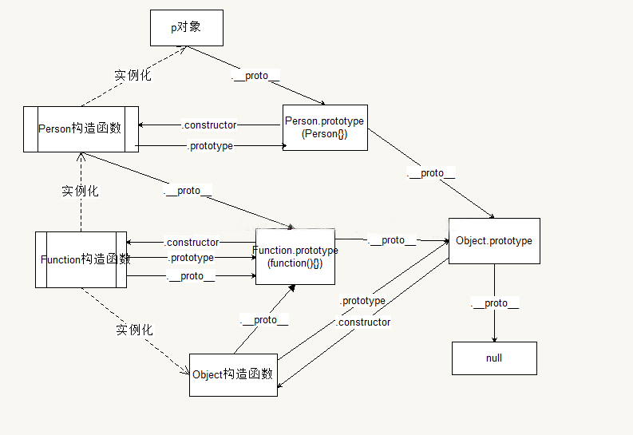
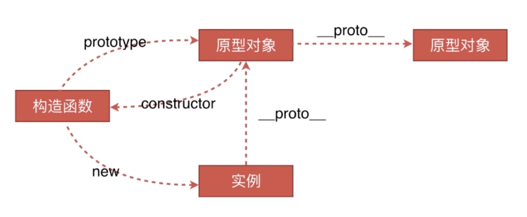
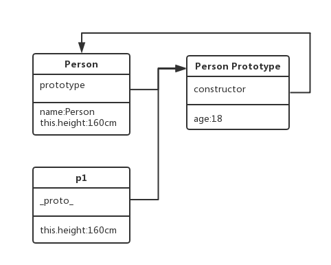
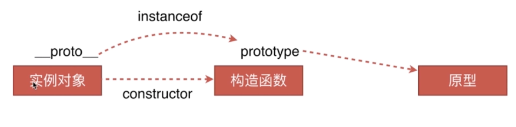

### 面向对象原理：

​    1）目标：实现封装、继承、多态等面向对象的基本功能。

​    2）原理：原型链是面向对象的基础,使用prototype、function 、new、this模拟面向对象的类。

​          JavaScript是面向对象语言，但不使用类（根本不存在类）。JavaScript的面向对象是**基于prototype和function**的，而不是基于类的。


### 介绍JavaScript的原型，原型链？有什么特点？

原型：
- JavaScript的所有对象中都包含了一个 [__proto__] 内部属性，这个属性所对应的就是该对象的原型。
- JavaScript的函数对象，除了原型 [__proto__] 之外，还预置了 prototype 属性。
- 当函数对象作为构造函数创建实例时，该 prototype 属性值将被作为实例对象的原型 [__proto__]。

原型链：

- 原型链是由一些用来继承和共享属性的对象组成的（有限的）对象链。
- 当一个对象调用的属性/方法自身不存在时，就会去自己 [__proto__] 关联的前辈 prototype 对象上去找。
- 如果没找到，就会去该 prototype 原型 [__proto__] 关联的前辈 prototype 去找。依次类推，直到找到属性/方法（一直检索到 Object 内建对象）或 undefined 为止。从而形成了所谓的“原型链”

- 关系：`instance.constructor.prototype = instance.__proto__`

- 原型特点：
  
  - JavaScript对象是通过引用来传递的，当修改原型时，与之相关的对象也会继承这一改变
  
- 原型链的基本原理：

  任何一个**实例**，通过原型链，找到它上面的**原型**，该原型对象中的方法和属性，可以被所有的原型实例共享。

  原型可以起到继承的作用，原型里的方法都可以被不同的实例共享。

- 其他理解：

  通过一个对象的**proto**可以找到它的原型对象，原型对象也是一个对象，就可以通过原型对象的**proto**，最后找到了我们的 Object.prototype，Object是原型链的顶端。从实例的原型对象开始一直到 Object.prototype 就是我们的原型链。

  每个对象都有一个私有属性（称之为 [[Prototype]]），它指向它的原型对象（**prototype**）。该 prototype 对象又具有一个自己的 prototype ，层层向上直到一个对象的原型为 null。根据定义，null 没有原型，并作为这个**原型链**中的最后一个环节。

  当查找一个对象的属性时，JavaScript 会向上遍历原型链，直到找到给定名称的属性为止，到查找到达原型链的顶部 - 也就是 **Object.prototype** - 但是仍然没有找到指定的属性，就会返回 **undefined**

  ```
  function Func()\\{\\}
  Func.prototype.name = "Sean";
  Func.prototype.getInfo = function() \\{
    return this.name;
  \\}
  var person = new Func();//现在可以参考var person = Object.create(oldObject);
  console.log(person.getInfo());//它拥有了Func的属性和方法
  //"Sean"
  console.log(Func.prototype);
  // Func \\{ name="Sean", getInfo=function()\\}
  ```




### 原型、构造函数、实例三者之间的关系



> PS：任何一个函数，如果在前面加了`new`，那就是构造函数。



1. 构造函数通过 `new` 生成实例
2. 构造函数也是函数，构造函数的`prototype`指向原型。（所有的函数有`prototype`属性，但实例没有 `prototype`属性）
3. 原型对象中有 `constructor`，指向该原型的构造函数。

> 上面的三行，代码演示：

```js
  var Foo = function (name) \\{
      this.name = name;
  \\};

  var fn = new Foo('smyhvae');
```

> 上面的代码中，`Foo.prototype.constructor === Foo`的结果是`true`：

4. 实例的`__proto__`指向原型。也就是说，`Foo.__proto__ === M.prototype`。

> 声明：所有的**引用类型**（数组、对象、函数）都有`__proto__`这个属性。

`Foo.__proto__ === Function.prototype`的结果为true，说明`Foo`这个普通的函数，是`Function`构造函数的一个实例。


### prototype 和**proto**的关系是什么？

所有的对象都拥有**proto**属性，它指向对象构造函数的 prototype 属性

```
let obj = \\{\\}
obj.__proto__ === Object.prototype // true

function Test()\\{\\}
test.__proto__ == Test.prototype // true
```

所有的函数都同时拥有**proto**和 protytpe 属性
函数的**proto**指向自己的函数实现 函数的 protytpe 是一个对象 所以函数的 prototype 也有**proto**属性 指向 Object.prototype

```
function func() \\{\\}
func.prototype.__proto__ === Object.prototype // true
```

Object.prototype.**proto**指向 null

```
Object.prototype.__proto__ // null
```


### 执行时对象查找时，永远不会去查找原型的一个函数是？

- javaScript中hasOwnProperty函数方法是返回一个布尔值，指出一个对象是否具有指定名称的属性。此方法无法检查该对象的原型链中是否具有该属性；该属性必须是对象本身的一个成员
- 使用方法： object.hasOwnProperty(proName)
- 其中参数object是必选项。一个对象的实例。
- proName是必选项。一个属性名称的字符串值。
- 如果 object 具有指定名称的属性，那么JavaScript中hasOwnProperty函数方法返回 true，反之则返回 false。


### instanceof的原理



- `instanceof`的**作用**：用于判断**实例**属于哪个**构造函数**。
- `instanceof`的**原理**：判断实例对象的`__proto__`属性，和构造函数的`prototype`属性，是否为同一个引用（是否指向同一个地址）。

> - **注意1**：虽然说，实例是由构造函数 new 出来的，但是实例的`__proto__`属性引用的是构造函数的`prototype`。也就是说，实例的`__proto__`属性与构造函数本身无关。
> - **注意2**：在原型链上，原型的上面可能还会有原型，以此类推往上走，继续找`__proto__`属性。这条链上如果能找到， instanceof 的返回结果也是 true。

比如说：

- `foo instance of Foo`的结果为true，因为`foo.__proto__ === M.prototype`为`true`。
- **`foo instance of Objecet`的结果也为true**，为`Foo.prototype.__proto__ === Object.prototype`为`true`。


**instanceof 的内部机制是通过判断对象的原型链中是不是能找到类型的 prototype。**

使用 instanceof 判断一个对象是否为数组，instanceof 会判断这个对象的原型链上是否会找到对应的 Array 的原型，找到返回 true，否则返回 false。

```js
[] instanceof Array; // true
```

但 instanceof 只能用来判断对象类型，原始类型不可以。并且所有对象类型 instanceof Object 都是 true。

```js
[] instanceof Object; // true
```

优点：instanceof 可以弥补 Object.prototype.toString.call()不能判断自定义实例化对象的缺点。

缺点：instanceof 只能用来判断对象类型，原始类型不可以。并且所有对象类型 instanceof Object 都是 true，且不同于其他两种方法的是它不能检测出 iframes。

```js
function f(name) \\{
  this.name = name;
\\}
var f1 = new f("martin");
console.log(f1 instanceof f); //true
```


**推荐阅读:** https://www.cnblogs.com/zhoulujun/p/9667651.html