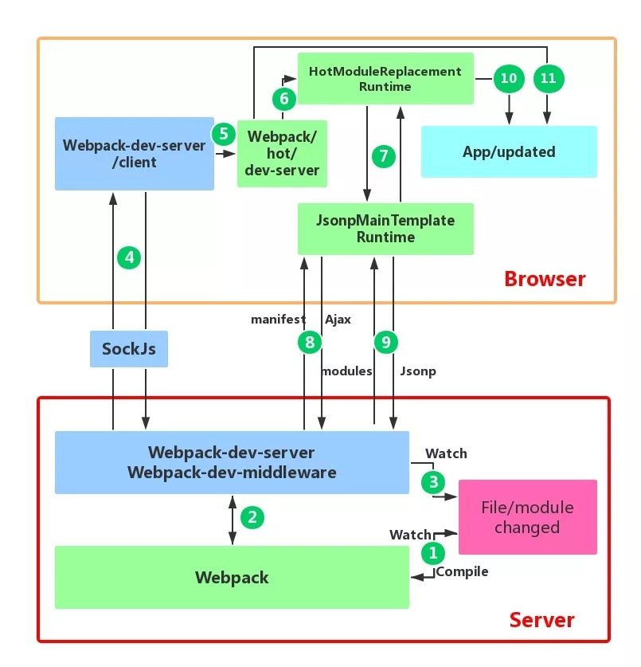
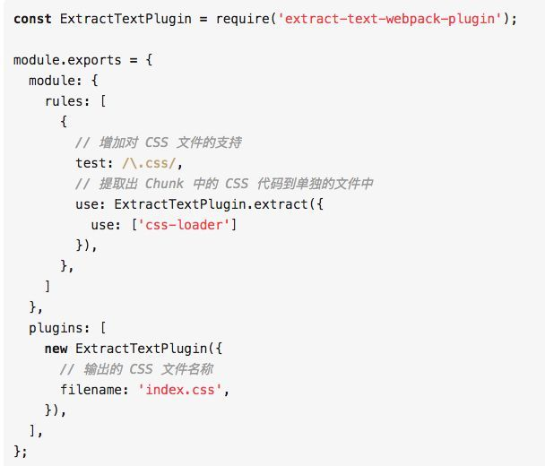
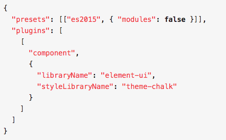

### 谈谈你对 webpack 的看法

我当时使用 webpack 的一个最主要原因是为了简化页面依赖的管理，并且通过将其打包为一个文件来降低页面加载时请求的资源
数。

我认为 webpack 的主要原理是，它将所有的资源都看成是一个模块，并且把页面逻辑当作一个整体，通过一个给定的入口文件，webpack 从这个文件开始，找到所有的依赖文件，将各个依赖文件模块通过 loader 和 plugins 处理后，然后打包在一起，最后输出一个浏览器可识别的 JS 文件。

Webpack 具有四个核心的概念，分别是 Entry（入口）、Output（输出）、loader 和 Plugins（插件）。

Entry 是 webpack 的入口起点，它指示 webpack 应该从哪个模块开始着手，来作为其构建内部依赖图的开始。

Output 属性告诉 webpack 在哪里输出它所创建的打包文件，也可指定打包文件的名称，默认位置为 ./dist。

loader 可以理解为 webpack 的编译器，它使得 webpack 可以处理一些非 JavaScript 文件。在对 loader 进行配置的时候，test 属性，标志有哪些后缀的文件应该被处理，是一个正则表达式。use 属性，指定 test 类型的文件应该使用哪个 loader 进行预处理。常用的 loader 有 css-loader、style-loader 等。

插件可以用于执行范围更广的任务，包括打包、优化、压缩、搭建服务器等等，要使用一个插件，一般是先使用 npm 包管理器进行安装，然后在配置文件中引入，最后将其实例化后传递给 plugins 数组属性。

使用 webpack 的确能够提供我们对于项目的管理，但是它的缺点就是调试和配置起来太麻烦了。但现在 webpack4.0 的免配置一定程度上解决了这个问题。但是我感觉就是对我来说，就是一个黑盒，很多时候出现了问题，没有办法很好的定位。

详细资料可以参考：
[《不聊 webpack 配置，来说说它的原理》](https://juejin.im/post/5b38d27451882574d87aa5d5#heading-0)
[《前端工程化——构建工具选型：grunt、gulp、webpack》](https://juejin.im/entry/5b5724d05188251aa01647fd)
[《浅入浅出 webpack》](https://juejin.im/post/5afa9cd0f265da0b981b9af9#heading-0)
[《前端构建工具发展及其比较》](https://juejin.im/entry/5ae5c8c9f265da0b9f400d8e)


###  webpack的作用是什么，谈谈你对它的理解？

现在的前端网页功能丰富，特别是SPA（single page web application 单页应用）技术流行后，JavaScript的复杂度增加和需要一大堆依赖包，还需要解决Scss，Less……新增样式的扩展写法的编译工作。

所以现代化的前端已经完全依赖于webpack的辅助了。

现在最流行的三个前端框架，可以说和webpack已经紧密相连，框架官方都推出了和自身框架依赖的webpack构建工具。

react.js+WebPack

vue.js+WebPack

AngluarJS+WebPack


### webpack的工作原理?

WebPack可以看做是模块打包机：它做的事情是，分析你的项目结构，找到JavaScript模块以及其它的一些浏览器不能直接运行的拓展语言（Sass，TypeScript等），并将其转换和打包为合适的格式供浏览器使用。在3.0出现后，Webpack还肩负起了优化项目的责任。


### webpack打包原理

把一切都视为模块：不管是 css、JS、Image 还是 html 都可以互相引用，通过定义 entry.js，对所有依赖的文件进行跟踪，将各个模块通过 loader 和 plugins 处理，然后打包在一起。

按需加载：打包过程中 Webpack 通过 Code Splitting 功能将文件分为多个 chunks，还可以将重复的部分单独提取出来作为 commonChunk，从而实现按需加载。把所有依赖打包成一个 bundle.js 文件，通过代码分割成单元片段并按需加载


### webpack的核心概念

- Entry：入口，Webpack 执行构建的第一步将从 Entry 开始，可抽象成输入。告诉webpack要使用哪个模块作为构建项目的起点，默认为./src/index.js
- output ：出口，告诉webpack在哪里输出它打包好的代码以及如何命名，默认为./dist
- Module：模块，在 Webpack 里一切皆模块，一个模块对应着一个文件。Webpack 会从配置的 Entry 开始递归找出所有依赖的模块。
- Chunk：代码块，一个 Chunk 由多个模块组合而成，用于代码合并与分割。
- Loader：模块转换器，用于把模块原内容按照需求转换成新内容。
- Plugin：扩展插件，在 Webpack 构建流程中的特定时机会广播出对应的事件，插件可以监听这些事件的发生，在特定时机做对应的事情。

###  

### Webpack的基本功能有哪些？  

- 代码转换：TypeScript 编译成 JavaScript、SCSS 编译成 CSS 等等
- 文件优化：压缩 JavaScript、CSS、html 代码，压缩合并图片等
- 代码分割：提取多个页面的公共代码、提取首屏不需要执行部分的代码让其异步加载
- 模块合并：在采用模块化的项目有很多模块和文件，需要构建功能把模块分类合并成一个文件
- 自动刷新：监听本地源代码的变化，自动构建，刷新浏览器
- 代码校验：在代码被提交到仓库前需要检测代码是否符合规范，以及单元测试是否通过
- 自动发布：更新完代码后，自动构建出线上发布代码并传输给发布系统。


### gulp/grunt 与 webpack的区别是什么?

三者都是前端构建工具，grunt和gulp在早期比较流行，现在webpack相对来说比较主流，不过一些轻量化的任务还是会用gulp来处理，比如单独打包CSS文件等。
grunt和gulp是基于任务和流（Task、Stream）的。

类似jQuery，找到一个（或一类）文件，对其做一系列链式操作，更新流上的数据， 整条链式操作构成了一个任务，多个任务就构成了整个web的构建流程。
webpack是基于入口的。

webpack会自动地递归解析入口所需要加载的所有资源文件，然后用不同的Loader来处理不同的文件，用Plugin来扩展webpack功能。


### webpack是解决什么问题而生的?

如果像以前开发时一个html文件可能会引用十几个js文件,而且顺序还不能乱，因为它们存在依赖关系，同时对于ES6+等新的语法，less, sass等CSS预处理都不能很好的解决……，此时就需要一个处理这些问题的工具。


### 你是如何提高webpack构件速度的?

多入口情况下，使用CommonsChunkPlugin来提取公共代码

通过externals配置来提取常用库

利用DllPlugin和DllReferencePlugin预编译资源模块通过DllPlugin来对那些我们

引用但是绝对不会修改的npm包来进行预编译，再通过DllReferencePlugin将预编译的模块加载进来。

使用Happypack 实现多线程加速编译

使用webpack-uglify-paralle来提升uglifyPlugin的压缩速度。

原理上webpack-uglify-parallel采用了多核并行压缩来提升压缩速度
使用Tree-shaking和Scope Hoisting来剔除多余代码


### npm打包时需要注意哪些？如何利用webpack来更好的构建？

Npm是目前最大的 JavaScript 模块仓库，里面有来自全世界开发者上传的可复用模块。

你可能只是JS模块的使用者，但是有些情况你也会去选择上传自己开发的模块。 

关于NPM模块上传的方法可以去官网上进行学习，这里只讲解如何利用webpack来构建。

NPM模块需要注意以下问题：

1. 要支持CommonJS模块化规范，所以要求打包后的最后结果也遵守该规则。
2. Npm模块使用者的环境是不确定的，很有可能并不支持ES6，所以打包的最后结果应该是采用ES5编写的。并且如果ES5是经过转换的，请最好连同SourceMap一同上传。
3. Npm包大小应该是尽量小（有些仓库会限制包大小）
4. 发布的模块不能将依赖的模块也一同打包，应该让用户选择性的去自行安装。这样可以避免模块应用者再次打包时出现底层模块被重复打包的情况。
5. UI组件类的模块应该将依赖的其它资源文件，例如.css文件也需要包含在发布的模块里。


### 前端为什么要进行打包和构建？

代码层面：

- 体积更小（Tree-shaking、压缩、合并），加载更快
- 编译高级语言和语法（TS、ES6、模块化、scss）
- 兼容性和错误检查（polyfill,postcss,eslint）

研发流程层面：

- 统一、高效的开发环境
- 统一的构建流程和产出标准
- 集成公司构建规范（提测、上线）


### webpack的构建流程是什么?从读取配置到输出文件这个过程尽量说全

Webpack 的运行流程是一个串行的过程，从启动到结束会依次执行以下流程：

- 初始化参数：从配置文件和 Shell 语句中读取与合并参数，得出最终的参数；
- 开始编译：用上一步得到的参数初始化 Compiler 对象，加载所有配置的插件，执行对象的 run 方法开始执行编译；
- 确定入口：根据配置中的 entry 找出所有的入口文件；
- 编译模块：从入口文件出发，调用所有配置的 Loader 对模块进行翻译，再找出该模块依赖的模块，再递归本步骤直到所有入口依赖的文件都经过了本步骤的处理；
- 完成模块编译：在经过第4步使用 Loader 翻译完所有模块后，得到了每个模块被翻译后的最终内容以及它们之间的依赖关系；
- 输出资源：根据入口和模块之间的依赖关系，组装成一个个包含多个模块的 Chunk，再把每个 Chunk 转换成一个单独的文件加入到输出列表，这步是可以修改输出内容的最后机会；
- 输出完成：在确定好输出内容后，根据配置确定输出的路径和文件名，把文件内容写入到文件系统。

在以上过程中，Webpack 会在特定的时间点广播出特定的事件，插件在监听到感兴趣的事件后会执行特定的逻辑，并且插件可以调用 Webpack 提供的 API 改变 Webpack 的运行结果。


### 怎么配置单页应用？怎么配置多页应用？

单页应用可以理解为webpack的标准模式，直接在entry中指定单页应用的入口即可，这里不再赘述

多页应用的话，可以使用webpack的 AutoWebPlugin来完成简单自动化的构建，但是前提是项目的目录结构必须遵守他预设的规范。多页应用中要注意的是：

- 每个页面都有公共的代码，可以将这些代码抽离出来，避免重复的加载。比如，每个页面都引用了同一套css样式表
- 随着业务的不断扩展，页面可能会不断的追加，所以一定要让入口的配置足够灵活，避免每次添加新页面还需要修改构建配置


### Loader机制的作用是什么？

webpack默认只能打包js文件，配置里的module.rules数组配置了一组规则，告诉 Webpack 在遇到哪些文件时使用哪些 Loader 去加载和转换打包成js。

注意：

use属性的值需要是一个由 Loader 名称组成的数组，Loader 的执行顺序是由后到前的；
每一个 Loader 都可以通过 URL querystring 的方式传入参数，例如css-loader?minimize中的minimize告诉css-loader要开启 CSS 压缩。


### 常用loader

css-loader读取 合并CSS 文件
style-loader把 CSS 内容注入到 JavaScript 里
sass-loader 解析sass文件（安装sass-loader，node-sass）
postcss-loader自动添加浏览器兼容前缀（postcss.config配置）
url-loader将文件转换为base64 URI。
vue-loader处理vue文件。


### Plugin（插件）的作用是什么？

Plugin 是用来扩展 Webpack 功能的，通过在构建流程里注入钩子实现，它给 Webpack 带来了很大的灵活性。

Webpack 是通过plugins属性来配置需要使用的插件列表的。plugins属性是一个数组，里面的每一项都是插件的一个实例，在实例化一个组件时可以通过构造函数传入这个组件支持的配置属性。


### 什么是bundle，什么是chunk，什么是module

bundle：是由webpack打包出来的文件

chunk：是指webpack在进行模块依赖分析的时候，代码分割出来的代码块

module：是开发中的单个模块


### 常见Plugins

HtmlWbpackPlugin自动在打包结束后生成html文件，并引入bundle.js
cleanwebPackPlugin打包自动删除上次打包文件


### ExtractTextPlugin插件的作用

ExtractTextPlugin插件的作用是提取出 JavaScript 代码里的 CSS 到一个单独的文件。

对此你可以通过插件的filename属性，告诉插件输出的 CSS 文件名称是通过[name]_[contenthash:8].css字符串模版生成的，里面的[name]代表文件名称，[contenthash:8]代表根据文件内容算出的8位 hash 值， 还有很多配置选项可以在ExtractTextPlugin的主页上查到。


### sourceMap

是一个映射关系，将打包后的文件隐射到源代码，用于定位报错位置

配置方式:

例如：devtool：‘source-map’
加不同前缀意义：

- inline:不生成映射关系文件，打包进main.js
- cheap: 1.只精确到行，不精确到列，打包速度快 2.只管业务代码，不管第三方模块
- module：不仅管业务代码，而且管第三方代码
- eval:执行效率最快，性能最好

最佳实践：
开发环境：cheap-module-eval-source-map
线上环境：cheap-mudole-source-map


### HMR热模块更新

借助webpack.HotModuleReplacementPlugin()，devServer开启hot

场景1：实现只刷新css，不影响js
场景2：js中实现热更新，只更新指定js模块

```
if (module.hot) \\{
	module.hot.accept(’./library.js’, function() \\{
	// Do something with the updated library module…
\\});\\}
```


### webpack如何配置多入口文件?

```
entry: \\{ home: resolve(__dirname, "src/home/index.js"), about: resolve(__dirname, "src/about/index.js")\\}
```

用于描述入口的对象。你可以使用如下属性：

- dependOn: 当前入口所依赖的入口。它们必须在该入口被加载前被加载。
- filename: 指定要输出的文件名称。
- import: 启动时需加载的模块。
- library: 指定 library 选项，为当前 entry 构建一个 library。
- runtime: 运行时 chunk 的名字。如果设置了，就会创建一个新的运行时 chunk。在 webpack 5.43.0 之后可将其设为 false 以避免一个新的运行时 chunk。
- publicPath: 当该入口的输出文件在浏览器中被引用时，为它们指定一个公共 URL 地址


### babel 相关: polyfill 以及 runtime 区别， ES stage 含义，preset–env 作用等等

  1.polyfill 以及 runtime 区别  

babel-polyfill 的原理是当运行环境中并没有实现的一些方法，babel-polyfill会做兼容。

babel-runtime 它是将es6编译成es5去执行。我们使用es6的语法来编写，最终会通过babel-runtime编译成es5.也就是说，不管浏览器是否支持ES6，只要是ES6的语法，它都会进行转码成ES5.所以就有很多冗余的代码。

babel-polyfill 它是通过向全局对象和内置对象的prototype上添加方法来实现的。比如运行环境中不支持Array.prototype.find 方法，引入polyfill, 我们就可以使用es6方法来编写了，但是缺点就是会造成全局空间污染。

babel-runtime: 它不会污染全局对象和内置对象的原型，比如说我们需要Promise，我们只需要import Promise from 'babel-runtime/core-js/promise'即可，这样不仅避免污染全局对象，而且可以减少不必要的代码。

  2.stage-x：指处于某一阶段的js语言提案  
Stage 0 - 设想（Strawman）：只是一个想法，可能有 Babel插件。
Stage 1 - 建议（Proposal）：这是值得跟进的。
Stage 2 - 草案（Draft）：初始规范。
Stage 3 - 候选（Candidate）：完成规范并在浏览器上初步实现。
Stage 4 - 完成（Finished）：将添加到下一个年度版本发布中。

  3. 理解 babel-preset-env  
babel-preset-es2015: 可以将es6的代码编译成es5.
babel-preset-es2016: 可以将es7的代码编译为es6.
babel-preset-es2017: 可以将es8的代码编译为es7.
babel-preset-latest: 支持现有所有ECMAScript版本的新特性


### 什么是模热更新？有什么优点？

模块热更新是webpack的一个功能，它可以使得代码修改之后，不用刷新浏览器就可以更新。

在应用过程中替换添加删出模块，无需重新加载整个页面，是高级版的自动刷新浏览器。

优点：只更新变更内容，以节省宝贵的开发时间。调整样式更加快速，几乎相当于在浏览器中更改样式


### lazy loading（模块懒加载）

借助import()语法异步引入组件，实现文件懒加载：prefetch,preloading
webpack提倡多写异步代码，提升代码利用率，从而提升页面性能
先加载主业务文件，prefetch利用网络空闲时间，异步加载组件

```
import(/* webpackPrefetch: true / ‘LoginModal’);
```

preload和主业务文件一起加载，异步加载组件

```
import(/ webpackPreload: true */ ‘ChartingLibrary’);
```


### 什么是长缓存？在webpack中如何做到长缓存优化？

浏览器在用户访问页面的时候，为了加快加载速度，会对用户访问的静态资源进行存储，但是每一次代码升级或者更新，都需要浏览器去下载新的代码，最方便和最简单的更新方式就是引入新的文件名称。

在webpack中，可以在output给出输出的文件制定chunkhash，并且分离经常更新的代码和框架代码，通过NameModulesPlugin或者HashedModulesPlugin使再次打包文件名不变。


### 什么是Tree-sharking?

指打包中去除那些引入了但在代码中没用到的死代码。在wepack中js treeshaking通过UglifyJsPlugin来进行，css中通过purify-CSS来进行。


### webpack-dev-server 和 http服务器的区别

webpack-dev-server使用内存来存储webpack开发环境下的打包文件，并且可以使用模块热更新，比传统的http服务对开发更加有效。


### webpack与grunt、gulp的不同？

三者都是前端构建工具，grunt和gulp在早期比较流行，现在webpack相对来说比较主流，不过一些轻量化的任务还是会用gulp来处理，比如单独打包CSS文件等。

grunt和gulp是基于任务和流（Task、Stream）的。类似jQuery，找到一个（或一类）文件，对其做一系列链式操作，更新流上的数据， 整条链式操作构成了一个任务，多个任务就构成了整个web的构建流程。

webpack是基于入口的。webpack会自动地递归解析入口所需要加载的所有资源文件，然后用不同的Loader来处理不同的文件，用Plugin来扩展webpack功能。

所以总结一下：

- 从构建思路来说

gulp和grunt需要开发者将整个前端构建过程拆分成多个`Task`，并合理控制所有`Task`的调用关系 webpack需要开发者找到入口，并需要清楚对于不同的资源应该使用什么Loader做何种解析和加工

- 对于知识背景来说

gulp更像后端开发者的思路，需要对于整个流程了如指掌 webpack更倾向于前端开发者的思路


###  与webpack类似的工具还有哪些？谈谈你为什么最终选择（或放弃）使用webpack？

同样是基于入口的打包工具还有以下几个主流的：

- webpack
- rollup
- parcel

  从应用场景上来看：  

- webpack适用于大型复杂的前端站点构建
- rollup适用于基础库的打包，如vue、react
- parcel适用于简单的实验性项目，他可以满足低门槛的快速看到效果

由于parcel在打包过程中给出的调试信息十分有限，所以一旦打包出错难以调试，所以不建议复杂的项目使用parcel


### 有哪些常见的Loader？他们是解决什么问题的？

- file-loader：把文件输出到一个文件夹中，在代码中通过相对 URL 去引用输出的文件
- url-loader：和 file-loader 类似，但是能在文件很小的情况下以 base64 的方式把文件内容注入到代码中去
- source-map-loader：加载额外的 Source Map 文件，以方便断点调试
- image-loader：加载并且压缩图片文件
- babel-loader：把 ES6 转换成 ES5
- css-loader：加载 CSS，支持模块化、压缩、文件导入等特性
- style-loader：把 CSS 代码注入到 JavaScript 中，通过 DOM 操作去加载 CSS。
- eslint-loader：通过 ESLint 检查 JavaScript 代码


### 有哪些常见的Plugin？他们是解决什么问题的？

- define-plugin：定义环境变量
- commons-chunk-plugin：提取公共代码
- uglifyjs-webpack-plugin：通过UglifyES压缩ES6代码


### Loader和Plugin的不同？

  不同的作用  

-   Loader  直译为"加载器"。Webpack将一切文件视为模块，但是webpack原生是只能解析js文件，如果想将其他文件也打包的话，就会用到loader。 所以Loader的作用是让webpack拥有了加载和解析非JavaScript文件的能力。
-   Plugin  直译为"插件"。Plugin可以扩展webpack的功能，让webpack具有更多的灵活性。 在 Webpack 运行的生命周期中会广播出许多事件，Plugin 可以监听这些事件，在合适的时机通过 Webpack 提供的 API 改变输出结果。

  不同的用法  

-   Loader  在module.rules中配置，也就是说他作为模块的解析规则而存在。 类型为数组，每一项都是一个Object，里面描述了对于什么类型的文件（test），使用什么加载(loader)和使用的参数（options）
-   Plugin  在plugins中单独配置。 类型为数组，每一项是一个plugin的实例，参数都通过构造函数传入。


### webpack的构建流程是什么?从读取配置到输出文件这个过程尽量说全

Webpack 的运行流程是一个串行的过程，从启动到结束会依次执行以下流程：

1. 初始化参数：从配置文件和 Shell 语句中读取与合并参数，得出最终的参数；
2. 开始编译：用上一步得到的参数初始化 Compiler 对象，加载所有配置的插件，执行对象的 run 方法开始执行编译；
3. 确定入口：根据配置中的 entry 找出所有的入口文件；
4. 编译模块：从入口文件出发，调用所有配置的 Loader 对模块进行翻译，再找出该模块依赖的模块，再递归本步骤直到所有入口依赖的文件都经过了本步骤的处理；
5. 完成模块编译：在经过第4步使用 Loader 翻译完所有模块后，得到了每个模块被翻译后的最终内容以及它们之间的依赖关系；
6. 输出资源：根据入口和模块之间的依赖关系，组装成一个个包含多个模块的 Chunk，再把每个 Chunk 转换成一个单独的文件加入到输出列表，这步是可以修改输出内容的最后机会；
7. 输出完成：在确定好输出内容后，根据配置确定输出的路径和文件名，把文件内容写入到文件系统。

在以上过程中，Webpack 会在特定的时间点广播出特定的事件，插件在监听到感兴趣的事件后会执行特定的逻辑，并且插件可以调用 Webpack 提供的 API 改变 Webpack 的运行结果。


### 是否写过Loader和Plugin？描述一下编写loader或plugin的思路？

Loader像一个"翻译官"把读到的源文件内容转义成新的文件内容，并且每个Loader通过链式操作，将源文件一步步翻译成想要的样子。

编写Loader时要遵循单一原则，每个Loader只做一种"转义"工作。 每个Loader的拿到的是源文件内容（source），可以通过返回值的方式将处理后的内容输出，也可以调用this.callback()方法，将内容返回给webpack。 还可以通过 this.async()生成一个callback函数，再用这个callback将处理后的内容输出出去。 此外webpack还为开发者准备了开发loader的工具函数集——loader-utils。

相对于Loader而言，Plugin的编写就灵活了许多。 webpack在运行的生命周期中会广播出许多事件，Plugin 可以监听这些事件，在合适的时机通过 Webpack 提供的 API 改变输出结果。


### webpack的热更新是如何做到的？说明其原理？

webpack的热更新又称热替换（Hot Module Replacement），缩写为HMR。 这个机制可以做到不用刷新浏览器而将新变更的模块替换掉旧的模块。

原理：



首先要知道server端和client端都做了处理工作

1. 第一步，在 webpack 的 watch 模式下，文件系统中某一个文件发生修改，webpack 监听到文件变化，根据配置文件对模块重新编译打包，并将打包后的代码通过简单的 JavaScript 对象保存在内存中。
2. 第二步是 webpack-dev-server 和 webpack 之间的接口交互，而在这一步，主要是 dev-server 的中间件 webpack-dev-middleware 和 webpack 之间的交互，webpack-dev-middleware 调用 webpack 暴露的 API对代码变化进行监控，并且告诉 webpack，将代码打包到内存中。
3. 第三步是 webpack-dev-server 对文件变化的一个监控，这一步不同于第一步，并不是监控代码变化重新打包。当我们在配置文件中配置了devServer.watchContentBase 为 true 的时候，Server 会监听这些配置文件夹中静态文件的变化，变化后会通知浏览器端对应用进行 live reload。注意，这儿是浏览器刷新，和 HMR 是两个概念。
4. 第四步也是 webpack-dev-server 代码的工作，该步骤主要是通过 sockjs（webpack-dev-server 的依赖）在浏览器端和服务端之间建立一个 websocket 长连接，将 webpack 编译打包的各个阶段的状态信息告知浏览器端，同时也包括第三步中 Server 监听静态文件变化的信息。浏览器端根据这些 socket 消息进行不同的操作。当然服务端传递的最主要信息还是新模块的 hash 值，后面的步骤根据这一 hash 值来进行模块热替换。
5. webpack-dev-server/client 端并不能够请求更新的代码，也不会执行热更模块操作，而把这些工作又交回给了 webpack，webpack/hot/dev-server 的工作就是根据 webpack-dev-server/client 传给它的信息以及 dev-server 的配置决定是刷新浏览器呢还是进行模块热更新。当然如果仅仅是刷新浏览器，也就没有后面那些步骤了。
6. HotModuleReplacement.runtime 是客户端 HMR 的中枢，它接收到上一步传递给他的新模块的 hash 值，它通过 JsonpMainTemplate.runtime 向 server 端发送 Ajax 请求，服务端返回一个 json，该 json 包含了所有要更新的模块的 hash 值，获取到更新列表后，该模块再次通过 jsonp 请求，获取到最新的模块代码。这就是上图中 7、8、9 步骤。
7. 而第 10 步是决定 HMR 成功与否的关键步骤，在该步骤中，HotModulePlugin 将会对新旧模块进行对比，决定是否更新模块，在决定更新模块后，检查模块之间的依赖关系，更新模块的同时更新模块间的依赖引用。
8. 最后一步，当 HMR 失败后，回退到 live reload 操作，也就是进行浏览器刷新来获取最新打包代码。


### 如何利用webpack来优化前端性能？（提高性能和体验）

用webpack优化前端性能是指优化webpack的输出结果，让打包的最终结果在浏览器运行快速高效。

- 压缩代码。删除多余的代码、注释、简化代码的写法等等方式。可以利用webpack的UglifyJsPlugin和ParallelUglifyPlugin来压缩JS文件， 利用cssnano（css-loader?minimize）来压缩css
- 利用[CDN](https://cloud.tencent.com/product/cdn?from=10680)加速。在构建过程中，将引用的静态资源路径修改为CDN上对应的路径。可以利用webpack对于output参数和各loader的publicPath参数来修改资源路径
- 删除死代码（Tree Shaking）。将代码中永远不会走到的片段删除掉。可以通过在启动webpack时追加参数--optimize-minimize来实现
- 提取公共代码。


### 如何提高webpack的构建速度？

1. 多入口情况下，使用CommonsChunkPlugin来提取公共代码
2. 通过externals配置来提取常用库
3. 利用DllPlugin和DllReferencePlugin预编译资源模块 通过DllPlugin来对那些我们引用但是绝对不会修改的npm包来进行预编译，再通过DllReferencePlugin将预编译的模块加载进来。
4. 使用Happypack 实现多线程加速编译
5. 使用webpack-uglify-parallel来提升uglifyPlugin的压缩速度。 原理上webpack-uglify-parallel采用了多核并行压缩来提升压缩速度
6. 使用Tree-shaking和Scope Hoisting来剔除多余代码


### 怎么配置单页应用？怎么配置多页应用？

单页应用可以理解为webpack的标准模式，直接在entry中指定单页应用的入口即可，这里不再赘述

多页应用的话，可以使用webpack的 AutoWebPlugin来完成简单自动化的构建，但是前提是项目的目录结构必须遵守他预设的规范。 多页应用中要注意的是：

- 每个页面都有公共的代码，可以将这些代码抽离出来，避免重复的加载。比如，每个页面都引用了同一套css样式表
- 随着业务的不断扩展，页面可能会不断的追加，所以一定要让入口的配置足够灵活，避免每次添加新页面还需要修改构建配置


### npm打包时需要注意哪些？如何利用webpack来更好的构建？

Npm是目前最大的 JavaScript 模块仓库，里面有来自全世界开发者上传的可复用模块。你可能只是JS模块的使用者，但是有些情况你也会去选择上传自己开发的模块。 关于NPM模块上传的方法可以去官网上进行学习，这里只讲解如何利用webpack来构建。

NPM模块需要注意以下问题：

1. 要支持CommonJS模块化规范，所以要求打包后的最后结果也遵守该规则。
2. Npm模块使用者的环境是不确定的，很有可能并不支持ES6，所以打包的最后结果应该是采用ES5编写的。并且如果ES5是经过转换的，请最好连同SourceMap一同上传。
3. Npm包大小应该是尽量小（有些仓库会限制包大小）
4. 发布的模块不能将依赖的模块也一同打包，应该让用户选择性的去自行安装。这样可以避免模块应用者再次打包时出现底层模块被重复打包的情况。
5. UI组件类的模块应该将依赖的其它资源文件，例如.css文件也需要包含在发布的模块里。

基于以上需要注意的问题，我们可以对于webpack配置做以下扩展和优化：

1. CommonJS模块化规范的解决方案： 设置output.libraryTarget='commonjs2'使输出的代码符合CommonJS2 模块化规范，以供给其它模块导入使用
2. 输出ES5代码的解决方案：使用babel-loader把 ES6 代码转换成 ES5 的代码。再通过开启devtool: 'source-map'输出SourceMap以发布调试。
3. Npm包大小尽量小的解决方案：Babel 在把 ES6 代码转换成 ES5 代码时会注入一些辅助函数，最终导致每个输出的文件中都包含这段辅助函数的代码，造成了代码的冗余。解决方法是修改.babelrc文件，为其加入transform-runtime插件
4. 不能将依赖模块打包到NPM模块中的解决方案：使用externals配置项来告诉webpack哪些模块不需要打包。
5. 对于依赖的资源文件打包的解决方案：通过css-loader和extract-text-webpack-plugin来实现，配置如下：




### 如何在vue项目中实现按需加载？

Vue UI组件库的按需加载 为了快速开发前端项目，经常会引入现成的UI组件库如ElementUI、iView等，但是他们的体积和他们所提供的功能一样，是很庞大的。 而通常情况下，我们仅仅需要少量的几个组件就足够了，但是我们却将庞大的组件库打包到我们的源码中，造成了不必要的开销。

不过很多组件库已经提供了现成的解决方案，如Element出品的babel-plugin-component和AntDesign出品的babel-plugin-import 安装以上插件后，在.babelrc配置中或babel-loader的参数中进行设置，即可实现组件按需加载了。



单页应用的按需加载 现在很多前端项目都是通过单页应用的方式开发的，但是随着业务的不断扩展，会面临一个严峻的问题——首次加载的代码量会越来越多，影响用户的体验。

通过import(*)语句来控制加载时机，webpack内置了对于import(*)的解析，会将import(*)中引入的模块作为一个新的入口在生成一个chunk。 当代码执行到import(*)语句时，会去加载Chunk对应生成的文件。import()会返回一个Promise对象，所以为了让浏览器支持，需要事先注入Promise polyfill


### 前端为什么要进行打包和构建？

代码层面：

- 体积更小（Tree-shaking、压缩、合并），加载更快
- 编译高级语言和语法（TS、ES6、模块化、scss）
- 兼容性和错误检查（polyfill,postcss,eslint）

研发流程层面：

- 统一、高效的开发环境
- 统一的构建流程和产出标准
- 集成公司构建规范（提测、上线）


### module chunk bundle区别

##### module - 各个源码文件，webpack中一切皆模块

##### chunk - 多模块合并成的

在 entry import() splitChunks 都可以定义chunk:

```
entry: \\{
  index: path.join(srcPath, 'index.js'),
  other: path.join(srcPath, 'other.js')
\\},
import('./  */djdj.js').then(res=>\\{
  console.log(res.data)
\\})
// splitChunks 代码分割；HtmlWebpackPlugin引用 chunk
```


##### bundle -最终输出文件

### loader和plugin的区别

loader 模块转换器 （less->css）
plugin 是扩展插件，如HtmlWebpackPlugin

常见的loader和plugin有哪些？
Loader:

- babel-loader：把 ES6 转换成 ES5
- css-loader：加载 CSS，支持模块化、压缩、文件导入等特性
- style-loader：把 CSS 代码注入到 JavaScript 中，通过 DOM 操作去加载 CSS。
- file-loader (png|jpg|jpeg|gif 开发
- 'url-loader', 生产
- vue-loader

Plugin:

- IgnorePlugin 避免引入无用模块
- HotModuleReplacementPlugin 热更新
- define-plugin：定义环境变量
- commons-chunk-plugin：提取公共代码
- uglifyjs-webpack-plugin：通过UglifyES压缩ES6代码


### babel和webpack的区别

babel JS新语法编译工具，只关心语法，不关心模块化
webpack -打包构建工具，是多个Loader plugin的集合


### webpack如何实现懒加载

import()

- 结合 vue 异步组件 $nexitick
- 结合vue-router异步加载路由 import


### 如何产出一个lib

```
output: \\{
  // lib的文件名
  filename: 'lodash.js',
  // 输出的lib都放到 dist 目录下
  path: distPath,
  // 存放lib的全局变量名称
  library: 'lodash',
\\},
```

 

### babel-polyfill babel-runtime 区别

babel-polyfill 会污染全局
babel-runtime 不会污染全局，产出第三方lib时要用babel-runtime


### 为什么 Proxy 不能被 Polyfill

如 Class 可以用 function 模拟
如 Promise 可以用 callback 模拟
但是 Proxy 功能用 Object.defineProperty 无法模拟


### webpack优化构建速度

生产环境：
babel-loader
IgnorePlugin
noParse
happyPack
ParallelUglifyPlugin

不能用于生产环境：
自动刷新
热更新
DllPlugin


### webpack优化产出代码

小图片base64编码
bundle加hash
懒加载
提取公共代码
使用cdn加速
IgnorePlugin
使用production
Scope Hosting
(场景、效果、原理)


### webpack3和webpack4的区别

1.1. mode/–mode参数
 新增了mode/--mode参数来表示是开发还是生产（development/production）
 production 侧重于打包后的文件大小，development侧重于goujiansud
1.2. 移除loaders，必须使用rules（在3版本的时候loaders和rules 是共存的但是到4的时候只允许使用rules）
1.3. 移除了CommonsChunkPlugin (提取公共代码)，用optimization.splitChunks和optimization.runtimeChunk来代替
1.4. 支持es6的方式导入JSON文件，并且可以过滤无用的代码

```jsx
let jsonData = require('./data.json')
import jsonData from './data.json'
import \\{ first \\} from './data.json' // 打包时只会把first相关的打进去
```

1.5. 升级happypack插件（happypack可以进行多线程加速打包）
1.6.  ExtractTextWebpackPlugin调整，建议选用新的CSS文件提取kiii插件mini-css-extract-plugin，production模式，增加  minimizer


## loader 和 plugin 不同

2.1. loader是使wenbpack拥有加载和解析非js文件的能力
 2.2. plugin 可以扩展webpack的功能，使得webpack更加灵活。可以在构建的过程中通过webpack的api改变输出的结果


### webpack构建流程

3.1. 初始化参数，从配置文件和shell语句中读到的参数合并，得到最后的参数
3.2. 开始编译：用合并得到的参数初始化complier对象，加载是所有配置的插件，执行run方法开始编译
3.3. 确定入口，通过entry找到入口文件
3.4. 编译模块，从入口文件出发，调用所有配置的loader对模块进行解析翻译，在找到该模块依赖的模块进行处理
3.5. 完成模块编译，得到每个模块被翻译之后的最终的内容和依赖关系
3.6. 输出资源，根据入口和模块之间的依赖关系，组装成一个个包含多个模块的chunk，在把每个chunk转换成一个单独的文件加载到输出列表
3.7. 输出完成，确定输出的路径和文件名，把内容写到文件系统中
  在以上过程中，webpack会在特定的时间点广播出特定的事件，插件在舰艇感兴趣的事件后会执行特定的逻辑，改变webpack的运行结果  


### 如何利用webpack来优化前端性能

5.1. 压缩代码。uglifyJsPlugin 压缩js代码， mini-css-extract-plugin 压缩css代码
5.2. 利用CDN加速，将引用的静态资源修改为CDN上对应的路径，可以利用webpack对于output参数和loader的publicpath参数来修改资源路径
5.3. 删除死代码（tree shaking），css需要使用Purify-CSS
5.4. 提取公共代码。webpack4移除了CommonsChunkPlugin (提取公共代码)，用optimization.splitChunks和optimization.runtimeChunk来代替


### 什么是bundle,什么是chunk，什么是module?

bundle:有webpack打包出来的文件
 chunk：webpack在进行模块的依赖分析的时候，代码分割出来的代码块
 module:开发中的单个模块


### webpack-dev-server和http服务器如nginx有什么区别?

webpack-dev-server使用内存来存储webpack开发环境下的打包文件，并且可以使用模块热更新，他比传统的http服务对开发更加简单高效。


### DefinePlugin

DefinePlugin ：允许创建一个在编译时可以配置的全局变量


### DllPlugin

使用DllPlugin可以减少基础模块编译次数，动态链接库插件，其原理是吧网页依赖的基础模块抽离出来打包到dll文件中，当需要导入的模块存在于某个dll中时，这个模块不再被打包，而是去dll中获取。在dll中大多包含的时常用的第三方模块，只要这些模块版本不升级，就只需要被编译一次。
   注意  
 DllPlugin参数中的name必须要和output.library值保持一致，并且生成的mainfest文件中会引用output.library值


### happyPack开启多线程loader转换

运行在node.js之上的webpack时单线程模型，也就是只能一个一个文件进行处理，不能并行处理，happypack可以将任务分解给多个子进程，最后将结果发给主进程，js是单线程模型，只能通过这种多线程的方式提高性能


### 概念


  从一个空的配置文件逐步完成一个完整的设置进行打包文件  

  不像大多数的模块打包机，webpack是收把项目当作一个整体，通过一个给定的的主文件，webpack将从这个文件开始找到你的项目的所有依赖文件，使用loaders处理它们，最后打包成一个或多个浏览器可识别的js文件  


### install

首先添加我们即将使用的包：

```q
npm install webpack webpack-dev-server --save-dev
```

webpack是我们需要的模块打包机，webpack-dev-server用来创建本地服务器，监听你的代码修改，并自动刷新修改后的结果。这些是有关devServer的配置

```awk
contentBase,  // 为文件提供本地服务器
port, // 监听端口，默认8080
inline, // 设置为true,源文件发生改变自动刷新页面
historyApiFallback  // 依赖HTML5 history API,如果设置为true,所有的页面跳转指向index.html
devServer:\\{
    contentBase: './src' // 本地服务器所加载的页面所在的目录
    historyApiFallback: true, // 不跳转
    inline: true // 实时刷新
\\}
然后我们在根目录下创建一个'webpack.config.js'，在'package.json'添加两个命令用于本地开发和生产发布
    

"scripts": \\{
            "start": "webpack-dev-server",
            "build": "webpack"
        \\}
```

在使用webpack命令的时候，他将接受webpack的配置文件，除非我们使用其他的操作


### entry

entry: 用来写入口文件，它将是整个依赖关系的根

```actionscript
var baseConfig = \\{
        entry: './src/index.js'
    \\}
```

当我们需要多个入口文件的时候，可以把entry写成一个对象

```stylus
var baseConfig = \\{
        entry: \\{
            main: './src/index.js'
        \\}
    \\}
```

我建议使用后面一种方法，因为他的规模会随你的项目增大而变得繁琐


### output

output: 即使入口文件有多个，但是只有一个输出配置

```lua
var path = require('path')
    var baseConfig = \\{
        entry: \\{
            main: './src/index.js'
        \\},
        output: \\{
            filename: 'main.js',
            path: path.resolve('./build')
        \\}
    \\}
    module.exports = baseConfig
```

如果你定义的入口文件有多个，那么我们需要使用占位符来确保输出文件的唯一性

```lua
output: \\{
        filename: '[name].js',
        path: path.resolve('./build')
    \\}
```

如今这么少的配置，就能够让你运行一个服务器并在本地使用命令npm start或者npm run build来打包我们的代码进行发布


### Loader

  loader的作用  ： 
1、实现对不同格式的文件的处理，比如说将scss转换为css，或者typescript转化为js
2、转换这些文件，从而使其能够被添加到依赖图中
loader是webpack最重要的部分之一，通过使用不同的Loader，我们能够调用外部的脚本或者工具，实现对不同格式文件的处理，loader需要在webpack.config.js里边单独用module进行配置，配置如下：

```dts
test: 匹配所处理文件的扩展名的正则表达式（必须）
    loader: loader的名称（必须）
    include/exclude: 手动添加处理的文件，屏蔽不需要处理的文件（可选）
    query: 为loaders提供额外的设置选项
    ex: 
        var baseConfig = \\{
            // ...
            module: \\{
                rules: [
                    \\{
                        test: /*匹配文件后缀名的正则*/,
                        use: [
                            loader: /*loader名字*/,
                            query: /*额外配置*/
                        ]
                    \\}
                ]
            \\}
        \\}
```

要是loader工作，我们需要一个正则表达式来标识我们要修改的文件，然后有一个数组表示
我们表示我们即将使用的Loader,当然我们需要的loader需要通过npm 进行安装。例如我们需要解析less的文件，那么webpack.config.js的配置如下：

```yaml
var baseConfig = \\{
                entry: \\{
                    main: './src/index.js'
                \\},
                output: \\{
                    filename: '[name].js',
                    path: path.resolve('./build')
                \\},
                devServer: \\{
                    contentBase: './src',
                    historyApiFallBack: true,
                    inline: true
                \\},
                module: \\{
                    rules: [
                        \\{
                            test: /\.less$/,
                            use: [
                                \\{loader: 'style-loader'\\},
                                \\{loader: 'css-loader'\\},
                                \\{loader: 'less-loader'\\}
                            ],
                            exclude: /node_modules/
                        \\}
                    ]
                \\}
            \\}
```

这里介绍几个常用的loader：
babel-loader： 让下一代的js文件转换成现代浏览器能够支持的JS文件。
babel有些复杂，所以大多数都会新建一个.babelrc进行配置
css-loader,style-loader:两个建议配合使用，用来解析css文件，能够解释@import,url()如果需要解析less就在后面加一个less-loader
file-loader: 生成的文件名就是文件内容的MD5哈希值并会保留所引用资源的原始扩展名
url-loader: 功能类似 file-loader,但是文件大小低于指定的限制时，可以返回一个DataURL事实上，在使用less,scss,stylus这些的时候，npm会提示你差什么插件，差什么，你就安上就行了


### Plugins

plugins和loader很容易搞混，说都是外部引用有什么区别呢？ 事实上他们是两个完全不同的东西。这么说  loaders负责的是处理源文件的如css、jsx，一次处理一个文件。而plugins并不是直接操作单个文件，  它直接对整个构建过程起作用下面列举了一些我们常用的plugins和他的用法
ExtractTextWebpackPlugin: 它会将入口中引用css文件，都打包都独立的css文件中，而不是内嵌在js打包文件中。下面是他的应用

```javascript
var ExtractTextPlugin = require('extract-text-webpack-plugin')
        var lessRules = \\{
            use: [
                \\{loader: 'css-loader'\\},
                \\{loader: 'less-loader'\\}
            ]
        \\}
        
        var baseConfig = \\{
            // ... 
            module: \\{
                rules: [
                    // ...
                    \\{test: /\.less$/, use: ExtractTextPlugin.extract(lessRules)\\}
                ]
            \\},
            plugins: [
                new ExtractTextPlugin('main.css')
            ]
        \\}
```

HtmlWebpackPlugin:
作用： 依据一个简单的index.html模版，生成一个自动引用你打包后的js文件的新index.html

```haxe
var HTMLWebpackPlugin = require('html-webpack-plugin')
            var baseConfig = \\{
                // ...
                plugins: [
                    new HTMLWebpackPlugin()
                ]
            \\}
```

HotModuleReplacementPlugin: 它允许你在修改组件代码时，自动刷新实时预览修改后的结果注意永远不要在生产环境中使用HMR。这儿说一下一般情况分为开发环境，测试环境，生产环境。
用法如 `new webpack.HotModuleReplacementPlugin()`

```javascript
    webapck.config.js的全部内容
    

const webpack = require("webpack")
        const HtmlWebpackPlugin = require("html-webpack-plugin")
        var ExtractTextPlugin = require('extract-text-webpack-plugin')
        var lessRules = \\{
            use: [
                \\{loader: 'css-loader'\\},
                \\{loader: 'less-loader'\\}
            ]
        \\}
        module.exports = \\{
            entry: \\{
                    main: './src/index.js'
                \\},
                output: \\{
                    filename: '[name].js',
                    path: path.resolve('./build')
                \\},
                devServer: \\{
                    contentBase: '/src',
                    historyApiFallback: true,
                    inline: true,
                    hot: true
                \\},
                module: \\{
                    rules: [
                        \\{test: /\.less$/, use: ExtractTextPlugin.extract(lessRules)\\}
                    ]
                \\},
                plugins: [
                new ExtractTextPlugin('main.css')
            ]
        \\}
    
```


### 产品阶段的构建

目前为止，在开发阶段的东西我们已经基本完成了。但是在产品阶段，还需要对资源进行别的
处理，例如压缩，优化，缓存，分离css和js。首先我们来定义产品环境

```haxe
var ENV = process.env.NODE_ENV
    var baseConfig = \\{
        // ... 
        plugins: [
            new webpack.DefinePlugin(\\{
                'process.env.NODE_ENV': JSON.stringify(ENV)
            \\})
        ]
    \\}
```

然后还需要修改我们的script命令

```json
"scripts": \\{
            "start": "NODE_ENV=development webpack-dev-server",
            "build": "NODE_ENV=production webpack"
        \\}
```

process.env.NODE_ENV 将被一个字符串替代，它运行压缩器排除那些不可到达的开发代码分支。
当你引入那些不会进行生产的代码，下面这个代码将非常有用。

```dockerfile
if (process.env.NODE_ENV === 'development') \\{
            console.warn('这个警告会在生产阶段消失')
        \\}
```


### 优化插件

下面介绍几个插件用来优化代码
OccurenceOrderPlugin: 为组件分配ID,通过这个插件webpack可以分析和优先考虑使用最多 的模块，然后为他们分配最小的ID
UglifyJsPlugin: 压缩代码
下面是他们的使用方法
var baseConfig = \\{

```haxe
// ...
 new webpack.optimize.OccurenceOrderPlugin()
 new webpack.optimize.UglifyJsPlugin()
```

\\}
然后在我们使用npm run build会发现代码是压缩的


### webpack打包复制文件插件copy-webpack-plugin

在离线应用中，前端所有文件都需在在本地，有些文件（比如iconFont)需要转为离线文件，这些文件可以直接引用更方便些，这就需要在打包时直接复制到打包文件下。

前端的文件复制让人直接联想到node的fs，可以在打包时调用文件复制方法，当然webpack提供一款插件来解决这一问题：[copy-webpack-plugin](https://www.npmjs.com/package/copy-webpack-plugin)

安装：

```
cnpm i copy-webpack-plugin -D 
/* 或 */
npm i copy-webpack-plugin --save-dev
```

使用：

```
const CopyPlugin = require("copy-webpack-plugin");

module.exports = \\{
  plugins: [
    new CopyPlugin(\\{
      patterns: [
        \\{ from: "source", to: "dest" \\},
        // 例如
        \\{ from: path.resolve(__dirname, '../static'), to: 'static' \\},
      ],
      options: \\{
        concurrency: 100,
      \\},
    \\}),
  ],
\\};
```

