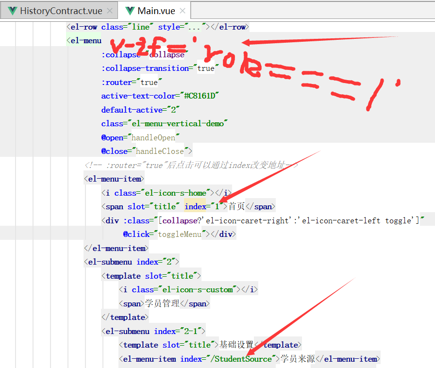

### 【VueJS】实例中data属性的三种写法及区别

```
<script type="text/javascript">
    var app=new Vue(\\{
        el:'#app',
        data:\\{
            isLogin: false
        \\}
    \\})
</script>
```

```
<script type="text/javascript">
    var app=new Vue(\\{
        el:'#app',
        data: function()\\{
            return \\{
                isLogin: false
            \\}
        \\}
    \\})
</script>
```

```
<script type="text/javascript">
    var app=new Vue(\\{
        el:'#app',
        data() \\{
            return \\{
                isLogin: false
            \\}
        \\}
    \\})
</script>
```

第3种是第2种的ES6写法

**区别**

1）在简单的Vue实例中，没什么区别，因为你app对象不会被复用。

```
var app = new Vue(\\{...\\})
```

2）但是在组件中，因为可能在多处调用同一组件，所以为了不让多处的组件共享同一data对象，只能返回函数。

```
export default\\{
    data()\\{
        return \\{
            ...
        \\}
    \\}
\\}
```

总结日期：2019.11.27


### 自定义路径别名 assets和static文件夹的区别

相信有很多人知道vue-cli有两个放置静态资源的地方，分别是`src/assets`文件夹和`static`文件夹,这两者的区别很多人可能不太清楚。

**assets目录中的文件会被webpack处理解析为模块依赖**，只支持相对路径形式。例如，在  ``和`background: url(./logo.png)`中，”./logo.png” 是相对的资源路径，将由Webpack解析为模块依赖。

**static/ 目录下的文件并不会被Webpack处理：它们会直接被复制到最终的打包目录（默认是dist/static）下。**必须使用绝对路径引用这些文件，这是通过在 config.js 文件中的 build.assetsPublicPath 和 build.assetsSubDirectory 连接来确定的。

任何放在 static/ 中文件需要以绝对路径的形式引用：/static/[filename]。

在我们实际的开发中，总的来说：**static放不会变动的文件 assets放可能会变动的文件。**

vue项目有两个地方可以存放静态资源。一个是assets文件夹，一个是static文件夹（地址栏输入static可以直接访问）。放到static里面webpack打包后只会把资源复制到发布目录而不会把小图片优化为base64。而assets内的资源会被webpack打包,比如图片,会被转为BASE64。为了兼顾图片资源优化，所以还是不适合把图片资源放到static。

assets 里面的图片是会经过 webpack 的 loader 处理的，而 static 里面的图片是被直接复制到 dist/static 下面的。

总结日期：2019.11.27


### 在js数据中用 requier 的方法引用图片

因为webpack会将图片当做模块来引用，所以在js中需要使用require将图片引用进来，不能直接以字符串的形式。

```
js部分：
data () \\{
	return\\{
		imgUrl: '图片地址',//错误写法
		imgUrl: require('图片地址')//正确的写法
	\\}
\\}
template部分：
img标签形式："img"/>或者p背景图形式："\\{backgroundImage: 'url(' + img + ')'\\}">
```

**因为webpack会将图片当做模块来引用，所以在js中需要使用require将图片引用进来，而不是直接以字符串的形式。**

node编程中最重要的思想就是模块化，`import `和 `require `都是被模块化所使用。

**遵循规范**

1. `require `是 AMD 规范引入方式
2. `import `是 ES6 的一个新的语法标准，如果要兼容浏览器的话必须转化成 ES5 的语法

**调用时间**

1. require 是在运行时调用，所以 require 理论上可以放在代码的任何地方
2. import 是在编译时调用，所以必须放在文件开头

**本质**

1. require 是赋值过程，其实 require 的结果就是对象、数字、字符串、函数等，再把 require 的结果赋值给某个变量
2. import 是解构过程，但是目前所有的引擎都还没有实现 import，我们在 node 中使用 babel 支持 ES6，也仅仅是将 ES6 转码为 ES5 再执行，import 语法会被转码为 require

总结日期：2019.11.27


### –save-dev和–save的区别

当你使用`--save-dev`或者-S，安装依赖的时候就会放在package.json的devDependencies对象下面，相反的，当你使用`--save`，安装依赖的时候就会出现在dependencies对象下面。

 –save-dev 是你开发时候依赖的东西，–save 是你发布之后还依赖的东西。

总结日期：2019.11.27


### 创建vue项目完整流程

#### 1. 选定路径，新建vue项目test

```
npm install vue-cli -g
vue init webpack test
```

一级文件夹：

- build：主要是用来配置构建项目以及webpack
- config:项目开发配置
- node_modules ：npm或者cnpm或者yarm所下载的依赖包。
- src:你的源代码
- assets：存放资源文件，例如css、js、image公共文件
- components：存放公共组件，例如menu、tabBar、sideBar等组件
- static:静态文件夹
- test：测试，一般可以删掉。
- index.html ：最外层的页面一般title等都设置在这里。
- package.json ：存放你要依赖包的json数据。

现在我们来看看HelloWorld.vue这个页面，这里js，css的代码放置格式它已经帮你写出来了，按照这种格式写就行了，需要提醒的就是style标签中的scoped属性，如果没写这条那么这个style的样式会影响到这个页面所有的子路由，如果加了那么这个样式只对当前页面起作用。

简单介绍一下routers中的结构，这里主要用来配置路由的，上面说过所有子路由都在App.vue下，所有App.vue是最外层的父路由，这里的routes中存的就是路由的数组，path就是你要访问你所创建的页面的路径，name想到与给它命名这个比较无关紧要，component相当于你要引用的页面，这里引用的是HelloWorld.vue这个页面，主要上面的import，这里的HelloWorld是一个变量，对应上面的路径文件。

- router-link组件是用来跳转路由的，to属性是将要跳转的路由页地址。
- router-view组件是用来展示组件页的。
- 编程式导航，也就是说通过js控制跳转路由页。
- $route.query来获取URL 查询参数，例如你有一个路由地址：/detail?id=100，则有 let id= $route.query.id || -1，如果没有查询参数，则默认给了个-1的数值。
- 了解vue-router的history和hash两种模式。

#### 2.npm start运行项目，浏览器打开http://localhost:8080

#### 3.路由目录下文件index.js改成动态加载，@为src文件夹。

```
\\{
  path: '/',
  name: 'HelloWorld',
  component:()=>import("@/components/HelloWorld")
\\},
```

#### 4.安装所需依赖工具

```
cnpm install element-ui -S
cnpm install node-sass@4.13.0 -S
cnpm install sass-loader@7.1.0 -S
cnpm install axios -S
```

#### 5.src下新建api文件夹，用于api统一管理和封装axios

新建api.js

```
//集中管理所有api，可以增加
export default \\{
    LOGIN:"/api/admin/login",
    UPLOAD:"/api/upload/upload",
\\}
```

新建init.js

```
//初始化配置
import axios from "axios";
import \\{Message\\} from 'element-ui';//单独引用message

const instance = axios.create(\\{
    timeout: 3000
\\});

// 添加请求拦截器
instance.interceptors.request.use(function (config) \\{
    // 在发送请求之前做些什么
    if (sessionStorage.getItem("token")) \\{
        config["headers"]=\\{
            "X_ACCESS_TOKEN":sessionStorage.token
        \\};
    \\}
    return config;
\\}, function (error) \\{
    // 对请求错误做些什么
    return Promise.reject(error);
\\});

instance.interceptors.response.use(function (response) \\{
    // 对响应数据做点什么
    if (response.data.code !== 200) \\{
        Message.error(response.data.msg);
    \\}
    return response;
\\}, function (error) \\{
    // 对响应错误做点什么
    Message.error("服务器错误");
    return Promise.reject(error);
\\});
export \\{instance\\};
```

新建methods.js

```
//封装请求方法
import \\{instance\\} from "./init";
export default \\{
    get(url,data=\\{\\})\\{
        return instance(\\{
            method:"get",
            url,
            params:data
        \\})
    \\},
    post(url,data=\\{\\})\\{
        return instance(\\{
            method:"post",
            url,
            data
        \\})
    \\},
    put(url,data=\\{\\})\\{
        return instance(\\{
            method:"put",
            url,
            data
        \\})
    \\},
    delete(url,data=\\{\\})\\{
        return instance(\\{
            method:"delete",
            url,
            params:data
        \\})
    \\}
\\}
```

#### 6.配置mian.js

```
import Vue from 'vue'
import App from './App'
import router from './router'
import ElementUI from 'element-ui';
import 'element-ui/lib/theme-chalk/index.css';
import axios from "./api/methods";//引入请求插件
import api from "./api/api";//引入api文件

//全局注册到vue原型上
Vue.prototype.$axios = axios;
Vue.prototype.$api = api;

Vue.config.productionTip = false;//阻止vue启动时生成生产提示

Vue.use(ElementUI);//安装vue插件

/* eslint-disable no-new */
new Vue(\\{
  el: '#app',
  router,
  components: \\{ App \\},
  template: '<App/>'
\\});
```

#### 7.修改App.vue默认样式

```
<style>
    #app \\{
        font-family: 'Avenir', Helvetica, Arial, sans-serif;
        -webkit-font-smoothing: antialiased;
        -moz-osx-font-smoothing: grayscale;
        height: 100\\%;
    \\}

    html, body \\{
        width: 100\\%;
        height: 100\\%;
    \\}

    * \\{
        margin: 0;
        padding: 0;
        list-style: none;
    \\}
</style>
```

#### 8.新建vue.config.js文件

```
module.exports = \\{
    //所有的资源都会被链接为相对路径，这样打包出来可以被部署在任意路径
    publicPath:"./"
\\};
```

总结日期：2019.11.27


### vue项目让局域网ip访问配置设置

在开发中，为了让同一局域网的小伙伴，都可以通过IP地址访问到vue-cli搭建的项目，要怎么配置呢?

**第一步：修改config文件夹中 index.js 文件里面的host改成 ‘0.0.0.0’，关闭开发机防火墙**

 **第二步：命令行输入ipconfig，查看开发机的ip地址，并告诉给其他小伙伴，IP地址+端口，如 http://192.168.1.87:8080/#/ ** 

总结日期：2019.12.2


### 行内样式绑定

```
:style="\\{ width: activewidth \\}"

data: () => (\\{
            collapse: false,
            activewidth: "200px"
        \\}),
methods: \\{
   //导航栏伸缩
   toggleMenu() \\{
   this.collapse = !this.collapse;
   if (this.collapse) \\{
       this.activewidth = "72px";
   \\}else \\{
       this.activewidth = "200px";
      \\}
   \\},
\\}
```

总结日期：2019.12.2


### 手机号和图片上传的验证规则

```
thumb: \\{required: true, message: "请上传缩略图"\\},
```

常用的验证对图片上传通不过，所以写个验证规则简单方便。

```
<el-form :model="form" :rules="rules" ref="loginForm" :status-icon="true">
   <el-form-item prop="username">
      <el-input v-model="form.username" placeholder="请输入手机号" prefix-icon="el-icon-user"></el-input>
   </el-form-item>
   <el-form-item label="学生照片" prop="avatorId">
                    <!-- 头像type=1,-->
                    <el-upload
                            drag
                            class="avatar-uploader"
                            :data=\\{type:1\\}
                            :action="upload"
                            :show-file-list="false"
                            :on-success="handleAvatarSuccess"
                            :before-upload="beforeAvatarUpload">
                        
                        <i v-else class="el-icon-plus avatar-uploader-icon"></i>
                    </el-upload>
    </el-form-item>
    <el-form-item label="扣课时数" prop="useNumber">
                    <el-input v-model="form.useNumber" type="number" placeholder="请输入扣课时数" clearable style="width: 46\\%"></el-input>
    </el-form-item>
</el-form>
                    
data() \\{
        //手机号验证规则
        let checkPhone = (rule, value, callback) => \\{
                if (!value) \\{
                    return callback(new Error('手机号不能为空'));
                \\} else \\{
                    const reg = /^1[3|4|5|7|8][0-9]\d\\{8\\}$/
                    // console.log(reg.test(value));
                    if (reg.test(value)) \\{
                        callback();
                    \\} else \\{
                        return callback(new Error('请输入正确的手机号'));
                    \\}
                \\}
            \\};
            //图片上传验证规则
            let checkAvator = (rule, value, callback) => \\{
                    if (!this.form.avatorId) \\{
                        callback(new Error('请上传图片'));
                    \\} else \\{
                        callback();
                    }};
            //正整数验证规则
            let checkNum = (rule, value, callback) => \\{
                if (Number.isInteger(Number(value)) && Number(value) > 0 && Number(value) < 10001) \\{
                    callback()
                \\} else \\{
                    callback(new Error('请输入1-10000的正整数'))
                \\}
            \\};
            return \\{
                form: \\{
                    username: "",
                    avatorId:"",
                    useNumber:""
                \\},
                rules: \\{
                    username:
                        [
                            \\{required: true, message: "手机号不能为空", trigger: "blur"\\},
                            \\{validator: checkPhone, trigger: "blur"\\}
                        ],
                    avatorId: \\{required: true, message: "请上传学生照片",validator: checkAvator,trigger:"change"\\},
                    useNumber: [\\{required: true, message: "请输入扣课时数", trigger: "blur"\\},
                        \\{validator: checkNum, trigger: "blur"\\}],
                \\}
            \\}
        \\},
```

总结日期：2019.12.2


### 全局导航守卫和退出

```
router.beforeEach((to, from, next) => \\{
  //如果已经登陆或者本来就是登陆页面就不拦截
  if (window.sessionStorage.getItem("userId") || to.name === "login") \\{
    next();
  \\} else \\{
    //要跳转的不是login就强制跳到login，避免了直接访问内部路径，更加安全
    next(\\{name: "login"\\})
  \\}
\\});

logout() \\{
     //清除全部缓存，导航守卫自动跳到登陆页面
     sessionStorage.clear();
     location.reload();
\\}
```

总结日期：2019.12.3


### 数组或对象遍历渲染页面

```
<el-col class="circle" v-for="(value, key) in items" :key="key">
     \\\{\\\{ key\\\}\\\} }}: \\\{\\\{ value\\\}\\\} }}
</el-col>
                
items: \\{
    a: '苹果',
    b: '凤梨',
    c: '香蕉'
\\}
                
                <!--                班级详情循环数组渲染-->
                <el-col :span="6" v-for="Details in classesDetailsList"
                        :key="Details.classesId"
                        class="circle"
                        :class="\\{ 'daban':Details.classesCategoryId===1||Details.classesCategoryId===4,'zhoban':Details.classesCategoryId===2,'xiaoban':Details.classesCategoryId===3\\}">
                    <h5>\\\{\\\{Details.categoryNam\\\}\\\}e}}</h5>
                    <pre>
    名称： \\\{\\\{Details.classesNam\\\}\\\}e}}
    人数：  \\\{\\\{Details.totalCoun\\\}\\\}t}}人
    比例: 男\\\{\\\{Details.boyCoun\\\}\\\}t}}、女\\\{\\\{Details.girlCoun\\\}\\\}t}}
    教师:\\\{\\\{Details.teacherNam\\\}\\\}e}}
                    </pre>
                    <el-row>
                        <el-button icon="el-icon-edit" @click="edit(Details.classesId)" circle size="mini"
                                   style="border: none"></el-button>
<!--                        总人数等于0才能删除-->
                        <el-button icon="el-icon-delete" v-if="Details.totalCount===0" @click="del(Details.classesId)"
                                   circle size="mini"
                                   style="border: none"></el-button>
                        <el-button icon="el-icon-delete" v-else disabled
                                   @click="del(Details.classesId)" circle size="mini"
                                   style="border: none"></el-button>
                    </el-row>
                </el-col>
```

总结日期：2019.12.5


### vue点击图片预览放大（可旋转、翻转、缩放、上下切换、键盘操作）

因项目需求（ui框架element-ui），需要实现图片的点击放大，还要能旋转以及上下切换。适合vue的插件，viewerjs的GitHub地址：https://github.com/fengyuanchen/viewerjs 

说实话，它的功能还是很多很强大的，大家可以自己去看。主要使用的旋转、翻转、缩放、上下切换、键盘操作等功能都有。

1、安装

```
cnpm install v-viewer -S
```

2、安装完main.js中引用（还要记得引用它的css样式）

```javascript
import Viewer from 'v-viewer';
import 'viewerjs/dist/viewer.css';
```

3、vue注册调用，再调用setDefaults方法，根据自己项目需求配置。

```javascript
//注册调用图片展示插件
Vue.use(Viewer);
Viewer.setDefaults(\\{
  'inline':false,//true会直接打开大图模式
  'button':true, //右上角按钮
  "navbar": true, //底部缩略图
  "title": true, //当前图片标题
  "toolbar": true, //底部工具栏
  "tooltip": true, //显示缩放百分比
  "movable": true, //是否可以移动
  "zoomable": true, //是否可以缩放
  "rotatable": true, //是否可旋转
  "scalable": true, //是否可翻转
  "transition": true, //使用 CSS3 过度
  "fullscreen": true, //播放时是否全屏
  "keyboard": true, //是否支持键盘
  "url": "data-source",
    
  //以下方法如果不需要自定义可以不写
  ready: function (e) \\{
    console.log(e.type,'组件以初始化');
  \\},
  show: function (e) \\{
    console.log(e.type,'图片显示开始');
  \\},
  shown: function (e) \\{
    console.log(e.type,'图片显示结束');
  \\},
  hide: function (e) \\{
    console.log(e.type,'图片隐藏完成');
  \\},
  hidden: function (e) \\{
    console.log(e.type,'图片隐藏结束');
  \\},
  view: function (e) \\{
    console.log(e.type,'视图开始');
  \\},
  viewed: function (e) \\{
    console.log(e.type,'视图结束');
    // 索引为 1 的图片旋转20度
    if(e.detail.index === 1)\\{
      this.viewer.rotate(20);
    \\}
  \\},
  zoom: function (e) \\{
    console.log(e.type,'图片缩放开始');
  \\},
  zoomed: function (e) \\{
    console.log(e.type,'图片缩放结束');
  \\}
\\});
```

表格说明：

| 名称       | 默认值 | 说明               |
| :--------- | :----- | :----------------- |
| inline     | false  | 启用 inline 模式   |
| button     | true   | 显示右上角关闭按钮 |
| navbar     | true   | 显示缩略图导航     |
| title      | true   | 显示当前图片的标题 |
| toolbar    | true   | 显示工具栏         |
| tooltip    | true   | 显示缩放百分比     |
| movable    | true   | 图片是否可移动     |
| zoomable   | true   | 图片是否可缩放     |
| rotatable  | true   | 图片是否可旋转     |
| scalable   | true   | 图片是否可翻转     |
| transition | true   | 使用 CSS3 过度     |
| fullscreen | true   | 播放时是否全屏     |
| keyboard   | true   | 是否支持键盘       |
| url        | src    | 设置大图片的 url   |

图片说明：


4、代码中使用

```html
<viewer :images="images" style="margin: 10px 0">
   
</viewer>

//data中定义
images:[             \\{src:'https://ss0.bdstatic.com/70cFvHSh_Q1YnxGkpoWK1HF6hhy/it/u=3272199364,3404297250&fm=26&gp=0.jpg',index:1\\},
 \\{src:'https://ss3.bdstatic.com/70cFv8Sh_Q1YnxGkpoWK1HF6hhy/it/u=3267295166,2381808815&fm=26&gp=0.jpg',index:2\\},              \\{src:'https://ss0.bdstatic.com/70cFvHSh_Q1YnxGkpoWK1HF6hhy/it/u=3429654663,2972188411&fm=26&gp=0.jpg',index:3\\},     \\{src:'https://ss3.bdstatic.com/70cFv8Sh_Q1YnxGkpoWK1HF6hhy/it/u=3597323878,2962972725&fm=26&gp=0.jpg',index:4\\}
],
```

总结日期：2019.12.6


### element-ui日期格式化（如何保存数据库中）

一，日期格式为yyyy-mm-dd
1，项目中需要的日期格式为yyyy-mm-dd，但是我们在使用的element-ui的 日期选择器后默认的时间格式为

```
Fri Sep 07 2018 00:00:00 GMT+0800 (中国标准时间)
```

2，datepicker中添加一句value-format=”yyyy-MM-dd” 即可

```
<el-date-picker
   v-model="editForm.birthday"
   type="date"
   value-format=yyyy-MM-dd
   placeholder="请选择日期">
</el-date-picker>
```

3，格式化为时间戳
datepicker中添加一句value-format=“timestamp” 即可

```
<el-date-picker
	v-model="formInline.timeStart"
	type="datetime"
	placeholder="选择日期时间"
	value-format="timestamp">
</el-date-picker>
```

总结日期：2019.12.9


### element-ui无法正常显示绑定值

**1.element-ui Radio 单选框组件默认值选不中？**

常是由于数据类型的问题导致，如数字/布尔等类型，比如请求返回的值是 radio = 1，而组件是这样写的：

```
<template>
  <el-radio v-model="radio" label="1">备选项1</el-radio>
  <el-radio v-model="radio" label="2">备选项2</el-radio>
</template>
```

此时label是字符串1， 而请求返回值是数字1，由于两者不匹配，于是该Radio单选框组件默认值就选不中`备选项1`

解决办法：

我们只要保证label的值和请求返回的值完全一样即可，如radio有数字有字符串，那么我们可以将请求返回值radio全转换为字符串即可。

**若radio全是数字，我们仅需在label前加`:` 即可, 这样label中的值会被当成js元素来执行，1就变成了数字。**

**2.表单绑定选择器可能是数据库传过来是整型，文档默认为字符串**

```
options: [\\{
	value: 1,
	label: '男'
\\}, 
\\{
	value: 2,
	label: '女'
\\}]
```

**3.switch开关绑定自定义数字1,2**

```
<el-form-item label="是否可登陆" prop="isUsable">
    <el-switch
       v-model="editForm.isUsable"
       :active-value=1
       :inactive-value=2
       active-color="#13ce66"
       inactive-color="#ff4949">
       </el-switch>
</el-form-item>
```

总结日期：2019.12.9


### Vue 使用element-ui步骤条流程

```
<el-dialog title="添加学生" :visible.sync="dialogVisible">

			<!--步骤条-->
            <el-steps :active="active" finish-status="success">
                <el-step title="基本信息"></el-step>
                <el-step title="其他信息"></el-step>
            </el-steps>
            
            <!--第一步，基本信息-->
            <el-form :model="addForm" ref="addForm" :rules="addRules" label-width="100px" v-if="active===1">
                <el-form-item label="姓名" prop="name">
                    <el-input v-model="addForm.name" placeholder="请输入姓名" clearable suffix-icon="el-icon-edit"
                              style="width: 65\\%"></el-input>
                </el-form-item>
            </el-form>
            
            <!--第二步，其他信息-->
            <el-form :model="addForm" ref="addForm" :rules="addRules" label-width="100px" v-if="active===2">
                <el-form-item label="手机号" prop="phone">
                    <el-input v-model="addForm.phone" placeholder="该手机号为教师登录账号，密码会短信通知" clearable
                              suffix-icon="el-icon-edit"
                              style="width: 65\\%"></el-input>
                </el-form-item>
            </el-form>
            
            <div slot="footer" class="dialog-footer">
                <!--上一步，下一步按钮-->
                <el-button @click="dialogVisible = false" v-if="active===1">取 消</el-button>
                <el-button type="primary" @click="next" v-if="active===1">下一步</el-button>
                <el-button @click="prev" v-if="active===2">上一步</el-button>
                <el-button type="primary" @click="addSubmit" v-if="active===2">确 定</el-button>
            </div>
</el-dialog>

data中定义
active: 1,//打开默认第一步

methods中定义方法
//步骤条:上一步，下一步
prev() \\{
   --this.active;
   if (active < 1) \\{
      this.active = 1;
   \\}
\\},
next() \\{
   if (this.active++ > 2) \\{
      this.active = 1;
   \\}
\\},
```

总结日期：2019.12.9


### 改Element-UI默认样式不生效

去掉scoped就可以显示样式，但此时会污染全局样式。

加一个该组件特定父类，避免全局变量污染

总结日期：2019.12.10


### Element-UI的Backtop回到顶部

```
<el-backtop target=".el-main"></el-backtop>
```

返回页面顶部的操作按钮

target为触发滚动的对象，挂载点需要是一个滚动区域（可设置高度。overflow-y：scroll）

总结日期：2019.12.10


### 图片上传

```
<el-form-item label="照片" prop="avatorId">
                                <el-upload
                                        drag
                                        class="avatar-uploader studentimg"
                                        :data="upLoadData"
                                        :action="upload"
                                        :show-file-list="false"
                                        :on-success="handleAvatarSuccess"
                                        :before-upload="beforeAvatarUpload">
                                    
                                    <i v-else class="el-icon-plus avatar-uploader-icon"></i>
                                </el-upload>
</el-form-item>
//限制9张图片上传
<el-form-item label="上课图片" prop="imageIds">
                    <el-upload
                            multiple	//可多选
                            ref='upload1'	//清空图片数组需要
                            :limit="9"
                            :action="upload"
                            list-type="picture-card"
                            :data="\\{type:2\\}"	//参数
                            :on-preview="handlePictureCardPreview"  //预览大图
                            :on-remove="handleRemove"		//清除
                            :on-exceed="beyondQuantity"		//超出数量提示
                            :on-success="handleSuccess"
                            :before-upload="beforeUpload">
                        <i class="el-icon-plus"></i>
                    </el-upload>
                </el-form-item>
//预览大图
<el-dialog :visible.sync="dialogVisible">
            
</el-dialog>

data中
 				upload: "",//上传图片的服务器路径
                studentImg: "",//返回的图片路径
                upLoadData: \\{
                    type: 1,
                    schoolId: sessionStorage.schoolId
                \\},//上传图片的时候额外参数
 				//大图
                dialogVisible: false,
                dialogImageUrl: '',
 addRules: \\{
            imageIds: \\{required: true, message: "请上传上课照片"\\},
           \\}, 

methods中
handleRemove(file, fileList) \\{//删除图片钩子
                // console.log(file);
                // console.log(fileList);
                let delId = file.response.avatorId + ",";
                // console.log(delId);
                //删除图片数组中删除的那张图片id
                this.addForm.imageIds = this.addForm.imageIds.split(delId).join("");
                // console.log(this.addForm.imageIds);
            \\},
handleAvatarSuccess(res) \\{//成功钩子
                if (res.data.code === 200) \\{
                    this.$message.success("图片上传成功(*^▽^*)");
                    //上传成功返回图片路径，页面可以显示;返回图片id，可以表单提交
                    this.studentImg = res.data.studentImg;
                    this.addForm.avatorId = res.data.avatorId;
                    this.addForm.imageIds += res.avatorId + ",";
                    this.$refs.addForm.validateField("studentImg");
                \\} else \\{
                    this.$message.error("图片上传失败(ಥ﹏ಥ)");
                \\}
            \\},
beforeAvatarUpload(file) \\{
                //限制图片格式和大小
                let typeArr = ["image/jpg", "image/jpeg", "image/png", "image/gif"];
                if (!typeArr.includes(file.type)) \\{
                    this.$message.error('请选择正确的图片格式');
                    return false;
                \\}
                //限制大小
                const isLt2M = file.size / 1024 / 1024 < 2;
                if (!isLt2M) \\{
                    this.$message.error('上传图片大小不能超过 2MB!');
                \\}
                return true;
            \\},
handlePictureCardPreview(file) \\{//预览大图钩子
                // console.log(file);
                this.dialogImageUrl = file.url;
                this.dialogVisible = true;
            \\},
beyondQuantity(file, fileList) \\{//超出图片数量钩子
                // console.log(file, fileList);
                this.$message.error("(。・＿・。)ﾉsorry~最多上传9张图片");
            \\},

addSubmit() \\{
                this.$refs.addForm.validate(valid => \\{
                    if (valid) \\{
                        this.addForm.imageIds = this.addForm.imageIds.slice(0, -1);
                        this.$axios.post(this.$api.addStudentAssessment, this.addForm).then(res => \\{
                            if (res.data.code === 200) \\{
                                this.$message.success("添加成功(*^▽^*)");
                                this.fetchData();
                                //清空表单和图片
                                this.$refs.addForm.resetFields();
                                this.$refs.upload1.clearFiles();
                                this.dialogVisible1 = false;
                            \\} else \\{
                                this.$message.error("添加失败(ಥ﹏ಥ)");
                                this.dialogVisible1 = false;
                            \\}
                        \\})
                    \\} else \\{
                        return false;
                    \\}
                \\});
            \\},
            
 mounted() \\{
            //图片上传路径
            this.upload = this.$api.UPLOAD;
        \\}
```

总结日期：2019.12.10


### 修改Vue项目名称

1、创建一个新的项目文件夹，复制之前的项目文件夹里面除了node_modules文件夹以外的内容到新的项目文件夹

2、然后修改根目录下的package.json文件，把name修改成你的项目名称

3、修改根目录下面的index.html文件的title，改好之后，vue文件的title就改过来了

4、重新cnpm instrall一次，记得npm 之后，之前通过npm安装的插件，也要重新安装

总结日期：2019.12.11


### 按钮不可用提示

```
 <el-button size="small" @click="shift" v-if="searchForm.classesId===''" 
 disabled title="请先选中班级">批量调班</el-button>
 <el-button size="small" @click="shift" v-else>批量调班</el-button>
```

总结日期：2019.12.12


### 选择器触发事件，选项标签组合

```
<el-select v-model="searchForm.classesId" filterable clearable placeholder="请选择班级名称"
                                   size="small"
                                   @change=fetchData>
     <el-option
           v-for="item in classesNameList"
           :key="item.classesId"
           :label="item.classesName+'('+item.classesCategoryName+')'"
           :value="item.classesId">
     </el-option>
</el-select>
```

总结日期：2019.12.12


### 多选实现

```
<el-row>
                <el-checkbox :indeterminate="isIndeterminate" v-model="checkAll" @change="handleCheckAll">全选
                </el-checkbox>
                <div style="margin: 15px 0;"></div>
                <el-checkbox-group v-model="checkedStudents" @change="handleCheckedStudentsChange">
                    <el-col :span="1" class="student" v-for="student in studentList" :key="student.studentId">
                        <!--                        label需要绑定数据，不然无法选中-->
                        <el-checkbox :label=student.studentId></el-checkbox>
                        
                        
                        <p>\\\{\\\{student.studentNam\\\}\\\}e}}</p>
                    </el-col>
                </el-checkbox-group>
            </el-row>
            <el-row>已选择\\\{\\\{this.checkedStudents.lengt\\\}\\\}h}}个学生</el-row>
            
data中
checkAll: false,
studentList: [],
checkedStudents: [],
isIndeterminate: true,

methods中
handleCheckAll(val) \\{
                // val为布尔型，是否全选
                if (val) \\{
                    this.checkedStudents = [];//清空之前的选中值
                    for (let student in this.studentList) \\{
                        this.checkedStudents.push(this.studentList[student].studentId);
                    \\}
                \\} else \\{
                    this.checkedStudents = [];
                \\}
                // console.log(this.checkedStudents);
                this.isIndeterminate = false;
            \\},
handleCheckedStudentsChange(value) \\{
                // value为选中值
                // console.log(this.checkedStudents);
                let checkedCount = value.length;
                this.checkAll = checkedCount === this.studentList.length;
                this.isIndeterminate = checkedCount > 0 && checkedCount < this.studentList.length;
            \\},
```

总结日期：2019.12.12


### Element-ui滚动条

在使用时要设置外层容器高度。并且要设置el-scrollbar 的高度为100\\%

```
<template>
  <div style="height: 54vh" class="tiaoban">
    <el-scrollbar>
          ....... blabla.....
    </el-scrollbar>
  </div>
</template>

<style lang="scss">
    .tiaoban .el-scrollbar \\{
        height: 100\\%;
        margin: 10px 0;
        padding: 10px;
        border-radius: 4px;
        border: 1px #EEEEEE solid;
    \\}

	//去掉横向的滚动条
    .tiaoban .el-scrollbar__wrap \\{
        overflow-x: hidden;
    \\}
</style>
```

总结日期：2019.12.12


### VUE中 @click 事件不生效

给vue组件绑定事件时候，必须加上native ，不然不会生效（监听根元素的原生事件，使用 .native 修饰符）

```
<el-col :span="1" class="student" v-for="student in studentList" :key="student.studentId"
                        @click.native="edit(student.studentId)">
                    
                    
                    <p>\\\{\\\{student.studentNam\\\}\\\}e}}</p>
</el-col>
```

总结日期：2019.12.12


### 表格中switch开关触发事件

```
<el-table-column label="上架状态" prop="status">
     <template #default="o">
         <!-- 原生事件绑定到组件上-->
         <el-switch @click.native="changeState(o.row.id,o.row.status)" :value="o.row.status===1" active-color="#13ce66" inactive-color="#ff4949"></el-switch>
     </template>
</el-table-column>

methods中
 //表格中状态改变
changeState(sourceId, status) \\{
   this.$axios.get(this.$api.changeStudentStatus, \\{sourceId, status: status === 1 ? 2 : 1\\}).then(res => \\{
       if (res.data.code === 200) \\{
       this.fetchData();
       this.$message.success("修改成功(*^▽^*)");
       \\}
    \\})
\\},
```

总结日期：2019.12.16


### Element表单

npm cache clean --force    清理npm缓存

忽然发现设置表单为对象时，无须定义添加表单字段，刚开始undefined，输入内容就自动添加上值了

```
addForm: \\{
                \\},
```

发现以前老师教的有点多余，表格编辑的时候无需获取后台信息，直接@click="edit(o.row)"就能传过来全部数据，然后this.editForm=row，不用重新请求一个接口了

关闭对话框触发事件clean清空表单

```
<el-dialog title="编辑合同" :visible.sync="dialogVisible1" @close="clean">

methods中
clean() \\{
           this.dialogVisible = false;
           this.$refs.addForm.resetFields();
        \\}
```

总结日期：2019.12.19


### VUE权限管理

可以直接在主页main.vue中的导航栏写个v-if判断用户是那种角色（登陆后获取一下权限类别字段），然后根据权限写两种不同菜单，只改变一下下面的index路径就行，这样不同权限的人就显示不同的导航，这么简单的思路，不用改路由或者存数据库搞那么复杂的。



总结日期：2019.12.20


### 日期格式yyyy-MM-dd

```
//装b方法
this.searchForm.courseDate=new Date().format("yyyy-MM-dd");
//简单方法
this.searchForm.courseDate=new Date().getFullYear()+"-"+(new Date().getMonth() + 1)+"-"+new Date().getDate();

main.js中
Date.prototype.format = function(fmt) \\{
  var o = \\{
    "M+" : this.getMonth()+1,                 //月份
    "d+" : this.getDate(),                    //日
    "h+" : this.getHours(),                   //小时
    "m+" : this.getMinutes(),                 //分
    "s+" : this.getSeconds(),                 //秒
    "q+" : Math.floor((this.getMonth()+3)/3), //季度
    "S"  : this.getMilliseconds()             //毫秒
  \\};
  if(/(y+)/.test(fmt)) \\{
    fmt=fmt.replace(RegExp.$1, (this.getFullYear()+"").substr(4 - RegExp.$1.length));
  \\}
  for(var k in o) \\{
    if(new RegExp("("+ k +")").test(fmt))\\{
      fmt = fmt.replace(RegExp.$1, (RegExp.$1.length==1) ? (o[k]) : (("00"+ o[k]).substr((""+ o[k]).length)));
    \\}
  \\}
  return fmt;
\\}
```

总结日期：2019.12.24


### 对象中是否存在某个属性

```
//表格选择事件，val为选中行的全部数据
 handleSelectionChange(val) \\{
                // console.log(val);
                this.addForm.studentList = val;
            \\},

//提交前先判断是否选中学生
if ("studentList" in this.addForm) \\{
                    console.log(this.addForm);
                    this.$axios.post(this.$api.addAppointmentStudent, this.addForm).then(res => \\{
                        if (res.data.code === 200) \\{
                            this.$message.success("添加成功(*^▽^*)");
                            this.fetchData();
                            //清空对象
                            this.addForm = \\{\\};
                            this.dialogVisible = false;
                        \\} else \\{
                            this.$message.error("添加失败(ಥ﹏ಥ)");
                            this.dialogVisible = false;
                        \\}
                    \\})
                \\} else \\{
                    this.$message.error("请您至少选择一个学生");
                    return;
                \\}
```

总结日期：2019.12.28


### 今天日期

```
courseDate: new Date().getFullYear() + "-" + (new Date().getMonth() + 1) + "-" + new Date().getDate(),
```

总结日期：2019.12.28


### 课程表切换上一周下一周

```
<el-row>
    	<el-button @click="lastclick">上一周</el-button>
        <span>\\\{\\\{todayDat\\\}\\\}e}}</span>
        <el-button @click="nextclick">下一周</el-button>
</el-row>
<el-row>
                    <table border="1">
                        <tr>
                            <th v-if="educationType===1">托育课程表</th>
                            <th v-if="educationType===2">早教课程表</th>
                            <th>时间段</th>
                           <th v-for="(item,index) in weekDayArr" :key="index">\\\{\\\{item.adat\\\}\\\}e}}</th>
                        </tr>
                        <tr v-for="timeSlot in morning">
                            <td>上午</td>
                            <td v-for="classes in timeSlot">
                                <!-- 单选框需要绑定一个唯一值-->
                                <el-radio v-model="radio" :label="classes.courseName+classes.week+classes.startTime"
                                          v-if="classes.courseTableId>0" @change="choose(classes)" border size="mini">
                                    \\\{\\\{classes.courseNam\\\}\\\}e}}
                                </el-radio>
                                <div v-else>\\\{\\\{classes.courseNam\\\}\\\}e}}</div>
                            </td>
                        </tr>
                        <tr v-for="timeSlot in afternoon">
                            <td>下午</td>
                            <td v-for="classes in timeSlot">
                                <el-radio v-model="radio" :label="classes.courseName+classes.week+classes.startTime"
                                          v-if="classes.courseTableId>0" @change="choose(classes)" border size="mini">
                                    \\\{\\\{classes.courseNam\\\}\\\}e}}
                                </el-radio>
                                <div v-else>\\\{\\\{classes.courseNam\\\}\\\}e}}</div>
                            </td>
                        </tr>
                    </table>
                </el-row>

data中
 				currentFirstDate: "",
                clen: 7,
                todayDate: "",
                weekDayArr: []

created() \\{
            this.todayDate = this.formatDate(new Date());
            this.setDate(new Date());
        \\},
methods: \\{
//单选
            choose(classes) \\{
                // console.log(classes);
                this.addForm.courseTableId = classes.courseTableId;
                this.addForm.week = classes.week;
                //重点：获取选中周次的日期拼接
                this.addForm.subscribeDate = new Date().getFullYear() + "-" + this.weekDayArr[classes.week - 1].adate.slice(0, -4);
                console.log(this.addForm.subscribeDate);
                this.classes = classes;//保存参数
            \\},
            
            // 日期格式处理
            formatDate(date) \\{
                var month = (date.getMonth() + 1) + '-';
                var day = date.getDate();
                var week = '(' + ['周日', '周一', '周二', '周三', '周四', '周五', '周六'][date.getDay()] + ')';
                return month + day + ' ' + week;
            \\},
            addDate(date, n) \\{
                date.setDate(date.getDate() + n);
                return date;
            \\},
            setDate(date) \\{
                var week = date.getDay() - 1;
                date = this.addDate(date, week * -1);
                this.currentFirstDate = new Date(date);
                for (var i = 0; i < this.clen; i++) \\{
                    this.weekDayArr.push(\\{"adate": this.formatDate(i == 0 ? date : this.addDate(date, 1))\\})
                \\}
            \\},
            //上一周
            lastclick() \\{
                this.weekDayArr = [];
                this.setDate(this.addDate(this.currentFirstDate, -7));
                console.log(this.weekDayArr);
            \\},
            //下一周
            nextclick() \\{
                this.weekDayArr = [];
                this.setDate(this.addDate(this.currentFirstDate, 7));
                console.log(this.weekDayArr);
            \\},
\\}

table \\{//默认样式修改
        text-align:center;/*文本居中*/
        border-collapse:collapse; /*表格的边框合并，如果相邻，则共用一个边框*/
        border-spacing:0; /*设置行与单元格边框的间距。当表格边框独立（即border-collapse:separate;）此属性才起作用*/

        th, td \\{
            padding: 5px 10px;
            white-space: nowrap;
            border: #C8161D 2px solid;
        \\}
    \\}
```

总结日期：2019.12.28


### Vue的组件为什么要export default

Vue 的模块机制

　　Vue 是通过 webpack 实现的模块化，因此可以使用 import 来引入模块，例如：


　　此外，你还可以在 bulid/webpack.base.conf.js 文件中修改相关配置：


　　意思是，你的模块可以省略 ".js"，".vue"，“.json” 后缀，weebpack 会在之后自动添加上；可以用 "@" 符号代替 "src" 字符串等。

　　export 用来导出模块，Vue 的单文件组件通常需要导出一个对象，这个对象是 Vue 实例的选项对象，以便于在其它地方可以使用 import 引入。而 new Vue() 相当于一个构造函数，在入口文件 main.js 构造根组件的同时，如果根组件还包含其它子组件，那么 Vue 会通过引入的选项对象构造其对应的 Vue 实例，最终形成一棵组件树。

　　export 和export default 的区别在于：export 可以导出多个命名模块，例如：

```
//demo1.js
export const str = 'hello world'

export function f(a)\\{
    return a+1
\\}
```

　　对应的引入方式：

```
//demo2.js
import \\{ str, f \\} from 'demo1'
```

　　export default 只能导出一个默认模块，这个模块可以匿名，例如：

```
//demo1.js
export default \\{
    a: 'hello',
    b: 'world'      
\\}
```

　　对应的引入方式：

```
//demo2.js
import obj from 'demo1'
```

　　引入的时候可以给这个模块取任意名字，例如 "obj"，且不需要用大括号括起来。

总结日期：2021.08.22


### iPhone中style不生效问题

```
:style="\\{ 'height': transHeight + 'vh', 'padding-bottom': iosBottom + 'px' \\}"

// data中
isIos: localStorage.getItem("device") === "ios" || localStorage.getItem("device") === "iPad",

// iPhone中试了一下:style不生效，只能绑定class，改为以下代码
:class="isIos ? 'ios-bottom content-info' : 'content-info'"
```


### 子组件props数据无法动态更新

1.数据改变后使用this.$nextTick调用子组件方法就可以

```
		handleEdit(id)\\{
            this.editId = id
            console.log(this.editId)
            this.$nextTick(() => \\{
                this.$refs.addCar.openDrawer()
            \\});
        \\},
```

2.用watch监听子组件接收的数据的变化，从而实现更新操作

```
watch:\\{
    addshow()\\{
    	this.addModelshow=this.addshow;
    \\}
\\}
```

参考链接：https://blog.csdn.net/weixin_50576800/article/details/125092510


### 图片引用不生效

```

```

下面使用了`require()`函数来直接导入图片。这种方式在Webpack环境下能够更好地处理图片资源，特别是当图片需要动态加载或者处理时。但请记得，这种方式在模板中使用会增加打包后的体积，因为每个可能的分支都会被包含进来。 

```

```


### Uncaught (in promise) far <= 0

腾讯地图初始化渲染的时候找不到所要渲染到的元素了，导致的报错。建议查找下对应元素是否书写正确，是否在渲染的过程中被隐藏或注销。 

解决办法： 确保加载完成再调用


### 将Vue项目methods中的方法暴露在window上

在接口调用中，有时会返回给我们一个函数回调，来自动执行我们在前端定义好的某个函数（多出现于通过回调的方式传递某个数值）。在原生项目中，我们只要提供一下这个方法就好了，通过函数回调会自动执行。问题就出现在，我使用的是Vue项目，方法是定义在methods中的，这样返回给我的函数回调就没有办法执行这段函数。 

```
        created() \\{
            // Vue的方法给原生调用，则需要把方法挂在Window下面
            window.cb = this.cb;
        \\},
    	// 路线规划请求
        reqPolyline(from, to) \\{
            // WebServiceAPI请求URL（驾车路线规划默认会参考实时路况进行计算）
            var url = "https://apis.map.qq.com/ws/direction/v1/driving/"; //请求路径
            url += `?from=$\\{from.latitude\\},$\\{from.longitude\\}`;  //起点坐标
            url += `&to=$\\{to.latitude\\},$\\{to.longitude\\}`;  //起点坐标
            url += "&output=jsonp&callback=cb";  //指定JSONP回调函数名，本例为cb
            url = url + "&key=" + this.mapKey; //开发key，可在控制台自助创建
            //发起JSONP请求，获取路线规划结果（浏览器调用WebServiceAPI需要通过Jsonp的方式）
            var script = document.createElement('script');
            script.src = url;
            document.body.appendChild(script);
        \\},
```


### vue判断设备是手机端还是pc端

在 App.vue（或者主页面）的 created 方法中对设置进行判断，如下:

```
created() \\{
    if (this.isMobile()) \\{
      alert("手机端");
      this.$router.replace('/m_index');
    \\} else \\{
      alert("pc端");
      this.$router.replace('/pc_index');
    \\}
    
    // 或者
    this.isMobile()
  \\}
```


在 App.vue（或者主页面）的 methods方法中做手机型号设置，如下:

```
 methods: \\{
    isMobile() \\{
      let flag = navigator.userAgent.match(/(phone|pad|pod|iPhone|iPod|ios|iPad|Android|Mobile|BlackBerry|IEMobile|MQQBrowser|JUC|Fennec|wOSBrowser|BrowserNG|WebOS|Symbian|Windows Phone)/i)
      return flag;
    \\}
    
    // 或者
    // 根据浏览器信息判断是否移动端并存到本地
    isMobile()\\{
      const isMobile = localStorage.getItem("isMobile")
      if(isMobile === null)\\{
        const flag = navigator.userAgent.match(/(phone|pad|pod|iPhone|iPod|ios|iPad|Android|Mobile|BlackBerry|IEMobile|MQQBrowser|JUC|Fennec|wOSBrowser|BrowserNG|WebOS|Symbian|Windows Phone)/i);
        if(flag)\\{
          localStorage.setItem("isMobile", true)
        \\}else\\{
          localStorage.setItem("isMobile", false)
        \\}
      \\}
    \\}
  
  \\}
```


### js判断设备是手机还是PC还是ipad

```
	// 判断浏览器信息并存到本地
    judgeDevice()\\{
      // const device = localStorage.getItem("device")
      // if(device === null)\\{ // 只执行一次
        const device = navigator.userAgent
        console.log(device)
        if (device.match(/android/ig)) \\{
          localStorage.setItem("device", "android")
        \\} else if (device.match(/iPad/ig)) \\{
          localStorage.setItem("device", "iPad")
        \\} else if (device.match(/WindowsWechat/ig)) \\{
          // 因为企微也有Safari，所以提前判断
          localStorage.setItem("device", "pc")
        \\} else if (device.match(/iphone|ipod|iOS|Safari/ig)) \\{
          // 部分iPhone也有Safari
          localStorage.setItem("device", "ios")
        \\} else \\{
          localStorage.setItem("device", "pc")
        \\}
      // \\}
    \\}
```


### 假数据重复

```
	// 测试数据
    dataist.forEach((item) => \\{
      // 对于每个元素，将其重复加入三次
      for (let i = 0; i < 3; i++) \\{
        listData.value.push(item)
      \\}
    \\})
```


### 图片压缩

```
<!DOCTYPE html>
<html>
  <head>
  </head>
  <body>
    <input type="file" id="upload">
    <script>
      const ACCEPT = ['image/jpg', 'image/png', 'image/jpeg']; // 限定图片文件类型
      const MAXSIZE = 1024 * 1024 * 3; // 限定图片最大容量
      const MAXSIZE_STR = '3MB';
      function convertImageToBase64(file, cb) \\{
        let reader = new FileReader();
        reader.addEventListener('load', function(e) \\{
          const base64Image = e.target.result; // 获取文件内容，等同于 reader.result
          cb(base64Image);
          reader = null;
        \\});
        reader.readAsDataURL(file); // 读取 file 对象中的内容
      \\}
      function compress(base64Image, cb) \\{
        let maxW = 1024;
        let maxH = 1024;

        const image = new Image();
        image.addEventListener('load', function() \\{
          let ratio; // 压缩比
          let needCompress = false; // 是否需要压缩
          if (maxW < image.naturalWidth) \\{
            needCompress = true;
            ratio = image.naturalWidth / maxW;
            maxH = image.naturalHeight / ratio;
          \\}
          if (maxH < image.naturalHeight) \\{
            needCompress = true;
            ratio = image.naturalHeight / maxH;
            maxW = image.naturalWidth / ratio;
          \\}
          if (!needCompress) \\{
            maxW = image.naturalWidth;
            maxH = image.naturalHeight;
          \\}
          const canvas = document.createElement('canvas');
          canvas.setAttribute('id', '__compress__');
          canvas.width = maxW;
          canvas.height = maxH;
          canvas.style.visibility = 'hidden';
          document.body.append(canvas);

          const ctx = canvas.getContext('2d');
          ctx.clearRect(0, 0, maxW, maxH);
          ctx.drawImage(image, 0, 0, maxW, maxH); // 渲染图片
          const compressImage = canvas.toDataURL('image/jpeg', 0.9); // 压缩图片
          cb(compressImage);
          const _image = new Image();
          _image.src = compressImage;
          document.body.appendChild(_image);
          canvas.remove(); // 移除 canvas
        \\});
        image.src = base64Image; // 将图片设置到 image 的 src 属性中
        document.body.appendChild(image);
      \\}
      function uploadImage(compressImage) \\{
        console.log('upload image to server...', compressImage);
      \\}

      const upload = document.getElementById('upload');
      upload.addEventListener('change', function(e) \\{
        const file = e.target.files[0];
        console.log(file);
        if (!file) \\{
          return;
        \\}
        const \\{ type: fileType, size: fileSize \\} = file;
        // 图片类型检查
        if (!ACCEPT.includes(fileType)) \\{
          alert('不支持上传该格式文件！');
          upload.value = '';
          return;
        \\}
        // 图片大小检查
        if (fileSize > MAXSIZE) \\{
          alert('文件超出' + MAXSIZE_STR + '！');
          upload.value = '';
          return;
        \\}
        // 压缩文件
        convertImageToBase64(file, (base64Image) => compress(base64Image, uploadImage));
      \\});
    </script>
  </body>
</html>
```


### 使用js实现搜索、标签、列表

```
				<div class="question">
                    <!-- <div class="title">企业灵活用工实操手册 —— 百问百答</div> -->
                    <div class="title"></div>
                    <div class="search">
                      <input type="text" placeholder="请输入您关心的问题" />
                      <div class="btn no-select">
                        
                      </div>
                    </div>
                    <div class="tags"></div>
                    <div class="list"></div>
                    <div class="bottom">
                      <div class="more no-select">查看更多</div>
                      <div class="noMore">没有更多了</div>
                      <div class="noAnswer">暂无相关的搜索结果</div>
                    </div>
                  </div>
```

```
$(function () \\{
    // 变量定义
    var keyword = ""; // 搜索关键词
    var tagsContent = "";
    var tagIndex = -1; // 标签内容
    var filterList; // 筛选后的数组
    var htmlContent = ""; // 当前页面内容
    var start = 0; // 渲染开始序号
    var tags; // 标签列表
    // 灵活用工标签
    var lgTags = ["委托代征", "核定征收", "政策", "临时税务登记", "经营所得", "综合所得", "个体户", "汇算清缴", "报税", "专票", "普票", "个税", "优势", "社保", "禁入行业", "劳务"];
    // 私车公用标签
    var carTags = ["私车公用", "私车公用痛点", "税前扣除", "车辆事故", "平台安全", "资金安全", "私车公用补贴"];

    // 点击切换标签
    var tabIndex = $("#nav a.on").index();
    $("#nav a").click(function () \\{
        tabIndex = $(this).index();
        $(this).addClass("on").siblings().removeClass("on");
        $("#contentBox .box")
            .eq(tabIndex)
            .addClass("active")
            .siblings()
            .removeClass("active");
        init()
    \\});

    // 首次加载
    init()

    // 初始化
    function init() \\{
        keyword = "";
        tagsContent = "";
        tagIndex = -1; // 标签内容
        htmlContent = ""; // 当前页面内容
        start = 0; // 渲染开始序号
        if (tabIndex == 0) \\{
            tags = lgTags;
            filterList = originalList;
        \\}
        if (tabIndex == 1) \\{
            tags = carTags;
            filterList = originalCarList;
        \\}
        // 首次加载
        $.each(tags, function (i, item) \\{
            tagsContent += `<div class="tag no-select">$\\{item\\}</div>`;
        \\});
        $(".tags").html(tagsContent);
        render(filterList);
    \\}

    // 渲染函数
    function render(list) \\{
        for (let i = start; i < start + 10 && i < list.length; i++) \\{
            htmlContent += `<div class="item">
                <div class="quest">
                <div class="label">Q：</div>
                <div class="quest-title">$\\{list[i].quest\\}</div>
                </div>
                <div class="answer">
                <div class="label">A：</div>
                <div class="content">$\\{list[i].answer\\}</div>
                </div>
            </div>`;
        \\}
        $(".list").html(htmlContent);

        // 没有更多了
        if (start + 10 > filterList.length) \\{
            $(".more").css("display", "none");
            if (filterList.length == 0) \\{
                $(".noAnswer").css("display", "block");
                $(".noMore").css("display", "none");
            \\} else \\{
                $(".noMore").css("display", "block");
                $(".noAnswer").css("display", "none");
            \\}
        \\} else \\{
            $(".more").css("display", "block");
            $(".noMore").css("display", "none");
            $(".noAnswer").css("display", "none");
        \\}
    \\}

    // 搜索
    $(".btn").click(function () \\{
        filter();
    \\});

    // 回车键按下触发搜索
    $(document).keydown(function (event) \\{
        if (event.keyCode == 13) \\{
            filter();
        \\}
    \\});

    // 点击标签
    $(".tags").on("click", ".tag", function () \\{
        $(".tag").removeClass("active"); // 清除已经选中了的按钮的样式
        // 如果点击已经选中的
        if (tagIndex === $(this).index()) \\{
            tagIndex = -1;
        \\} else \\{
            tagIndex = $(this).index();
            $(this).addClass("active"); // 重新给新选中的按钮添加选中样式
        \\}
        filter();
    \\});

    // 过滤
    function filter() \\{
        start = 0;
        htmlContent = "";
        keyword = $("input[type=text]").val().trim();
        if (tabIndex == 1) \\{
            var list = originalCarList;
        \\} else \\{
            var list = originalList;
        \\}
        filterList = list.filter(function (item) \\{
            if (tagIndex === -1) \\{
                // 没有选择标签
                return item.quest.indexOf(keyword) !== -1;
            \\} else \\{
                // 选择了标签
                return (
                    item.quest.indexOf(keyword) !== -1 &&
                    item.quest.indexOf(tags[tagIndex]) !== -1
                );
            \\}
        \\});
        render(filterList);
    \\}

    // 查看更多
    $(".more").click(function () \\{
        start += 10;
        if (start <= filterList.length) \\{
            render(filterList);
        \\}
    \\});
\\});
```

```js
// 原始数组
var originalList = [
    \\{
        quest: "一、什么是委托代征？",
        answer: `“委托代征”是一种税收征收方法，又称“代征代缴”。<br/><br/>
            指税务机关根据《中华人民共和国税收征收管理法实施细则》有利于税收控管和方便纳税的要求，按照双方自愿、简便征收、强化管理、依法委托的原则和国家有关规定，委托有关单位和人员代征零星、分散和异地缴纳的税收的行为。<br/><br/>
            秀川灵活用工平台即采用“委托代征”的方式代灵活用工人员向税务局申报收入，并缴纳税费。`,
    \\},
    \\{
        quest: "二、委托代征有什么政策依据？",
        answer: `《中华人民共和国税收征收管理法实施细则》第四十四条：<br/>
            税务机关根据有利于税收控管和方便纳税的原则，可以按照国家有关规定委托有关单位和人员代征零星分散和异地缴纳的税收，并发给委托代征证书。<br/>
            《委托代征管理办法》第二条：<br/>
            本办法所称委托代征，是指税务机关根据《中华人民共和国税收征收管理法实施细则》有利于税收控管和方便纳税的要求，按照双方自愿、简便征收、强化管理、依法委托的原则和国家有关规定，委托有关单位和人员代征零星、分散和异地缴纳的税收的行为。`,
    }}
```


### v-model直接绑定到v-for迭代别名，这将无法修改v-for源数组

```
					<view class="trip-item"
                        v-for="(item, index) in tripList"
                        :key="index">
                            <input v-if="index === 0"
                                v-model="item"
                                @input="inputSpot"
                                @focus="focus(index)"
                                placeholder="请输入起点"
                                maxlength="32"
                                :auto-focus="autoFocus[0]" />
                    </view>

					tripList: ['', '']
```

编译模板时出错：
11:03:46.014＜input v-model=“item”＞：您正在将v-model直接绑定到v-for迭代别名。这将无法修改v-for源数组，因为写入别名就像修改函数的局部变量。请考虑使用对象数组，并在对象属性上使用v-model。

```
Errors compiling template:
11:03:46.014   <input v-model="item">: You are binding v-model directly to a v-for iteration alias. This will not be able to modify the v-for source array because writing to the alias is like modifying a function local variable. Consider using an array of objects and use v-model on an object property instead.
```

解决方案

```
:value="item"

inputSpot(e) \\{
	this.tripList[this.inputIndex] = e.detail.value
\\},
```


### vue2升级最高版

Vue 2 的最高版本是 **2.7.16**，也被称为“Swan Song”（绝唱）版本。这个版本在 2023 年 12 月 24 日正式发布，标志着 Vue 2 的生命周期终点。从 2023 年 12 月 31 日起，Vue 官方将不再对 Vue 2 进行维护，而是将精力全部放在 Vue 3 的维护上。

Vue 2.7.16 版本修复了一些已知问题，并改进了与 Vue 3 的类型一致性。如果你正在使用 Vue 2，并且计划启动一个新项目，Vue 官方强烈建议从 Vue 的最新版本（即 Vue 3.x）开始。Vue 3 提供了许多新的特性和改进，可以帮助你构建更高效、更可维护的应用程序。

记得同时升级vue-template-compiler

```
"vue-template-compiler": "^2.7.16",
```

#### vue-template-compiler是什么，有什么用？

**是一个用于编译Vue模板的包**，它的主要作用是将Vue模板预编译为渲染函数（template => ast => render），以避免运行时编译开销和CSP（内容安全策略）限制。

在Vue工程中，vue-template-compiler通常与vue-loader一起使用，特别是在Webpack构建过程中，vue-loader会使用vue-template-compiler来完成实际编译的繁重工作，例如.vue文件的编译。vue-template-compiler的两个主要功能是：将模板转换为render()函数和解析单个文件组件。

此外，由于Vue模板只是一个普通的字符串，Vue模板编译器的compile()函数可以转换这个模板字符串，使其可以作为render()函数为组件提供功能。

在构建Vue项目时，需要注意vue-template-compiler和vue的版本必须保持一致，否则可能会引发错误。


### vue项目如何实现返回上一页，并刷新上一页数据

vue 返回上一页有两种方法：

- 如果使用的是 vue-router ，this.$router.go(-1) 就可以回到上一页。
- history.go(-1) 是回到浏览器上一页。 

在上一页中重新获取数据

```
activated() \\{
	this.getList();
\\},
```

在 Vue 3 中，返回上一页主要依赖于 Vue Router 的功能。有几种常见的方法可以实现返回上一页的操作：

#### 1. 使用 `<router-view>` 的默认行为

如果你的页面之间是通过 `<router-link>` 或者 `this.$router.push()` 导航的，那么大多数浏览器的后退按钮会自然地工作，无需额外代码。

#### 2. 使用 `$router.go(-1)`

在需要手动触发返回上一页的场景下，你可以使用 Vue Router 的 `$router.go()` 方法，传递 `-1` 作为参数表示返回上一页。

```javascript
import \\{ useRouter \\} from 'vue-router';

export default \\{
  setup() \\{
    const router = useRouter();

    const goBack = () => \\{
      router.go(-1);
    \\};

    return \\{ goBack \\};
  \\},
\\};
```

然后在模板中绑定点击事件：

```html
<button @click="goBack">返回上一页</button>
```

#### 3. 使用 `<router-back>` 自定义组件（非官方，示例）

虽然 Vue Router 没有直接提供 `<router-back>` 组件，但你可以自定义一个组件来模拟这样的行为：

```javascript
// RouterBack.vue
<script setup>
import \\{ useRouter \\} from 'vue-router';

const router = useRouter();

const goBack = () => \\{
  router.go(-1);
\\};
</script>

<template>
  <button @click="goBack">返回上一页</button>
</template>
```

然后在任何需要的地方使用这个组件：

```html
<RouterBack />
```

#### 注意

- 确保 Vue Router 已正确安装并配置在你的项目中。
- 使用 `$router.go(-1)` 会触发浏览器的历史记录回退，这不仅限于 Vue Router 管理的路由，也包括用户直接在地址栏操作等产生的历史记录。
- 如果你的应用有特定的路由逻辑，比如需要在返回前执行某些操作（如清理状态、确认对话框等），则可以在调用 `router.go(-1)` 前添加相应的逻辑。


### mounted中获取不到dom

```
setTimeout(() => \\{
    // 设置对话框位置，延时才能获取到dom
    let ele = document.getElementById("zc__sdk__container");
    ele.style.right = "108px";
    ele.style.bottom = "calc(50\\% - 360px)";
\\}, 500);
```


### 解决Duplicate keys detected: ‘0‘. This may cause an update error.

在我们使用vue或者uniapp开做v-for时，可能会出现这种异常

#### 问题产生原因分析

vue规定v-for时我们必须指定一个key，而我们习惯将遍历索引作为key来使用。而key的作用也容易被我们所忽略，key的作用简单理解就是vue为dom做的标记

即在同一个dom节点中包含了两个v-for也就出现了两个key，而这两个key都是遍历的索引，所以两个key的值会是相同的，违反了类似唯一约束的原则。

#### 解决方案

1、我们可以不让他们在同一个dom节点内，用一个盒子来隔离他们。

2、我们可以修改其中一个key，让他和遍历索引可以区分开，比如修改为item.id。


### vue中的`__ob__: Le`

如果你发现你拿到的数据中含有这个不要惊慌，这是vue内部属性，如果想要去掉可以使用

```
JSON.parse(JSON.stringify())
```

之后使用的数组或者数组中的对象也不会再带有这个属性了
百度所有的答案：`__ob__: Le`都说是vue设置的监控，如果删除将失去了vue的意义


### 执行settimeout后要清理吗

在JavaScript中，使用`setTimeout`函数设置的定时器，默认情况下是不会自动清理的。一旦定时器到期，相关的代码逻辑将被执行。如果你希望在定时器完成后清理它，你可以使用`clearTimeout`函数来取消定时器。

`clearTimeout`函数接受一个参数，即要清除的定时器的ID。这个ID可以通过`setTimeout`函数返回的结果得到。例如：

```javascript
const timerId = setTimeout(() => \\{
  // 定时器到期时执行的代码逻辑
\\}, 1000);

// 在需要的时候清除定时器
clearTimeout(timerId);
```

以上代码将在设置了1秒后执行的定时器到期前，立即清除定时器。

另外，如果在页面卸载或刷新时，定时器仍然处于活动状态，可能会造成内存泄漏。因此，在不再需要定时器时，最好手动清除它，以确保浏览器不会继续持有它的引用。。

在vue中

```
closeTimer: null // 自动关闭弹窗定时器id

this.closeTimer = setTimeout(() => \\{
	this.close()
\\}, 5000)
console.log('定时器开启', this.closeTimer)
                    
// 清除上一个自动关闭弹窗定时器，防止一直重复点按钮 自动关闭的越来越快
clearTimeout(this.closeTimer)
console.log('定时器关闭', this.closeTimer)
```


### Unexpected token ‘??=‘ 报错处理

UnhandledPromiseRejectionWarning: SyntaxError: Unexpected token ‘??=‘ 报错处理

使用Vue3+Vite创建项目时忽然报这个错

逻辑空赋值(??=)是ES2021的语法，node v15.0.0以上才支持逻辑空赋值(??=)的语法。之前为了兼容旧代码使用的node版本是14。

使用nvm切换16的node，成功解决


### vxe-table清除表头编辑的icon

showIcon : false可以去掉

```
:edit-config="\\{trigger: 'manual', mode: 'row', showIcon : false\\}"
```


### 表格vxe-column循环，顺序和数组顺序不一致

:key="index"即可

之前绑定了item.key，造成dom复用，导致不更新

```
<vxe-table show-overflow
            border="inner"
            :data="tableData"
            :loading="loading">
            <vxe-column v-for="(item,index) in columns"
                :key="index"
                :field="item.key"
                :title="item.title"
                :width="item?.width"></vxe-column>
        </vxe-table>
```


### vue使用动态路由引入组件，mounted钩子不会重新触发，怎么解决

在Vue中，如果你发现使用动态路由时`mounted`钩子没有如预期那样触发，这可能是因为Vue为了性能考虑，对于已经创建过的组件实例，在路由参数改变但组件本身不变化时，不会再次调用`mounted`钩子。这种情况下，可以考虑使用其他生命周期钩子来处理数据的更新逻辑。

对于动态路由页面内容更新的问题，可以考虑使用以下钩子：

1. **updated**: 当组件的响应式数据变化引起虚拟DOM重新渲染和打补丁时调用。但是，请注意频繁触发可能导致性能问题。

2. **watch**: 你可以使用`watch`来监听路由参数或查询参数的变化，并在变化时执行相应逻辑。这对于基于路由参数动态更新数据特别有用。

3. **activated** (对于keep-alive组件): 如果你的组件被包裹在`<keep-alive>`中，那么当组件被重新激活时（比如，从一个路由切换回来），`activated`钩子会被触发。这个钩子适合用来处理数据的重新获取或组件状态的恢复。

示例代码（使用`watch`）:

```javascript
export default \\{
  watch: \\{
    '$route'(to, from) \\{
      // 当路由发生变化时执行的逻辑
      this.fetchData(); // 假设这是你获取数据的方法
    \\},
  \\},
  mounted() \\{
    this.fetchData(); // 首次加载时获取数据
  \\},
  methods: \\{
    fetchData() \\{
      // 获取数据的逻辑
    \\},
  \\},
\\};
```

或者，如果你的组件被`<keep-alive>`包含，可以使用`activated`:

```javascript
export default \\{
  activated() \\{
    this.fetchData(); // 每当组件被重新激活时获取数据
  \\},
  mounted() \\{
    this.fetchData(); // 首次加载时获取数据
  \\},
  methods: \\{
    fetchData() \\{
      // 获取数据的逻辑
    \\},
  \\},
\\};
```

这样，无论是在首次加载还是路由参数变化时，都能确保数据的及时更新。

